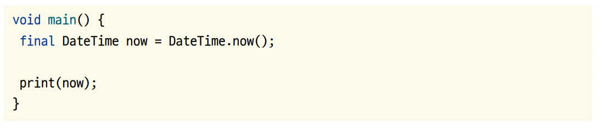
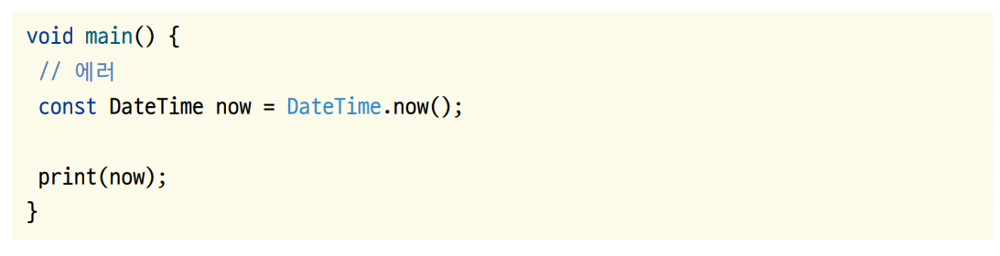

# **다트 소개**  
구글이 개발한 다트 프로그래밍 언어(Dart programming language)는 2011년 10월 GOTO 컨퍼런스에서 공개되었다. 구글은 크롬에 다트 가상 머신
(Dart virtual machine)을 심어 자바스크립트를 대체하려는 시도를 했지만 웹 개발에 혼란을 가져온다는 여론을 극복하지 못하고 결국 다트 언어를 
자바스크립트로 완전 컴파일 가능하게 만드는 데 그쳤다. 비록 웹에서 자바스크립트를 대체하겠다는 목적에는 실패했지만 현재 플러터의 
인기에 힘입어 모바일 영역에서 다트 언어가 큰 각광을 받고 있다.  
  
다트의 장점  
- 다트 언어는 UI를 제작하는 데 최적화되어 있다. 완전한 비동기 언어이며 이벤트 기반이다. 그리고 아이솔레이트를 이용한 동시성 기능도 제공한다.  
- 널 안정성(Null Safety), 스프레드 기능(Spread Operator), 컬렉션 if문(Collection if) 등 효율적으로 UI를 코딩할 수 있는 기능을 제공한다.  
- 효율적인 개발 환경을 제공한다. 핫 리로드를 통해 코드의 변경 사항을 즉시 화면에 반영해볼 수 있다.  
- 멀티 플랫폼에서 로깅 및 디버깅을 하고 실행할 수 있다.  
- AOT 컴파일이 가능하기 때문에 어떤 플랫폼에서든 빠른 속도를 자랑한다.  
- 자바스크립트로의 완전한 컴파일을 지원한다.  
- 백엔드 프로그래밍을 지원한다.  
  
# **다트 언어의 컴파일 플랫폼**  
다트 언어는 자바스크립트 언어로 완전한 컴파일이 가능하며 네이티브 플랫폼과 마찬가지로 효율적인 개발을 위해 증분 컴파일을 지원한다. 
다트는 모바일이나 데스크톱 기기를 타기팅하는 네이티브 플랫폼과 웹을 타기팅하는 웹 플랫폼으로 컴파일할 수 있다.  
  
  
  
다트 네이티브 플랫폼은 JIT(Just In Time) 컴파일 방식과 AOT(Ahead of Time) 컴파일 방식을 사용한다. 소프트웨어를 효율적으로 
개발하려면 코드의 변경된 사항을 화면에 반영해보고 수정하는 반복적인 과정이 빠른 사이클로 진행돼야 한다. JIT 컴파일 방식은 다트 가상 머신에서 
제공하는 기능으로 코드의 변경된 사항을 처음부터 다시 컴파일할 필요 없이 즉시 화면에 반영할 수 있는 핫 리로드 기능, 실시간으로 매트릭스를 
확인할 수 있는 기능, 디버깅 기능을 제공한다. 개발하는 도중에 하드웨어 리소스를 적게 사용하는 것보다 빠르게 개발할 수 있는 
효율이 중요하기 때문에 JIT 컴파일 방식을 사용한다.  
  
그러나 소프트웨어를 배포할 때는 목적 코드로 변환되어 있어야 더욱 리소스를 효율적으로 사용할 수 있다. 그래서 배포 시에는 AOT 컴파일 방식을 
사용해서 컴파일한다. AOT 컴파일 방식을 사용하면 ARM64나 x64 기계어로 다트 언어가 직접 컴파일이 되어서 매우 효율적으로 프로그램을 
실행할 수 있다.  
  
# **안드로이드 스튜디오에서 문법 공부하기**  
플러터 프로젝트를 생성해면 main.dart 파일에 기본 생성되는 코드를 모두 삭제한 후 다음과 같이 main() 함수만 남겨둔다.  
  
  
  
안드로이드 스튜디오 아래에 Terminal 탭을 누른 후 터미널에 'dart lib/main.dart' 명령어를 실핸한다. Enter를 누르면 "hello world"가 출력된다.  
  
  
  
# **기초 문법**  
# **메인 함수**  
다트는 프로그램 시작점인 엔트리 함수 기호로 main()을 사용한다. 다음과 같은 형식이다.  
  
  
  
중괄호 사이에 원하는 코드를 입력하면 된다. void는 아무 값도 반환하지 않는다는 뜻이다. main 뒤에 있는 괄호 안에 입력받을 매개변수를 지정할 
수 있다. 괗로 안이 비어 있으면 아무런 매개변수도 받지 않는다는 뜻이다.  
  
# **주석**  
주석 기로호 //와 /* */와 ///를 사용한다.  
  
  
  
# **print() 함수**  
print() 함수는 문자열을 콘솔에 출력하는 함수이다.  
  
  
  
# **var를 사용한 변수 선언**  
변수는 var 변수명 = 값; 형식으로 선언한다. 변수에 값이 들어가면 자동으로 타입을 추론하는 타입 추론 기능을 제공하므로 명시적으로 
타입을 선언하지 않아도 된다. 실제 코드가 컴파일될 때는 추론된 타입으로 var이 치환된다.  
  
  
  
# **dynamic을 사용한 변수 선언**  
var 타입은 변수의 값을 사용해서 변수의 타입을 유추하는 키워드다. 타입을 한 번 유추하면 추론된 타입이 고정된다. 따라서 고정된 
변수 타입과 다른 변수 타입의 값을 같은 변수에 다시 저장하려 하면 에러가 난다. 하지만 dynamic 키워드를 사용하면 변수의 타입이 
고정되지 않아서 다른 타입의 값을 저장할 수 있다.  
  
  
  
# **final/const를 사용한 변수 선언**  
final과 const 키워드는 변수의 값을 처음 선언 후 변경할 수 없다.  
  
  
  
final은 런타임, const는 빌드 타임 상수이다. 구체적인 차이점을 현재 시간을 가져오는 DataTime.now() 함수를 이용해서 알아보자. 
DateTime.now() 함수는 DateTime.now() 함수가 실행되는 순간의 날짜 및 시간을 제공해준다. 다시 말해서 런타임, 즉 실행을 해봐야 
값을 알 수 있다는 뜻이다.  
  
  
  
final 키워드를 사용했으니 now 값이 한 번 저장되면 추후 변경할 수 없다.  
  
반면에 const를 사용하면 에러가 난다. const로 지정한 변수는 빌드 타임에 값을 알 수 있어야 하는데 DateTime.now() 함수는 
런타임에 반환되는 값을 알 수 있기 때문이다.  
  
  
  
코드를 실행하지 않은 상태에서 값이 확정되면 const를, 실행될 때 확정되면 final을 사용하자.  
  
# **변수 타입**  
모든 변수는 고유한 변수 타입을 갖고 있다. var 키워드를 사용하면 자동으로 변수 타입을 유추할 수 있지만 직접적으로 변수 타입을 명시해주면 
코드가 더욱 직관적이어서 유지보수가 편해진다. 직접 문자열, 정수, 실수, 불리언(true/false) 타입을 지정하는 방법.  
  
  
  
# **컬렉션**  
컬렉션은 여러 값을 하나의 변수에 저장할 수 있는 타입이다. 여러 값을 순서대로 저장하거나(List), 특정 키값을 기반으로 빠르게 값을 
검색해야 하거나(Map), 중복된 데이터를 제거할 때 사용된다(Set). 컬렉션 타입은 서로의 타입으로 자유롭게 형변환이 가능하다는 
매우 큰 장점이 있다. 이 장점을 이용해서 각 타입의 특징을 프로그래밍에 적극적으로 활용할 수 있다.  
  
# **List 타입**  
리스트 타입은 여러 값을 순서대로 나열한 변수에 저장할 때 사용된다. 리스트의 구성 단위를 원소라고 한다. 리스트[인덱스] 형식으로 
특정 원소에 접근할 수 있다. 인덱스는 원소의 순번이라고 생각하면 된다. 제일 첫 원소는 0으로 지정한다. 따라서 마지막 원소는 
리스트 길이 - 1로 지정해야 하나.  
  
  
  
리스트 길이는 length를 가져와 확인할 수 있다.  
  
List 타입에는 다트 언어에서 기본으로 제공하는 함수가 많다. 기중 가장 많이 사용하는 add(), where(), map(), reduce() 함수에 대해 알아본다.  
  
# **add() 함수**  
add() 함수는 List에 값을 추가할 때 사용되며 추가하고 싶은 값을 매개변수에 입력하면 된다.  
  
  
  
  
# **where() 함수**  
where() 함수는 List에 있는 값들은 순서대로 순회하면서 특정 조건에 맞는 값만 필터링하는 데 사용한다. 매개변수에 함수를 입력해야 하며 
입력된 함수는 기존 값을 하나씩 매개변수로 입력받는다. 각 값별로 true를 반환하면 값을 유지하고 false를 반환하면 값을 버린다. 
순회가 끝나면 유지된 값들을 기반으로 이터러블이 반환된다.  
  
  
  
# **map() 함수**  
map() 함수는 List에 있는 값들을 순서대로 순회하면서 값을 변경할 수 있다. 매개변수에 함수를 입력해야 하며 입력된 함수는 기존 
값을 하나씩 매개변수로 입력받는다. 반환하는 값이 현잿값을 대체하며 순회가 끝나면 Iterable이 반환된다.  
  
  
  
# **reduce() 함수**  
reduce() 함수 역시 List에 있는 값들을 순회하면서 매개변수에 입력된 함수를 실행한다. 다만 reduce() 함수는 순회할 때마다 
값을 쌓아가는 특징이 있다. 지금까지 배운 함수들은 모두 Iterable을 반환했지만 reduce() 함수는 List 멤버의 타입과 같은 
타입을 반환한다.  
  
  
  
기존 함수들과 다르게 reduce() 함수는 매개변수로 함수를 입력받고 해당 함수는 매개변수 2개를 입력받는다. 순회가 처음 시작될 때 
첫 번째 매개 변수(value)는 리스트의 첫 번째 값 즉, 리사를 받게 되고 두 번째 매개변수(element)는 지수를 받게 된다. 첫 번째 
순회 이후로는 첫 번째 매개변수에 기존 순회에서 반환한 값이 첫 번째 매개변수에 입력되고 리스트에서 다음 값이(제니) 두 번째 
매개변수에 입력된다. 그래서 reduce() 함수는 리스트 내부의 값들을 점차 더해가는 기능으로 사용된다.  
  
# **fold() 함수**  
fold() 함수는 reduce() 함수와 실행되는 논리는 똑같다. reduce() 함수는 함수가 실행되는 리스트 요소들의 타입이 같아야 하지만 
fold() 함수는 어떠한 타입이든 반환할 수 있다.  
  
  
  
fold() 함수는 reduce() 함수의 특수한 형태라고 생각하면 된다. reduce() 함수는 리스트를 구성하는 값들의 타입과 반환되는 리스트를 
구성할값들의 타입이 완전히 같아야 한다. 하지만 fold() 함수는 그런 제약이 없다. 그래서 첫 번째 매개변수에 시작할 값을 지정하고 
두 번째 매개변수에는 reduce() 함수와 똑같이 작동하는 함수를 입력한다. 다만 첫 번째 순회 때 리스트의 첫 번째 값이 아닌 fold() 함수의 
첫 번째 매개변수에 입력된 값이 초깃값으로 사용된다. 두 번째 매개변수인 (value, element) => value + element.length는 
람디식으로 최초 순회 때 value에는 초깃값(여기서는 0)이 입력되고 이후에는 기존 순회의 반환값이 입력된다. element는 reduce() 
함수와 마찬가지로 리스트의 다음 값이 입력된다.  
  
# **Map 타입**  
맵 타입은 키와 값의 짝을 저장한다. 순서대로 값을 저장하는 데 중점을 두는 리스트와 달리 맵은 키를 이용해서 원하는 값을 빠르게 
찾는 데 중점을 둔다. Map<키 타입, 값 타입> 맵 이름 형식으로 생성한다.  
  
  
  
# **키와 값 반환받기**  
모든 Map 타입은 키와 값을 모두 반환받을 수 있다. 값을 반환받고 싶은 Map 타입의 변수에 key와 value 게터를 실행하면 된다.  
  
  
  
# **Set 타입**  
맵이 키와 값의 조합이라면 셋은 중복 없는 값들의 집합이다. Set<타입> 세트이름 형식으로 생성한다. 중복을 방지하므로 유일한 
값들만 존재하는 걸 보장한다.  
  
  
  
Set은 절대로 중복값을 허용하지 않기 떄문에 각 값의 유일함을 보장받을 수 있다. 제니가 두 번 입력됐지만 출력은 한 번뿐이다. 
추가적으로 contains() 함수로 값이 있는지 없는지 확인할 수 있다. 원한다면 Set 타입을 List 타입으로 변환하거나 List를 
Set 타입으로 변환할 수 있습니다.  
  
컬렉션 타입은 타입 그 자체로도 다채로운 자료 형태를 표현할 수 있다. 하지만 컬렉션 타입의 진정한 장점은 서로의 타입으로 형변환을 
하며 나타난다. 예를 들면 Set 타입에 .toList() 함수를 실행하면 기존 존재하던 데이터를 유지한 채로 Set 타입을 List 타입으로 
변환할 수 있다. 그리고 Map 타입의 키와 값을 따로 리스트로 받아보고 싶다면 .keys.toList()와 .values.toList() 함수를 
사용할 수 있다. 마지막으로 Set.from()을 사용하면 어떤 리스트든 Set 타입으로 반환할 수 있다. 물론 Set 타입의 특성대로 
중복값은 제거된다.  
  
# **enum**  
enum은 한 변수의 값을 몇 가지 옵션으로 제한하는 기능이다. 선택지가 제한적일 때 사용한다. String으로 완전 대체할 수 있지만 
enum은 기본적으로 자동 완성이 지원되고 정확히 어떤 선택지가 존재하는지 정의해둘 수 있기 때문에 유용하다.  
  
  
  
# **연산자**  
연산자로는 수치 연산자, null값 입력 관련 연산자, 값 비교 연산자, 타입 비교 연산자, 논리 연산자가 있다.  
  
# **기본 수치 연산자**  
다트 언어에서는 일반적으로 다른 언어에서도 사용하는 기본 산수 기능을 제공한다.  
  
  
  
  
# **null 관련 연산자**  
null은 아무 값도 없음을 뜻한다. 다트 언어에서는 변수 타입이 null 값을 가지는지 여부를 직접 지정해줘야 한다. 타입 키워드를 
그대로 사용하면 기본적으로 null 값이 저장될 수 없다. 타입 뒤에 ?를 추가해줘야 null 값이 저장될 수 있다.  
  
  
  
타입 뒤에 ?를 추가해주면 null 값이 저장될 수 있다. null을 가질 수 있는 변수에 새로운 값을 추가할 때 ??를 사용하면 기존에 null인 
때만 값이 저장되도록 할 수도 있다.  
  
  
  

