# **만난 지 며칠 U&I (상태 관리, CupertinoDatePicker, Dialog, DateTime)**  
# **프로젝트 구상하기**  
이번 프로젝트에서 집중할 요소는 두 가지이다. 첫 번째는 StatefulWidget을 이용한 상태 관리이다. 9장에서 전자액자 앱을 
만들며 StatefulWidget의 생명주기를 사용했지만 setState() 함수를 사용한 상태 관리는 아직 안 해봤다. 이번 프로젝트는 
setState() 함수 사용법을 알아본다. 두 번째는 쿠퍼티노 위젯이다.  
  
플러터는 두 가지 디자인 시스템을 지원한다. 구글의 머티리얼 디자인을 기반으로 하는 Material 위젯과 iOS 스타일의 디자인인 
Cupertiono 위젯이다. 이번 프로젝트를 진행하면서 다이얼로그 및 데이터픽커를 Cupertino 위젯을 사용해서 구현한다.  
  
# **사전 지식**  
# **setState() 함수**  
State를 상속하는 모든 클래스는 setState() 함수를 사용할 수 있다. setState() 함수가 실행되는 과정은 다음과 같이 
5단계이다.  
  
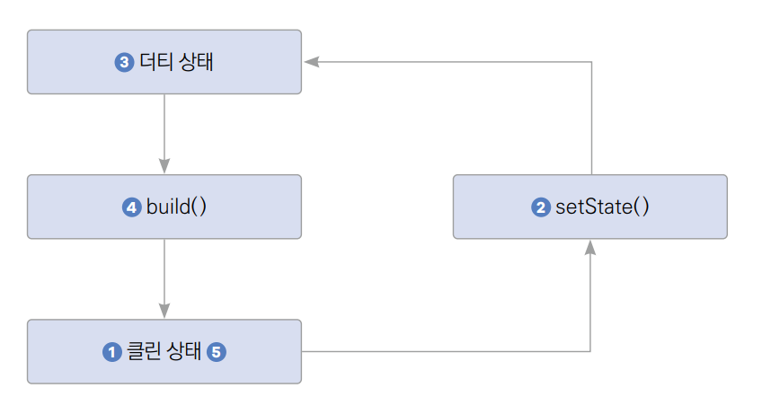  
  
1. StatefulWidget의 렌더링이 끝나고 클린 상태이다.  
2. 플러터에서는 그 어떤 상태 변경 툴을 사용하든 클린 상태에서 상태를 변경해줘야 한다. setState()를 실행해서 원하는
속성들을 변경한다.  
3. 속성이 변경되고 위젯의 상태가 더티로 설정된다.  
4. build() 함수가 실행된다.  
5. State가 클린 상태로 다시 되돌아온다.  
  
setState() 함수를 실행하는 방법은 매우 간단하다. setState() 함수는 매개변수 하나를 입력받는다. 이 매개변수는 콜백 
함수이고 이 콜백 함수에 변경하고 싶은 속성들을 입력해주면 해당 코드가 반영된 뒤 build() 함수가 실행된다. 콜백 함수가 
비동기로 작성되면 안 된다는 점에 주의하자.  
  
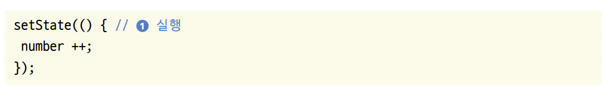  
  
setState() 함수의 첫 번째 매개변수에 상태(변수) 값을 변경하는 로직을 작성한다. 예제에서는 number라는 값을 1만큼 
증가시키고 다시 build() 함수를 실행한다.  
  
# **showCupertinoDialog() 함수**  
showCupertinoDialog()는 다이얼로그를 실행하는 함수이다. Cupertino라고 정의된 만큼 iOS 스타일로 다이얼로그가 실행되며 
실행 시 모든 애니메이션과 작동이 iOS 스타일로 적용된다.  
  
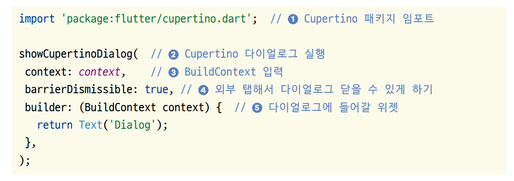  
  
1. Cupertino 위젯을 사용하려면 Cupertino 패키지를 꼭 불러와야 한다.  
2. showCupertinoDialog() 함수를 실행하면 Cupertino 스타일의 다이얼로그를 실행할 수 있다.  
3. 모든 showDialog() 형태의 함수들은 BuildContext를 반드시 입력해야 한다.  
4. 플러터에서 다이얼로그 위젯 외에 흐림 처리가 된 부분을 배리어라고 부른다. 예를 들어 아이럴로그 위젯의 높이가 300인데 
화면 전체의 높이가 1000이라면 나머지 700만큼의 부분이 배리어가 된다. barrierDismissible에 true를 입력하면 배리어를 
눌렀을 때 다이얼로그가 닫히고 false를 입력하면 닫히지 않는다.  
5. builder() 함수에 다이얼로그로 띄우고 싶은 위젯은 반환해주면 된다.  
  
# **사전 준비**  
이번 강의에서는 에셋과 폰트를 추가해야 한다.  
  
1. 실습에 사용할 프로젝트를 생성한다.  
- 프로젝트 이름: u_and_i  
- 네이티브 언어: 코틀린  
  
# **이미지와 폰트 추가하기**  
1. 이미지와 폰트를 프로젝트에 추가한다. asset 폴더를 만들고 그 아래 font와 img 폴더를 만든다. 내려받은 예제에서 
폰트 파일들은 font 폴더에, 그림 파일들은 img 폴더에 저장한다.  
  
# **pubspec.yaml 설정하기**  
이미지와 마찬가지로 폰트도 pubspec.yaml 파일에 추가한다. 에셋 파일은 flutter 키의 assets 키에, 폰트 파일은 flutter 
키의 fonts 키에 입력하면 된다. 이미지와 폰트를 pubspec.yaml에 적용한다.  
  
pubspec.yaml 참고  
  
Weight는 폰트 두께를 의미한다. 폰트의 두께별로 파일이 따로 제공되기 때문에 같은 폰트라도 다른 두께를 표현하는 파일은 
weight 값을 따로 표현해줘야 한다. 두께값은 100부터 900까지 100 단위로 사용할 수 있으며 숫자가 높을수록 두꺼운 값을 
의미한다. 추후 플러터에서 사용할 때 fontWeight 클래스에 표현되는 두께값과 같다(예: weight: 500 = FontWeight.w500).  
  
2. pub get을 실행해서 변경 사항을 반영한다.  
  
# **프로젝트 초기화하기**  
1. lib 폴더에 screen 폴더를 생성하고 앱의 기본 홈 화면으로 사용할 HomeScreen 위젯을 생성할 home_screen.dart를 생성한다. 
다음과 같이 HomeScreen이라는 StatelessWidget을 생성한다.  
  
lib -> screen -> home_screen.dart  
  
2. lib/main.dart 파일에서도 마찬가지로 HomeScreen을 홈 위젯으로 등록한다.  
  
lib -> main.dart  
  
# **레이아웃 구상하기**  
지금까지 프로젝트에서는 Scaffold 위젯의 body 매개변수에 위젯 하나만 입력했다. 이번에는 _DDay 위젯과 _CoupleImage 위젯 
두 가지를 위아래로 나누어서 구현한다. 홈 스크린 말고도 CupertinoDialog를 추가로 구현해야 한다. 중앙의 하트 아이콘을 
클릭하면 CupertinoDialog가 실행되는 구조를 만든다.  
  
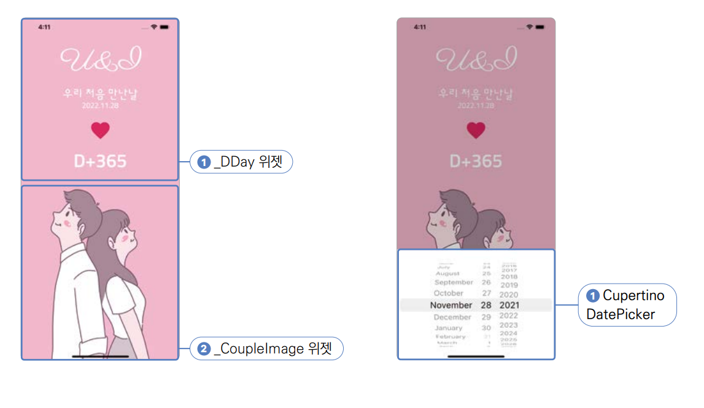  
  
# **구현하기**  
UI 구현, 상태 관리 구현, 날짜 선택 기능 구현 순서로 진행한다. UI를 먼저 작업해서 앱 전체의 틀을 잡고 상태 관리를 설정해서 
날짜 데이터를 관리할 기반을 잡는다. 마지막으로 날짜 선택 기능을 추가해서 선택한 날짜에 따라 D-Day를 계산하는 기능을 구현한다.  
  
# **홈 스크린 UI 구현하기**  
1. 지금까지는 HomeScreen 위젯 하나로 모든 화면을 구현했다. 하지만 이번에는 코드가 조금 더 많아지는 만큼 위젯을 두 위젯으로 
나눠서 화면을 구성한다. 우선 HomeScreen의 위쪽 반을 구현할 _DDay 위젯을 HomeScreen 위젯 아래에 생성한다. _DDay 위젯처럼 
이름 첫 글자가 언더 스코어이면 다른 파일에서 접근할 수 없다. 그래서 파일을 불러오기 했을 때 불필요한 값들이 한 번에 
불러와지는 걸 방지할 수 있다.  
  
lib -> screen -> home_screen.dart  
  
2. 다음은 HomeScreen의 아래쪽을 구현할 _CoupleImage 위젯을 _DDay 위젯 아래에 생성한다.  
  
lib -> screen -> home_screen.dart  
  
3. 이 두 위젯을 위아래로 서로 반씩 차지하게 배치해야 한다. HomeScreen 위젯에 Column 위젯을 사용해서 _DDay 위젯과 
_CoupleImage 위젯이 위아래에 놓이게 한다.  

lib -> screen -> home_screen.dart  
  
아이폰 노치에 대비해서 위에는 SafeArea를 적용해주고 이미지를 자연스럽게 구현하기 위해 아래에는 미적용한다. MainAxisAlignment.
spaceBetween을 사용해서 위아래 각각 끝에 _DDay와 _CoupleImage 위젯을 위치시킨다.  
  
4. 배경색을 핑크색으로 변경한다.  
  
lib -> screen -> home_screen.dart  
  
5. 기본값으로 적용해둔 글자들을 제거하고 목표하는 UI를 구현할 차례다. _CoupleImage 위젯에 커플 이미지를 적용하고 이미지의 
높이를 화면 높이의 반만큼 조절한다.  

lib -> screen -> home_screen.dart  
  
Center 위젯을 사용해서 이미지를 중앙에 배치한다. MediaQuery.of(context)를 사용하면 화면 크기와 관련된 각종 기능을 
사용할 수 있다. 특히 여기서 사용된 size 게터를 불러 오면 화면 전체의 너비와 높이를 쉽게 가져올 수 있다. 화면의 전체 높이를 
2로 나눠서 화면 높이의 반만큼 이미지가 차지하도록 설정한다.  
  
.of 생성자  
.of(context) 생성자를 초보자들이 많이 헷갈려한다. .of(context)로 정의된 모든 생성자는 일반적으로 BuildContext를 매개변수로 
받고 위젯 트리에서 가장 가까이에 있는 객체의 값을 찾아낸다. 결과적으로 MediaQuery.of(context)는 현재 위젯 트리에서 가장 
가까이에 있는 MediaQuery 값을 찾아낸다.  
  
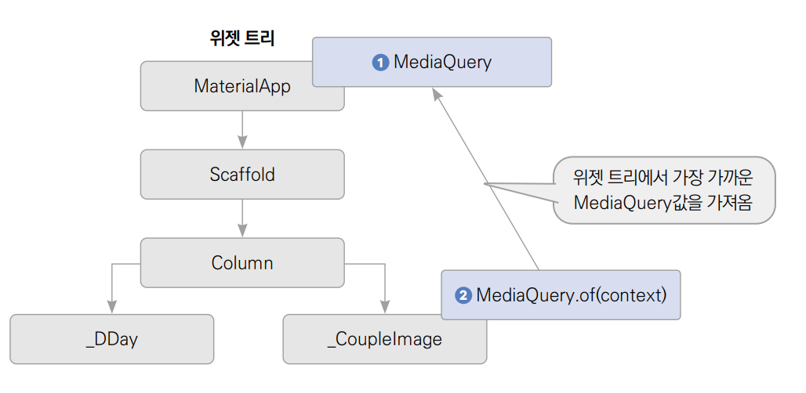  
  
앱이 실행되면 MaterialApp이 빌드됨과 동시에 MediaQuery가 생성된다. 위젯 트리 아래에서 MediaQuery.of(context)를 
실행하면 위젯 트리를 올라가며 가장 가까운 곳에 위치한 MediaQuery 값을 가져온다. 비슷한 예제로는 Theme.of(context)나 
Navigator.of(context) 등이 있다.  
  
6. 이제 _DDay 위젯을 구현할 차례다. _DDay 위젯은 여러 Text 위젯과 하트 아이콘(IconButton)으로 이루어져있다. 사귀기 
시작한 날짜와 며칠이 지났는지 표시하는 글자는 날짜를 변경할 때마다 자동으로 바뀌게 코딩해야 하지만 일단은 임의의 글자들을 
넣어둔다.  

lib -> screen -> home_screen.dart  
  
7. Text 위젯을 스타일링할 때는 style 매개변수를 사용하면 된다. 하지만 각 Text 위젯의 스타일이 아니라 Text 위젯의 기본 
스타일을 변경하고 싶다면 공용으로 재사용 가능한 StatelessWidget을 만들어도 되지만 이런 상황에는 테마를 사용하면 편하다. 
테마를 사용하면 13가지 Text 스타일을 따로 저장하여 프로젝트로 불러와서 사용할 수 있다.  
  
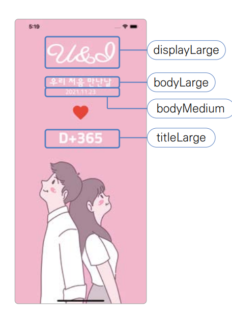  
  
프로젝트 목표를 보면서 각 문장들을 스타일별로 나눈다. 스타일명으로 display, headline, title, body, label 등의 
명칭을 사용할 수 있으며 각각 large, medium small 사이즈가 존재한다. 예를 들어 displayLarge, titleMedium, labelSmall 
등의 이름으로 스타일을 미리 지정해둘 수 있다. 스타일명은 임의적으로 지정할 수 있다. 어떤 상황에 어떤 스타일명을 사용해야 
한다는 절대적인 법칙은 없으니 자유롭게 본인만의 기준을 잡아서 스타일명을 적용하면 된다.  
  
8. main.dart 파일에 텍스트와 IconButton 테마를 정의한다.  

lib -> main.dart  
  
MaterialApp에는 theme이라는 매개변수가 있다. 여기에는 ThemeData 클래스를 입력할 수 있다. ThemeData에서는 플러터가 
기본으로 제공하는 대부분의 위젯의 기본 스타일을 지정할 수 있다. textTheme는 글자의 테마를 정할 수 있는 매개변수다. 13가지 
글자 스타일들을 모두 여기서 정의할 수 있다.  
  
흔히 사용되는 ThemeData의 매개변수는 아래 표를 참고하자.  
  
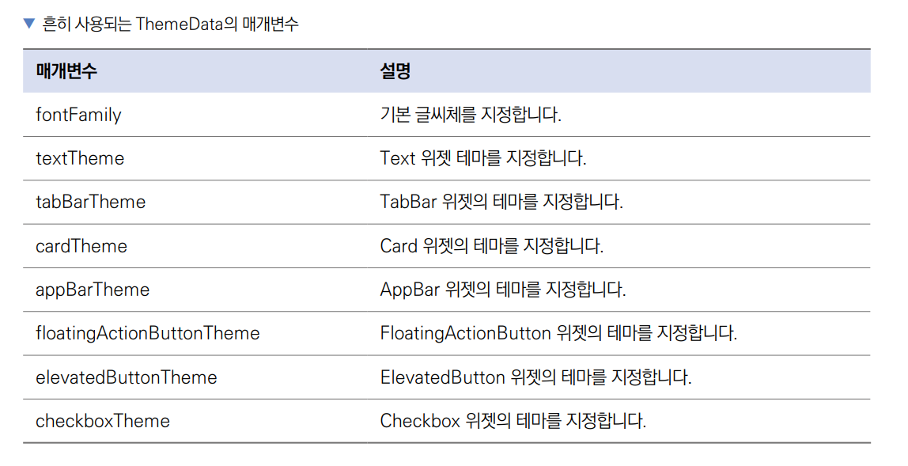  
  
이 매개변수들을 다 알고 있지 않아도 위젯이름Theme의 규칙을 이용해서 특정 위젯의 테마를 작업할 수 있다.  
  
9. 스타일 지정을 완료했으니 이제 Text 위젯에 스타일을 적용한다.  
  
lib -> screen -> home_screen.dart  
  
Theme.of(context)도 MediaQuery.of(context)와 똑같이 이해하면 된다. 위젯 트리 위 가장 가까운 Theme값을 가져온다. 
Icon의 색상도 Theme에서 지정할 수 있지만 Icon의 경우 색상이 각각 다른 경우가 많아서 직접 지정했다.  
  
10. 스타일을 모두 적용했으니 Run 버튼을 눌러서 프로젝트를 재시작한다. 변경한 theme는 MaterialApp의 매개변수에 입력했고 
build() 함수에 입력되지 않은 값들은 핫 리로드로 반영이 되지 않는다.  
  
# **다양한 화면의 비율과 해상도에 따른 오버플로 해결하기**  
핸드폰은 화면의 비율과 해상도가 모두 다르다. 그렇기 떄문에 하나의 화면을 기준으로 UI를 작업하면 다른 크기의 핸드폰에서 
같은 UI 배치가 나오지 않을 수 있다. 현재 아래쪽 이미지를 화면의 반만큼 크기를 차지하도록 지정했다. 만약에 핸드폰의 
크기가 작아서 상단의 글자들이 화면의 반 이상을 차지하면 아래쪽 이미지는 남은 공간보다 더 많은 높이를 차지한다. 남은 공간은 
화면의 반이 안 되는 데 이미지는 화면의 반을 차지하도록 코드를 작성했기 때문이다. 플러터에서는 이런 상황을 오버플로라고 
한다. 다음 캡처 화면은 작은 화면의 시뮬레이터 또는 에뮬레이터에서 같은 코드를 실행했을 때 오버플로가 나는 상황이다.  
  
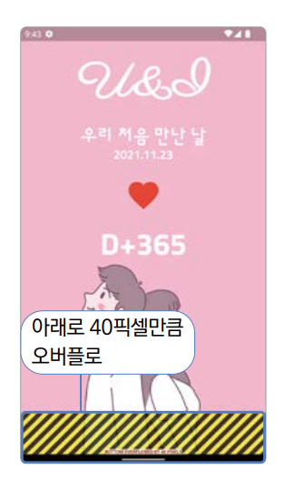  
  
이런 문제가 있을 때 해결 방법은 두 가지이다. 글자나 이미지의 크기를 임의로 조절하거나 이미지가 남는 공간만큼만 차지하도록 
코드를 작성한다. 일반적으로 이미지가 남는 공간만큼 차지하도록 많이 작업하는데 Expanded 위젯을 사용해주면 된다.  
  
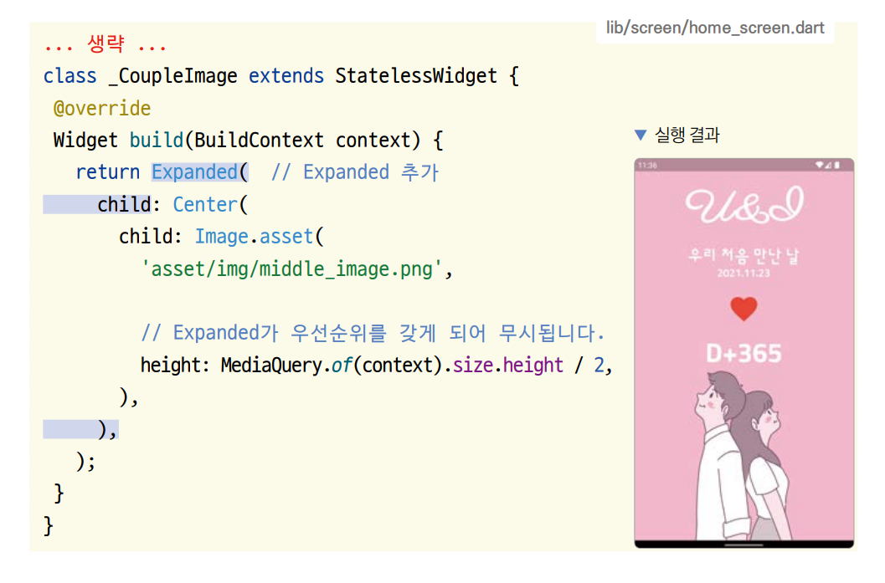  
  
# **상태 관리 연습해보기**  
UI는 목표대로 완성했다. 이제 순차적으로 기능을 추가한다.  
  
1. 먼저 HomeScreen을 StatefulWidget으로 변경한다.  
  
lib -> screen -> home_screen.dart  
  
2. 이번 프로젝트에서 상태 관리를 할 값은 '처음 만난 날'이다. 이 날짜를 변숫값으로 저장하고 변경하면서 사용한다. 오늘을 
기준으로 이 변숫값을 선언한다.  
  
lib -> screen -> home_screen.dart  
  
3. 목표하는 기능은 하트 버튼을 누르면 날짜를 고를 수 있는 UI가 나오며 날짜가 변경될 때마다 firstDay 변수를 맞춰서 
변경시키는 기능이다. 하지만 현재 하트 버튼의 opPressed 매개변수가 _DDay 위젯에 위치해 있어 _HomeScreenState에서 버튼이 
눌렸을 때 콜백을 받을 수 없다. _DDay 위젯에 하트 아이콘을 눌렀을 때 실행되는 콜백 함수를 매개변수로 노출해서 _HomeScreenState에서 
상태 관리를 하도록 한다.  
   
lib -> screen -> home_screen.dart  
  
IconButton의 onPressed 매개변수에 입력할 GestureTapCallback 타입의 변수를 정의한다. GestureTapCallback은 
Material 패키지에서 기본으로 제공하는 Typedef로 버튼의 onPressed 또는 onTap 콜백 함수들이 GestureTapCallback 
타입으로 정의돼 있다. 아무것도 반환하지 않고 아무것도 입력받지 않는 기본 형태의 함수로 정의돼 있다.  
  
onHeartPressed의 값을 생성자 매개변수를 통해 외부에서 정의받는다. 기존에 정의했던 비어 있는 함수 대신에 onHeartPressed 
값을 넣어준다. 하트 아이콘을 눌렀을 때 실행할 함수를 정의한다. _DDay 위젯 생성자에 추가된 매개변수 onHeartPressed에 
_HomeScreenState에 정의한 onHeartPressed 함수를 입력한다.  
  
4. 핫 리로드를 하고 하트 아이콘을 클릭하여 콘솔에 '클릭'이 잘 출력되는지 확인한다.  
  
5. 하트 아이콘의 콜백 함수가 잘 실행되지만 아직 글자들이 firstDay 변수와 연동이 안 되어 있다. _DDay 생성자에 매개변수로 
firstDay 값을 입력해주고 firstDay 변수를 기반으로 날짜와 D-Day가 렌더링되게 한다.  

lib -> screen -> home_screen.dart  
  
위젯에서 사용할 DateTime 값을 변수로 선언한다. firstDay 변수의 값을 생성자의 매개변수로 외부에서 입력받도록 정의한다. 
_DDay 위젯에서 현재 날짜시간 값을 now 변수에 저장한다. DateTime 타입에는 year, month, day, hour, minute, second, 
millisecond, microsecond, weekday 등의 게터가 있다. 순서대로 DateTime 값의 년, 월, 일, 시, 분, 초, 밀리초, 마이크로초 
값을 가져올 수 있다.  
  
DateTime의 생성자에는 year, month, day, hour, minute, second, millisecond, microsecond 매개변수를 사용해서 
원하는 날짜시간을 DateTime 값으로 만들 수 있다. 그리고 DateTime은 difference() 함수를 사용해서 하나의 DateTime 값을 
또 다른 DateTime 값과 비교할 수 있다. 추가적으로 difference() 함수는 Duration 값을 반환하는데 Duration 값에는 
기간을 날짜로 반환하는 inDays 게터가 있다. 오늘 날짜와 firstDay 변수의 기간 차이를 일수로 계산하고 사귀는 첫 날은 
'오늘부터 1일'로 보통 정의하기 때문에 1을 더해준다.  
  
6. 저장하고 핫 리로드를 하면 오늘 날짜가 처음 만난 날로 정의되고 계산된 D-Day가 렌더링된다.  
  
7. setState() 함수를 사용한다. 상태 관리 테스트로 하트 아이콘을 누르면 firstDay가 하루씩 늘어나는 기능을 추가한다.  
  
lib -> screen -> home_screen.dart  
  
setState() 매개변수에 함수를 입력하고 함수에 변경하고 싶은 변숫값을 지정해주면 된다. 원하는 만큼 기간을 뺄 수 있는 
subtract() 함수를 사용해서 하트 버튼이 눌릴 때마다 firstDay 값이 하루씩 줄어드는 기능을 추가한다.  
DateTime은 날짜와 시간을 저장할 수 있는 변수 타입이고 Duration은 기간을 정할 수 있는 변수 타입이다. 매개변수에 days, 
hours, minute, seconds, milliseconds, microseconds 값들을 사용해서 원하는 기간을 정의할 수 있다.  
  
8. 아이콘 버튼을 누르면 처음 만난 날 날짜와 D-Day가 변경된다.  
  
firstDay 값을 새로 지정하는 코드를 setState() 함수 없이 지정하면 아무리 하트 버튼을 눌러도 UI가 반영되지 않는다. 값은 
바뀌는데 build() 함수를 재실행하라는 신호를 받지 못한다.  
  
# **CupertinoDatePicker로 날짜 선택 구현하기**  
1. showCupertinoDialog() 함수와 CupertinoDatePicker 위젯을 사용해서 아이콘을 클릭하면 날짜를 선택할 수 있는 
CupertinoDatePicker가 화면에 생성되도록 구현한다.  
  
lib -> screen -> home_screen.dart  
  
showCupertinoDialog를 실행하면 다이얼로그를 열어준다. builder 매개변수에 입력되는 함수에 다이얼로그로 보여주고 싶은 
위젯을 반환해주면 해당 위젯을 다이얼로그에서 보여줄 수 있다.  
  
CupertinoDatePicker는 Cupertino 패키지에서 기본으로 제공하는 위젯이다. 스크롤을 통해서 날짜를 정할 수 있고 정해진 
값을 onDateTimeChanged 콜백 함수의 매개변수로 전달한다.  
  
mode 매개변수는 날짜를 고르는 모드를 지정할 수 있다.  
- CupertinoDatePickerMode.date: 날짜
- CupertinoDatePickerMode.time: 시간
- CupertinoDatePickerMode.dateAndTime: 날짜와 시간  
  
2. 하트 아이콘을 눌러서 CupertinoDatePicker가 다이얼로그에 제대로 실행되는지 확인한다. 현재는 다이얼로그를 닫을 방법이 
없다. 다이얼로그를 없애고 싶으면 Run 버튼을 눌러서 앱을 재실행한다.  
   
3. 하트 아이콘을 누르면 다이얼로그가 열리면서 배경이 어두워지고 CupertinoDatePicker가 보이지만 계획과 달리 아래 
공간만 조금 차지하는 흰색 배경의 형태가 아니다. 화면 아래에서 300 픽셀만 CupertinoDatePicker가 차지하게 하고 CupertinoDatePicker의 
배경을 흰색으로 변경한다.  
  
lib -> screen -> home_screen.dart  
  
Align 위젯은 자식 위젯을 어떻게 위치시킬지 정할 수 있다. Align 위젯의 alignment 매개변수에는 Alignment 값을 입력할 
수 있다. 여기서는 Alignment.bottomCenter를 입력해서 아래 중간에 자식 위젯을 배치했다. showCupertinoDialog의 
barrierDismissible 매개변수는 배경을 눌렀을 때의 행동을 지정한다. false값을 입력하면 배경을 눌러도 다이얼로그가 
닫히지 않고 true 값을 누르면 배경을 눌렀을 때 다이얼로그가 닫힌다. Alignment의 정렬값은 아래 표를 참고하자.  
  
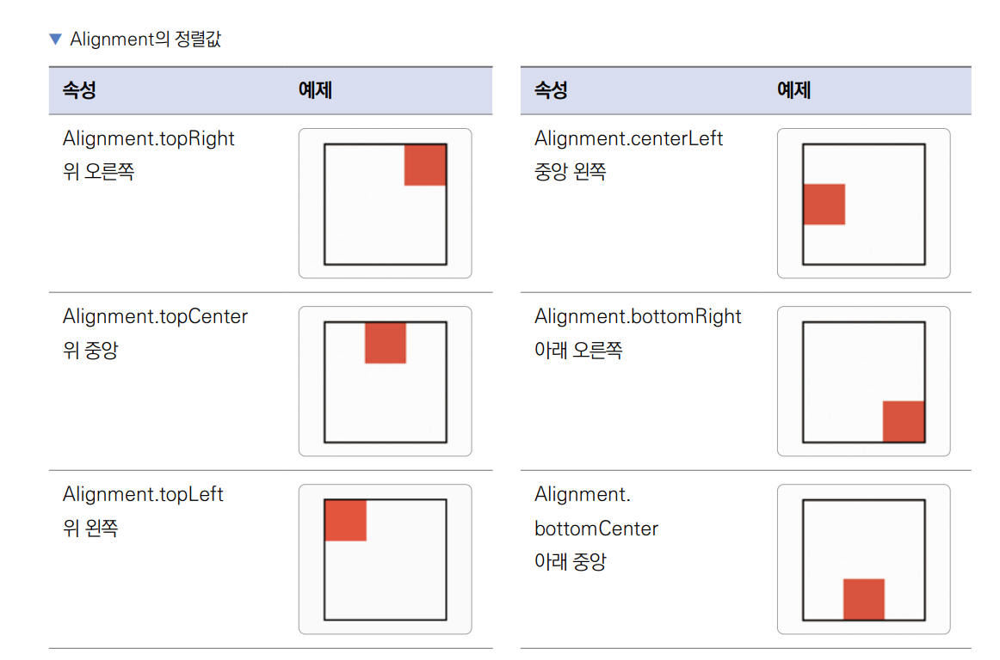  
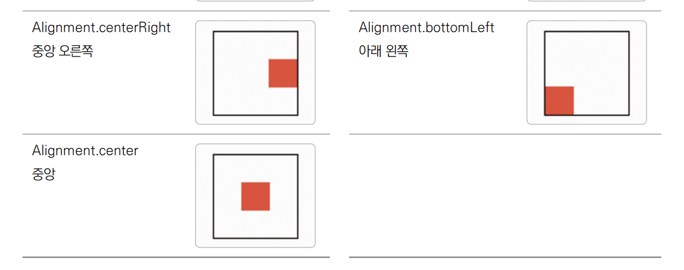  
  
4. Run 버튼을 눌러서 앱을 재시작하고 다시 하트 아이콘을 누르면 CupertinoDatePicker 위젯이 아래에 흰색 배경으로 이쁘게 
배치되는걸 볼 수 있다. 이제 배경을 누르면 다이얼로그가 닫힌다.  
  
# **CupertinoDatePicker 변경 값 상태 관리에 적용하기**  
1. CupertinoDatePicker와 setState() 함수를 연결해서 CupertinoDatePicker의 날짜 값이 변경될 때마다 firstDay 
값을 변경한다.  
  
lib -> screen -> home_screen.dart  
  
onDateTimeChanged의 콜백 함수는 CupertinoDatePicker 위젯에서 날짜가 변경될 때마다 실행된다. 결과적으로 콜백 함수가 
실행될 때마다 매개변수로 제공되는 date 값을 firstDay 변수에 저장해주기만 하면 된다.  
  
2. 이제 CupertinoDatePicker에서 날짜를 변경해주면 '우리 처음 만난 날' 및 D-Day에 선택한 날짜값이 반영된다.
