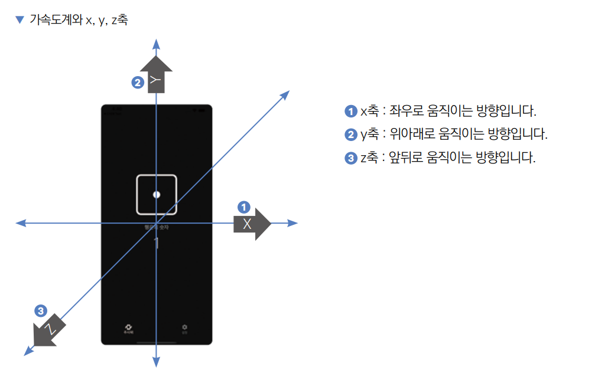
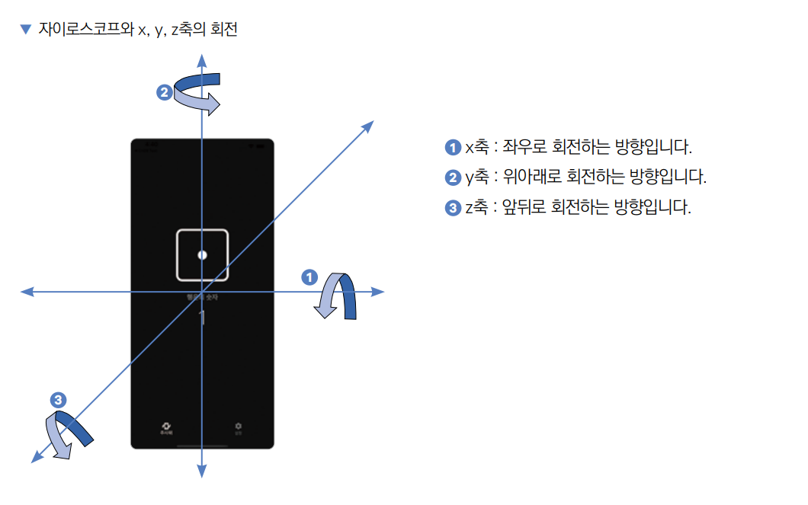
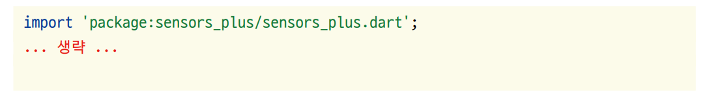
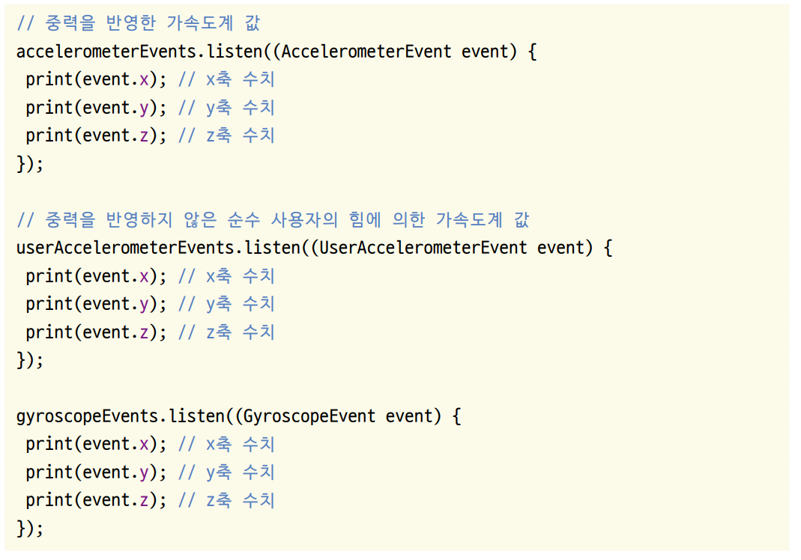

# **디지털 주사위 (가속도계, 자이로스코프, Sensor_Plus)**  
# **프로젝트 구상하기**  
가속도계는 특정 방향으로 가속을 하는 정도를 측정하는 기기이다. 가속도계는 가속도를 측정하기 때문에 어느 정도의 가속 수치를 
흔드는 행동으로 인식할지에 대한 기준이 중요하다. 이 앱에서는 사용자가 특정 수치를 넘는 강도로 핸드폰을 흔든 순간을 
인식할 수 있는 함수를 구현한다. 이 기준을 사용자가 설정하도록 Slider 위젯을 이용한다.  
  
화면 두 개를 만들어 탭과 스크롤로 이동한다. 두 화면을 각각 따로 위젯으로 구현하고 BottomNavigationBar를 이용한다.  
  
# **사전 지식**  
# **가속도계**  
가속도계는 말 그대로 특정 물체가 특정 방향으로 이동하는 가속도가 어느 정도인지를 숫자로 측정하는 기기이다. 대부분의 
핸드폰에 가속도계가 장착되어 있다. 가속도계는 3개의 축으로 가속도를 측정할 수 있다. 핸드폰을 정면으로 봤을 때 x, y, z축의 
의미는 다음과 같다.  
  
  
  
사람은 기계가 아니기 떄문에 하나의 축으로 핸드폰을 움직이는 건 불가능하다. 그렇게 때문에 가속도계를 사용해서 움직임 이벤트를 
받으면 x, y, z축의 측정 결과가 모두 double 값으로 반환된다.  
  
# **자이로스코프**  
가속도계는 x, y, z축으로의 직선 움직임만 측정할 수 있다. 자이로스코프는 이 단점을 보완해서 x, y, z축의 회전을 측정할 
수 있다. 핸드폰을 정면으로 봤을 때 x, y, z축의 의미는 다음과 같다.  
  
  
  
가속도계와 마찬가지로 자이로스코프도 회전에 대한 이벤트를 받게 되면 x, y, z축 모두에서의 회전값이 동시에 반환된다.  
  
# **Sensor_Plus 패키지**  
sensor_plus 패키지를 사용하면 핸드폰의 가속도계와 자이로스코프 센서를 간단하게 사용할 수 있다. 하지만 가속도계와 자이로스코프 
센서의 데이터는 x, y, z축의 움직임을 각각 반환하기 때문에 전반적인 핸드폰의 움직임을 측정하려면 정규화가 필요하다. 
한마디로 x, y, z 각 값을 통합해 전반적인 움직임 수치를 계산해서 핸드폰을 흔든 정도를 수치화해야 한다. 이 부분은 크게 
어렵지는 않지만 수학적인 부분이라 미리 정규화 작업을 해둔 shake 패키지를 이용한다. 하지만 sensors_plus 패키지를 이용한 
가속도계와 자이로스코프 사용법을 알고 있으면 유용하기 떄문에 간략하게 관련 코드를 살펴보자.  
  
우선 sensors_plus 패키지를 pubspec.yaml에 등록해야 한다. 등록 후 다음 코드를 이용해서 가속도계와 자이로스코프를 사용해볼 
수 있다.  
  
  
  
  
iOS 시뮬레이터나 안드로이드 에뮬레이터로는 가속도계나 자이로스코프의 기능을 사용할 수 없다. 이번 장은 꼭 실제 기기를 
활용해 테스트를 진행해야 한다.  
  
# **사전 준비**  
프로젝트에서 사용할 상수값들을 미리 정리해두면 개발이 훨씬 수월해진다. 이번 프로젝트에서 사용할 색상을 colors.dart 파일에 
미리 추가한다.  
  
1. 실습 프로젝트 생성  
- 프로젝트 이름: random_dice  
- 네이티브 언어: 코틀린  
  
# **상수 추가하기**  
프로그래밍을 하다 보면 반복적으로 사용하는 상수들을 접한다. 예를 들어 글자 크기, 주색상 등이 있다. 이런 값들을 한 번 
입력하고 나서 다시는 변경하지 않는다면 각각 작성을 해도 크게 문제는 없겠지만 나중에 일괄 변경을 하려면 대공사가 된다. 그런 
상황을 예방하려면 프로젝트에 반복적으로 사용할 상수를 별도의 파일에 정리해두는 게 좋다.  
  
1. lib 폴더에서 마우스 우클릭해서 상수값과 관련된 모든 파일을 저장할 const 폴더를 생성한다. const 폴더에서 다시 마우스 
우클릭해서 색상과 관련된 모든 상수값들을 저장할 colors.dart 파일을 생성한다.  
  
2. 이제 프로젝트에서 사용할 색상 정보를 colors.dart 파일에 저장한다.  
  
lib -> const -> colors.dart  
  
Colors.grey는 const로 선언이 가능하지만 600이라는 키값을 입력하면 런타임에 색상이 계산되기 때문에 const 사용이 불가능하다.  
  
# **이미지 추가하기**  
asset 폴더를 만들고 그 아래 img 폴더를 만든다. 이미지를 내려받고 해당 폴더에 저장한다.  
  
# **pubspec.yaml 설정하기**  
1. 이미지를 추가했으니 이미지를 읽을 위치를 pubspec.yaml에 추가한다.  
  
pubspec.yaml 참고  
  
pubspec.yaml 파일은 프로젝트의 의존성을 관리하기 위한 파일이다. 하지만 depenedency_overrides를 사용해서 shake 플러그인 
같은 외부 플러그인의 의존성도 임의로 덮어쓸 수 있다. 최신 플러터 버전을 사용하면 sensors_plus 패키지의 버전을 6.1.0으로 
업데이트 해야하는데 shake 플러그인의 관리자가 아직 sensors_plus 6.1.0 버전 이상의 의존성과 함께 새로운 버전을 배포하지 
않은 상태이다. 이럴때 강제로 의존성의 의존성 버전을 변경 할 수 있다. 우리가 필요한 sensors_plus 버전은 6.1.0이기 떄문에 
sensors_plus: 6.1.0 버전으로 강제 변경을 해준다. 오픈소스 플러그인은 쉽게 사용 할 수 있지만 이와같이 관리 문제가 생길 
수 있다. 보통 플러그인이 오래된 버전의 의존성을 사용하는게 문제가 되는 경우가 많기 떄문에 플러터 프레임워크에서는 이렇게 
손 쉽게 플러그인의 의존성 버전을 덮어쓰는 기능을 제공해준다. 미래에 shake 플러그가 업데이트되어 최신 sensors_plus 버전을 
지원한다면 dependency_overrides를 더 이상 할 필요 없어진다.  
  
2. pub get을 실행해서 변경 사항을 반영한다.  
  
# **프로젝트 초기화하기**  
1. lib 폴더에 screen 폴더를 생성하고 앱의 기본 홈 화면으로 사용할 HomeScreen 위젯을 생성할 home_screen.dart를 생성한다. 
다음과 같이 HomeScreen이라는 StatelessWidget을 생성한다.  
  
lib -> screen -> home_screen.dart  
  
2. lib/main.dart 파일에서도 마찬가지로 HomeScreen을 홈 위젯으로 등록해줘야 한다.  
  
lib -> main.dart  
  

