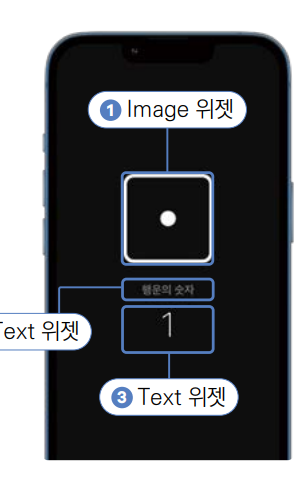

# **디지털 주사위 (가속도계, 자이로스코프, Sensor_Plus)**  
# **프로젝트 구상하기**  
가속도계는 특정 방향으로 가속을 하는 정도를 측정하는 기기이다. 가속도계는 가속도를 측정하기 때문에 어느 정도의 가속 수치를 
흔드는 행동으로 인식할지에 대한 기준이 중요하다. 이 앱에서는 사용자가 특정 수치를 넘는 강도로 핸드폰을 흔든 순간을 
인식할 수 있는 함수를 구현한다. 이 기준을 사용자가 설정하도록 Slider 위젯을 이용한다.  
  
화면 두 개를 만들어 탭과 스크롤로 이동한다. 두 화면을 각각 따로 위젯으로 구현하고 BottomNavigationBar를 이용한다.  
  
# **사전 지식**  
# **가속도계**  
가속도계는 말 그대로 특정 물체가 특정 방향으로 이동하는 가속도가 어느 정도인지를 숫자로 측정하는 기기이다. 대부분의 
핸드폰에 가속도계가 장착되어 있다. 가속도계는 3개의 축으로 가속도를 측정할 수 있다. 핸드폰을 정면으로 봤을 때 x, y, z축의 
의미는 다음과 같다.  
  
  
  
사람은 기계가 아니기 떄문에 하나의 축으로 핸드폰을 움직이는 건 불가능하다. 그렇게 때문에 가속도계를 사용해서 움직임 이벤트를 
받으면 x, y, z축의 측정 결과가 모두 double 값으로 반환된다.  
  
# **자이로스코프**  
가속도계는 x, y, z축으로의 직선 움직임만 측정할 수 있다. 자이로스코프는 이 단점을 보완해서 x, y, z축의 회전을 측정할 
수 있다. 핸드폰을 정면으로 봤을 때 x, y, z축의 의미는 다음과 같다.  
  
  
  
가속도계와 마찬가지로 자이로스코프도 회전에 대한 이벤트를 받게 되면 x, y, z축 모두에서의 회전값이 동시에 반환된다.  
  
# **Sensor_Plus 패키지**  
sensor_plus 패키지를 사용하면 핸드폰의 가속도계와 자이로스코프 센서를 간단하게 사용할 수 있다. 하지만 가속도계와 자이로스코프 
센서의 데이터는 x, y, z축의 움직임을 각각 반환하기 때문에 전반적인 핸드폰의 움직임을 측정하려면 정규화가 필요하다. 
한마디로 x, y, z 각 값을 통합해 전반적인 움직임 수치를 계산해서 핸드폰을 흔든 정도를 수치화해야 한다. 이 부분은 크게 
어렵지는 않지만 수학적인 부분이라 미리 정규화 작업을 해둔 shake 패키지를 이용한다. 하지만 sensors_plus 패키지를 이용한 
가속도계와 자이로스코프 사용법을 알고 있으면 유용하기 떄문에 간략하게 관련 코드를 살펴보자.  
  
우선 sensors_plus 패키지를 pubspec.yaml에 등록해야 한다. 등록 후 다음 코드를 이용해서 가속도계와 자이로스코프를 사용해볼 
수 있다.  
  
  
  
  
iOS 시뮬레이터나 안드로이드 에뮬레이터로는 가속도계나 자이로스코프의 기능을 사용할 수 없다. 이번 장은 꼭 실제 기기를 
활용해 테스트를 진행해야 한다.  
  
# **사전 준비**  
프로젝트에서 사용할 상수값들을 미리 정리해두면 개발이 훨씬 수월해진다. 이번 프로젝트에서 사용할 색상을 colors.dart 파일에 
미리 추가한다.  
  
1. 실습 프로젝트 생성  
- 프로젝트 이름: random_dice  
- 네이티브 언어: 코틀린  
  
# **상수 추가하기**  
프로그래밍을 하다 보면 반복적으로 사용하는 상수들을 접한다. 예를 들어 글자 크기, 주색상 등이 있다. 이런 값들을 한 번 
입력하고 나서 다시는 변경하지 않는다면 각각 작성을 해도 크게 문제는 없겠지만 나중에 일괄 변경을 하려면 대공사가 된다. 그런 
상황을 예방하려면 프로젝트에 반복적으로 사용할 상수를 별도의 파일에 정리해두는 게 좋다.  
  
1. lib 폴더에서 마우스 우클릭해서 상수값과 관련된 모든 파일을 저장할 const 폴더를 생성한다. const 폴더에서 다시 마우스 
우클릭해서 색상과 관련된 모든 상수값들을 저장할 colors.dart 파일을 생성한다.  
  
2. 이제 프로젝트에서 사용할 색상 정보를 colors.dart 파일에 저장한다.  
  
lib -> const -> colors.dart  
  
Colors.grey는 const로 선언이 가능하지만 600이라는 키값을 입력하면 런타임에 색상이 계산되기 때문에 const 사용이 불가능하다.  
  
# **이미지 추가하기**  
asset 폴더를 만들고 그 아래 img 폴더를 만든다. 이미지를 내려받고 해당 폴더에 저장한다.  
  
# **pubspec.yaml 설정하기**  
1. 이미지를 추가했으니 이미지를 읽을 위치를 pubspec.yaml에 추가한다.  
  
pubspec.yaml 참고  
  
pubspec.yaml 파일은 프로젝트의 의존성을 관리하기 위한 파일이다. 하지만 depenedency_overrides를 사용해서 shake 플러그인 
같은 외부 플러그인의 의존성도 임의로 덮어쓸 수 있다. 최신 플러터 버전을 사용하면 sensors_plus 패키지의 버전을 6.1.0으로 
업데이트 해야하는데 shake 플러그인의 관리자가 아직 sensors_plus 6.1.0 버전 이상의 의존성과 함께 새로운 버전을 배포하지 
않은 상태이다. 이럴때 강제로 의존성의 의존성 버전을 변경 할 수 있다. 우리가 필요한 sensors_plus 버전은 6.1.0이기 떄문에 
sensors_plus: 6.1.0 버전으로 강제 변경을 해준다. 오픈소스 플러그인은 쉽게 사용 할 수 있지만 이와같이 관리 문제가 생길 
수 있다. 보통 플러그인이 오래된 버전의 의존성을 사용하는게 문제가 되는 경우가 많기 떄문에 플러터 프레임워크에서는 이렇게 
손 쉽게 플러그인의 의존성 버전을 덮어쓰는 기능을 제공해준다. 미래에 shake 플러그가 업데이트되어 최신 sensors_plus 버전을 
지원한다면 dependency_overrides를 더 이상 할 필요 없어진다.  
  
2. pub get을 실행해서 변경 사항을 반영한다.  
  
# **프로젝트 초기화하기**  
1. lib 폴더에 screen 폴더를 생성하고 앱의 기본 홈 화면으로 사용할 HomeScreen 위젯을 생성할 home_screen.dart를 생성한다. 
다음과 같이 HomeScreen이라는 StatelessWidget을 생성한다.  
  
lib -> screen -> home_screen.dart  
  
2. lib/main.dart 파일에서도 마찬가지로 HomeScreen을 홈 위젯으로 등록해줘야 한다.  
  
lib -> main.dart  
  
# **Theme 설정하기**  
이번 프로젝트에서도 상수를 사용하여 테마를 적용한다. main.dart 파일의 MaterialApp 위젯 안에 정의한다.  
  
lib -> main.dart  
  
# **레이아웃 구상하기**  
이번 프로젝트는 BottomNavigationBar 위젯을 사용해서 화면 전환을 해야 하기 떄문에 지금까지와는 다른 형태로 구조를 
짜야 한다. 첫 번째 화면인 HomeScreen 위젯과 두 번째 화면인 SettingsScreen을 TabBarView를 이용해서 RootScreen 위젯에 
위치시킨다(즉 RootScreen 하나에 탭으로 홈 스크린과 설정 스크린을 감싸고 있는 헝태).  
  
# **기본 스크린 위젯**  
기본 스크린 위젯은 이번 프로젝트에서 사용할 모든 위젯을 담고 있는 최상위 위젯이다. 주사위가 보이는 홈 스크린과 감도를 
설정할 수 있는 설정 스크린을 탭으로 담게 된다. RootScreen 위젯이라고 이름지어 사용한다. RootScreen 위젯은 상단과 
하단으로 나눈다. 하단에는 사용자가 직접 화면 전환을 할 수 있는 BottomNavigationBar 위젯이 위치하고 그 위에 TabBarView를 
통해 선택된 화면을 보여준다. BottomNavigationBar에서 각 탭을 누르거나 TabBarView에서 좌우로 스크롤을 해서 화면 
전환을 할 수 있다.  
  
  
  
# **홈 스크린 위젯**  
HomeScreen 위젯은 하나의 Column 위젯으로 간단하게 구현할 수 있다. 가장 위에 주사위 이미지가 위치하므로 Image 위젯을 
사용하면 된다. "행운의 숫자"라는 글자를 작성하는 데 Text 위젯을 사용한다. 각 숫자의 눈 개수를 표현하는 데도 Text 위젯을 
사용한다.  
  
  
  
# **설정 스크린 위젯**  
SettingsScreen 위젯 가운데에 민감도를 정하는 Slider 위젯을 위치시켜야 한다. 이 슬라이더를 사용자가 좌우로 이동해서 
직접 흔들기 기능의 민감도를 정할 수 있다. 추가적으로 Slider 위젯의 기능을 쉽게 알 수 있도록 Text 위젯으로 레이블을 
지정한다.  
  
  
  
# **구현하기**  
# **RootScreen 위젯 구현하기**  
1. RootScreen 위젯 작업의 주요 요소는 BottomNavigationBar와 TabBarView이다. BottomNavigationBar을 아래 위치시키고 
남는 공간에 TabBarView를 위치시켜서 스크린 전환이 가능한 구조를 만든다. 먼저 lib/screen 폴더에 root_screen.dart 파일을 
만든다.  
  
2. 우선 TabBarView 위젯과 BottomNavigationBar 위젯을 반환해줄 renderChildren() 함수와 renderBottomNavigation() 
함수를 작업한다.  
  
lib -> screen -> root_screen.dart  
  
TabBarView 위젯을 이용하면 각종 Tab 위젯과 쉽게 연동할 수 있는 UI를 구현할 수 있다. PageView와 매우 비슷한 기본 
애니메이션이 제공되며 children 매개변수에 각 탭의 화면으로 활용하고 싶은 위젯을 List로 넣어주면 된다. Scaffold 위젯은 
BottomNavigationBar를 위치시키는 매개변수를 따로 보유한다. bottomNavigation 매개변수에 BottomNavigationBar을 
넣어주면 쉽게 Tab을 조정할 수 있는 UI를 핸드폰의 아래에 배치할 수 있다. BottomNavigationBar에 제공될 각 탭은 (아이콘과 탭의 레이블) 
BottomNavigationBar 위젯의 items 매개변수에 제공해주면 된다.  
  
3. main.dart 파일에 HomeScreen 위젯을 홈으로 등록해두었다. 하지만 홈 화면을 RootScreen 위젯으로 변경해야 한다. 
HomeScreen은 RootScreen의 탭 중 하나 (첫 번째 탭)로 구현할 계획이기 떄문이다.  
  
lib -> main.dart  
  
4. TabBarView부터 작업한다. TabBarView는 TabController가 필수이다. 추가적으로 TabController를 초기화하려면 vsync 
기능이 필요한데 이는 State 위젯에 TickerProviderMixin을 mixin으로 제공해줘야 사용할 수 있다. TabController는 위젯이 
생성될 때 단 한 번만 초기화되어야 하니 HomeScreen 위젯을 StatefulWidget으로 변경하고 initState()에서 초기화한다.  
  
lib -> screen -> root_screen.dart  
  
TickerProviderMixin과 SingleTickerProviderMixin은 애니메이션의 효율을 올려주는 역할을 한다. TabController의 
length 매개변수에는 탭 개수를 int 값으로 제공해주고 vsync에는 TickerProviderMixin을 사용하는 State 클래스를 this 
형태로 넣어주면 된다. 생성된 TabController는 TabBarView의 controller 매개변수에 입력해주면 된다. 그러면 
입력된 controller를 이용해서 TabBarView를 조작할 수 있다.  
  
- TickerProviderMixin과 vsync  
TickerProviderMixin은 애니메이션 효율을 담당한다. 플러터는 기기가 지원하는 대로 60FPS(초당 60프레임) 부터 120FPS를 
지원하는데 TickerProviderMixin을 사용하면 정확히 한 틱(1FPS)마다 애니메이션을 실행한다. 간혹 애니메이션 코드를 작성하다 
보면 실제로 화면에 그릴 수 있는 주기보다 더 자주 렌더링을 실행하게 될 때가 있는데 TickerProviderMixin을 사용하면 이런 
비효율적인 상황을 막아준다. TabController도 마찬가지로 vsync에 TickerProviderMixin을 제공함으로써 렌더링 효율을 
극대화할 수 있다.  
  
5. 이제는 BottomNavigationBar를 작업한다. BottomNavigationBar의 Items 매개변수에는 BottomNavigationBarItem이라는 
클래스를 사용해서 각 탭의 정의를 제공해줘야 한다. BottomNavigationBarItem의 icon 매개변수와 label 매개변수를 이용해서 
구현할 두 탭을 작업한다.  
  
lib -> screen -> root_screen.dart  
  
BottomNavigationBarItem 클래스에는 아이콘을 지정할 수 있는 icon 매개변수와 이름을 지정할 수 있는 label 매개변수를 
제공할 수 있다. 탭별로 BottomNavigationBarItem을 구현해서 BottomNavigationBar의 items 매개벼수에 입력해주면 간단히 
BottomNavigation을 구현할 수 있다.  
  
6. BottomNavigationBar를 구현했으니 이제 각 탭을 표현해줄 위젯들을 TabBarView의 children에 제공해줘야 한다. 간단한 
샘플 화면을 만들기 위해 HomeScreen 탭을 표현할 "Tab 1" 이라는 글자와 SettingsScreen 탭을 표현할 "Tab 2"라는 글자가 
작성된 Container 위젯들을 renderChildren() 함수에 구현한다.  
  
lib -> screen -> root_screen.dart  
  
7. 어느 정도 RootScreen 위젯의 구도가 나왔으니 Run 버튼을 눌러서 프로젝트를 재시작한다.  
  
  
  
8. TabBarView를 스와이프할 때는 화면 전환이 자연스럽게 잘 이루어지지만 안타깝게도 BottomNavigationBar의 탭을 누르면 
이동되지 않는다. 그 이유는 BottomNavigationBar를 누를 때마다 TabBarView와 연동해야 하기 떄문이다. 각각 BottomNavigaionBarItem을 
눌러도 화면 전환이 잘되도록 TabController를 연동한다.  
  
lib -> screen -> root_screen.dart  
  
TabBarView에서 바라보고 있는 화면의 인덱스가 변경될 때마다 BottomNavigationBar을 다시 그려서 어떤 탭이 보여지고 
있는지 표시해야 한다. addListener() 함수는 controller의 속성이 변할 때마다 특정 함수를 실행할 수 있도록 콜백 함수를 
등록할 수 있다. 이 콜백 함수에 setState()를 실행하여 controller의 속성이 변경될 때마다 build()를 재실행하도록 한다. 
RootScreen 위젯이 생성될 때 단 한 번만 리스너가 등록되면 되니 initState()에서 실행해준다.  
  
tabListener() 함수는 TabController의 속성이 변경될 때마다 실행할 함수이다. addListener를 사용하여 listener를 등록하면 
위젯이 삭제될 때 항상 등록된 listener도 같이 삭제해줘야 한다. 위젯이 삭제될 때 실행되는 dispose() 함수를 오버라이드해서 
controller에 붙은 리스너를 삭제한다.  
  
currentIndex는 BottomNavigationBar에서 현재 선택된 상태로 표시해야 하는 BottomNavigationBarItem의 index이다. 
TabBarView와 같은 탭의 인덱스를 바라보게 해줘야 한다.  
  
onTap은 BottomNavigationBarItem이 눌릴 떄마다 실행되는 함수이며 매개변수로 눌린 탭의 인덱스를 전달해준다. 탭을 눌렀을 
때 TabBarView와 화면을 동기화해줘야 하니 animateTo() 함수를 사용해서 자연스러운 애니메이션으로 지정한 탭으로 TabBarView가 
전환되게 한다.  
  
# **HomeScreen 위젯 구현하기**  
1. Column 위젯 하나를 사용해서 Image 위젯과 Text 위젯들을 배치한다. 추가적으로 어떤 숫자를 보여줄지는 RootScreen 위젯에서 
정하도록 생성자를 통해서 number 매개변숫값을 입력받는다.  
  
lib -> screen -> home_screen.dart  
  
생성자로 입력받은 number값에 해당되는 이미지와 텍스트를 화면에 그려준다.  
  
2. 이제 RootScreen에 임의로 입력해둔 첫 번째 Container 위젯을 대체한다. TabBarView의 첫 번째 화면에 "Tab 1"이라고 
보여주는 대신 1이라는 number값을 입력해서 임의로 보여준다.  
  
lib -> screen -> root_screen.dart  
  
3. 앱을 재시작하면 기획대로 완성된 첫 번째 탭을 확인할 수 있다.  
  
# **SettingsScreen 위젯 만들기**  
1. lib -> screen에 settings_screen.dart 파일을 생성한다.  
  
2. SettingsScreen은 Text 위젯과 Slider 위젯으로 이루어졌다. HomeScreen 위젯과 마찬가지로 Column 위젯을 이용해서 
Text 위젯과 Slider 위젯을 세로로 위치시킨다. Slider 위젯은 눌러서 좌우로 움직일 때 움직인 만큼의 값이 제공되는 콜백 
함수가 실행된다. 이 값을 저장하고 다시 Slider에 넣어주는 게 Slider 위젯 사용법의 주요 포인트이다. 민감도에 대한 상태는 
RootScreen 위젯에서 관리할 예정이니 Slider의 현잿값과 콜백 함수는 외부로 노출하고 나머지 매개변수들은 SettingsScreen에서 
관리한다.  
  
lib -> screen -> settings_screen.dart  

divisions는 min값과 max값을 나누는 구분 개수이다. 0.1 부터 10까지 101개의 구간으로 나눠서 각 구간을 이동할 때마다 
0.1씩 현재값이 변경된다.  

onChanged는 Slider 위젯의 콜백 함수이다. 사용자의 제스처에 의해 Slider 위젯의 원이 움직이는 만큼 콜백 함수의 매개변수로 
이동한 값이 제공된다. onChanged 매개변수로 입력받은 현재값을 State에 저장하고 다시 value 매개변수에 같은 값을 입력하는 
형태로 Slider 위젯이 구현된다. label 매개변수를 이용하면 Slider 위젯을 스크롤할 때마다 화면에 표시할 문자를 지정할 
수 있다. Slider 값을 소수점 한 자리까지 표현하도록 코드를 작성했다.  
  
3. 이제 SettingsScreen을 RootScreen에 적용해줄 차례다. Slider 위젯의 현재값과 onChanged 매개변수를 RootScreen에서 
입력받도록 한다.  
  
lib -> screen -> root_screen.dart  

Slider 위젯의 현재값이 변경될 때마다 threshold 변수에 값을 저장하고 setState() 함수를 실행해서 build() 함수를 
재실행해준다. Slider 위젯은 변경된 threshold 변수의 값을 기반으로 화면에 다시 그려진다.  
  
4. 앱을 재실행하면 설정 탭의 슬라이더를 좌우로 움직일 때 Slider 위젯의 값이 변경되고 현잿값이 원 위에 표시되는걸 볼 
수 있다(label 변수).  
  
# **shake 플러그인 적용하기**  
1. 아직은 RootScreen 위젯에 직접 1이라는 숫자를 입력해서 화면에서 주사위 값 1을 보여주고 있다. 하지만 이제 핸드폰을 
흔들 때마다 매번 새로운 숫자가 생성되어야 하니 HomeScreen 위젯의 number 매개변수에 들어갈 값을 number 변수로 상태 
관리하도록 코드를 변경한다.  
  
lib -> screen -> root_screen.dart  
  
number 변수를 State에 선언하고 이 변수를 HomeScreen 위젯의 number 매개변수에 입력해주면 number 변수의 값을 변경할 
때마다 HomeScreen 위젯의 렌더링 결과를 바꿀 수 있다.  
  
2. Shake 플러그인을 적용한다. RootScreen을 구현할 때 TabController의 addListener() 함수를 활용해서 탭의 인덱스 값이 
변경될 때마다 특정 함수를 실행했다. 그때처럼 Shake 플러그인도 핸드폰 흔들기를 감지할 때마다 실행할 함수를 등록한다.  
  
lib -> screen -> root_screen.dart  
  
ShakeDetector의 autoStart 생성자를 이용하면 코드가 실행되는 순간부터 흔들기를 감지한다. 반면에 waitForStart 생성자를 
이용하면 코드만 등록을 해두고 추후에 흔들기 감지를 시작하는 코드를 따로 실행해줄 수 있다.  

shakeSlopTimeMS는 얼마나 자주 흔들기를 감지할지 정한다. 밀리초 단위로 입력하면 되며 한 번 흔들기를 감지하면 입력된 
시간이 지나기까지 다시 흔들기를 감지하지 않는다. shakeThresholdGravity는 흔들기를 감지하는 민감도를 설정한다. 이 값은 
이미 구현한 SettingsScreen의 Slider 위젯에서 받아온다.  
  
onPhoneShake 매개변수로 등록한 함수는 핸드폰을 흔들 때마다 난수를 생성해야 한다. 다트 언어에서 기본으로 제공하는 dart:math 
패키지의 Random 클래스를 이용해서 목적을 이룰 수 있다. Random 클래스는 nextInt() 함수를 제공하는데 이 함수의 첫 번째 
매개변수에 생성될 최대 int 값을 넣어주면 된다. 다만 난수는 최소 0부터 생성되니 0 ~ 5까지 생성되게 매개변수에 5를 넣어주고 
결괏값에 1을 더해주면 1 ~ 6 사이 난수를 생성할 수 있다. 생성된 난수를 미리 만들어둔 number 변수에 setState() 함수로 
저장하면 화면에 반영할 수 있다.  
  
ShakeDetector도 마찬가지로 dispose()가 실행됐을 때 리스너를 제거해야 한다.  
  

  

  

  

