# **동영상 플레이어(화면 회전, 시간 변환, String 패딩)**  
# **프로젝트 구상하기**  
언뜻 보기에는 화면을 두 개 써야 할 것 같지만 하나로 구현할 수 있다. 플러터에서는 모든 게 위젯으로 이루어졌기 때문에 이런 
형식의 UI 구현이 매우 간편하다. 첫 번쨰 화면 HomeScreen은 단순히 앱 이름과 로고만 보여준다. 로고를 한 번 탭해주면 
동영상을 선택하는 창이 나온다. 사용자가 동영상을 선택하면 HomeScreen이 VideoPlayer로 대체된다.  
  
동영상이 선택되면 즉시 동영상을 실행하고 Slider 위젯으로 진행 상황을 보여주는 기능을 구현한다. 추가적으로 흔히 동영상 
플레이어 앱에서 볼 수 있는 것처럼 뒤로 3초 돌리기, 앞으로 3초 돌리기, 재생/일시중지 기능도 구현한다. 이 버튼들은 항상 
화면에 보이면 동영상을 시청하는데 방해되므로 화면을 한 번 탭하면 보이고 한 번 더 탭하면 보이지 않게 프로그래밍한다.  
  
# **사전 지식**  
# **iOS 시뮬레이터 화면 회전하기**  
iOS 시뮬레이터는 화면 회전이 비교적 간단하다. 시뮬레이터의 맨 위에 있는 3가지 옵션 중 가장 오른쪽에 있는 회전하기 
버튼을 눌러주면 시뮬레이터를 오른쪽으로 90도씩 회전할 수 있다.  
  
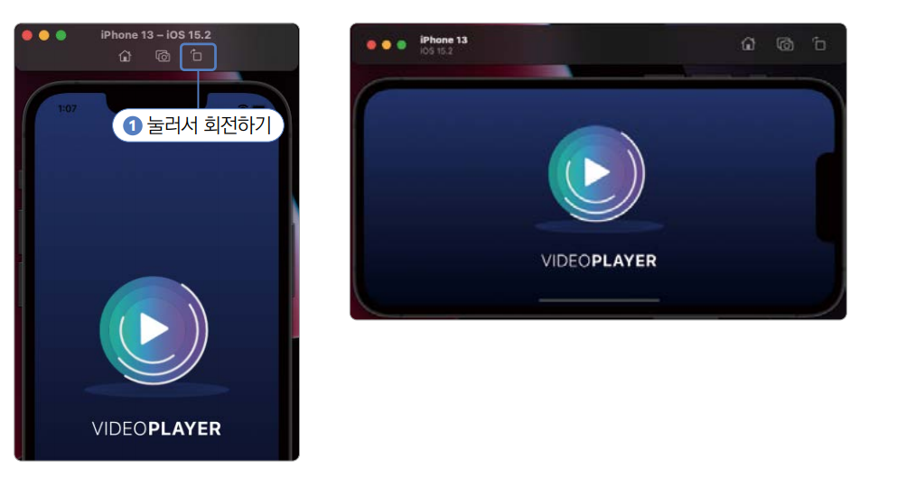  
  
# **안드로이드 에뮬레이터 화면 회전하기**  
안드로이드 에뮬레이터 또한 회전하기 버튼을 눌러서 시계방향 또는 반시계방향 90도로 에뮬레이터를 회전할 수 있다. iOS 시뮬레이터와는 
다르게 안드로이드 에뮬레이터에서는 회전 후 화면에 나오는 앱 회전 버튼을 한 번 더 눌러줘야 에뮬레이터에서 실행 중인 앱도 
회전된다.  
  
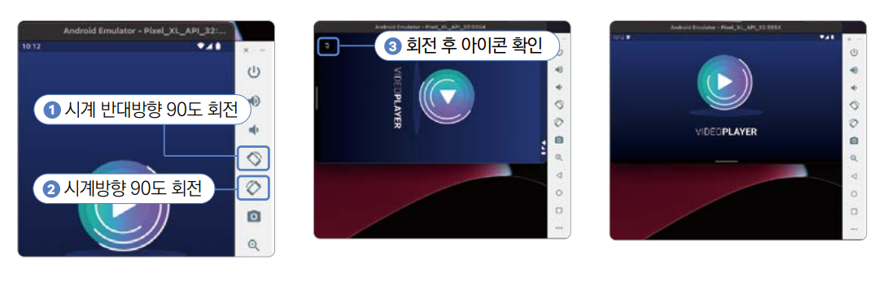  
  
# **시간 변환 및 String 패딩**  
Duration 클래스는 특정 날짜를 가리키는 DateTime과는 다르게 기간을 표혀할 수 있는 클래스였다. video_player 플러그인을 
사용하면서 현재 실행되고 있는 영상의 위치, 영상의 총 길이 등을 Duration 클래스로 반환받게 된다. 하지만 개발자가 선호하는 
자료 형태와 실제 사용자가 선호하는 자료 형태가 다르기 때문에 보기 좋은 String 값으로 Duration 클래스를 전환하는 게 
매우 중요하다.  
  
예를 들어 Duration 클래스를 화면에 그대로 출력하면 개발자들은 쉽게 이해할 수 있지만 일반 사람은 이해하기 힘들다.  
  
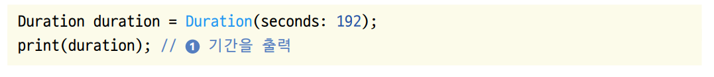  
  
0:03:12.000000을 출력한다.  
  
0:03:12.000000값에서 '.' 뒷부분을 제외한 앞부분만 원한다. String에 split() 함수로 원하는 부분만 가져온다.  
  
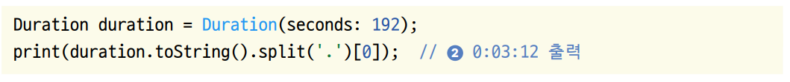  
  
split() 함수는 첫 번째 매개변수에 들어오는 값을 기준으로 String값을 나누고 각각 나뉜 값을 List에 넣어서 반환한다.  
  
여기서 '시' 단위를 생략하고 '분분:초초' 형태로 Duration을 표현한다면 약간 복잡해진다.  
  
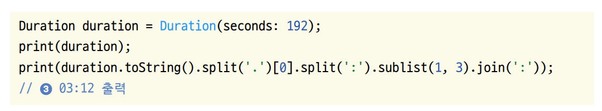  
  
먼저 '.'을 기준으로 String을 split()해서 밀리초 단위를 삭제해주고 다시 한변 ':'를 기준으로 split()해서 시, 분, 초 
단위로 나뉜 List값을 반환받는다. 여기서 리스트의 맨 앞의 값으로 반환되는 '시'는 버려야 하니 sublist() 함수를 이용해서 
1번 인덱스부터 2번 인덱스의 값들만 모아 다시 join() 함수를 통해 모아준다.  
  
Duration 클래스의 정의로 이동해서 toString() 함수를 보면 '초'단위 시간을 '시', '분', '초'로 변환하는 방법이 코드로 
작성되어 있다. 위에서 진행한 형태의 코드가 불편하게 느껴진다면 Duration 클래스의 toString() 함수를 참고해서 직접 
코드를 짜볼 수도 있다.  
  
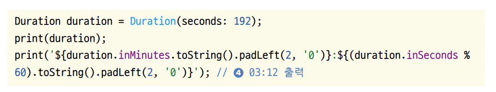  
  
Duration 클래스의 inMinutes 게터는 분 단위 시간을 가져온다. 그리고 inSeconds 게터는 초 단위 시간을 가져오니 초 단위 
시간은 분의 몫으로 넘어간 값을 제외한 나머지 값만 보여주면 된다. String 클래스에는 padLeft() 함수와 padRight() 함수가 
존재하는데 pad() 함수들은 String의 길이를 맞춰주는 역할을 한다. 첫 번째 매개변수에 String의 최소 길이를 입력하고 
두 번째 매개변수에 길이가 부족할 때 채워줄 String값을 넣어준다. padLeft()는 최소 길이에 맞춰서 두 번째 매개변수에 입력된 
값을 왼쪽에 채워주고 padRight()는 오른쪽에 채워준다.  
  
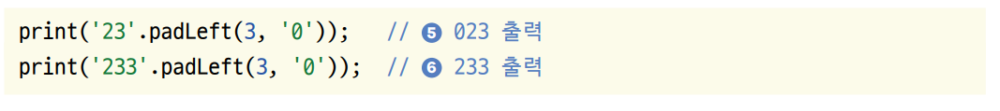  
  
최소 3의 길이만큼 String을 채워넣어야 하니 '023'이 된다. '233'은 이미 최소 길이인 3을 충족했으니 그대로 '233'이 된다.  
  
# **사전 준비**  
iOS에서는 동영상을 불러오려면 사진첩 권한이 필요하다. 일반적으로 ImagePicker 플러그인을 사용하면 카메라와 마이크 권한까지 
필요한 경우가 많으니 세 가지 권한을 모두 등록한다.  
  
1. 실습에 사용할 프로젝트 생성  
- 프로젝트 이름: vid_player
- 네이티브 언어: 코틀린  
  
# **가상 단말에 동영상 추가하기**  
이번 프로젝트는 핸드폰에 저장되어 있는 동영상을 선택해 플레이한다.  
  
# **iOS 시뮬레이터**  
iOS 시뮬레이터에서는 상대적으로 간단하게 파일을 시뮬레이터로 옮길 수 있다.  
  
1. 동영상 파일을 드래그해서 시뮬레이터에 드롭한다. 그러면 자동으로 사진첩 앱이 실행되며 추가한 동영상을 확인할 수 있다.  
  
# **안드로이드 에뮬레이터**  
1. 동영상 파일을 드래그해서 시뮬레이터에 드롭하면 파일들을 옮길 수 있다.  
2. 동영상 파일을 저장해도 파일 앱이 바로 실행되지 않기 때문에 파일이 잘 옮겨졌는지 직접 확인해야 한다. 안드로이드에 기본으로 
설치되어 있는 Files 앱을 실행한다. 왼쪽 상단의 메뉴 아이콘인 햄버거 버튼을 누른다. 열리는 Drawer에서 [Downloads] 탭을 
눌러준다. 복사한 동영상 3개가 모두 복사되었는지 확인한다.  
  
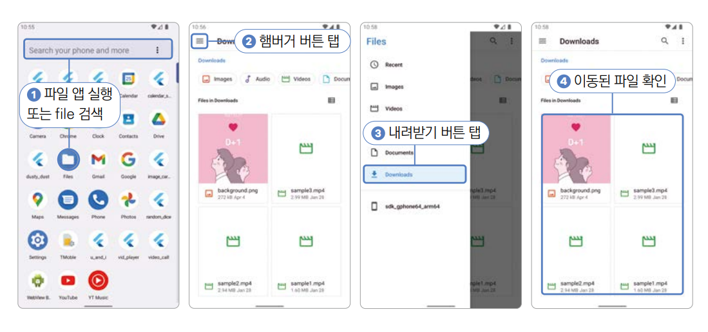  
  
# **이미지 추가하기**  
이미지 에셋을 pubspec.yaml 파일에 추가한다.  
  
1. asset 폴더를 만들고 그 아래 img 폴더를 만든다. 다운로드 받은 이미지를 넣는다.  
  
# **pubspec.yaml 설정하기**  
1. image_picker와 video_player, assets 설정을 입력한다.  
  
pubspec.yaml 참고  
  
2. pub get을 실행해서 변경 사항을 반영한다.  
  
# **네이티브 설정하기**  
이번 프로젝트는 갤러리 관련 권한이 필요하다. 갤러리에서 사용자가 선택한 동영상을 불러오려면 안드로이드와 iOS 모두에서 
갤러리 권한을 추가해줘야 한다.  
  
# **iOS 권한 추가하기**  
iOS 권한은 Info.plist 파일에서 추가할 수 있다. NSPhotoLibraryUsageDescription 권한을 등록해주면 사용자가 허가했을 
때 아이폰에서 갤러리 권한을 얻을 수 있다.  
  
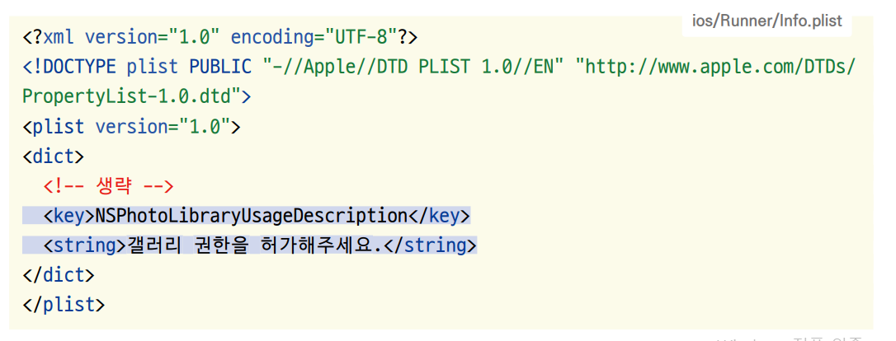  
  
# **안드로이드 권한 추가하기**  
안드로이드 권한은 AndroidManifest.xml 파일에서 추가할 수 있다. android.permission.READ_EXTERNAL_STORAGE 권한을 
추가하면 되며 이 권한을 추가하면 안드로이드에서 갤러리 이미지 또는 동영상을 읽을 수 있다.  
  
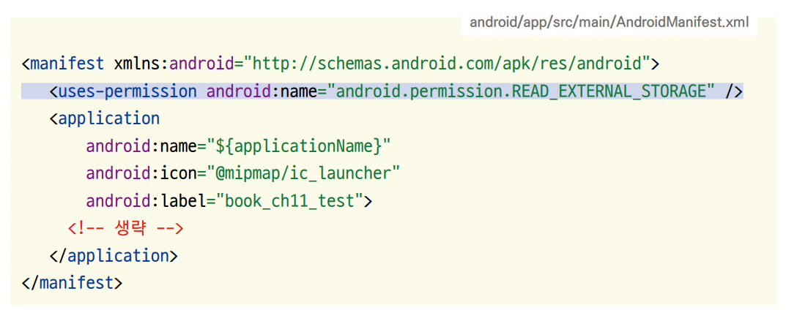  
  
# **프로젝트 초기화하기**  
1. lib 폴더에 screen 폴더를 생성하고 앱의 기본 홈 화면으로 사용할 HomeScreen 위젯을 생성할 home_screen.dart를 생성한다.  
  
lib -> screen -> home_screen.dart  
  
2. lib/main.dart 파일에서도 마찬가지로 HomeScreen을 홈 위젯으로 등록한다.  
  
lib -> main.dart  
  
# **레이아웃 구상하기**  
이번 프로젝트는 실질적으로 화면 하나로 구성되어 있다. 하지만 전체 화면을 차지하는 위젯 두 개를 활용해 조건에 따라 알맞은 
위젯을 보여준다. 메인 화면을 HomeScreen이라고 부르겠다. 이 HomeScreen 위젯에서 renderEmpty() 함수와 renderVideo() 
함수를 구현한다. 각각 동영상이 선택되기 전과 후를 담당하는 위젯을 반환하는 함수가 된다.  
  
# **첫 화면: renderEmpty() 함수**  
renderEmpty()는 앱을 처음 실행했을 때 화면에 보여줄 위젯은 반환하는 함수이다. 앱의 로고와 이름을 보여주고 gradient 
배경을 적용한다.  
  
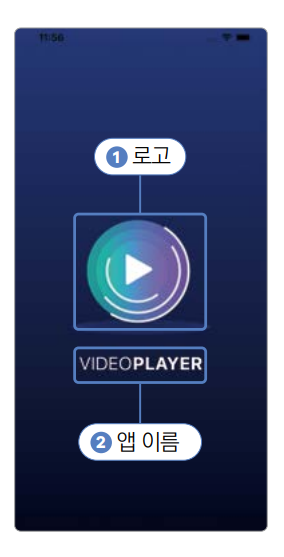  
  
# **플레이 화면: renderVideo() 함수**  
로고를 눌러서 실행하고 싶은 동영상을 선택하면 화면에 보여줄 위젯을 반환해준다. 동영상을 볼 수 있고 동영상을 컨트롤할 수 
있는 버튼들이 있는 함수이다. 영상을 재생하거나 일시정지하고 3초 전으로 돌리거나 3초 후로 돌리거나 새로운 영상을 선택할 
수 있다.  
  
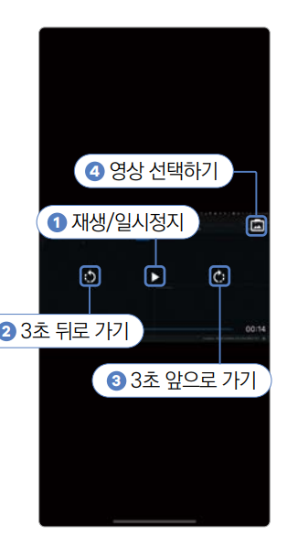  
  
# **구현하기**  
UI를 구현한 후 기능을 구현한다. 먼저 ImagePicker를 이용해서 동영상을 선택하는 기능을 구현하고 동영상 실행 기능을 
구현한다.  
  
# **첫 화면: renderEmpty() 함수 구현하기**  
1. 홈 스크린에서 동영상 파일 선택과 관련해서 상태 관리를 할 계획이니 HomeScreen 클래스를 StatefulWidget으로 구성한다. 
동영상을 선택할 때 사용할 image_picker 플러그인은 이미지나 동영상을 선택했을 때 XFile이라는 클래스 형태로 선택된 값을 
반환해준다. HomeScreen에 선택된 동영상을 의미하는 XFile 형태의 video 변수를 선언하고 이 값을 기반으로 renderEmpty() 
함수를 보여줄지 아니면 renderVideo() 함수를 보여줄지 정한다.  
  
lib -> screen -> home_screen.dart  
  
image_picker 플러그인을 사용하면 XFile 클래스 형태로 동영상을 받아볼 수 있다. 선택된 동영상이 있으면 이 변수에 저장한다. 
선택된 동영상이 없으면 renderEmpty() 함수가 반환하는 위젯을 보여주고 선택된 동영상이 있으면 renderVideo() 함수가 
반환하는 위젯을 보여준다.  
  
2. 레이아웃 구상하기에서 확인했듯이 매우 간단하게 renderEmpty() 함수를 설계할 수 있다. Column 위젯에 로고를 넣어주고 
바로 아래에 앱의 이름을 넣어준다. 코드가 복잡해지면 안 되니 _Logo 위젯으로 로고 코드를 작성하고 _AppName 위젯으로 앱의 
이름을 작업한다.  
  
lib -> screen -> home_screen.dart  
  
_Logo 위젯과 앱 제목을 출력하는 위젯을 만든다.  

lib -> screen -> home_screen.dart  
  
TextStyle의 copyWith 함수는 현재 속성들을 그대로 유지한 채로 특정 속성만 변경할 수 있는 함수이다. textStyle의 값을 
모두 유지한 채로 글자 굵기만 700으로 변경한다.  
  
3. 코드를 다 작성하고 앱을 재시작하면 가운데에 로고가 있는 모습을 볼 수 있다.  
  
# **배경색 그라데이션 구현하기**  
파란색부터 검정색으로 화면의 윗부분부터 아랫부분까지 자연스럽게 그라데이션 배경을 구현하는 데 BoxDecoration 클래스를 사용한다. 
BoxDecoration 클래스를 사용하면 Container 위젯의 배경색, 테두리, 모서리 둥근 정도 등 전반적인 디자인을 변경할 수 있다.  
  
1. BoxDecoration 클래스에는 gradient라는 매개변수가 있다. 시작 부위부터 끝 부위까지 점점 색이 변하는 LinearGradient 
또는 중앙에서 색깔이 점점 퍼져가는 형태인 RadialGradient 클래스를 이용하면 된다. 여기서는 LinearGradient를 사용한다.  
  
lib -> screen -> home_screen.dart  
  
decoration 매개변수에 들어갈 BoxDecoration 값을 getBoxDecoration() 함수에서 구현한다. LinearGradient 클래스에 시작과 
끝을 정하는 begin과 end 매개변수를 지정해준다. 이때 Alignment 클래스를 사용한다. Alignment 클래스는 정렬을 정의하는 
매개변수에 자주 사용되며 정렬과 관련된 값들이 있다. colors 매개변수에 배경을 구성할 색들도 List로 입력해준다. 색상은 
begin에 입력된 위치부터 end에 입력된 위치까지 순서대로 적용된다.  
  
2. Gradient를 추가해주고 앱을 재시작하면 배경색이 반영된 걸 볼 수 있다.  
  
# **파일 선택 기능 구현하기**  
1. 이제 로고를 탭하면 비디오와 사진을 선택할 수 있는 기능을 구현해야 한다. UI를 직접 구현할 필요는 없고 사용자가 파일을 
선택했을 때 변숫값을 처리하는 코드만 작성해주면 된다. 추가적으로 _Logo 위젯에 GestureDetector를 추가해서 onTap() 
함수가 실행됐을 때 동영상을 선택하는 함수를 실행한다.  
  
lib -> screen -> home_screen.dart  
  
_Logo 위젯을 탭했을 떄 실행되는 onTap 매개변수에 onNewVideoPressed() 함수를 입력해서 로고를 탭하면 동영상을 선택하는 
화면이 실행되게 한다. ImagePicker().pickVideo() 함수를 실행하면 동영상을 선택하는 화면을 실행할 수 있다. 이 함수의 
source 매개변수로 ImageSource.gallery 또는 ImageSource.camera를 선택할 수 있다. 전자는 이미 저장되어 있는 동영상을 
갤러리로부터 선택하는 화면을 실행하고 후자는 카메라를 실행한 후 동영상 촬영을 마치면 해당 영상이 선택된다. 선택된 동영상을 
XFile 형태로 비동기로 반환받을 수 있으며 사용자가 선택한 값이 존재하면 video 변수에 저장한다.  
  
Image.asset을 GestureDetector로 감싸서 onTap() 함수를 외부로부터 입력받는다. 이 예제에서는 _HomeScreenState의 
onNewVideoPressed() 함수를 입력받는다.  
  
# **플레이어 화면 구현하기**  
1. CustomVideoPlayer 위젯을 따로 생성해서 영상 재생과 관련된 모든 코딩을 작업할 계획이니 renderVideo() 함수에서 
특별히 많이 할 작업은 없다. 일단 CustomVideoPlayer 위젯이 있다는 가정하에 화면 정중앙에 CustomVideoPlayer 위젯을 
배치하는 정도의 작업만 진행한다.  
  
lib -> screen -> home_screen.dart  
  
# **동영상 재생기 구현하기**  
1. lib 아래에 component 폴더를 생성하고 그 안에 custom_video_player.dart 파일을 생성한다.  
  
2. CustomVideoPlayer 위젯은 HomeScreen 위젯에서 선택된 동영상을 재생하는 모든 상태를 관리한다. 그러니 StatefulWidget으로 
생성하고 위젯이 잘 렌더링되는지 확인하는 용도로 CustomVideoPlayer라는 글자만 정가운데에 위치시킨다.  
  
lib -> component -> custom_video_player.dart  
  
3. home_screen.dart로 돌아가서 custom_video_player.dart 파일을 임포트하고 CustomVideoPlayer 위젯에 video 매개변수를 
제공한다.  
  
lib -> screen -> home_screen.dart  
  
4. 동영상을 선택하면 renderVideo() 함수가 잘 실행되는지 확인할 차례다. 앱을 재실행한 후 로고를 눌러서 아무 동영상이나 
선택한다. 동영상을 선택하고 나면 video 변수가 null이 아닌 상태로 변경된다. 결과적으로 로고와 앱의 제목이 사라지고 
CustomVideoPlayer라는 글자가 화면 가운데 보여야 한다.  
  
5. 이제 CustomVideoPlayer 위젯의 기능을 개선할 차례이다. 우선 video_player 패키지에서 VideoPlayerController와 
VideoPlayer 위젯을 사용해서 선택한 동영상을 화념ㄴ에 보여주는 기능을 구현한다.  
  
lib -> component -> custom_video_player.dart  
  
VideoPlayer 위젯은 VideoPlayerController로 조작할 수 있다. initState() 함수에서 설정할 VideoPlayerController를 
선언한다. initializeController는 VideoPlayerController를 선언하는 역할을 한다. VideoPlayerController는 State가 
생성되는 순간 한 번만 생성되어야 하니 initState() 함수에서 선언한다.  
  
동영상 파일로부터 VideoPlayerController를 생성하기 때문에 VideoPlayerController.file 생성자를 이용해서 컨트롤러를 
만든다. VideoPlayerController를 생성하고 나면 initialize() 함수를 실행해서 동영상을 재생할 수 있는 상태로 준비해줘야 
한다. 에러가 없이 initialize() 함수가 완료되면 VideoPlayerController를 사용할 수 있는 상태라는 뜻이니 setState() 
함수를 이용해서 this.videoController에 준비한 videoController 변수를 저장한다.  
  
VideoPlayerController가 성공적으로 초기화 돼야지만 videoPlayer 변수가 null이 아닌 조건을 만들 수 있다. 만약에 
videoPlayer 변수가 null이면 VideoPlayerController를 사용할 수 있는 상태가 아니라는 뜻이나 CircularProgressIndicator를 
띄워서 로딩 중임을 암시해준다.  
  
AspectRatio는 child 매개변수에 입력되는 위젯의 비율을 정할 수 있는 위젯이다. aspectRatio 매개변수에 원하는 비율을 
입력할 수 있다. 비율은 너비/높이로 입력하면 되며 16:9 비율을 입력하고 싶을 떄는 16/9를 입력하면 된다. VideoPlayerController를 
선안하면 입력된 동영상의 비율을 value.aspectRatio 게터로 받아올 수 있으니 이 값을 직접 넣어준다.  
  
6. 앱을 재실행해서 동영상을 선택하면 선택한 동영상이 보인다.  
VideoPlayerController를 선언할 수 있는 생성자는 다음과 같이 대표적으로 3가지가 있다.  
  
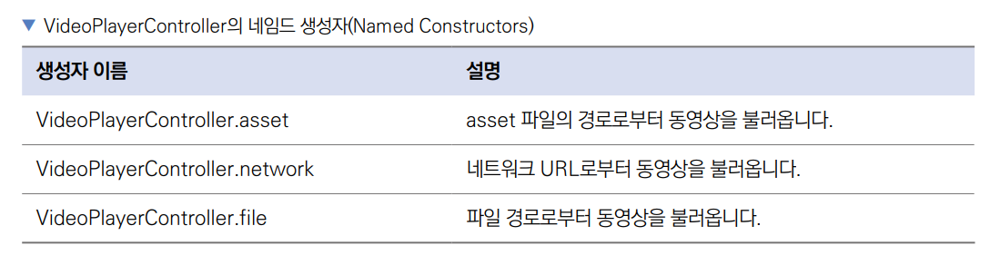  
  

  

