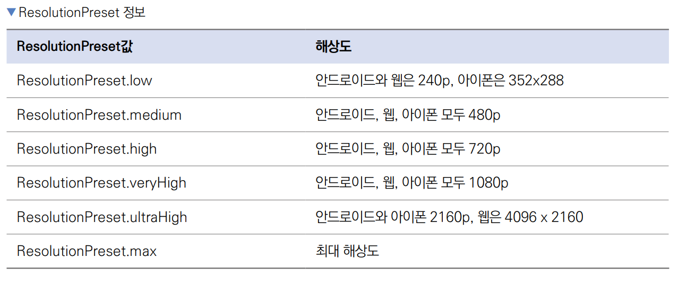
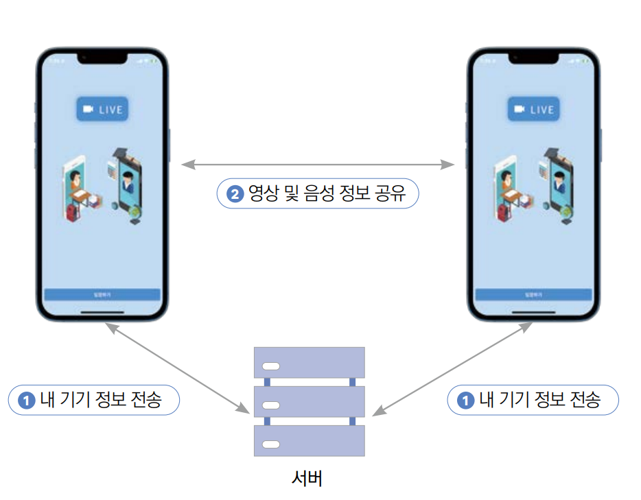
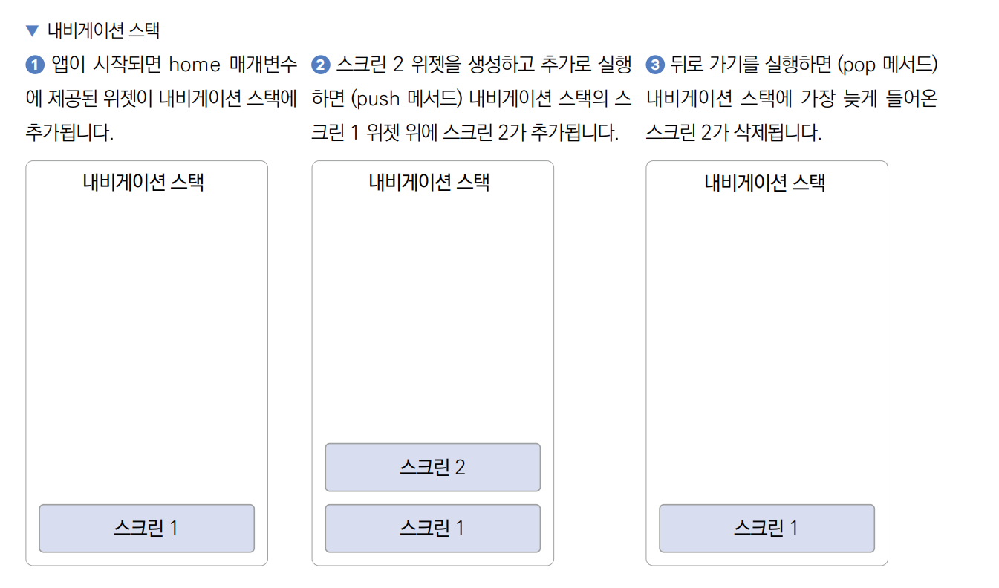
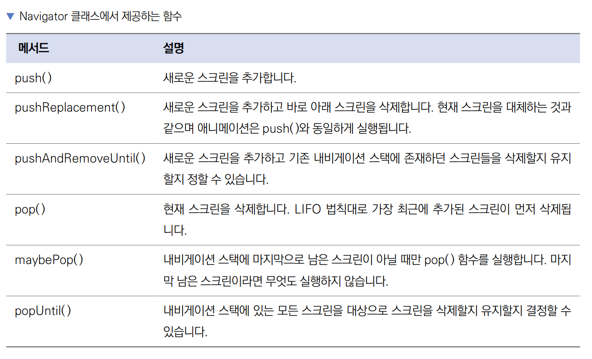
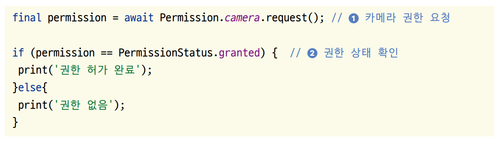
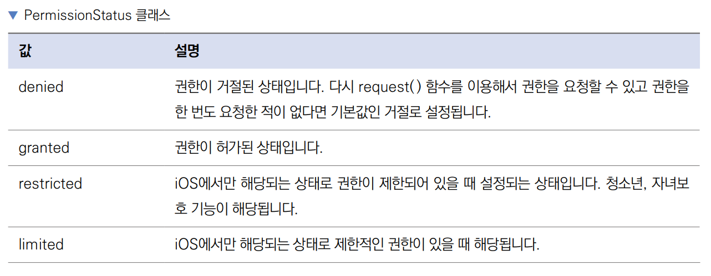
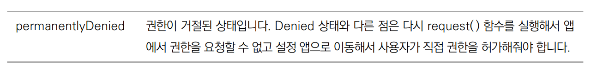
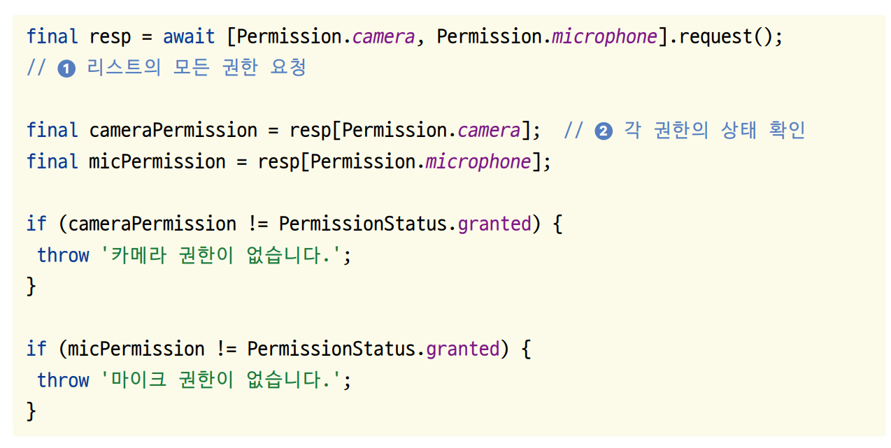

# **영상 통화(WebRTC, 내비게이션, 아고라 API)**  
# **프로젝트 구상하기**  
일반적으로 WebRTC 기술을 사용해서 핸드폰 간의 영상 통화를 구현한다. 전체 기능을 모두 구현하려면 시간이 너무 오래 걸리고 
요점에서 벗어나기 때문에 중계 서버로 아고라라는 유료 API를 사용한다(1만 분까지는 무료로 이용할 수 있다).  
  
영상 통화를 하려면 동영상과 음성을 서로 전달해야 하기 떄문에 카메라 권한과 마이크 권한이 필요하다. 이번 프로젝트에서는 
플러터에서 가장 대중적으로 사용되는 권한 관련 플러그인인 permission_handler 플러그인을 사용해서 안드로이드와 iOS에서 
권한을 관리하는 방법을 알아본다.  
  
iOS 시뮬레이터는 영상 통화 관련 기능을 전혀 지원하지 않아서 빌드가 불가능하다. iOS 실제 기기, 안드로이드 실제 기기, 
안드로이드 에뮬레이터에서 빌드와 실습을 진행하자.  
  
# **사전 지식**  
# **카메라 플러그인**  
카메라 플러그인을 사용하면 카메라 기능을 활용할 수 있다. 이번 프로젝트에서는 아고라 플러그인을 통해서 카메라 기능을 
사용하지만 플러터 공식 플러그인인 camera 플러그인을 사용해서 카메라를 실행하는 방법을 알아보자.  
  
1. pubspec.yaml 파일에 camera 플러그인을 추가한다.  
  
pubspec.yaml 참고  
  
2. 다음 코드를 main.dart 파일에 작성한다.(tmp_main.dart)  
  
lib -> tmp_main.dart  

WidgetsFlutterBinding.ensureInitialized()은 material.dart에서 제공된다. main() 함수의 첫 실행값이 runApp() 이면 
불필요하지만 지금처럼 다른 코드가 먼저 실행돼야 하면 꼭 제일 먼저 실행해줘야 한다. availableCameras()는 기기에서 
사용할 수 있는 카메라들을 가져온다. CameraController는 카메라를 제어할 수 있는 컨트롤러다.  
  
CameraController의 첫 번째 매개변수는 사용할 카메라를 입력하게 된다. 두 번째 매개변수는 해상도를 설정하게 된다. 
ResolutionPreset.max는 최대 해상도를 의미한다.  
  
다른 값은 하단 표를 확인하자.  
  
  
  
initialize()는 카메라를 초기화한다. isInitialized는 카메라 초기화가 완료된 상태인지를 알 수 있다. CameraPreview 
위젯을 사용하면 카메라를 화면에 보여줄 수 있다. 첫 번째 매개변수에 CameraController를 입력해야 한다.  
  
# **WebRTC**  
영상 통화 기능을 구현하려면 영상과 음성 정보를 저장하고 전송하기, 클라이언트 간의 연결하기 등 다양한 기능을 구현해야 한다. 
그런 기능을 모조리 구현하려면 시간이 많이 든다. 웹 브라우저 기반으로 통신하는 WebRTC라는 API가 있다. 음성 통화, 영상 통화, 
P2P 파일 공유 기능을 제공하므로 WebRTC를 사용하면 간단히 영상 통화 기능을 구현할 수 있다.  
  
WebRTC를 사용하려면 두 클라이언트 말고도 중계용 서버가 필요하다. 영어로는 시그널링 서버(Signalling Server)라고 하는데 
이 서버를 직접 구현할 수도 있지만 앱 개발에 집중하고자 아고라 서비스를 이용한다.  
  
클라이언트와 서버 간의 정보 흐름 절차를 그림을 보면서 살펴보자.  
  
  
  
1. WebRTC를 사용할 클라이언트들은 서로에게 연결할 수 있는 공개 IP 등의 정보를 서버에 전송하고 상대의 연결 정보를 받아온다.  
2. 서버에서 받아온 정보를 기반으로 내 영상 및 음성을 공유하고 상대의 영상 및 음성 정보를 이용한다.  
  
# **iOS 시뮬레이터와 안드로이드 에뮬레이터에서의 카메라 사용**  
영상 통화 앱을 구현하려면 당연히 카메라 기능을 사용한다. 하지만 안타깝게도 iOS 시뮬레이터는 카메라 기능을 아예 제공하지 
않는다. 반면에 안드로이드 에뮬레이터는 카메라 앱을 실행할 수는 있지만 실제 카메라와 연동되지는 않고 샘플 영상이 실행된다. 
그래서 이번 장에서 만든 앱을 사용하려면 카메라를 사용할 수 있는 디바이스가 두 대 필요하다. 사용할 수 있는 디바이스가 한 
대 뿐이라면 안타깝지만 하나는 안드로이드 에뮬레이터로 대체해야 한다.  
  
# **내비게이션**  
내비게이션은 플러터에서 화면을 이동할 때 사용하는 클래스이다. 내비게이션은 스택이라는 데이터 구조로 설계되어 있다. 
스택에 대해 잘 이애하면 내비게이션이 제공하는 여러 함수를 조금 더 이해하기 쉽다. 스택은 LIFO(Last In First Out) 구조, 
즉 마지막으로 들어온 요소가 가장 먼저 삭제되는 구조이다.  
  
  
  
플러터에서는 내비게이션 스택의 가장 위에 위치한 위젯을 화면으로 보여준다. Navigator 클래스에서 제공하는 메서드를 사용해서 
내비게이션 스택을 사용할 수 있다.  
  
  
  
# **플러터에서 권한 관리**  
스마트폰을 사용하다 "위치 정보를 사용하도록 허가해주세요"같은 메시지를 본 적이 있을 것이다. 특정 기능들, 특히 보안에 
민감한 기능은 사용자가 권한을 허가해줘야 앱에서 정보를 가져오거나 기능을 사용할 수 있다. 안드로이드와 iOS는 권한을 
요청하는 시스템이 비슷하다. permission_handler 패키지를 이용하면 두 플랫폼 모두에서 쉽게 권한을 관리할 수 있다.  
  
안드로이드와 iOS에는 허가를 받아야 하는 권한이 있고 허가를 받지 않아도 되는 권한이 있다. 예를 들어 블로그 웹 앱 
프로젝트에서 AndroidManifest.xml 파일에 등록한 인터넷 권한은 따로 사용자에 허가를 받지 않고 사용했다. 하지만 이번에 
사용할 카메라와 마이크 권한은 사용자에게 이용 허가를 꼭 받아야지만 사용할 수 있다. 그래서 이 권한들은 네이티브 설정에 
등록을 했더라도 플러터 프레임워크에서 권한이 허가됐는지 아닌지 확인해줘야 한다.  
  
permission_handler 플러그인은 사용법이 매우 단순하다. 플러그인의 Permission 클래스에 존재하는 권한을 선택한 후 
request() 함수를 실행하면 권한 요청을 할 수 있다. 반환 값으로는 PermissionStatus에 해당하는 enum값을 받아올 수 
있으며 PermissionStatus.granted 값을 돌려받으면 권한이 있다는 걸 의미한다.  
  
  
  
  
  
  
권한을 상황에 맞게 하나씩 요청하는 경우도 있지만 필요한 여러 권한을 한 번에 연속적으로 요청할 때도 있다. 이때는 요청하고 
싶은 권한을 순서대로 List에 넣어서 한번에 request() 함수를 실행해주면 여러 권한을 단번에 요청할 수 있다. 그리고 권한 
요청에 대한 결과는 Map 형태로 반환받으며 확인하고 싶은 권한의 값을 key로 입력해주면 권한 요청의 결과를 가져올 수 있다.  
  
  
  

  
