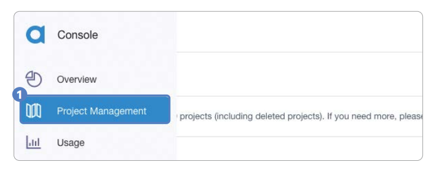
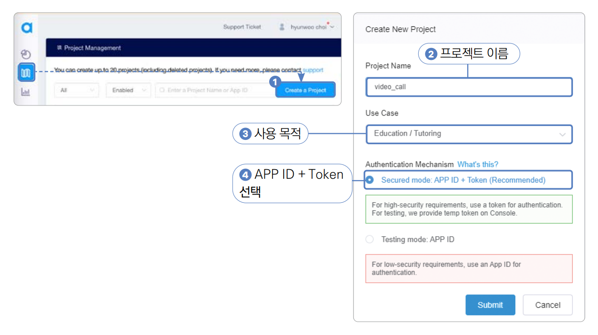
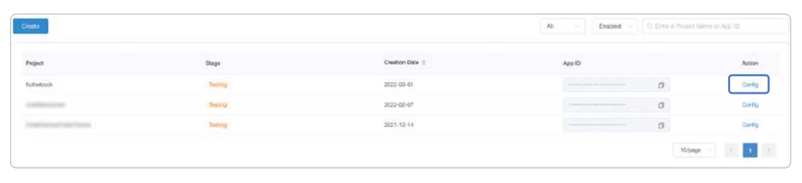
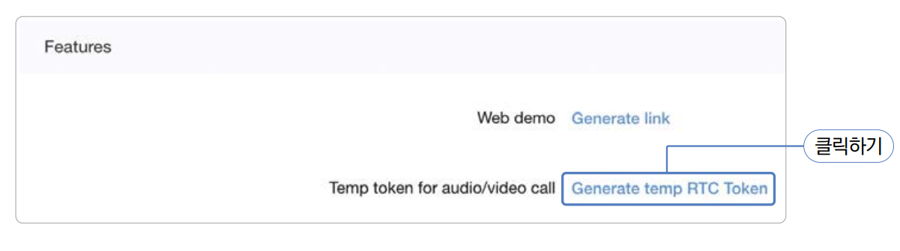
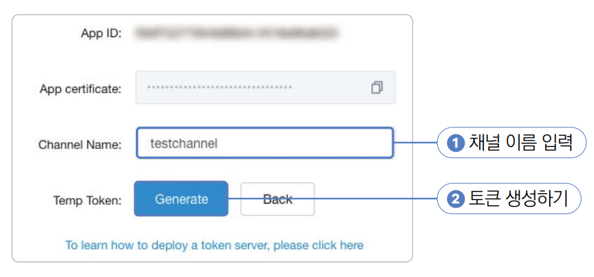
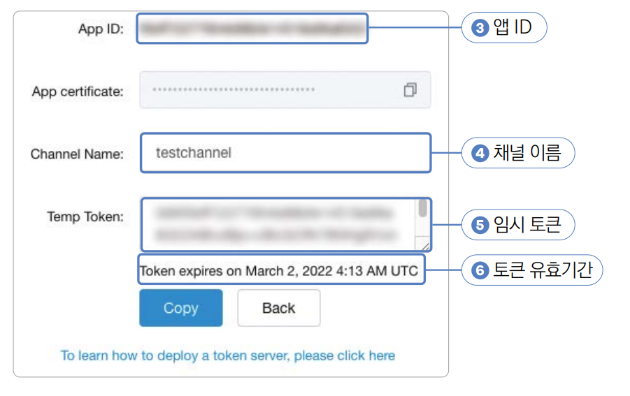

# **영상 통화(WebRTC, 내비게이션, 아고라 API)**  
# **프로젝트 구상하기**  
일반적으로 WebRTC 기술을 사용해서 핸드폰 간의 영상 통화를 구현한다. 전체 기능을 모두 구현하려면 시간이 너무 오래 걸리고 
요점에서 벗어나기 때문에 중계 서버로 아고라라는 유료 API를 사용한다(1만 분까지는 무료로 이용할 수 있다).  
  
영상 통화를 하려면 동영상과 음성을 서로 전달해야 하기 떄문에 카메라 권한과 마이크 권한이 필요하다. 이번 프로젝트에서는 
플러터에서 가장 대중적으로 사용되는 권한 관련 플러그인인 permission_handler 플러그인을 사용해서 안드로이드와 iOS에서 
권한을 관리하는 방법을 알아본다.  
  
iOS 시뮬레이터는 영상 통화 관련 기능을 전혀 지원하지 않아서 빌드가 불가능하다. iOS 실제 기기, 안드로이드 실제 기기, 
안드로이드 에뮬레이터에서 빌드와 실습을 진행하자.  
  
# **사전 지식**  
# **카메라 플러그인**  
카메라 플러그인을 사용하면 카메라 기능을 활용할 수 있다. 이번 프로젝트에서는 아고라 플러그인을 통해서 카메라 기능을 
사용하지만 플러터 공식 플러그인인 camera 플러그인을 사용해서 카메라를 실행하는 방법을 알아보자.  
  
1. pubspec.yaml 파일에 camera 플러그인을 추가한다.  
  
pubspec.yaml 참고  
  
2. 다음 코드를 main.dart 파일에 작성한다.(tmp_main.dart)  
  
lib -> tmp_main.dart  

WidgetsFlutterBinding.ensureInitialized()은 material.dart에서 제공된다. main() 함수의 첫 실행값이 runApp() 이면 
불필요하지만 지금처럼 다른 코드가 먼저 실행돼야 하면 꼭 제일 먼저 실행해줘야 한다. availableCameras()는 기기에서 
사용할 수 있는 카메라들을 가져온다. CameraController는 카메라를 제어할 수 있는 컨트롤러다.  
  
CameraController의 첫 번째 매개변수는 사용할 카메라를 입력하게 된다. 두 번째 매개변수는 해상도를 설정하게 된다. 
ResolutionPreset.max는 최대 해상도를 의미한다.  
  
다른 값은 하단 표를 확인하자.  
  
  
  
initialize()는 카메라를 초기화한다. isInitialized는 카메라 초기화가 완료된 상태인지를 알 수 있다. CameraPreview 
위젯을 사용하면 카메라를 화면에 보여줄 수 있다. 첫 번째 매개변수에 CameraController를 입력해야 한다.  
  
# **WebRTC**  
영상 통화 기능을 구현하려면 영상과 음성 정보를 저장하고 전송하기, 클라이언트 간의 연결하기 등 다양한 기능을 구현해야 한다. 
그런 기능을 모조리 구현하려면 시간이 많이 든다. 웹 브라우저 기반으로 통신하는 WebRTC라는 API가 있다. 음성 통화, 영상 통화, 
P2P 파일 공유 기능을 제공하므로 WebRTC를 사용하면 간단히 영상 통화 기능을 구현할 수 있다.  
  
WebRTC를 사용하려면 두 클라이언트 말고도 중계용 서버가 필요하다. 영어로는 시그널링 서버(Signalling Server)라고 하는데 
이 서버를 직접 구현할 수도 있지만 앱 개발에 집중하고자 아고라 서비스를 이용한다.  
  
클라이언트와 서버 간의 정보 흐름 절차를 그림을 보면서 살펴보자.  
  
  
  
1. WebRTC를 사용할 클라이언트들은 서로에게 연결할 수 있는 공개 IP 등의 정보를 서버에 전송하고 상대의 연결 정보를 받아온다.  
2. 서버에서 받아온 정보를 기반으로 내 영상 및 음성을 공유하고 상대의 영상 및 음성 정보를 이용한다.  
  
# **iOS 시뮬레이터와 안드로이드 에뮬레이터에서의 카메라 사용**  
영상 통화 앱을 구현하려면 당연히 카메라 기능을 사용한다. 하지만 안타깝게도 iOS 시뮬레이터는 카메라 기능을 아예 제공하지 
않는다. 반면에 안드로이드 에뮬레이터는 카메라 앱을 실행할 수는 있지만 실제 카메라와 연동되지는 않고 샘플 영상이 실행된다. 
그래서 이번 장에서 만든 앱을 사용하려면 카메라를 사용할 수 있는 디바이스가 두 대 필요하다. 사용할 수 있는 디바이스가 한 
대 뿐이라면 안타깝지만 하나는 안드로이드 에뮬레이터로 대체해야 한다.  
  
# **내비게이션**  
내비게이션은 플러터에서 화면을 이동할 때 사용하는 클래스이다. 내비게이션은 스택이라는 데이터 구조로 설계되어 있다. 
스택에 대해 잘 이애하면 내비게이션이 제공하는 여러 함수를 조금 더 이해하기 쉽다. 스택은 LIFO(Last In First Out) 구조, 
즉 마지막으로 들어온 요소가 가장 먼저 삭제되는 구조이다.  
  
  
  
플러터에서는 내비게이션 스택의 가장 위에 위치한 위젯을 화면으로 보여준다. Navigator 클래스에서 제공하는 메서드를 사용해서 
내비게이션 스택을 사용할 수 있다.  
  
  
  
# **플러터에서 권한 관리**  
스마트폰을 사용하다 "위치 정보를 사용하도록 허가해주세요"같은 메시지를 본 적이 있을 것이다. 특정 기능들, 특히 보안에 
민감한 기능은 사용자가 권한을 허가해줘야 앱에서 정보를 가져오거나 기능을 사용할 수 있다. 안드로이드와 iOS는 권한을 
요청하는 시스템이 비슷하다. permission_handler 패키지를 이용하면 두 플랫폼 모두에서 쉽게 권한을 관리할 수 있다.  
  
안드로이드와 iOS에는 허가를 받아야 하는 권한이 있고 허가를 받지 않아도 되는 권한이 있다. 예를 들어 블로그 웹 앱 
프로젝트에서 AndroidManifest.xml 파일에 등록한 인터넷 권한은 따로 사용자에 허가를 받지 않고 사용했다. 하지만 이번에 
사용할 카메라와 마이크 권한은 사용자에게 이용 허가를 꼭 받아야지만 사용할 수 있다. 그래서 이 권한들은 네이티브 설정에 
등록을 했더라도 플러터 프레임워크에서 권한이 허가됐는지 아닌지 확인해줘야 한다.  
  
permission_handler 플러그인은 사용법이 매우 단순하다. 플러그인의 Permission 클래스에 존재하는 권한을 선택한 후 
request() 함수를 실행하면 권한 요청을 할 수 있다. 반환 값으로는 PermissionStatus에 해당하는 enum값을 받아올 수 
있으며 PermissionStatus.granted 값을 돌려받으면 권한이 있다는 걸 의미한다.  
  
  
  
  
  
  
권한을 상황에 맞게 하나씩 요청하는 경우도 있지만 필요한 여러 권한을 한 번에 연속적으로 요청할 때도 있다. 이때는 요청하고 
싶은 권한을 순서대로 List에 넣어서 한번에 request() 함수를 실행해주면 여러 권한을 단번에 요청할 수 있다. 그리고 권한 
요청에 대한 결과는 Map 형태로 반환받으며 확인하고 싶은 권한의 값을 key로 입력해주면 권한 요청의 결과를 가져올 수 있다.  
  
  
  
# **사전 준비**  
카메라와 마이크를 사용하려면 권한 설정을 해야 한다. 아고라 API에서 필수로 요구하는 사항이니 꼭 등록해줘야 한다.  
  
1. 먼저 실습에 사용할 프로젝트를 생성한다.  
- 프로젝트 이름: video_call  
- 네이티브 언어: 코틀린  
  
# **아고라에서 필요한 상수값 가져오기**  
아고라는 영상 통화와 통화 기능 API를 유료로 제공하는 서비스이다. 이번 프로젝트에서는 아고라의 영상 통화 API를 이용한다. 
아고라 같은 유료 API를 사용하려면 여러 가지 고윳값이 필요하다. 유료 API인만큼 아고라 입장에서는 누가 어떤 기능을 얼마만큼 
사용하는지 알아야 한다. 그래서 사용자별로 토큰을 발급해주며 사용자들은 이 토큰값을 사용해서 서비스를 이용한다. 아고라가 
유료 서비스이긴 하지만 회원가입을 하면 매달 1만 분을 무료로 사용할 수 있다. 영상 통화 기능을 실수로 1만 분 이상 틀어 
놓지 않으면 과금 없이 충분히 이번 프로젝트를 마무리할 수 있다.  
  
# **아고라 가입하기**  
1. 토큰을 발급받으려면 아고라에 회원가입을 해야 한다. https://www.agora.io 로 이동해서 회원가입을 진행하면 된다.

2. 로그인 및 회원가입을 완료하면 대시보드 페이지로 이동된다. 프로젝트 생성 팝업창이 뜬다. 일단 팝업창을 종료한다. 
대시보드 페이지에서 왼쪽 사이드바에 마우스를 올린 다음 Project Management 버튼을 누른다.  
  
  
  
3. Project Management 화면으로 이동되면 Create a Project 버튼을 눌러서 새로운 프로젝트를 생성한다. Create a Project 
버튼을 눌러주면 뜨는 프로젝트 생성 창에서 프로젝트 이름, 사용 목적, Secure Mode를 선택한 후 Submit 버튼을 눌러서 
프로젝트를 생성한다.  
  
  
  
2번은 프로젝트 이름이다. 구현하려는 앱에 어울리는 이름을 지어주면 된다. 3은 아고라 API 사용 목적이다. Education -> 
Tutoring을 선택한다. 크게 중요한 부분이 아니므로 적절히 선택해주면 된다. 4번은 APP ID + Token 모드를 선택해야 한다.  
  
4. 프로젝트를 생성하면 Project Management 페이지의 테이블에 새로 만든 프로젝트가 생성된다. 방금 생성한 프로젝트의 
config 버튼을 눌러서 설정 화면으로 이동한다.  
  
  
  
5. 프로젝트 설정 페이지에 들어가면 Features 카테고리가 있다. 이 테이블에서 Generate temp RTC Token 버튼을 누른다.  
  
  
  
6. 토큰 생성 페이지로 이동하면 채널 이름을 testchannel로 설정한 후 Generate 버튼을 누르면 토큰이 생성된다. 이 페이지에서 
필요한 모든 값들을 볼 수 있다.  
  
  
  
첫 번째 App ID는 프로젝트의 유니크한 아이디를 의미한다. 두 번째 채널 이름은 핸드폰끼리 통신할 때 사용할 채널의 이름이다. 
원하는 대로 지어도 된다. 마지막으로 Temp Token은 아고라 API를 사용하는 권한이 있음을 증명하는 데 사용된다. 이 토큰을 
사용해야지만 우리 프로젝트와 연동해서 아고라 서비스를 사용할 수 있다. 추가적으로 토큰 유효기간도 적혀 있는데 모든 토큰은 
생성 후 24시간만 유효하다. 프로젝트에 필요한 값들은 App ID, Channel Name, Temp Token이니 안전한 곳에 잘 복사해두자.  
  
  
  
7. 값들을 모두 복사했다면 lib/const 폴더를 생성하고 그 아래에 agora.dart 파일을 생성해서 아고라와 관련된 값들을 
정리해준다. Temp Token은 발급받은 시간으로부터 24시간만 유효하다.  
  
lib -> const -> agora.dart  
  
# **이미지와 폰트 추가하기**  
1. asset 폴더를 만들고 그 아래 img 폴더를 만든다. 예제 그림 파일을 img 폴더에 저장한다.  
  
# **pubspec.yaml 설정하기**  
1. pubspec.yaml에 의존성과 에셋 파일을 추가한다.  
  
pubspec.yaml 참고  
  
2. pub get을 실행해서 변경 사항을 반영한다.  
  
# **네이티브 설정하기**  
안드로이드에서 추가할 네이티브 권한은 네트워크 상태를 읽는 READ_PHONE_STATE와 ACCESS_NETWORK_STATE 권한이다. 인터넷을 
이용해서 영상을 스트리밍해야 하니 INTERNET 권한도 필수이다. 그리고 녹음과 녹화 기능과 관련된 RECORD_AUDIO, MODIFY_AUDIO_SETTINGS와 
CAMERA 권한을 추가한다. 블루투스를 이용한 녹음 및 녹화 기능을 사용할 수도 있으니 BLUETOOTH_CONNECT 기능까지 추가한다. 
마지막으로 모듈의 build.gradle 파일도 변경한다. iOS는 카메라 권한인 NSCameraUsageDescription과 마이크 권한인 
NSMicrophoneUsageDescription만 추가해주면 된다.  
  
android -> app -> src -> main -> AndroidManifest.xml  
ios -> Runner -> Info.plist  
  
# **프로젝트 초기화하기**  
1. lib 폴더에 screen 폴더를 생성하고 앱의 기본 홈 화면으로 사용할 HomeScreen 위젯을 생성할 home_screen.dart를 생성한다. 
다음과 같이 HomeScreen이라는 StatelessWidget을 생성한다.  
  
lib -> screen -> home_screen.dart  
  
2. lib/main.dart 파일에서도 마찬가지로 HomeScreen을 홈 위젯으로 등록해줘야 한다.  
  
lib -> main.dart  
  
# **레이아웃 구상하기**  
이번 프로젝트는 2개의 화면으로 구성된다. 첫 번째 화면은 홈 스크린으로 화상 통화 채널에 참여할 수 있는 화면이고 두 번째 
화면은 화상 통화를 하는 화면이다. 일반적으로 화상 통화 앱을 구현한다면 홈 화면에서 참여할 채널 또는 화상 통화를 진행할 
상대를 선택하는 기능이 추가되겠지만 이 프로젝트에서는 하나의 채널만 있다는 가정하에 앱을 구현한다.  
  
# **홈 스크린 위젯**  
홈 스크린 위젯은 지금까지 구현해왔던 다른 호 화면들과 크게 다를 게 없다. 가장 위에 앱의 로고가 위치하고 중앙에 이미지가 
위치한다. 그리고 마지막에 화상 통화 채널에 참여할 수 있는 버튼을 구현한다. 별다른 특이점은 없으므로 학습 목적으로 앱의 
로고를 구현할 때 로고를 감싸고 있는 Container에 그림자를 넣어서 3D 입체감을 추가한다.  
  

  
