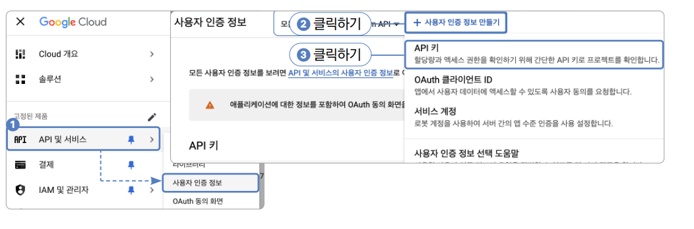

# **오늘도 출첵(구글 지도, Geolocator 플러그인, 다이얼로그)**  
# **프로젝트 구상하기**  
이번 프로젝트에서 가장 집중할 핵심 요소는 지도 기반 위치 서비스이다. 오늘도 출첵은 정해둔 특정 위치의 위도, 경도부터 
100미터 이내에서 출근 체크 기능을 제공하는 앱이다. 우선 구글 클라우드 플랫폼 콘솔에서 API 키를 발급받고 구글 지도 API를 
사용해서 회사 건물 위치, 출근 가능 영역 그리고 현재 나의 위치를 지도 위에 표현한다. 마지막으로 건물 위치와 내 현재 
위치가 몇 미터가 떨어져 있는지 계산해서 출근 체크를 할 수 있는 거리인지 확인하는 기능도 구현한다.  
  
# **사전 지식**  
# **Geolocator 플러그인**  
Geolocator 플러그인은 지리와 관련된 기능을 쉽게 사용할 수 있는 플러그인이다. Geolocator 기능은 크게 세 가지다. 
첫 번째로 위치 서비스를 사용할 수 있는 권한이 있는지 확인하고 권한을 요청한다. 두 번쨰로 현재 GPS 위치가 바뀔 때마다 
현재 위칫값을 받을 수 있는 기능을 사용한다. 마지막으로 현재 위치와 회사 건물 간의 거리를 계산한다.  
  
# **위치 서비스 권한 확인하기**  
위치 서비스를 사용할 수 있는 상태인지 파악하는 과정은 2단계이다. 첫 번째로 기기의 위치 서비스가 활성화되어 있는지 확인해야 
한다. 기기에서 위치 서비스를 꺼놓았다면 앱에서 위치 서비스에 대한 권한이 있더라도 위치 서비스 기능을 사용할 수 없다. 
두 번째로 앱에서 위치 서비스 권한을 요청하고 허가받아야 한다. 기기의 위치 서비스 기능이 켜졌더라도 안드로이드와 iOS는 
유저로부터 앱에서 위치 서비스 권한을 직접 허가받고 사용하도록 설계되어 있다.  
  
기기의 위치 서비스 기능이 켜졌는지 확인하는 데 isLocationServiceEnabled() 함수를 사용하면 된다. boolean 값으로 
활성화되어 있으면 true, 아니면 false를 반환한다.  
  
  
  
앱에서 위치 서비스 기능을 사용할 수 있는 상태인지 확인하는 데 checkPermission() 함수를 사용하면 된다. 만약에 권한이 
없다면 requestPermission() 함수를 사용해서 권한을 요청할 수 있다. 두 함수 모두 LocationPermission enum을 반환해주며 
5가지 값 중 하나를 반환받을 수 있다.  
  
  
  
  

# **현재 위치 지속적으로 반환받기**  
Geolocator 플러그인의 getPositionStream() 함수를 사용하면 현재 위치가 변경될 때마다 현재 위칫값을 Position 클래스 
형태로 주기적으로 반환받을 수 있다.  
  
  
  
  
  
# **두 위치 간의 거리 구하기**  
Geolocator 플러그인의 distanceBetween() 함수를 실행하면 복잡한 함수를 직접 구현할 필요 없이 두 위치 간의 거리를 미터 
단위로 반환받을 수 있다.  
  
  
  
# **사전 준비**  
준비할 작업은 크게 두 가지이다. 첫 번쨰로 구글 짇를 사용하도록 구글 API 키를 발급받아야 한다. 구글 지도의 특정 기능들은 
일정 사용량을 넘으면 유료이므로 앱별로 키를 발급받아 사용해야 한다. 두 번째 작업은 네이티브 설정이다. 발급받은 구글 
API 키를 안드로이드와 iOS 네이티브 코드로 등록해야 한다.  
  
1. 실습에 사용할 프로젝트 생성 
- 프로젝트 이름: chool_check
- 네이티브 언어: 코틀린  
  
# **구글 지도 API 키 발급받기**  
구글 지도 API를 사용하려면 구글 지도 API 키를 발급받아야 한다. 오래 전 구글이 클라우드 사업에 진출하며 대부분의 API 
발급 시스템이 구글 클라우드 플랫폼으로 통합되었다. 이 과정에서 구글 지도도 구글 클라우드 플랫폼으로 병합되어서 구글 지도 
API를 발급받으려면 구글 클라우드 플랫폼을 이용해야 한다.  
  
구글 클라우드 플랫폼으로 병합되기 전 구글 지도의 모든 기능은 무료였지만 현재는 부분 무료로 변경되었다. 기본 기능은 무료로 
사용할 수 있으나 검색 서비스 및 길찾기 등의 기능은 유료이다. 이번 프로젝트에서는 무료 기능만 사용한다.  
  
# **구글 클라우드 플랫폼 접속 및 회원가입**  
1. 구글에서 구글 클라우드 플랫폼을 검색하거나 https://cloud.google.com/gcp로 이동해 구글 클라우드 플랫폼으로 접속한다.  
2. 접속 후 로그인 버튼을 눌러서 로그인 또는 회원가입을 진행한 후 무료로 시작하기 버튼을 눌러서 구글 클라우드 플랫폼 
콘솔에 접속한다. 기존에 구글 클라우드 계정이 있다면 로그인 후에 콘솔을 클릭해 콘솔에 접속한다. 기존 회원은 3번 단계를 
스킵하고 4번을 진행한다.  
  
  
  
3. 총 3단계 절차에 따라 계정 정보 및 카드 정보를 입력한다. 구글 클라우드 플랫폼은 서비스를 사용 후 후불로 결제하는 시스템이니 
카드 정보를 꼭 기입해야 서비스를 사용할 수 있다. 유료 기능을 사용하지 않으면 과금은 이루어지지 않는다. 정보를 모두 정확히 
입력하면 구글 클라우드 플랫폼 콘솔로 이동한다. 이때 콘솔로 이동될 수도 있고 프로젝트 생성 페이지로 자동 이동될 수도 있다.  
  
  
  
4. 오늘도 출첵 앱을 만들며 사용할 프로젝트를 생성해야 한다. My First Project 또는 해당 위치에 있는 My Project를 
선택하고 새 프로젝트를 클릭한다.  
  
  
  
원하는 이름으로 프로젝트를 하나 생성한다.  
  
  
  
# **API 키 발급받기**  
1. 프로젝트의 전반적인 상황을 모니터링할 수 있는 홈페이지로 이동되었을 것이다. 상단 탐색창에 Maps SDK for를 입력하고 엔터를 
치면 Maps SDK for Android와 Maps SDK for iOS 버튼이 보인다. 이 두 버튼을 순서대로 클릭해서 사용 버튼을 눌러주면 
현재 프로젝트에서 구글 시도를 사용하도록 설정할 수 있다. Maps SDK for Android와 Maps SDK for iOD 버튼은 상황에 따라 
타일 또는 리스트로 표현되니 당황하지 말고 정확한 버튼을 찾아서 페이지로 이동한 후 기능을 활성화하자.  
  
  
  
2. API 키를 발급받을 차례다. 메뉴에서 API 및 서비스 -> 사용자 인증 정보 버튼을 누른 후 + 사용자 인증 정보 만들기 버튼을 
눌러서 사용자 인증 정보를 생성한다. 팝업 메뉴에서 API 키 버튼을 클릭한다.  
  
  
  
3. 화면에 팝업창이 하나 실행된다. 이 창의 중간에 적혀 있는 글자가 새로 발급된 구글 지도 API 키이다. 이 값을 잘 저장해두고 
추후 프로젝트에 적용하면 된다.  
  
  
  
# **pubspec.yaml 설정하기**  
1. 지도 기능을 제공해주는 google_maps_flutter 플러그인과 위치 관련 기능을 제공해주는 geolocator 플러그인을  
pubspec.yaml에 추가한다.  
  
pubspec.yaml 참고  
  
2. pub get을 실행해서 변경 사항을 반영한다.  
  
# **네이티브 코드 설정하기**  
구글 지도를 사용하려면 안드로이드와 iOS 모두 네이티브 설정이 필요하다. 구글 클라우드 플랫폼에서 발급받은 API 키를 
안드로이드와 iOS 네이티브 파일에 모두 등록해줘야 구글 지도를 불러올 수 있다. 그리고 안드로이드에서는 최소 버전 설정이 
필요하니 추가한다.  
  
# **Android 설정**  
1. android/app/src/main/AndroidManifest.xml에 상세 위치 권한과 미리 발급받은 구글 지도 API 키를 등록해줘야 한다. 
먼저 상세 위치 권한을 의미하는 ACCESS_FINE_LOCATION을 등록해준다. 그리고 manifest 태그의 application 태그 안에 
meta-data 태그를 새로 생성해서 android:name 값을 다음과 같이 입력하고 android:value 값에 발급받은 API 키를 입력한다. 
다음으로 geolocator 플러그인을 사용하기 위해 위치 권한을 추가한다.  
  
  
  
  
# **iOS 설정**  
1. ios/Runner/AppDelegate.swift 파일을 열어주고 파일 내용을 다음 코드로 완전히 덮어쓰기 해주면 된다. 그다음 API_KEY를 
입력해준다.  
  
ios -> Runner -> AppDelegate.swift  
  
2. 마지막으로 권한 요청 메시지를 작업한다.  
  
ios -> Runner -> Info.plist  
  
# **프로젝트 초기화하기**  
1. lib 폴더에 screen 폴더를 생성하고 앱의 기본 홈 화면으로 사용할 HomeScreen 위젯을 생성할 home_screen.dart를 
생성한다.  
  
lib -> screen -> home_screen.dart  
  
2. lib/main.dart 파일에서도 마찬가지로 HomeScreen을 홈 위젯으로 등록해줘야 한다.  
  
lib -> main.dart  
  

  

