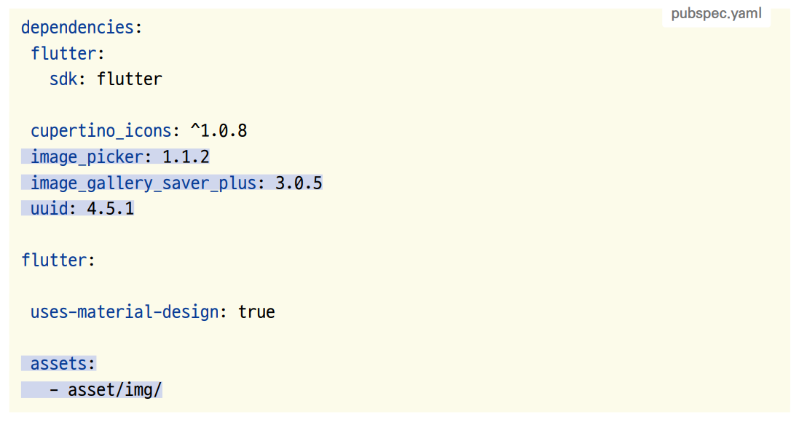
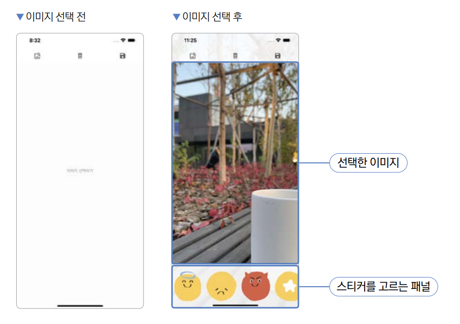
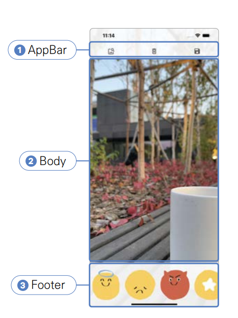

# **포토 스티커(GestureDetector)**  
# **프로젝트 구상하기**  
제스처 기능 및 위젯의 위치를 조절하는 방법을 알아본다. 지금까지 버튼을 이용해서 탭 제스처만 사용해왔다. 플러터에서는 
단순히 탭 제스처뿐만 아니라 굉장히 넓은 스펙트럼의 제스처들을 손쉽게 사용하도록 해준다. 이번에 배워볼 onScaleUpdate 
제스처는 확대, 축소 및 x, y, z축에서의 이동에 대한 정보도 모두 받아볼 수 있다.  
  
제스처의 움직임을 받고 나면 제스처의 움직임만큼 위젯 위치와 크기를 조절해줘야 한다. 이 기능을 플러터에서 제공하는 
Transform 위젯을 사용하면 간편하게 구현할 수 있다.  
  
# **사전 지식**  
# **GestureDetector와 제스처**  
GestureDetector는 플러터에서 지원하는 모든 제스처들을 구현할 수 있는 위젯이다. 지금까지 사용해본 단순 탭뿐만 아니라 
더블 탭, 길게 누르기, 드래그 등 여러 가지 제스처를 인식할 수 있다. 제스처가 인식되면 매개변수에 입력된 콜백 함수가 
실행된다. 다음 표에 흔히 사용되는 제스처 매개변수들이 정리되어있다.  
  
  
  
# **사전 준비**  
이미지를 불러오고 저장하려면 사진첩 및 파일시스템 관련 권한이 필수이다.  
  
1. 실습에 사용할 프로젝트 생성  
- 프로젝트 이름: image_editor  
- 네이티브 언어: 코틀린  
  
# **이미지와 폰트 추가하기**  
1. asset 폴더를 만들고 그 아래 img 폴더를 만든다. 내려받은 이미지를 img 폴더에 저장한다.  
  
# **pubspec.yaml 설정하기**  
1. 다음 수정 사항을 pubspec.yaml에 적용한다.  
  
  
  
2. pub get을 실행해서 변경 사항을 저장한다.
  
# **네이티브 권한 설정하기**  
# **iOS 권한 설정하기**  
iOS는 이미지 관련 권한을 추가해야 한다. 사진첩(NSPhotoLibraryUsageDescription), 카메라(NSCameraUsageDescription), 
마이크(NSMicrophoneUsageDescription) 권한을 추가한다.  
  
ios -> Runner -> Info.plist  
  
# **안드로이드 권한 설정하기**  
안드로이드 11 버전을 기준으로 새로운 파일 저장소가 추가되었다. 하지만 사용자의 핸드폰이 안드로이드 11 버전 이전 운영체제를 
실행 중이면 기존 파일 저장소를 사용해야 하기 때문에 requestLegacyExternalStorage 옵션을 true로 설정해줘야 한다. 
이 값을 true로 설정하면 모든 버전에서 적절한 파일 저장소를 사용할 수 있다.  
  
android -> app -> src -> main -> mainAndroidManifest.xml  
  
# **프로젝트 초기화하기**  
1. lib 폴더에 screen 폴더를 생성하고 앱의 기본 홈 화면으로 사용할 HomeScreen 위젯을 생성할 home_screen.dart를 생성한다. 
  
lib -> screen -> home_screen.dart  
  
2. lib/main.dart 파일에서도 마찬가지로 HomeScreen을 홈 위젯으로 등록해준다.  
  
lib -> main.dart  
  
# **레이아웃 구상하기**  
이번 프로젝트는 하나의 스크린으로 구성되어 있다. HomeScreen을 최상단 AppBar, 이미지를 보여주는 중앙 Body, 스티커를 
고르는 Footer로 3등분으로 나눠서 구현한다.  
  
# **홈 스크린 위젯**  
이번 프로젝트는 하나의 스크린으로 구성되어 있다. 하지만 이미지가 선택됐을 때와 이미지가 선택되지 않았을 떄의 화면이 약간 
다르다. 이미지가 선택되지 않은 상태에서는 화면의 중앙에 [이미지 선택하기] 버튼이 보인다. 반면 이미지가 선택된 상태에서는 
선택된 이미지와 스티커를 고를 수 있는 패널이 생긴다.  
  
  
  
# **이미지 선택 후 화면**  
이미지를 선택한 후 보이는 화면을 세 가지 요소로 요약할 수 있다.  
  
첫 번쨰로 AppBar이다. 반투명 형태로 이미지가 AppBar 아래에 위치하도록 설계할 계획이니 일반 AppBar 위젯을 사용하지 않고 
직접 Container를 이용해서 AppBar를 구현한다. 두 번째는 선택한 이미지가 보이는 Body이다. 이 이미지는 화면 전체를 차지하고 
전체 화면 위에 AppBar와 스티커를 고를 수 있는 Footer 위젯이 올라가게 된다. 추가적으로 이 이미지 위에 쌓을 수 있어야 
한다. 더 나아가 섬세하게 스티커들을 위치시키도록 이미지를 이동하고 확대할 수 있어야 한다.  
  
마지막으로 Footer이다. Footer는 꾸밀 이미지를 선택했을 때만 화면에 보이는 위젯으로 스티커 목록을 보여주는 공간이다. 
좌우로 스크롤이 가능하고 원하는 스티커를 탭했을 때 이미지 위에 스티커를 올릴 수 있다.  
  
  
  
# **구현하기**  
UI부터 구현한다. 이미지를 선택하는 화면을 제외한 나머지 화면은 HomeScreen에서 작업하면 된다. HomeScreen UI 작업이 
끝나면 스티커 붙이기 기능을 구현하고 마지막으로 이미지 선택, 이모티콘 삭제, 이미지 저장에 해당되는 기능을 구현한다.  
  
