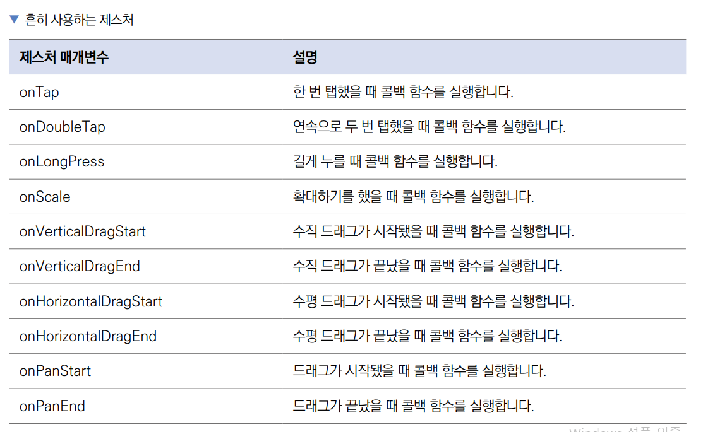

# **포토 스티커(GestureDetector)**  
# **프로젝트 구상하기**  
제스처 기능 및 위젯의 위치를 조절하는 방법을 알아본다. 지금까지 버튼을 이용해서 탭 제스처만 사용해왔다. 플러터에서는 
단순히 탭 제스처뿐만 아니라 굉장히 넓은 스펙트럼의 제스처들을 손쉽게 사용하도록 해준다. 이번에 배워볼 onScaleUpdate 
제스처는 확대, 축소 및 x, y, z축에서의 이동에 대한 정보도 모두 받아볼 수 있다.  
  
제스처의 움직임을 받고 나면 제스처의 움직임만큼 위젯 위치와 크기를 조절해줘야 한다. 이 기능을 플러터에서 제공하는 
Transform 위젯을 사용하면 간편하게 구현할 수 있다.  
  
# **사전 지식**  
# **GestureDetector와 제스처**  
GestureDetector는 플러터에서 지원하는 모든 제스처들을 구현할 수 있는 위젯이다. 지금까지 사용해본 단순 탭뿐만 아니라 
더블 탭, 길게 누르기, 드래그 등 여러 가지 제스처를 인식할 수 있다. 제스처가 인식되면 매개변수에 입력된 콜백 함수가 
실행된다. 다음 표에 흔히 사용되는 제스처 매개변수들이 정리되어있다.  
  
  
  
# **사전 준비**  
이미지를 불러오고 저장하려면 사진첩 및 파일시스템 관련 권한이 필수이다.  
  
1. 실습에 사용할 프로젝트 생성  
- 프로젝트 이름: image_editor  
- 네이티브 언어: 코틀린  
  
# **이미지와 폰트 추가하기**  
1. asset 폴더를 만들고 그 아래 img 폴더를 만든다. 내려받은 이미지를 img 폴더에 저장한다.  
  
