# **API 채팅봇, 소울챗(HTTP 요청, REST API, JSON, 제미나이 API, Isar 데이터베이스)**  
# **프로젝트 구상하기**  
이번 프로젝트의 핵심 요소는 AI이다. AI를 연동하는 게 마냥 어렵게 느껴질 수 있지만 생각보다 기본은 단순하다. 이 프로젝트에서는 
제미나이 AI를 사용해서 AI가 자동으로 대답하는 채팅앱을 구현한다. 그 과정에서 채팅 기록을 저장할 데이터베이스인 Isar NoSQL 
사용법과 데이터를 전송하는 HTTP 요청 방법을 알아본다.  
  
# **사전 지식**  
# **HTTP 요청**  
HTTP(HyperText Transfer Protocol)는 월드 와이드 웹 상에서 통신할 수 있는 프로토콜(약속)이다. 주로 HTTP 문서를 
주고받는 용도로 사용하며 TCP와 UDP 방식을 사용한다. 전 세계 대부분의 앱 및 웹사이트가 서버와 통신에 HTTP 규약을 사용한다. 
HTTP는 요청과 응답으로 구분할 수 있다. 서버/클라이언트 구조에서 HTTP 요청을 보내는 쪽을 클라이언트라고 하고 요청을 
받아서 그에 대응하는 데이터를 보내주는 쪽을 서버라고 한다.  
  
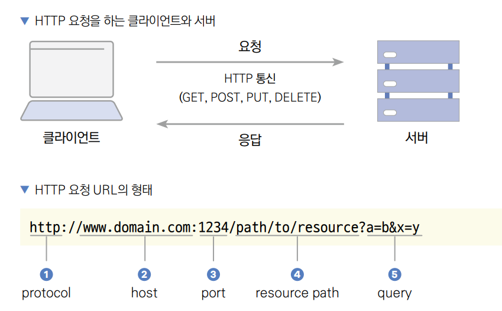  
  
HTTP 요청은 http 또는 https 프로토콜로 실행할 수 있다. https는 http 프로토콜보다 보안이 더욱 강화된 프로토콜이다. 
host는 요청하는 사이트의 도메인을 의미한다. port는 요청이 서버로 전달될 때 어떤 포트로 전달할지 지정한다. HTTP 요청은 
보통 80번 포트를 사용하고 https 요청은 보통 443 포트를 사용한다. resource path는 요청의 경로이다. 불러올 데이터의 정보가 
명시되어 있으며 경로에 따라 API 서버에서 로직을 실행하고 데이터를 반환한다. query는 이외에 추가로 전송할 정보이다.  
  
마지막은 HTTP 요청의 헤더다. 헤더는 메타데이터 즉, HTTP 요청에서 보내는 데이터에 대한 메타 정보를 입력하는 부분이다. 
예를 들어 바디가 어떻게 구성되어 있는지, 데이터의 총 길이는 어느 정도인지, 어떤 브라우저에서 보낸 요청인지에 대한 정보를 
흔히 입력한다. 로그인 후 발급받은 토큰을 서버로 다시 보낼 때도 일반적으로 헤더에 정보를 저장한다.  
  
HTTP 요청을 많이 사용하다 보니 개발자들이 HTTP를 어떤 방식으로 사용하는 게 가장 효율적인지 많은 고민을 하기 시작했다. 
오랜 고민 끝에 개발된 방법 중에는 REST API, GraphQL, gRPC 등이 있다. 현대에는 GraphQL과 gRPC도 많이 사용하지만 
REST API가 압도적으로 대중적이다.  
  
  
  
HTTP 요청은 여러 메서드를 제공하는데 대표적으로 GET, POST, PUT, DELETE를 가장 많이 사용한다.  
  
- GET 메서드는 서버로부터 데이터를 가져온다. 예를 들어 브라우저에서 사이트에 접속하면 GET 메서드를 사용해서 HTML, 
CSS, JS 파일 등을 불러온다. GET 메서드는 HTML 문서의 body를 사용하지 않고 데이터를 전송할 필요가 있을 때 쿼리 
매개변수를 사용한다.  
- POST 메서드는 데이터를 서버에 저장한다. POST 메서드는 body를 자주 사용하는 요청 중 하나로 생성할 데이터에 대한 정보를 
HTML 문서의 바디에 입력한다. 쿼리 매개변수 또한 사용할 수 있으나 POST 메서드에서는 자주 사용하지 않는다.  
- PUT 메서드는 데이터를 업데이트한다. PUT 메서드 또한 쿼리 매개변수와 body를 사용할 수 있다.  
- DELETE 메서드는 데이터를 삭제한다. POST 메서드 그리고 PUT 메서드와 마찬가지로 쿼리 매개변수와 body를 모두 사용할 
수 있다.  
  
# **REST API**  
프로그램이 다른 프로그램과 통신하는 데 정해진 규격의 API를 이용한다.  
  
REST API는 REST 기준을 따르는 HTTP API이다. HTTP API이므로 GET, POST, PUT, DELETE 메서드를 제공한다. 그렇다면 
HTTP 요청에서 제공하는 GET, POST, PUT, DELETE와 REST API가 어떻게 다를까? REST API는 균일한 인터페이스, 무상태, 
계층화, 캐시 원칙을 준수하는 HTTP API이다. 이를 RESTful API라고 한다.  
  
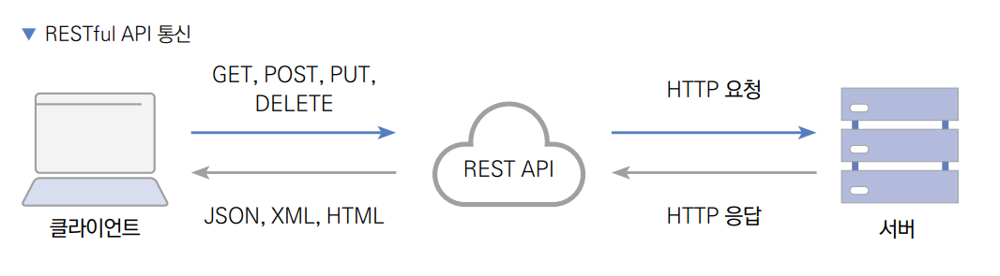  
  
REST API의 4가지 기준  
- 균일한 인터페이스: 요청은 균일한 인터페이스를 갖고 있어야 한다. 요청만으로도 어떤 리소스를 접근하려는지 알 수 있어야 
하며 수정 또는 삭제를 한다면 해당 작업을 실행할 리소스 정보를 충분히 제공해야 한다.  
- 무상태(Stateless): 요청이 완전 분리될 수 있어야 한다. 하나의 요청이 이전 또는 이후의 요청과 완전 독립된 형태로 
구현돼야 하며 임의의 순서로 요청이 처리될 수 있어야 한다.  
- 계층화된 시스템: 클라이언트와 서버 사이에 다른 중개자에 요청을 연결할 수 있다. 이 중개자는 또 다른 서버가 될 수 있고 
클라이언트에서는 이 계층이 보이지 않는다.  
- 캐시: 클라이언트는 응답 속도를 개선할 목적으로 일부 리소스를 저장할 수 있다. 예를 들어 한 웹사이트에 공통으로 사용되는 
이미지나 헤더가 있을 떄 해당 요청을 캐싱함으로써 응답 속도를 빠르게 하거나 불필요한 요청을 줄일 수 있다. 더 나아가 
캐시가 불가능한 API를 지정할 수도 있다.  
  
플러터 프레임워크에서 HTTP 요청을 하는 데 일반적으로 http 플러그인이나 dio 플러그인을 사용한다.  
  
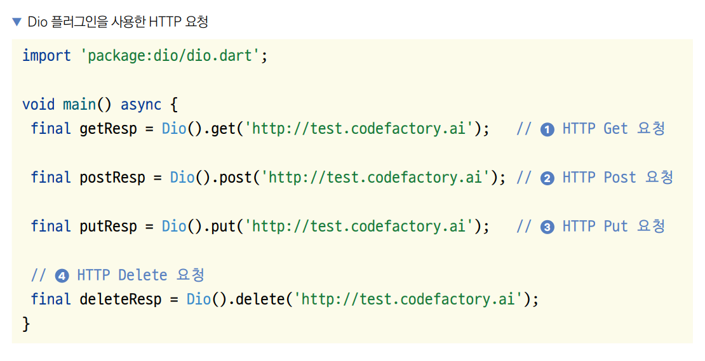  
  
Dio 플러그인을 사용하면 손쉽게 HTTP 요청을 할 수 있다. 단순히 Dio 클래스를 인스턴스화하고 메서드를 (Get, Post, Put, 
Delete) 함수 이름으로 실행해주면 된다. 모든 함수의 첫 번째 매개변수에는 요청을 보내는 URL을 입력해야 한다.  
  
REST API 통신을 하면서 응답으로 XML이나 HTML 같은 문자열을 전달할 수도 있고, JSON 처럼 객체를 전달할 수도 있다.  
  
# **JSON**  
HTTP 요청에서 body를 구성할 때 사용하는 구조는 크게 XML과 JSON으로 나뉜다. XML은 구식으로 현대 API에서는 잘 사용하지 
않고 대부분 JSON 구조를 사용한다. JSON은 인간이 읽을 수 있는 텍스트를 사용해 키-값 쌍으로 이루어진 데이터 객체를 전달하는 
개방형 표준 포맷이다.  
  
REST API 요청할 때 요청 및 응답 Body에 JSON 구조를 자주 사용한다. 플러터에서 JSON 구조로 된 데이터를 응답받으면 
직렬화를 통해 클래스의 인스턴스로 변환하여 사용할 수 있다.  
  
# **제미나이 API**  
챗봇을 만드는 방법은 전통적으로 규칙을 기반으로 했다. 규칙 기반 챗봇은 미리 정의된 규칙과 대화 흐름에 따라 작동하며 정해진 
입력에만 반응한다. 챗봇이 제시하는 메뉴 안에서 선택하여 대화를 이어가는 방식이라서 내가 원하는 내용을 빠르게 확인할 수 
없는 단점이 있다. 반면 챗 GPT나 제미나이 API를 이용한 챗봇은 대규모 언어 모델을 활용해 문맥을 이해하고 더 자연스럽고 
유연한 대화를 생성할 수 있다. 비정형 질문이나 복잡한 대화에도 대응할 수 있어 실효성이 높아 최근 관심이 더 높아졌다.  
  
제미나이의 대안으로 챗GPT, 클로드를 들 수 있다. 챗GPT 점유율이 가장 높지만 제미나이는 구글 워크스페이스 기반 다양한 
서비스를 제공하고 가격도 상대적으로 저렴하여 많은 기업에서 이용하고 있다.  
  
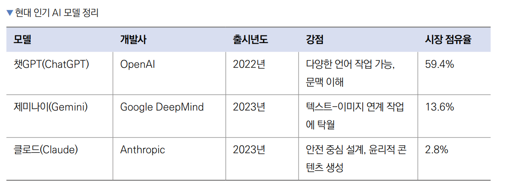  
  
제미나이는 알파고를 개발한 딥마인드가 개발한 AI이다. 제미나이는 다음과 같은 특징이 있다.  
1. 멀티모달 이해 능력: 제미나이는 텍스트뿐 아니라 이미지 등 다양한 데이터를 이해할 수 있는 멀티모달 모델이다. 이를 통해 
텍스트 생성뿐만 아니라 이미지 설명 생성, 텍스트와 이미지 간의 상호 이해, 다양한 입력 형식이 필요한 작업에서 포괄적인 응답을 
제공한다.  
2. 높은 추론 능력과 정확성: 강화 학습과 인간 피드백을 통해 복잡한 문제를 단계별로 해결하는 추론 능력이 뛰어나며 여러 
정보를 통합해 더욱 정확하고 유의미한 응답을 생성한다.  
3. 최적화된 언어 모델: 최신 트랜스포머 아키텍처 기반으로 성능과 효율성을 극대화해 더 많은 정보를 짦은 시간 내에 학습하고 
빠른 응답을 제공한다. 리소스 사용을 최적화하면서도 높은 성능을 유지한다.  
4. 안정성과 윤리적 사용: 유해 콘텐츠 탐지 및 필터링 메커니즘이 강력해 데이터 편향성을 줄이고 윤리적인 응답을 제공하도록 
설계되었다.  
5. 사용자 친화적 인터페이스 및 확장성: 다양한 API와 인터페이스를 제공해 챗봇이나 어시스턴트를 개발하기에 적합하다.  
  
제미나이는 아주 단순한 REST API 형식으로 AI 모델에 응답 생성을 요청할 수 있는 기능을 제공해준다. 제미나이의 API 스펙은 
매우 일반적인 구조이기 떄문에 제미나이를 공부하면 다른 AI 모델의 API도 손쉽게 사용해볼 수 있다.  
  
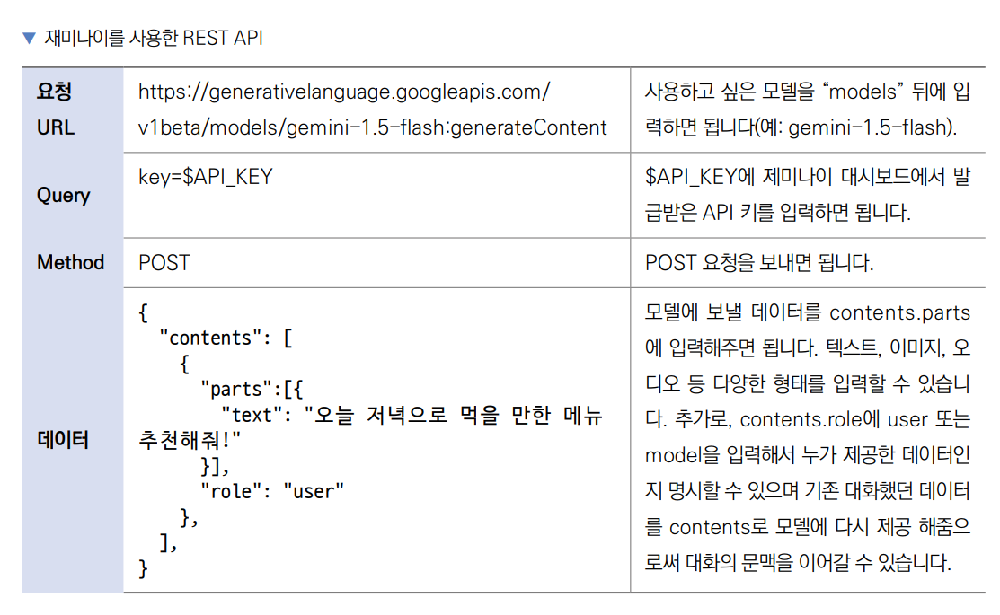  
  
# **Isar 데이터베이스**  
Isar 데이터베이스는 플러터에서 사용할 수 있는 고성능 NoSQL 데이터베이스다. NoSQL 데이터베이스는 SQL과 굉장히 다른 
특성을 갖고 있다. SQL 데이터베이스는 항상 테이블의 구조가 무결성을 유지해야 하는 반면 NoSQL은 구조가 강제되지 않는다. 
그렇기 때문에 사용이 자유로운 반면 방심하면 프로젝트가 커졌을 때 유지보수가 어려워질 수 있다. 서버 데이터베이스는 무결성이 
매우 중요하기 떄문에 SQL 데이터베이스를 많이 사용하는 반면 프론트엔드 데이터베이스는 퍼포먼스와 사용성이 조금 더 중요시 되고 
구조가 복잡하지 않기 때문에 NoSQL 데이터베이스를 사용하는 경우가 많다. 이번 프로젝트에서는 채팅 메시지 데이터를 저장하는 
데 Isar를 사용한다.  
  
# **컬렉션 정의하기**  
Isar 데이터베이스는 데이터를 컬렉션 단위로 나누게 된다. 컬렉션은 특정 자료형 객체를 모아 관리하는 개념이다. 예를 들어 
블로그 앱을 만든다면 사용자 (User)가 한 컬렉션이 되고 상품(Product)이 하나의 컬렉션이 될 수 있다. 컬렉션을 정의하는 
방법은 간단하다. 클래스를 선언하고 클래스를 @collection으로 어노테이트해주면 된다.  
  
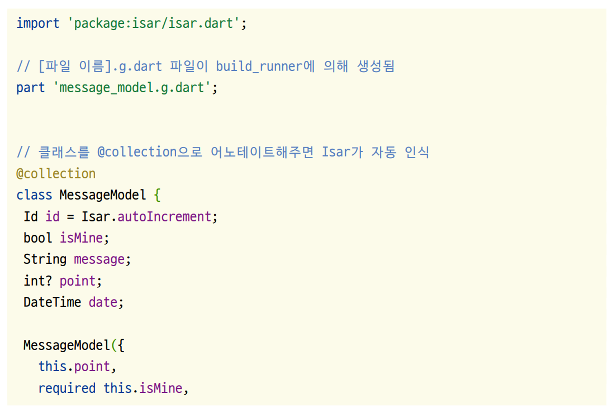  
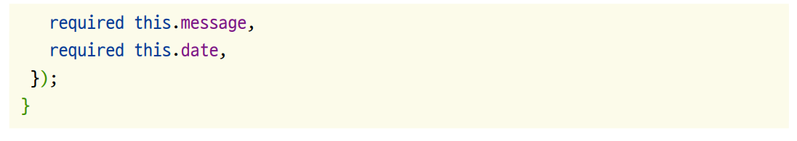  
  
# **빌드 러너 실행하기**  
컬렉션을 정의하고 나면 꼭 빌드 러너(Build Runner)를 실행 해줘야 한다. Build Runner를 실행하면 @collection으로 
어노테이트된 모든 클래스들의 Isar 보조 파일을 생성하게 된다. 보조 파일들은 어노테이트된 클래스가 존재하는 파일 이름에 
.g.dart가 추가된 형태로 생성되며 컬렉션에 실행할 수 있는 기능을 정의하고 있다. 빌드 러너는 컬렉션이 새로 생기거나 
변경되면 매번 실행해줘야 하는 과정이다.  
  
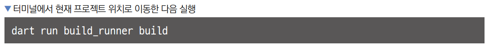  
  
# **사전 준비**  
1. 먼저 실습에 사용할 프로젝트를 생성한다.  
- 프로젝트 이름: soul_talk  
- 네이티브 언어: 코틀린  
  
# **제미나이 API 키 발급받기**  
이 프로젝트에서는 구글 딥마인드의 제미나이를 사용하기 때문에 제미나이 API와 통신할 때 인증을 진행할 수 있는 API 키를 
받아야 한다.  
  
1. 구글 AI 웹사이트에 접속하고 [로그인] 버튼을 눌러서 로그인을 진행한다.  
- https://ai.google.dev  
  
  
  
2. 로그인을 완료한 후 [Get API key in Google AI Studio] 버튼을 클릭한다. (만약에 해당 버튼이 없다면 다음 링크로 
이동한다. https://aistudio.google.com/app/apikey)  
  
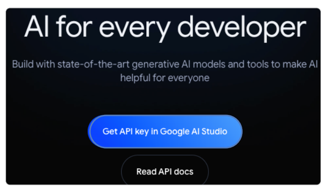  
  
처음 접속하면 다음과 같은 안내 문이 보인다. x 버튼을 눌러 닫는다. 또는 기타 규약 관련 창이 뜰 수 있다. 그러면 안내에 
따라 동의를 해주고 진행한다.  
  
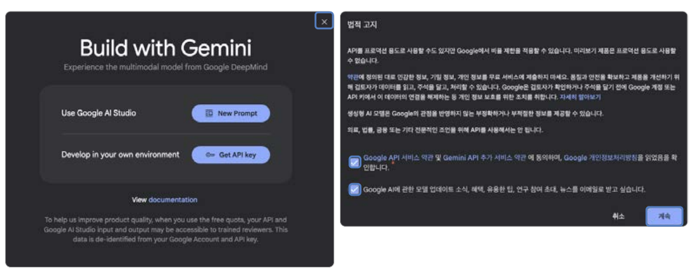  
  
3. 아래로 스크롤해서 API 키 만들기 버튼을 클릭한다. 역시나 처음 생성한다면 간단한 법적 고지를 리마인드하는 창이 보일 
수 있다. 내용을 확인하고 동의한다면 확인 버튼을 클릭한다.  
  
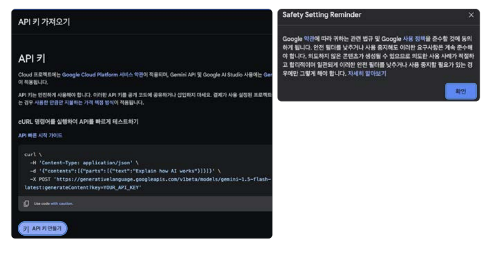  
  
4. 프로젝트를 선택하고 새 프로젝트에서 API 키 만들기 버튼을 클릭한다.  
  
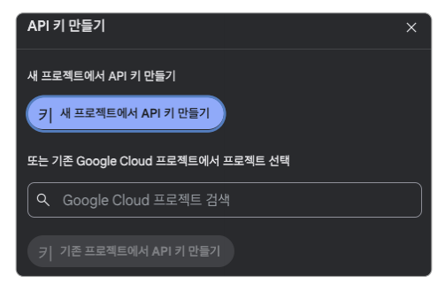  
  
5. 생성된 API 키를 복사한 후 잘 보관해둔다. 이 값을 앞으로 제미나이 API Key 라고 부르겠다.  
  
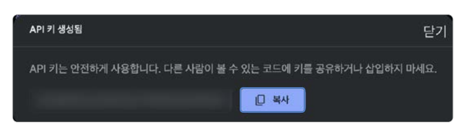  
  
# **이미지 추가하기**  
1. asset 폴더를 만들고 그 아래 img 폴더를 만든다. 예제의 이미지를 방금 만든 img 폴더에 저장한다.  
  
# **안드로이드 네이티브 설정하기**  
최신 플러터 버전에서는 그래들 8 버전 이상을 사용하고 있기 때문에 최신 플러터 버전을 지원하려면 플러그인들의 대응이 
필요하다. 하지만 모든 플러그인들이 발빠르게 최신 업데이트 요구 사항을 반영하지 않기 때문에 최신 요구사항을 반영하지 
않은 플러그인들에 대한 대응 방안이 필요하다. 아래 코드를 추가해서 그래들 8 버전의 요구사항인 namespace를 자동으로 
추가하는 기능을 구현한다.  
  
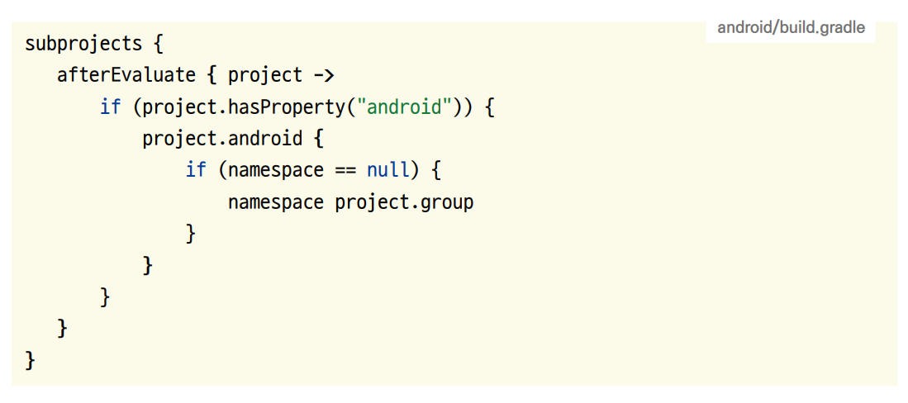  
  
# **pubspec.yaml 설정하기**  
1. 의존성을 pubspec.yaml에 적용한다.  
  
pubspec.yaml 참고  
  
2. pub get을 실행해서 변경 사항을 반영한다.  
  
# **프로젝트 초기화하기**  
1. lib 폴더에 screen 폴더를 생성하고 앱의 기본 홈 화면으로 사용할 HomeScreen 위젯을 생성하는 home_screen.dart를 
생성한다.  
  
lib -> screen -> home_screen.dart  
  
2. lib/main.dart 파일에서도 마찬가지로 HomeScreen을 홈 위젯으로 등록한다.  
  
lib -> main.dart  
  
# **레이아웃 구상하기**  
이 프로젝트는 최대한 단순한 UI로 제미나이 AI API에 연동하는 데 집중한다. 화면은 하나의 스크롤 가능한 단일 스크린으로 
이루어졌으며 가장 위에는 앱의 로고와 설명이 위치한다. 채팅한 날짜가 변경될 때마다 날짜가 화면에 출력되며 그 밑으로 해당 
날짜에 진행한 채팅이 출력된다. 내가 보낸 채팅 메시지 아래에 한 번씩 채팅을 할 때마다 쌓이는 포인트도 표시된다.  
  
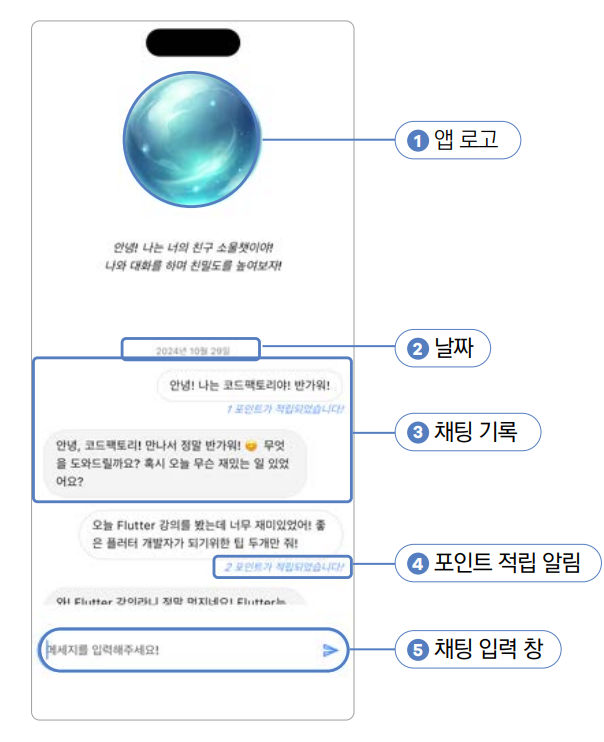  
  
# **구현하기**
# **Logo 위젯 구현하기**  
Logo 위젯은 상단 로고 이미지 위젯과 아래 앱 설명으로 나눌 수 있다. Column을 이용해서 이미지와 텍스트를 위치시킨다.  
  
1. lib/component/logo.dart 파일을 생성하고 코드를 작성한다.  
  
lib -> component -> logo.dart  
  
# **PointNotification 위젯 구현하기**  
내가 제미나이에게 메시지를 보낼 때마다 몇 포인트가 적립됐는지 표시해줄 알림 텍스트를 작업한다. int 타입으로 point 파라미터를 
입력받고 이 값을 기준으로 화며에 Text 위젯을 보여준다.  
  
1. lib/component/point_notification.dart 파일을 생성하고 코드를 작성한다.  
  
lib -> component -> point_notification.dart  
  
# **Message 위젯 구현하기**  
Message 위젯은 제미나이와 내가 한 채팅 내용을 보여줄 채팅 버블이다. 코드는 약간 길지만 로직은 단순하다. Text 위젯을 
Container 위젯으로 감싸고 테두리와 배경을 설정해서 디자인한다. 내가 보낸 채팅 메시지는 오른쪽에, 제미나이가 보낸 메시지는 
왼쪽에 위치시킨다.  
  
1. 이 기능을 사용할 alignLeft 파라미터를 정의하고 true이면 왼쪽에, false이면 오른쪽에 정렬한다.  
  
lib -> component -> message.dart  
  
# **DateDivider 위젯 구현하기**  
DateDivider 위젯으 날짜를 입력받고 화면에 '2024년 11월 23일' 형식으로 출력하는 위젯이다. 이전 채팅 메시지와 현재 
채팅 메시지의 생성 날짜가 다를 떄 화면에 출력하게 된다. 단순히 날짜 파라미터를 하나 입력받고 화면에 Text 위젯을 출력한다.  
  
1. lib/component/date_divider.dart 작성  
  
lib -> component -> date_divider.dart  
  
# **ChatTextField 위젯 구현하기**  
ChatTextFiled 위젯은 코드가 약간 길지만 단순 디자인 요소밖에 없다. ChatTextField 위젯은 파라미터를 네 개 입력받는다.  
  
1. TextField에 입력된 값을 받아올 수 있도록 controller를 입력받고 메시지 전송 버튼을 눌렀을 때 함수를 실행할 수 
있도록 onSend를 입력받는다. 추가로 혹시 있을 에러를 보여줄 error 파라미터를 입력받고 제미나이가 답변을 생성하는 동안 
추가로 메시지를 보낼 수 없도록 loading 파라미터를 입력받는다.  
  
lib -> component -> chat_text_field.dart  
  
# **MessageModel 구현하기**  
제미나이와 사용자가 채팅을 하면 결괏값을 MessageModel의 규격에 맞게 저장한다. MessageModel은 고유 식별값인 ID값, 
내가 보낸 메시지인지 확인할 수 있는 isMaine 파라미터, 주고받은 메시지를 저장하는 message 파라미터, 적립된 포인트를 알 
수 있는 point 파라미터 그리고 생성된 날짜를 저장하는 date 파라미터가 있다.  
  
1. lib -> model -> message_model.dart 파일을 생성한 후 코드를 작성한다.  
  
# **HomeScreen 화면에 UI 요소 배치하기**  
1. HomeScreen 위젯을 StatefulWidget으로 변경한다.  
  
lib -> screen -> home_screen.dart  
  
2. 적절한 가로 세로 패딩과 함께 Logo를 반환하는 _buildLogo() 함수르 작성한다.  
  
lib -> screen -> home_screen.dart  
  
3. API 연동을 완료하기 전까지는 UI가 의도한 대로 출력되는 걸 확인하는 데 샘플 데이터를 활용한다. lib/screen/home_screen.dart 
파일의 맨 위에 샘플 데이터를 추가한다.  
  
lib -> screen -> home_screen.dart  
  
4. 메시지를 화면에 그리는 함수를 작성한다. 메시지당 buildMessageItem() 함수를 실행하면 화면에 메시지 하나를 그려주거나 
날짜와 함께 메시지를 그려준다. 이 기능을 제공할 DateTime을 String으로 변환하는 getStringDate() 함수와 두 날짜를 
다른 날짜로 인식해야 하는지 확인하는 shouldDrawDate() 함수를 만든다.  
  
lib -> screen -> home_screen.dart  
  
5. 이제 화면에 UI를 보여줄 차례다. buildMessageList() 함수를 만들어서 화면에 로고와 메시지들을 보여줄 ListView를 작업한다.  
  
lib -> screen -> home_screen.dart  
  
6. 앱을 실행하면 로고와 메세지를 볼 수 있다.  
  
7. 마지막 UI 작업으로 채팅 입력 텍스트 필드를 화면 아래에 배치한다. Column 위젯으로 ListView 위젯과 TextField 위젯을 
세로로 배치하고 약간의 패딩을 입혀주면 된다. 마지막으로 비어 있는 handleSendMessage() 함수를 정의하고 제미나이에게 
메시지를 보내는 로직은 나중에 작업한다.  
  
lib -> screen -> home_screen.dart  
  
# **Isar 세팅하기**  
1. MessageModel 클래스를 Isar 컬렉션으로 변경한다.  
  
lib -> model -> message_model.dart  
  
2. 현재 프로젝트 위치에서 터미널에 dart run build_runner build 또는 flutter pub run build_runner build를 실행해서 
message_model.g.dart 파일을 생성한다. 그후 lib/model/message_model.g.dart 파일이 생성된 걸 확인한다.  
  
3. lib/main.dart 파일에 Isar 초기화를 한다. 생성된 Isar 객체를 GetIt에 등록해 프로젝트 어디에서든 사용할 수 있다.  
  
lib -> main.dart  
  
# **제미나이 연동하기**  
REST API를 사용해서 연동하는 것도 가능하지만 구글에서 제미나이와 쉽게 연결할 수 있는 플러터 SDK를 제공해주고 있다. 
해당 플러터 SDK를 사용해서 연동한다. 연동 코드가 매우 길기 때문에 세 번에 걸쳐서 작업한다.  
  
1. 첫 번째로 내가 제미나이에게 보낸 메시지를 Isar에 저장하는 작업을 한다.  
  
lib -> screen -> home_screen.dart  
  
2. 두 번째로는 제미나이에 보낼 데이터를 만드는 작업을 한다.  
  
lib -> screen -> home_screen.dart  
  
제미나이에게 현재까지 대화한 문맥을 제공하기 위해 최근 어느 정도 대화 히스토리를 함께 제공하는 게 정확한 대답을 이끌어내기에 
유용하다. 많은 대화 히스토리를 제공할수록 AI가 더욱 정확한 문맥을 이해하기 쉽지만 비용도 함께 늘어나니 합리적인 선에서 문맥을 
제공해야 한다.  
  
3. 마지막으로 제미나이에게 메시지를 보내고 응답을 Isar에 저장하는 작업을 한다. 전체 응답이 올 때까지 기다리지 않고 부분 
부분 응답이 올 때마다 메시지를 즉각적으로 화면에 보여줄 수 있도록 메시지는 스트림으로 받는다.  
  
lib -> screen -> home_screen.dart  
  
Stream으로 데이터를 받아오면 한 번에 응답이 오지 않고 부분 부분 나눠서 응답을 받게 된다. Isar 데이터베이스의 put() 
함수는 id를 제공하지 않을 경우 새로운 데이터를 생성하고 id를 제공할 경우 기존 Isar 데이터를 업데이트한다. 응답이 부분 
부분 올 때마다 새로운 Isar 데이터를 매번 생성하면 안 되니 처음 데이터를 생성한 후에는 존재하는 데이터에 메시지를 
업데이트한다.  
  
4. Isar 데이터베이스로부터 메시지 데이터를 Stream으로 받아와서 UI에 반영한다.  
  
lib -> screen -> home_screen.dart  
  
where() 함수에 아무런 쿼리도 입력하지 않으면 컬렉션 전체를 대상으로 쿼리를 실행할 수 있다. watch() 함수를 실행하면 
쿼리에 해당되는 모든 업데이트 사항을 Stream으로 받아볼 수 있으며 fireImmediately 파라미터를 true로 입력하면 코드가 
실행되는 순간에 즉시 한 번 쿼리를 실행한다.  
  
5. 궁금한 내용을 제미나이에게 물어보면 잘 설명하는 걸 볼 수 있다.  
  
# **자동 스크롤 애니메이션 적용하기**  
1. 기능적인 부분은 모두 작업 완료했으나 새로운 메시지가 화면을 넘어갈 떄 자동으로 리스트의 끝까지 스크롤이 안 되고 있다. 
메시지가 새로 들어올 때마다 화면 끝으로 자동으로 스크롤되는 기능을 제작한다.  
  
lib -> screen -> home_screen.dart  
  
WidgetsBinding.instance.addPostFrameCallback() 함수는 현재 프레임이 렌더링되고 딱 한 번만 실행할 함수를 등록 할 
수 있는 매우 매력적인 함수이다. 이 경우처럼 StreamBuilder가 새로 렌더링될 때마다 매번 스크롤 애니메이션을 실행하는 게 
목적인 경우 매우 효율적인 함수가 될 수 있다. 하지만 위젯 build()는 플러터에서 생각보다 자주 일어난다는 점을 기억하자. 
매번 build()가 될 때마다 리소스를 많이 사용하는 함수를 실행한다면 앱의 퍼포먼스를 매우 저하시키는 요인이 된다.  
  
2. 이제 제미나이에게 메시지를 보내면 응답을 업데이트받을 때마다 매번 아래로 스크롤되는 걸 확인할 수 있다.  
  

  

  

