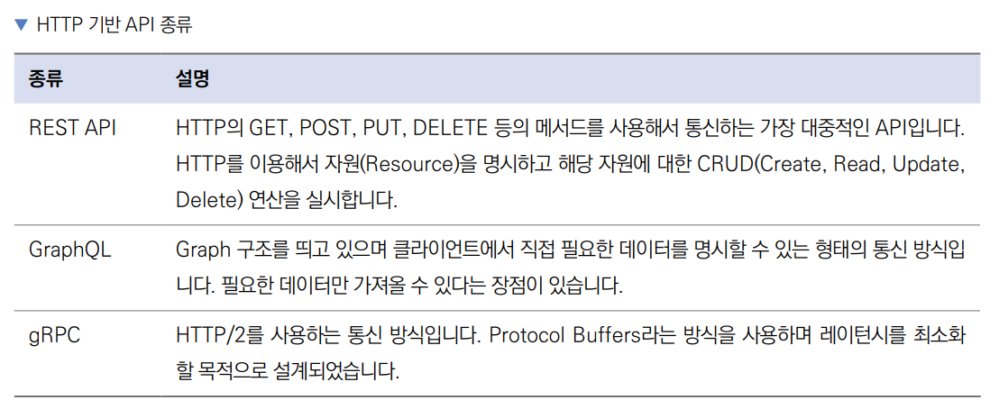

# **API 채팅봇, 소울챗(HTTP 요청, REST API, JSON, 제미나이 API, Isar 데이터베이스)**  
# **프로젝트 구상하기**  
이번 프로젝트의 핵심 요소는 AI이다. AI를 연동하는 게 마냥 어렵게 느껴질 수 있지만 생각보다 기본은 단순하다. 이 프로젝트에서는 
제미나이 AI를 사용해서 AI가 자동으로 대답하는 채팅앱을 구현한다. 그 과정에서 채팅 기록을 저장할 데이터베이스인 Isar NoSQL 
사용법과 데이터를 전송하는 HTTP 요청 방법을 알아본다.  
  
# **사전 지식**  
# **HTTP 요청**  
HTTP(HyperText Transfer Protocol)는 월드 와이드 웹 상에서 통신할 수 있는 프로토콜(약속)이다. 주로 HTTP 문서를 
주고받는 용도로 사용하며 TCP와 UDP 방식을 사용한다. 전 세계 대부분의 앱 및 웹사이트가 서버와 통신에 HTTP 규약을 사용한다. 
HTTP는 요청과 응답으로 구분할 수 있다. 서버/클라이언트 구조에서 HTTP 요청을 보내는 쪽을 클라이언트라고 하고 요청을 
받아서 그에 대응하는 데이터를 보내주는 쪽을 서버라고 한다.  
  
  
  
HTTP 요청은 http 또는 https 프로토콜로 실행할 수 있다. https는 http 프로토콜보다 보안이 더욱 강화된 프로토콜이다. 
host는 요청하는 사이트의 도메인을 의미한다. port는 요청이 서버로 전달될 때 어떤 포트로 전달할지 지정한다. HTTP 요청은 
보통 80번 포트를 사용하고 https 요청은 보통 443 포트를 사용한다. resource path는 요청의 경로이다. 불러올 데이터의 정보가 
명시되어 있으며 경로에 따라 API 서버에서 로직을 실행하고 데이터를 반환한다. query는 이외에 추가로 전송할 정보이다.  
  
마지막은 HTTP 요청의 헤더다. 헤더는 메타데이터 즉, HTTP 요청에서 보내는 데이터에 대한 메타 정보를 입력하는 부분이다. 
예를 들어 바디가 어떻게 구성되어 있는지, 데이터의 총 길이는 어느 정도인지, 어떤 브라우저에서 보낸 요청인지에 대한 정보를 
흔히 입력한다. 로그인 후 발급받은 토큰을 서버로 다시 보낼 때도 일반적으로 헤더에 정보를 저장한다.  
  
HTTP 요청을 많이 사용하다 보니 개발자들이 HTTP를 어떤 방식으로 사용하는 게 가장 효율적인지 많은 고민을 하기 시작했다. 
오랜 고민 끝에 개발된 방법 중에는 REST API, GraphQL, gRPC 등이 있다. 현대에는 GraphQL과 gRPC도 많이 사용하지만 
REST API가 압도적으로 대중적이다.  
  
  
  
HTTP 요청은 여러 메서드를 제공하는데 대표적으로 GET, POST, PUT, DELETE를 가장 많이 사용한다.  
  
- GET 메서드는 서버로부터 데이터를 가져온다. 예를 들어 브라우저에서 사이트에 접속하면 GET 메서드를 사용해서 HTML, 
CSS, JS 파일 등을 불러온다. GET 메서드는 HTML 문서의 body를 사용하지 않고 데이터를 전송할 필요가 있을 때 쿼리 
매개변수를 사용한다.  
- POST 메서드는 데이터를 서버에 저장한다. POST 메서드는 body를 자주 사용하는 요청 중 하나로 생성할 데이터에 대한 정보를 
HTML 문서의 바디에 입력한다. 쿼리 매개변수 또한 사용할 수 있으나 POST 메서드에서는 자주 사용하지 않는다.  
- PUT 메서드는 데이터를 업데이트한다. PUT 메서드 또한 쿼리 매개변수와 body를 사용할 수 있다.  
- DELETE 메서드는 데이터를 삭제한다. POST 메서드 그리고 PUT 메서드와 마찬가지로 쿼리 매개변수와 body를 모두 사용할 
수 있다.  
  

