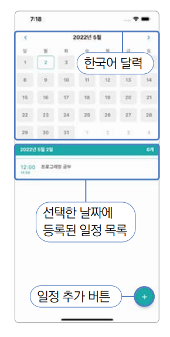
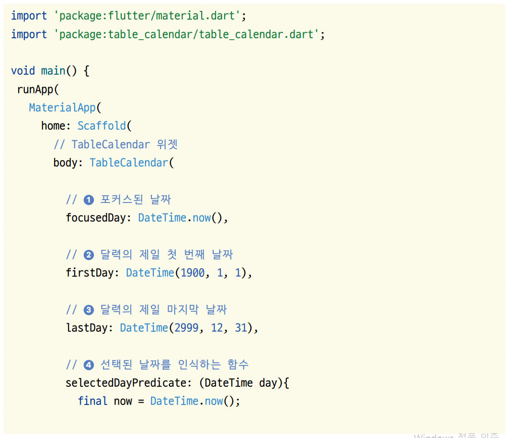
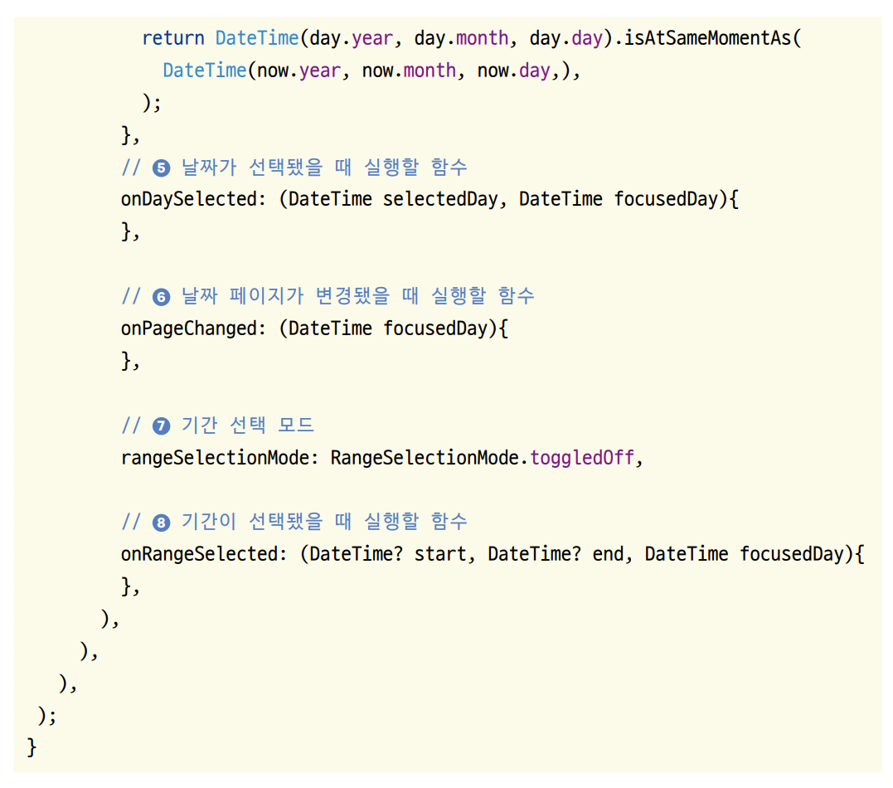
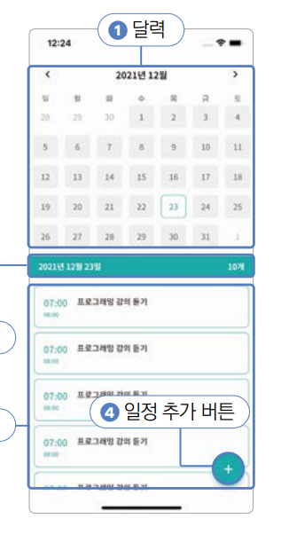
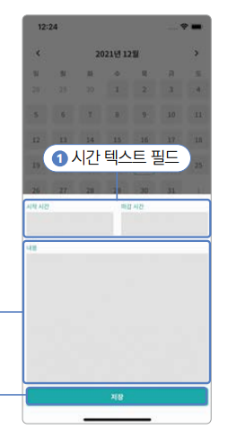
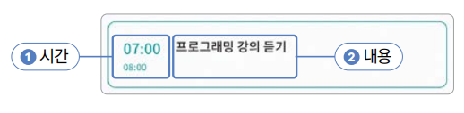
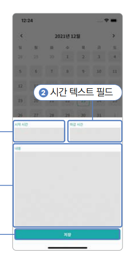

# **일정 관리 앱 만들기(table_calendar)**  
# **프로젝트 구상하기**  
이 프로젝트는 크게 위젯 두 개로 구분할 수 있다. 일정 데이터를 조회하고 조회할 날짜를 선택하는 홈 스크린과 일정을 추가하는 
일정 추가 화면이다. 먼저 홈 스크린에서 달력 형태의 위젯을 구현하고 바로 아래에 일정을 리스트로 보여준다. 다음으로 
일정 추가 버튼을 플로팅 액션 버튼으로 구현한 다음 눌렀을 때 일정 추가 화면이 보이게 한다. 마지막으로 일정 정보를 입력하는 
텍스트 필드와 저장 버튼을 구현한다.  
  
  
  
# **사전 지식**  
# **table_calendar 플러그인**  
이번에 사용해볼 table_calendar는 달력을 쉽게 구현할 수 있도록 해주는 플러그인이다. 직접 달력을 구현할 수도 있겠지만 
그럴 경우 상당한 시간이 소요될 가능성이 매우 높다. 그렇기 떄문에 잘 개발되어 있는 오픈 소스를 이용해서 달력 기능을 구현한다.  
  
달력 플러그인은 특정 날짜 선택하기, 날짜 기간 선택하기, 현재 화면에 보여지는 날짜 지정하기, 일정 입력하기 등 기능을 
제공해준다. 그리고 매우 유연한 디자인 기능을 노출하고 있어서 달력 플러그인의 거의 모든 요소를 직접 최적화할 수 있다. 
간단한 샘플 코드를 이용해서 대표적으로 사용되는 달력 플러그인의 매개변수들을 알아보자.  
  
  
  
  
1번은 현재 포커스된 날짜를 지정할 수 있다. 포커스된 날짜는 현재 화면에 보이는 날짜를 의미한다. 예를 들어 11월 23일이 
지정되었다며 화면에 11월 달력이 보인다. 2번은 달력의 가장 첫 번째 날짜이다. 지정된 날짜보다 이전 날짜는 조회할 수 없다. 
3번은 달력의 가장 마지막 날짜이다. 지정된 날짜의 이후 날짜는 조회할 수 없다. 4번은 달력에 표시되는 '선택된 날짜'를 
어떤 날짜로 지정할지 로직을 작성할 수 있다. DateTime day 매개변수는 현재 화면에 보이는 날짜들을 하나씩 입력받고, 
true가 반환되면 해당 날짜가 선택된 날짜로 지정되고 false가 반환되면 선택되지 않은 날짜로 지정된다. 현재 날짜와 day 
매개변수가 같은 날짜인지 비교한 값을 반환하면 현재 날짜가 선택된 날짜로 지정된다.  
  
5번은 날짜가 선택됐을 때 실행되는 함수이다. seletedDay 매개변수는 선택된 날짜이고 focusedDay는 날짜가 선택된 순간에 
포커스돼 있는 날짜이다. 6번은 달력의 페이지가 변경될 때 마다 실행되는 함수이다. focusedDay 매개변수는 달력의 페이지가 
변경되며 새로 포커스된 날짜를 의미한다. 7번은 기간 선택 모드를 지정할 수 있으며 RangeSelectionMode.toggleOn과 
RangeSelectionModel.toggleOff가 존재한다. RangeSelectionModel.toggleOn을 입력해주면 단일 날짜 대신 날짜 기간을 
선택할 수 있다. 8번은 rangeSelectionMode 매개변수에 RangeSelectionModel.toggleOn이 설정됐을 때 실행되는 함수이다. 
start 매개변수는 선택한 기간의 시작 날짜를 의미하고 end 매개변수는 선택한 기간의 마지막 날짜를 의미한다. focusedDay는 
선택이 실행된 순가에 포커스된 날짜이다.  
  
# **사전 준비**  
1. 실습에 사용할 프로젝트를 생성한다.  
- 프로젝트 이름: calendar_scheduler  
- 네이티브 언어: 코틀린  
  
# **pubspec.yaml 설정하기**  
지금까지 플러그인을 추가할 때 pubspec.yaml 파일의 dependencies에 추가했다. 하지만 pubspec.yaml 파일에는 플러그인을 
추가할 수 있는 키값이 하나 더 있다. dev_dependencies이다. 여기에는 dependencies에 플러그인을 추가할 때처럼 똑같이 
플러그인을 추가할 수 있지만 근본적인 차이점이 있다. dependencies 키에 작성된 플러그인들은 앱에 함께 패키징되지만 
dev_dependdencies에 입력된 플러그인들은 개발할 때만 사용되고 앱과 함께 패키징되지는 않는다. 결론적으로 개발할 때만 
필요하고 앱을 실행할 때 필요 없는 플러그인을 dev_dependencies에 입력하면 된다.  
  
드리프트(Drift)는 클래스를 이용해서 SQLite 데이터베이스를 구현할 수 있는 플러그인이다. 직접 SQL 쿼리를 작성하지 않아도 
다트 언어로 데이터베이스 테이블과 쿼리를 구현하면 드리프트가 자동으로 쿼리를 생성해준다. 이렇게 자동으로 코드를 작성하는 
기능을 플러터에서는 코드 생성이라고 부른다. 코드 생성은 데이터베이스 관련 코드가 변경될 때마다 한 번씩만 실행해주면 되기 
때문에 앱과 함께 패키징될 필요가 없다. 개발할 때 코드 생성 기능을 사용해서 코드를 미리 생성한 후 배포하면 된다. 그렇기 
떄문에 실제 앱이 빌드될 때 함께 포함되지 않는 dev_dependencies에 드리프트 코드 생성 관련 플러그인들을 추가해야 한다.  
  
1. 코드 생성 기능을 제공하는 drift_dev와 build_runner를 dev_dependencies에 추가한다.  
  
pubspec.yaml 참고  
  
drift_dev는 Drift와 관련된 코드를 생성하는 로직이 작성되어 있는 플러그인이고 build_runner는 Code Generation을 
실행하는 명령어를 지원하는 플러그인이다.  
  
# **프로젝트 초기화하기**  
1. lib 폴더에 screen 폴더를 생성하고 앱의 기본 홈 화면으로 사용할 HomeScreen 위젯을 만들 home_screen.dart를 생성한다.  
  
lib -> screen -> home_screen.dart  
  
2. lib/main.dart 파일에서도 마찬가지로 HomeScreen을 홈 위젯으로 등록한다.  
  
lib -> main.dart  
  
# **레이아웃 구상하기**  
프로젝트를 본격적으로 시작하기에 앞서 프로젝트에서 사용할 색상들을 한 파일에 정리한다. 그다음 HomeScreen 그리고 
CreateScheduleBottomSheet 순서로 구상한다.  
  
# **홈 스크린**  
홈 스크린은 달력과 리스트로 2등분된 형태이다. 달력에서 특정 날짜를 선택하면 날짜에 해당되는 달력 아래에 일정 리스트가 
나타난다. 일정은 시작 시간 기준으로 오름차순 정렬된다. 달력과 리스트 사이에는 선택된 날짜와 날짜에 해당되는 일정이 몇 
개 있는지 보여주는 배너가 있다. 마지막으로 플로팅 액션 버튼으로 구현한 일정 추가 버튼이 있다. 이 버튼을 누르면 새로운 
일정을 생성하는 화면을 띄울 수 있다.  
  
  
  
# **ScheduleBottomSheet**  
ScheduleBottomSheet는 일정을 추가하거나 수정할 때 사용하는 위젯이다. BottomSheet는 아직 배우지 않았지만 U&I 앱에서 
작업했던 다이얼로그와 매우 비슷하다. CreateScheduleBottomSheet는 텍스트 필드와 저장 버튼으르 이루어져 있다. 일정 시작 
시간과 종료 시간을 지정할 수 있는 시간 텍스트 필드와 일정 내용을 작성할 수 있는 내용 텍스트 필드를 사용해서 일정 정보를 
입력하고 저장 버튼을 눌러서 일정을 저장한다.  
  
  
  
# **구현하기**  
일정 조회를 담당할 HomeScreen은 3등분으로 나눠져 있다. 화면의 중앙에 날짜 정보와 일정 개수가 위치하고 위에 달력, 아래에 
리스트가 똑같은 크기로 위치한다. 달력은 TableCalendar 플러그인을 이용해서 구현하고 리스트는 ListView 위젯을 이용해서 
구현한다. 다음으로 ScheduleBottomSheet는 세 개의 텍스트 필드와 하나의 저장 버튼으로 이루어져 있다. ScheduleBottomSheet
가 화면의 반을 차지하도록 구현하고 저장 버튼이 가장 아래에 위치하게 한 다음 텍스트 필드들이 나머지 공간을 차지하게 한다.  
  
# **주색상 설정하기**  
1. 이번 프로젝트에서 사용할 색상은 세 가지로 요약할 수 있다. 주색상인 초록색, 옅은 회색, 어두운 회색 그리고 텍스트 필드 
배경색이다. 이 값들을 lib/const/colors.dart 파일에 지정한다.  
  
lib -> const -> colors.dart  
  
# **달력 구현하기**  
1. HomeScreen 화면 윗부분의 달력을 MainCalendar 클래스로 만든다. 달력 기능은 pubspec.yaml에 이미 추가한 table_calendar 
플러그인을 사용한다.  
  
lib -> component -> main_calendar.dart  
  
table_calendar 플러그인을 불러오면 TableCalendar라는 위젯을 사용할 수 있는데 이 위젯은 firstDay, lastDay, 그리고 
focusedDay 매개변수를 필수로 입력해줘야 한다. firstDay 매개변수는 달력에서 선택할 수 있는 제일 오래된 날짜를 의미한다. 
1800년 1월 1일로 설정했다. lastDay 매개변수는 달력에서 선택할 수 있는 제일 미래의 날짜를 의미한다. 이 값은 3000년 
1월 1일로 여유롭게 설정한다. 마지막으로 focusedDay는 현재 달력이 화면에 보여줄 날짜를 의미한다. 이 날짜를 현재 날짜 
즉, DateTime.now()로 설정해서 앱이 실행되고 있는 날짜가 보이도록 한다.  
  
2. home_screen.dart에 MainCalendar를 적용한다. 위쪽에는 달력이, 아래쪽에는 일정 리스트가 보여야 하는 구조이니 Column 
위젯을 사용해서 배치한다.  
  
lib -> screen -> home_screen.dart  
  
3. 코드를 실행하면 화면에 달력이 보인다.  
  
4. 달력을 띄우는 걸 성공했으니 달력을 스타일링한다. TableCalendar 위젯의 스타일은 크게 두 가지로 나눌 수 있다. 화살표와 
년도 및 월이 보이는 최상단은 headerStyle 매개변수를 통해서 지정할 수 있고 날짜들이 배열돼 있는 아랫부분은 calendarStyle 
매개변수를 사용해 지정할 수 있다. 그리고 이 스타일들을 이미 많이 사용해본 BoxDecoration과 TextStyle을 사용해서 정의한다.  
  
lib -> component -> main_calendar.dart  
  
titleCentered 매개변수에 true를 입력하면 연, 월을 보여주는 글자가 가운데 정렬된다. formatButtonVisible 매개변수는 
날짜들을 매월 1주일씩 보여줄지 2주일씩 보여줄지 전체를 다 보여줄지 선택할 수 있는 버튼의 존재 여부를 지정할 수 있다. 필요 
없는 기능이니 false를 입력한다. titleStyle 매개변수는 연, 월을 보여주는 글자의 스타일을 변경한다.  
  
TableCalendar는 날짜 칸을 하나하나 스타일링하도록 구현되어있다. defaultDecoration은 날짜 칸의 기본 BoxDecoration을 
설정할 수 있는 매개변수이다. weekendDecoration은 주말 날짜 칸의 BoxDecoration을, selectedDecoration은 탭해서 선택된 
날짜의 BoxDecoration을 설정하는 매개변수이다.  
  
defaultTextStyle은 날짜 칸의 기본 TextStyle을 weekendTextStyle은 주말 날짜 칸의 TextStyle을 selectedTextStyle은 
선택된 날짜의 TextStyle을 설정하는 매개변수다.  
  
5. 코딩을 완료한 후 핫 리로드를 해서 목표한 UI에 근접한 달력을 확인하자.  
  
6. 달력에 기능을부여할 차례다. TableCalendar 위젯은 날짜가 선택될 떄마다 실행되는 콜백 함수를 등록하고 추가적으로 어떤 
날짜가 현재 선택된 상태인지 달력에 표시해주어야 한다. HomeScreen에서 모든 상태를 관리할 계획이기 때문에 MainCalendar에 
관련 코드를 채운다.  
  
lib -> component -> main_calendar.dart  
  
OnDaySelected 타입은 table_calendar 플러그인에서 기본 제공하는 typedef 이다. onDaySelected는 달력의 날짜가 탭될 
때마다 실행된다. 첫 번재 매개변수에 선택된 날짜(selectedDate)를 입력받고 두 번째 매개변수에 현재 화면에 보이는 날짜를 
입력받는다(focusedDay). selectedDayPredicate는 어떤 날짜를 선택된 날짜로 지정할지 결정하는 함수다. 현재 달력에 보이는 
모든 날짜를 순회하며 실행하는 함수로 true가 반환되면 선택된 날짜로 표시되고 false가 반환되면 선택되지 않은 날짜로 지정된다. 
HomeScreen에서 입력해줄 selectedDate와 연, 월, 일 값이 같으면 선택된 날짜로 지정한다.  
  
7. MainCalendar 위젯에 생성한 매개변수들을 HomeScreen에서 입력한다.  
  
lib -> screen -> home_screen.dart  
  
상태 관리가 필요하니 우선 HomeScreen 위젯을 StatefulWidget으로 전환한다. 선택된 날짜를 관리할 selectedDate 변수를 
선언한다. onDaySelected() 함수를 선언해서 날짜가 탭될 때마다 selectedDate 변수를 변경한다.  
  
8. 이제 앱을 재시작하고 나서 아무 날짜를 탭하면 해당 날짜가 선택된다.(그에 따라 스타일도 바뀐다)  
  
# **선택된 날의 일정을 보여주기: ScheduleCard 위젯**  
선택된 날짜에 해당되는 일정을 보여줄 ScheduleCard를 작업한다. 각 일정은 시간(시작 시간부터 종료 시간) 영역과 내용 
영역으로 구성된다. ScheduleCard 위젯을 구현할 때 시간과 내용으로 자식 위젯을 추가로 분리해서 작업한다.  
  
  
  
1. lib/component/schedule_card.dart 파일을 생성한다. 먼저 시간을 표현할 _Time 위젯부터 작업한다.  
  
lib -> component -> schedule_card.dart  
  
시작 시간과 종료 시간은 외부에서 입력해줄 수 있도록 매개변수로 정의한다. 현재 시간 정보는 시작 시간이 위에, 종료 시간이 
아래에 배치되어 있다. 세로로 배치할 때는 Column 위젯을 사용해야 하기 때문에 Column 위젯으로 시작 시간과 종료 시간을 배치한다.  
  
2. 내용을 렌더링할 _Content 위젯을 작업한다.  
  
lib -> component -> schedule_card.dart  
  
부모 위젯에서 내용을 String 값으로 입력해주고 Expanded 위젯에 감싸서 좌우로 최대한 크기를 차지하게 하는 게 중요하다.  
  
3. ScheduleCard를 완성시킬 자식 위젯들이 모두 정리되었다. 이제 ScheduleCard 위젯을 작성한다. _Time 위젯과 _Content 위젯에 
입력할 시작 시간, 종료 시간 그리고 내용을 모두 변수로 부모 위젯으로부터 받는다.  
  
lib -> component -> schedule_card.dart  
  
IntrinsicHeight 위젯은 내부 위젯들의 높이를 최대 높이로 맞춰준다. 예를 들어 _Time 위젯은 Column 위젯을 사용 중이기 
떄문에 ScheduleCard 위젯의 최대 크기만큼 높이를 차지한다. 하지만 _Content 위젯은 Column 위젯을 사용하지 않기 떄문에 
최소 크기만 차지하며 세로로 가운데 정렬이 된다. 이럴 때 _Time 위젯과 _Content 위젯의 높이를 똑같이 맞춰주려면 IntrinsicHeight 
위젯을 사용해서 최대 크기를 차지하는 위젯만큼 다른 위젯들 크기를 동일하게 맞춰주어야 한다.  
  
4. ScheduleCard를 완성했으니 HomeScreen에 적용한다. MainCalendar 위젯 아래에 샘플로 ScheduleCard 위젯을 위치하고 
12시부터 14시까지 진행되는 프로그래밍 공부 일정을 샘플로 추가한다.  
  
lib -> screen -> home_screen.dart  
  
5. 코드를 저장한 후 핫 리로드를 실행하면 일정 카드가 보인다.  
  
# **오늘 날짜를 보여주기: TodayBanner 위젯**  
TodayBanner 위젯은 MainCalendar 위젯과 ScheduleCard 위젯 사이에 오늘 날짜를 보여준다. 선택된 날짜와 날짜에 해당하는 
일정 개수로 구성되어 있으니 간단하게 구현한다.  
  
1. 우선 lib/component/today_banner.dart 파일을 생성해서 TodayBanner StatelessWidget을 구현한다.  
  
lib -> component -> today_banner.dart  
  
TodayBanner 위젯은 선택된 날짜와 해당하는 일정 개수를 부모 위젯에서 입력받을 수 있도록 변수를 선언한다.  
  
2. TodayBanner 위젯을 HomeScreen에 사용한다.  
  
lib -> screen -> home_screen.dart  
  
selectedDate 매개변수에는 selectedDate 변수를 입력해주면 되고 count 변수에는 임시로 0을 입력한다.  
  
3. 코드를 저장해 핫 리로드를 진행하면 목표하는 디자인과 유사한 화면을 볼 수 있다.  
  
# **일정 입력하기**  
ScheduleBottomSheet는 사용자가 새로 추가할 일정을 입력할 수 있는 위젯이다. 텍스트 필드 3개와 버튼 하나로 이루어져 
있다. 시작 시간, 종료 시간, 일정 내용을 입력한 후 저장 버튼을 누르면 선택된 날짜를 기준으로 일정을 생성한다.  
  
  
  
1. lib/component/schedule_bottom_sheet.dart 파일을 생성하고 일정 정보를 입력할 수 있는 위젯인 ScheduleBottomSheet를 
구현한다. 이 위젯에는 요소가 많이 들어가므로 큰 들만 잡아준다.  
  
lib -> component -> schedule_bottom_sheet.dart  
  
ScheduleBottomSheet StatefulWidget을 생성하고 SafeArea 위젯에 화변의 반을 차지하는 흰색 Container 위젯을 하나 배치한다.  
  
2. HomeScreen에서 FloatingActionButton을 누르면 ScheduleBottomSheet가 화면에 나오도록 코드를 변경한다.  
  
lib -> screen -> home_screen.dart  
  
floatingActionButton 매개변수에 FloatingActionButton 위젯을 입력해 준 후 bottom sheet를 실행하는 showModalBottomSheet() 
함수를 이용해서 ScheduleBottomSheet 위젯을 bottom sheet로 실행한다.  
  
3. 코드를 다시 실행하면 HomeScreen 위젯의 오른쪽 아래에 FloatingActionButton이 구현된다. 이 버튼을 탭하면 ScheduleBottomSheet가 
실행된다.  
  
# **일정 내용 필드 구현하기**  
1. lib/component/custom_text_field.dart 파일을 생성하고 SchedulBottomSheet에 들어갈 텍스트 필드를 먼저 구현한다.  
  
lib -> component -> custom_text_field.dart  
  
플러터에서 텍스트 필드는 TextField 위젯과 TextFormField로 나눌 수 있다. TextField 위젯은 각 텍스트 필드가 독립된 
형태일 때 많이 사용되고 TextFormField는 여러 개의 텍스트 필드를 하나의 폼으로 제어할 때 사용된다. 저장 버튼을 눌렀을 때 
시간 텍스트 필드 2개와 텍스트 필드 하나를 제어할 계획이니 TextFormField를 사용한다.  
  
텍스트 필드와 제목의 텍스트 필드가 위아래로 위치해야 하므로 Column 위젯을 사용해서 Text 위젯과 TextFormField 위젯을 
세로로 배치한다.  
  
2. 기본 TextFormField 위젯이 어떻게 생겼는지 확인하기 위해 ScheduleBottomSheet 위젯에 CustomTextField 위젯을 하나만 
렌더링한다.  
  
lib -> component -> schedule_bottom_sheet.dart  
  
3. 저장 후 핫 리로드를 실행하면 FloatingActionButton을 눌렀을 때 ScheduleBottomSheet 위젯이 올라오고 텍스트 필드를 
볼 수 있다.  
  
4. 텍스트 필드의 배경색과 테두리를 꾸민다.  
  
lib -> screen -> custom_text_field.dart  
  
maxLines 매개변수는 텍스트 필드에 값을 입력할 때 허락되는 최대 줄 개수이다. int 값을 입력할 수 있으며 null을 넣으면 
개수를 제한하지 않는다. 시간을 입력할 때는 한 줄만 입력하도록 하고 아니면 제한을 두지 않는다. expands 매개변수는 텍스트 
필드를 부모 위젯 크기만큼 세로로 늘릴지 결정한다. 기본값은 false이며 true로 입력하면 부모의 위젯 크기만큼 텍스트 필드를 
늘릴 수 있다. false의 경우 텍스트 필드는 최소 크기만 차지한다.  
  
keyboardType 매개변수는 텍스트 필드를 선택했을 때 화면에 어떤 키보드가 보여질지 선택할 수 있다. TextInputType.number는 
숫자만 입력하는 키보드를 보여줄 수 있고 TextInputType.multiline은 줄바꿈 키가 존재하는 일반 키보드를 보여줄 수 있다.  
  
inputFormatters 매개변수는 텍스트 필드에 입력되는 값들을 제한할 수 있다. 언뜻 보면 키보드의 종류를 정의하는 keyboardType 
매개변수와 비슷해보이지만 큰 차이가 있다. keyboardType 매개변수는 핸드폰에서 보여주는 키보드만 제한할 수 있고 블루투스 
키보드나 보안 키보드처럼 커스텀 구현된 키보드를 사용할 때는 입력되는 값들을 제한할 수 없다. inputFormatters 매개변수의 
경우 특정 입력 자체를 제한할 수 있다. 리스트로 원하는 만큼 제한을 넣어줄 수 있으며 filteringTextInputFormatter.digitsOnly는 
숫자만 입력되도록 제한할 수 있다. suffix 매개변수는 접미사를 지정할 수 있다. 특정 값이 입력됐을 때 텍스트 필드의 오른쪽 
끝에 원하는 글자가 상시 표시되도록 지정할 수 있다.  
  
목표 UI에서 시간과 관련된 텍스트 필드는 최소한의 높이를, 내용 텍스트 필드는 최대한의 높이를 차지한다. 추가적으로 isTime을 
false로 지정할 경우 expands 매개변수가 true로 지정되니 Column 위젯 안에서 최대한 크기를 차지하도록 Expanded 위젯을 
사용해줘야 한다.  
  
5. CustomTextField가 완성됐으니 목표 UI대로 텍스트 필드를 구현한다.  
  
lib -> component -> schedule_bottom_sheet.dart  
  
시작 시간과 종료 시간을 표현할 텍스트 필드는 하나의 Row 위젯에 감싸서 좌우로 펼쳐지게 한다. 그리고 해당 Row 위젯을 
Column 위젯에 한 번 더 감싸서 내용을 담는 텍스트 필드가 남는 공간을 모두 차지하게 한다. 마지막으로 ElevatedButton을 
하단에 추가해줘서 UI를 완성한다.  
  
6. 저장 후 ScheduleBottomSheet를 실행하면 목표한 UI를 확인할 수 있다.  
  
7. 구현 완성도가 매우 높아졌지만 아직 한 가지 아쉬운 점이 있다. 에뮬레이터나 시뮬레이터를 사용해서 개발하다 보면 가상 
키보드의 존재를 잠시 잊게 된다. 실제 기기에서는 텍스트 필드를 누르면 키보드가 화면에 올라오는 만큼 텍스트 필드들이 가려진다. 
잘 구현된 화면에서는 텍스트 필드가 아래에서 위로 올라온만큼 BottomSheet 위젯의 아래에 패딩을 추가해서 텍스트 필드 및 버튼이 
가리지 않고 보여야 한다. MediaQuery 클래스를 사용해서 키보드가 아래에 차지하는 크기를 가져온 다음 해당되는 크기만큼 
패딩을 추가해서 키보드가 올라와도 모든 위젯들이 잘 보이도록 코드를 변경한다.  
  
iOS 시뮬레이터에서 텍스트 필드를 늘려도 키보드가 올라오지 않는다면 시뮬레이터를 선택하고 Command + Shift + K를 입력한다.  
  
lib -> component -> schedule_bottom_sheet.dart  
  
MediaQuery의 viewInsets을 가져오면 시스템이 차지하는 화면 아랫부분 크기를 알 수 있다. 일반적으로 이 값은 키보드가 보일 
때 차지하는 크기가 된다. 최대 높이에 키보드 크기만큼 높이를 더해줘서 키보드가 화면에 보일 때 컨테이너 크기를 늘려준다. 
Container의 높이가 늘어난 만큼 아래에 패딩을 추가해줘서 위젯들이 잘 보이는 위치로 끌어올린다.  
  
8. 마지막으로 HomeScreen 위젯에서 showModalBottomSheet() 함수를 약간 변경해줘야 한다. showModalBottomSheet() 
함수는 기본적으로 최대 높이를 화면의 반으로 규정한다. 하지만 isScrollControlled 매개변수에 true를 넣어주면서 간단하게 
최대 높이를 화면 전체로 변경할 수 있다. 코드를 변경한 후 ScheduleBottomSheet에서 텍스트 필드를 선택할 경우 키보드가 
보이는 만큼 ScheduleBottomSheet 위젯이 위로 이동되는 걸 볼 수 있다.  
  
lib -> screen -> home_screen.dart  
  
# **달력 언어 설정하기**  
1. 현재 달력이 사용하는 언어는 영어로 설정되어 있다. intl 패키지와 TableCalendar의 언어를 변경한다. 우선 main.dart 
파일에서 intl 패키지를 초기화한다. main() 함수를 비동기로 변경하고 코드 두 줄을 추가해서 간단하게 intl 패키지를 프로젝트에서 
사용할 수 있다.  
  
lib -> main.dart  
  
2. intl 패키지를 초기화했으니 TableCalendar에 한국어를 적용한다. TableCalendar 위젯의 locale 매개변수에 한국어를 
의미하는 ko_kr을 입력한다.  
  
lib -> component -> main_calendar.dart  
  
3. main.dart 파일을 변경했으니 앱을 재시작해주면 영어로 설정되었던 TableCalendar 위젯이 한국어로 변경된 것을 볼 수 있다.  
  
# **핵심 요약**  
1. TableCalendar 플러그인은 가장 대중적으로 사용되는 플러터 달력 플러그인이다. 여러 스타일 매개변수를 이용해서 자유롭게 
달력을 디자인할 수 있다.  
2. ListView는 다수의 위젯을 리스트 형태로 보여줄 수 있는 위젯이다. ListView를 Expanded로 감싸면 남는 공간만큼 차지하도록 
할 수 있다.  
3. FloatingActionButton은 화면의 오른쪽 아래에 위치해 오른손잡이가 접근하기 쉽다.  
4. BottomSheet는 아래에서 위로 화면을 덮는 위젯이다. showBottomSheet() 함수를 이용해서 실행할 수 있다.  
5. TextField와 TextFormField는 사용자에게 글자 입력을 받을 수 있는 위젯이다. 텍스트 필드를 각각 따로 관리할 때는 
TextField 위젯을, Form으로 통합해서 관리할 떄는 TextFormField 위젯을 사용한다. TextField나 TextFormField를 이용할 
때는 키보드가 올라왔을 때 화면을 가리지 않는지 꼭 확인해야 한다. 키보드의 높이만큼 위젯 아래에 패딩을 추가하면 키보드를 
피해서 위젯을 렌더링할 수 있다.  
  

