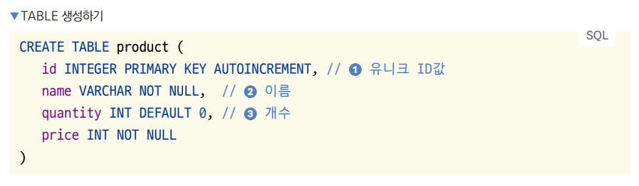
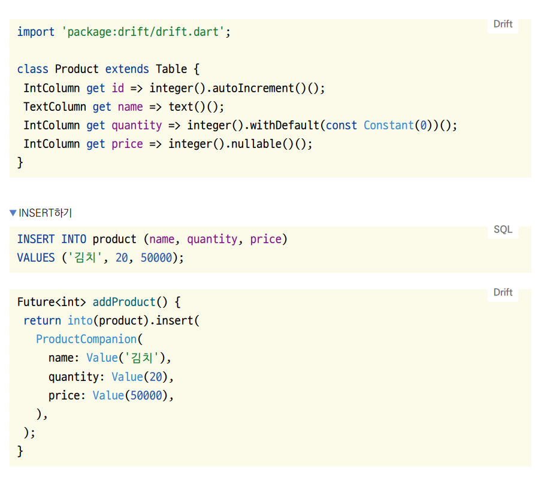
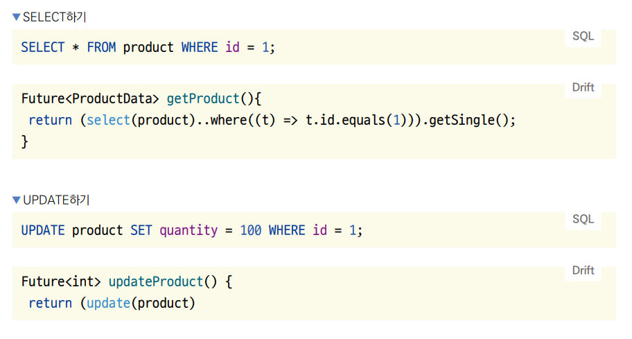
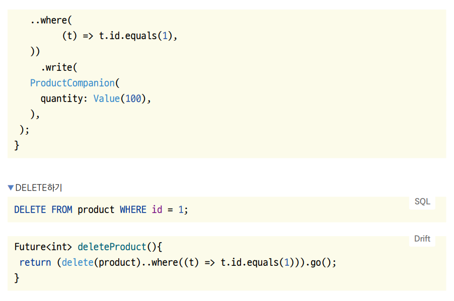
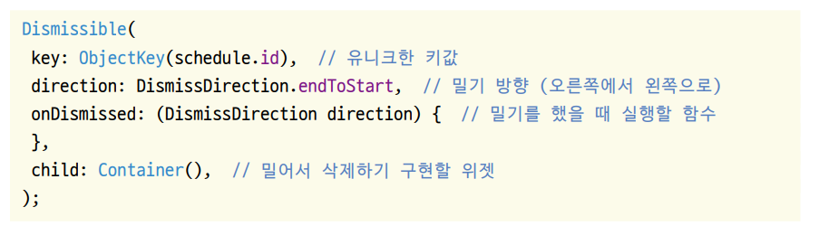
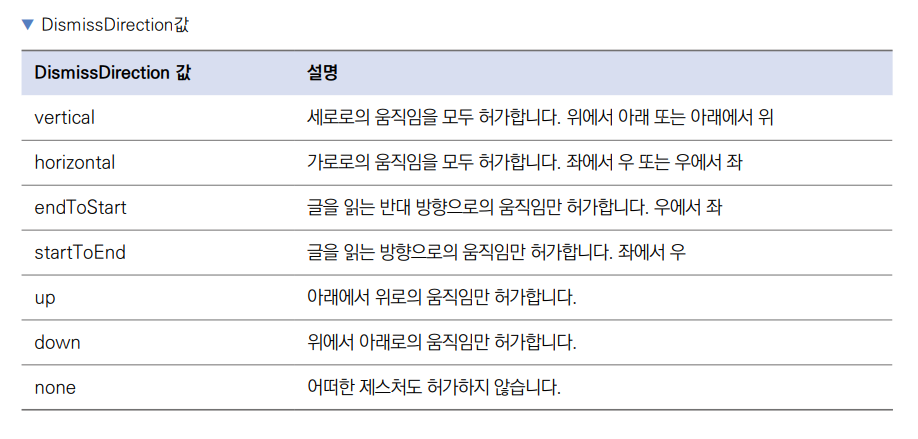
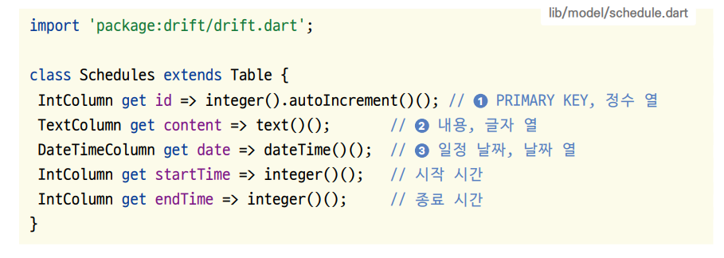

# **데이터베이스 연동하기(SQL, SQLite, Drift, Dismissible)**  
# **프로젝트 구상하기**  
18장에서는 로컬 데이터베이스로 SQLite를 사용한다. SQLite를 잘 사용하려면 SQL 문법을 알아야 한다. 드리프트를 이용해서 
SQLite 테이블 및 모델을 형성하고 데이터를 삽입, 업데이트, 조회하기 때문에 직접 SQL문을 작성할 일은 없지만 기초 SQL은 
알아두는 것이 좋다.  
  
# **사전 지식**  
# **SQL, SQLite**  
SQL은 Standard Query Language의 약자로 데이터베이스 언어이다. SQL은 데이터베이스별로 문법이 약간씩은 다르지만 큰 
틀은 공유한다. 서버에서 사용하는 데이터베이스로는 MySQL, 오라클, 포스트그레SQL, DB2, SQL 서버 등이 있다. 이번에 다룰 
SQLite는 프론트엔드에서 흔히 사용하는 데이터베이스이다. 이름에서도 볼 수 있듯이 SQL을 사용하는 비교적 가벼운 데이터베이스다.  
  
이번 프로젝트는 드리프트(Drift)라는 패키지를 사용한다. 그래서 SQL을 직접적으로 사용하진 않겠지만 SQL을 어느 정도 알고 
있어야 드리프트 패키지를 이해하기 쉽다.  
  
# **드리프트 플러그인**  
드리프트 플러그인을 사용하면 직접 SQL을 작성하지 않고도 SQLite를 사용할 수 있다. SQLite 쿼리를 직접 작성할 수도 있지만 
그럴 경우 모든 쿼리를 String으로 작업해야 해서 유지보수가 힘들다. 그래서 드리프트와 같은 객체-관계 모델을 사용한다. 
테이블을 클래스로 표현하고 쿼리를 다트 언어로 표현하면 드리프가 자동으로 해당되는 테이블과 쿼리를 생성한다.  
  
  
  
  
  
  
# **Dismissible 위젯**  
Dismissible 위젯은 위젯을 밀어서 삭제하는 기능을 제공한다. 밀어서 삭제하기를 구현하고 싶은 위젯을 Dismissible 위젯으로 
감싸고 onDismissed와 key 매개변수를 입력해주면 된다.  
  
  
  
아래 표는 삭제 방향을 표현하는 DismissDirection enum의 값들을 정리한 표다.  
  
  
  
# **구현하기**  
드리프트 설정부터 진행한다. SQLite 데이터베이스를 사용하려면 가장 먼저 테이블을 생성해야 한다. 드리프트로 테이블을 
생성하고 테이블에 데이터를 조회, 삽입, 업데이트, 삭제하는 기능을 만든다. 마지막으로 17장에서 구현한 UI와 18장에서 
구현한 기능을 연동해서 로컬데이터베이스를 사용하는 일정 앱을 완성한다.  
  
# **모델 구현하기**  
데이터베이스를 설계할 때 모델을 구현하는 일이 중요하다. 개별 테이블을 잘 만들고 잘 연동되도록 설계해야 손쉽게 SQLite를 
사용할 수 있다. 이 책에서는 직접 SQLite를 사용하지 않고 코드를 이용해 데이터베이스를 사용할 수 있는 드리프트를 사용해 
작업한다.  
  
1. lib/model/schedule.dart 파일을 생성해서 테이블을 생성한다. 드리프트를 사용하면 클래스를 선언해서 테이블을 생성할 
수 있다. 테이블은 드리프트 패키지의 Table 클래스를 상속하면 선언할 수 있다. 그다음 자식 클래스에 열로 정의하고 싶은 
값들을 게터로 선언해주면 된다. 열 선언은 세 가지 요소로 나뉘어진다. 열의 타입, 열의 이름, 열의 속성이다. 열의 타입으로는 
IntColumn, TextColumn, DateTimeColumn 등이 있다. 이름 그대로 어떤 타입의 열인지를 정의할 수 있으며 SQLite에 존재하는 
열 타입들을 모두 사용할 수 있다. 열 이름은 일반적으로 클래스에서 게터를 선언하듯이 작성하면 된다. 열 속성은 무조건 열의 
타입으로부터 시작된다. 그다음 추가하고 싶은 속성이 있다면 함수를 이어서 실행해주면 된다. 다음 코드의 1을 예로 들면 
Integer 타입의 id 열에 AUTOINCREMENT 속성을 추가한다. 모든 속성을 추가했으면 괄호를 여닫으며 함수를 한 번 더 실행해준다. 
그래야 선언한 모든 속성들이 SQL 문법으로 전환된다.  
  
  
  
lib -> model -> schedule.dart  
  
# **테이블 관련 코드 생성하기**  
드리프트에 생성한 Schedules 테이블을 등록해주면 드리프트가 자동으로 테이블과 관련된 기능을 코드로 생성한다. 이렇게 작성한 
코드를 기반으로 자동으로 코드가 생성되는 걸 코드 생성(code generation)이라고 한다.  
  
1. 어떤 플러터 패키지에서든 코드 생성을 사용하려면 part 파일을 지정해줘야 한다. part 파일은 part 키워드를 사용해서 
지정하면 된다. 코드 생성을 사용하는 각각 패키지별로 part 파일의 이름 패턴은 약간 다르지만 대부분은 현재 파일 이름에 
.g.dart를 추가하는 형식이다. 드리프트 또한 현재 파일명에 .g.dart를 추가하면 된다. 해당 파일이 아직 존재하지 않을 때 
코드 생성을 실행하면 자동으로 생성된다.  
  
lib -> database -> drift_database.dart  
  
드리프트 관련 쿼리를 작성할 클래스를 하나 작성하고 이 클래스의 이름 앞에 _$를 추가한 부모 클래스를 상속한다. 이 클래스는 
현재 존재하지 않지만 코드 생성을 실행하면 생성된다.  
  
part 파일은 import와 비슷한 기능을 갖고 있다. part 파일로 파일을 지정하면 해당 파일의 값들을 현재 파일에서 사용할 수 
있게 된다. 하지만 public 값들만 사용할 수 있는 import 기능과 달리 part 파일은 private값들도 사용할 수 있다.  
  
2. 이제 코드 생성을 통해 쿼리를 작성하는 데 필요한 기능을 생성해야 한다. 안드로이드 스튜디오 하단에서 terminal 탭을 
눌러서 현재 프로젝트 위치에서 terminal 또는 CMD를 실행 후 flutter pub run build_runner build 명령어를 실행해서 
코드 생성을 진행한다.  
  
명령어 실행 후 프로젝트를 보면 database 폴더에 생성하지 않은 파일이 새로 생긴 걸 볼 수 있다. drift_database.g.dart 
파일을 열어보면 굉장히 많은 코드가 자동으로 작성되어 있다. 이 파일 안에는 상속한 _$LocalDatabase 클래스도 있다.  
  
# **쿼리 구현하기**  
1. 코드 생성을 실행하면 테이블과 관련된 쿼리를 작성하는 데 필요한 기능이 모두 생성된다. 자동으로 생성된 코드를 사용해서 
일정들을 불러오는 SELECT 기능을 먼저 작업한다. 드리프트에서 SELECT 기능을 두 가지로 표현할 수 있다. 일회성으로 데이터를 
가져오는 get() 함수와 변화가 있을 때마다 자동으로 데이터를 불러오는 watch() 함수이다. 일반적으로 get() 함수는 버튼을 
눌렀을 때처럼 특정 상황의 데이터를 가져올 때 사용되고 watch() 함수는 위젯처럼 데이터가 업데이트될 때마다 새로운 값을 
반영해줘야 할 때 사용된다. 달력에서 특정 날짜를 선택했을 때 해당되는 일정을 불러오는 기능을 만들어야 하니 watch() 함수로 
SELECT 기능을 구현한다.  
  
lib -> database -> drift_database.dart  
  
괄호가 많아서 헷갈릴 수 있지만 하나씩 분리하면 크게 어려운 코드가 아니다. 코드 생성을 통해 생성된 클래스에는 SQL SELECT문에 
해당되는 select() 함수가 주어진다. 이 함수가 반환하는 값은 watch() 또는 get() 함수를 실행할 수 있다. 하지만 모든 일정을 
다 불러오는 게 아니고 특정 날짜에 해당되는 일정만 불러오기 떄문에 where 함수를 통해서 관련 일정을 먼저 필터링해야 한다. 
결론적으로 where() 함수가 아닌 select() 함수에 watch() 함수가 직접 실행되어야 하기 떄문에 괄호가 한 번 더 감싸진 
형태이다.  
  
추가적으로 where() 함수에 제공되는 첫 번쨰 매개변수에는 현재 선택한 테이블에 해당되는 값이 제공된다. 드리프트로 필터링을 
진행할 때는 다트 언어에서 일반적으로 사용하는 == 또는 < 같은 비교 기호를 사용하지 않고 테이블 객체에서 제공하는 함수로 
비교를 진행해야 한다. 테이블의 date 컬럼과 매개변수에 입력된 date 변수가 같은지 비교하기 위해 equals() 함수를 사용했다.  
  
2. 이번에는 INSERT에 해당하는 새로운 일정을 생성하는 기능을 구현한다. select() 함수가 코드 생성을 통해서 제공된 것처럼 
insert() 함수도 제공된다. 다만 select() 함수와 비교해서 특이한 점은 into() 함수를 먼저 사용해서 어떤 테이블에 데이터를 
넣을지 지정해준 다음 insert() 함수를 이어서 사용해야 한다는 점이다. 추가적으로 코드 생성을 실행하면 모든 테이블의 
Companion 클래스가 생성된다. 데이터를 생성할 때는 꼭 생성된 Companion 클래스를 통해서 값들을 넣어줘야 하기 때문에 
Schedules 테이블에 해당되는 SchedulesCompanion 클래스를 입력받아서 insert() 함수에 전달해준다.  
   
lib -> databaase -> drift_database.dart  
  
3. 마지막으로 일정을 삭제하는 기능을 구현한다. select(), insert() 함수와 마찬가지로 코드 생성에서 제공하는 delete() 
함수를 사용해서 구현한다. select() 함수에서 watch() 함수와 get() 함수를 실행하듯이 delete() 함수에는 go() 함수를 
실행해줘야 삭제가 완료됩니다. 추가적으로 유의할 점은 특정 ID에 해당되는 값만 삭제해야 하니 매개변수에 id값을 입력받고 해당 
id에 해당되는 일정만 삭제해야 한다.  
  
4. 드리프트 데이터베이스 클래스는 필수로 schemaVersion값을 지정해줘야 한다. 기본적으로 1부터 시작하고 테이블의 변화가 
있을 때마다 1씩 올려줘서 테이블 구조가 변경된다는 걸 드리프트에 인지시켜주는 기능이다.  
  
lib -> database -> drift_database.dart  
  
5. 마지막으로 데이터베이스 파일을 생성하고 연동한다. 드리프트 데이터베이스 객체는 부모 생성자에 LazyDatabase를 필수로 
넣어야 한다. LazyDatabase 객체에는 데이터베이스를 생성할 위치에 대한 정보를 입력해주면 된다.  
  
lib -> database -> drift_database.dart  
  
안드로이드와 iOS 플랫폼 모두 각 앱별로 사용할 수 있는 전용 폴더를 제공받는다. SQLite는 파일 기반으로 데이터를 저장하기 
때문에 필수적으로 데이터베이스의 파일 위치를 제공해줘야 한다. path_provider 패키지에서 제공하는 getApplicationDocumentsDirectory() 
함수를 사용하면 현재 앱이 배정된 폴더의 경로를 받을 수 있다. 해당 폴더에 db.sqlite라는 파일을 데이터베이스 파일로 
사용한다.  
  
# **드리프트 초기화하기**  
1. 드리프트 설정을 마쳤으니 구현한 기능들을 프로젝트에서 사용하도록 초기화한다.  
  
lib -> main.dart  
  
미리 정의해둔 LocalDatabase 클래스를 인스턴스화한다. get_it 패키지는 Dependency Injection, 즉 의존성 주입을 구현하는 
플러그인이다. 위에서 선언한 database 클래스를 프로젝트 전역에서 사용할 수 있어야 하는데 서브 위젯으로 값을 계속 넘겨주기에는 
반복적인 코드를 너무 많이 사용해야 한다. GetIt으로 값을 한 번 등록해두면 어디서든 처음에 주입한 값 즉 같은 database 변수를 
GetIt.I를 통해서 프로젝트 어디서든 사용할 수 있다.  
  
# **일정 데이터 생성하기**  
1. 일정을 데이터베이스에 생성할 차례다. 현재 ScheduleBottomSheet 위젯에 텍스트 필드를 생성만 해두고 입력된 값을 
가져오는 기능을 아직 만들지 않았다. 텍스트 필드를 TextFormField 위젯을 기반으로 구현했기 떄문에 상위에 Form 위젯을 
사용해주면 손쉽게 데이터를 가져올 수 있다.  
  
lib -> component -> custom_text_field.dart  
  
Form 위젯과의 호환을 위해서 CustomTextField 위젯에 onSaved와 validator 매개변수를 주입해준다. validator 매개변수는 
Form 위젯의 validate() 함수를 실행하면 실행되는 함수이고 onSaved 매개변수는 Form 위젯의 save() 함수를 실행하면 
실행되는 함수이다.  
  
2. 이제 ScheduleBottomSheet에서 Form 위젯을 사용한다.  
  
lib -> component -> schedule_bottom_sheet.dart  
  
Form 위젯은 key 매개변수에 GlobalKey 값을 넣어주면 된다. 그리고 Form을 조작할 때 같은 key를 사용해서 Form 내부의 
TextFormField를 일괄 조작한다. 그리고 모든 CustomTextField에 새로 추가한 onSaved와 validator 매개변수를 모두 입력한다.  
  
3. formKey는 save() 함수와 validate() 함수를 실행할 수 있다. validate() 함수를 실핼하면 Form 서브에 있는 모든 
TextFormField의 validator 매개변수에 제공된 함수가 실행된다. 이 함수의 첫 번쨰 매개변수에는 입력된 값이 제공되며 
에러가 있을 경우 해당 에러 메시지를 String 값으로 반환하고 에러가 없으면 null을 반환한다.  
  
lib -> component -> schedule_bottom_sheet.dart  
  
검증이 null을 반환하면 정상, 아니면 에러 메시지를 반환한다.  
  
4. 이제 Form의 validate() 함수와 save() 함수를 한 번 실행한다.  
  
lib -> component -> schedule_bottom_sheet.dart  
  
validate() 함수는 Form의 서브에 있는 모든 TextFormField의 validate 매개변수에 입력된 함수들을 실행한다. 모든 함수들이 
null을 반환하면 validate() 함수가 true를 반환하고 만약에 어느 한 함수라도 String 값을 반환해서 에러를 발생시키면 
validate() 함수는 false를 반환한다.  
  
save() 함수는 마찬가지로 모든 서브 TextFormField들에 onSaved 매개변수에 입력된 함수를 실행한다. 이 함수들은 작성한 
것처럼 텍스트 필드의 값을 변수에 저장하는 역할을 한다. 그러니 validate() 함수를 실행해서 true를 반환받으면 텍스트 필드 
검증에 문제가 없다는 뜻이니 save() 함수를 실행해서 텍스트 필드의 값들을 변수에 저장하면 된다.  
  
5. 위 코드를 추가한 후 빌드해 앱을 실행한다. 원하는 날짜를 하나 정하고 일정 추가 버튼을 누른다. 입력폼(ScheduleBottomSheet) 
에서 시작 시간에 12, 종료 시간에 14, 내용에 프로그래밍 공부하기를 입력한 후 저장 버튼을 누르면 12, 14, 프로그래밍 공부하기가 
순서대로 출력된다. 텍스트 필드에 입력된 값들이 변수에 잘 저장되고 있다는 의미다.  
  
6. LocalDatabase 클래스에 정의해놓은 createSchedule() 함수를 실행하려면 현재 선택된 날짜의 값을 ScheduleBottomSheet 
위젯에서 갖고 있어야 한다. ScheduleBottomSheet 위젯에 매개변수를 새로 생성해서 HomeScreen으로부터 seletedDate 변수를 
입력받는다.  
  
lib -> component -> schedule_bottom_sheet.dart  
lib -> screen -> home_screen.dart  
  
7. 저장 버튼을 눌렀을 때 SQLite 데이터베이스에 일정을 저장해야 한다. 이 기능은 미리 작성해놓은 LocalDatabase 클래스에서 
수행할 수 있으니 GetIt을 통해 미리 생성해둔 LocalDatabase 인스턴스를 가져온 후 createSchedule() 함수를 실행한다.  
  
lib -> component -> schedule_bottom_sheet.dart  
  
createSchedule() 함수를 실행하면 설계한 대로 일정 데이터를 SQLite 데이터베이스에 입력할 수 있다. 다만 매개변수에 꼭 
SchedulesCompoanion을 입력해줘야 하는데 SchedulesCompanion에는 실제 Schedules 테이블에 입력될 값들을드리프트 패키지에서 
제공하는 Value라는 클래스로 감싸서 입력해주면 된다.  
  
저장이 완료되면 뒤로 가기 기능을 실행해서 ScheduleBottomSheet를 닫는다.  
  
8. 코드를 저장한 후 다시 일정을 생성하면 저장 버튼 클릭 후 ScheduleBottomSheet 위젯이 닫힌다.  
  
# **일정 데이터 읽기**  
1. 일정을 저장하는 기능을 완성했지만 값이 제대로 저장되는지 아직 확인할 길이 없다. 미리 생성해둔 LocalDatabase 클래스의 
watchSchedules() 함수를 사용해서 달력에서 선택한 날짜에 해당되는 일정들을 불러와 화면에 반영한다.  
  
lib -> screen -> home_screen.dart  
  
달력과 현재 날짜 외의 모든 공간을 일정 리스트가 차지하도록 Expanded 위젯을 사용해준다. watchSchedules() 함수는 Stream을 
반환해준다. 그렇기 떄문에 StreamBuilder를 사용해서 일정 관련 데이터가 변경될 때마다 위젯들을 새로 렌더링해준다. 
watchSchedules() 함수에 매개변수로 selectedDate를 입력해서 선택한 나날짜의 일정만 따로 필터링해서 불러온다. 일정이 
존재하지 않으면 아무것도 들어 있지 않은 Container 위젯을 렌더링한다.  
  
ListView.builder를 사용하면 여러 개의 위젯을 스크롤 가능한 위젯에 구현할 수 있다. 주요 매개변수로는 구현할 리스트의 
객체 개수를 입력할 수 있는 itemCount와 각 객체를 구현할 수 있는 itemBuilder가 있다. itemBuilder 매개변수로 입력되는 
함수에는 context와 index 변수가 순서대로 제공되어 순서별로 원하는 위젯을 그려낼 수 있다. 함수에서 제공하는 index 값으로 
각 순서에 해당하는 위젯을 그려낼 수 있다.  
  
2. 코드를 저장한 후 일정을 생성했던 날짜를 선택하면 달력 아래에 일정이 리스트로 렌더링되는 걸 볼 수 있다. 다른 날짜를 
선택하면 아무런 일정도 보여지지 않는다. 이처럼 Stream을 사용하면 데이터를 일회성으로 조회하는 게 아니라 지속적으로 변화가 
있을 때 새로운 값들을 받아올 수 있다.  
  
# **일정 데이터 삭제하기**  
1. 핸드폰 앱은 다양한 제스처를 지원한다. 삭제는 보통 왼쪽으로 미는 제스처를 사용하므로 우리도 각 일정을 왼쪽으로 밀어서 
삭제하도록 코드를 개선한다. 왼쪽으로 미는 제스처를 따로 구현할 필요는 없다. Dismissible 위젯을 사용하면 해당 기능이 
자동으로 지원된다.  
  
lib -> screen -> home_screen.dart  
  
key 매개변수에는 각 일정별로 절대 겹치지 않는 값을 ObjectKey에 감싸서 입력해줘야 한다. 이 값은 삭제 제스처가 어디에 적용됐는지 
구분할 수 있는 요소로 사용된다. direction 매개변수는 밀기 제스처를 어떻게 제한할지 지정할 수 있다. DismissDirection.endToStart를 
적용해주면 끝부터 시작, 즉 글을 읽는 방향의 반대인 왼쪽부터 오른쪽으로 미는 제스처만 인식한다. onDismissed 매개변수에 입력되는 
함수는 제스처가 인식됐을 때 실행할 함수를 입력할 수 있다. 첫 번째 매개변수로 어떤 방향으로 제스처가 입력됐는지 알 수 있다.  
  
2. 코드를 저장한 후 "프로그래밍 공부하기" 일정을 좌에서 우로 밀어보자. 일정이 삭제되면 성공이다.  
  

