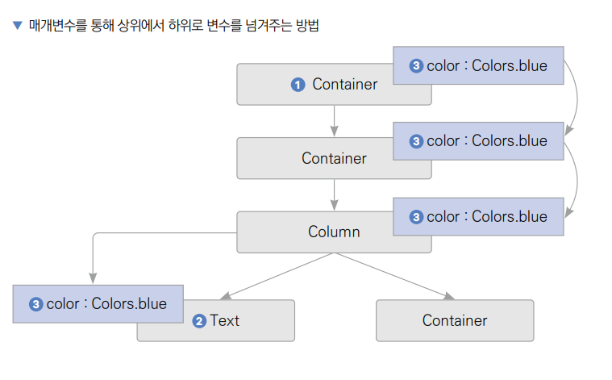
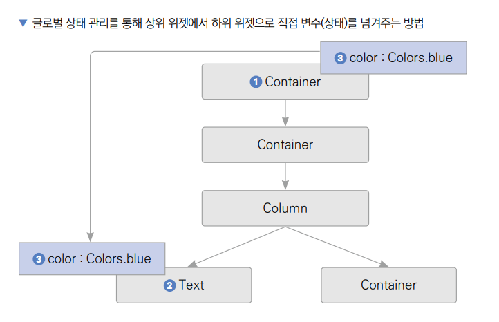
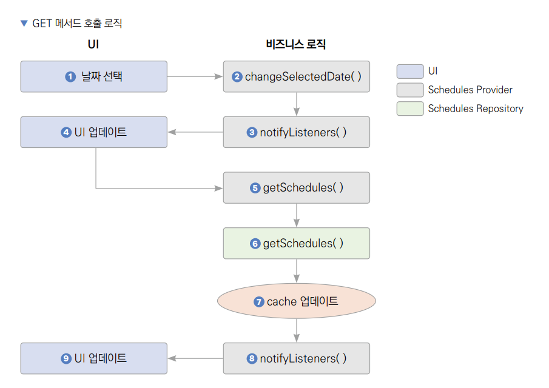
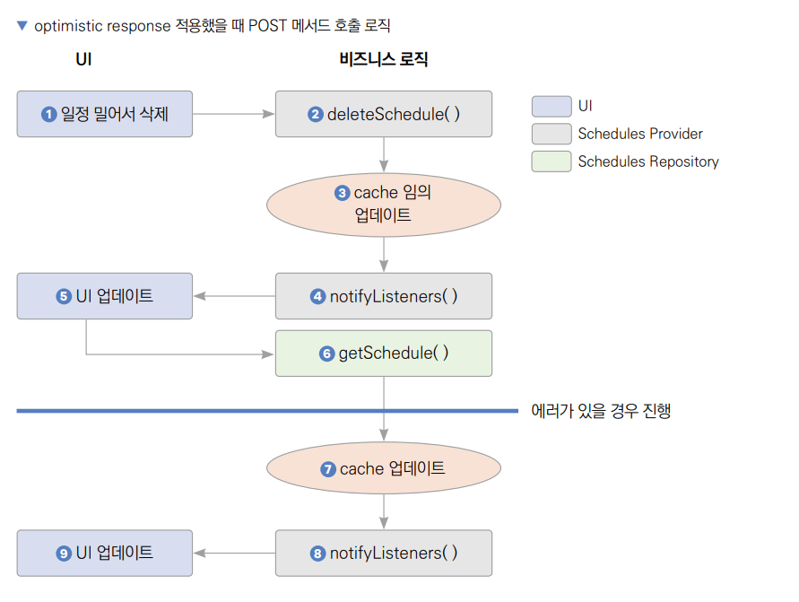
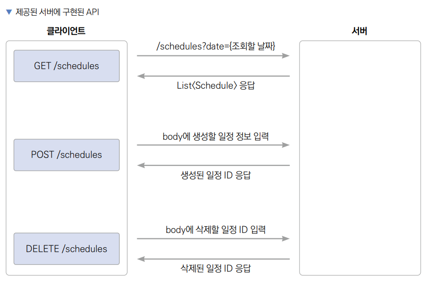
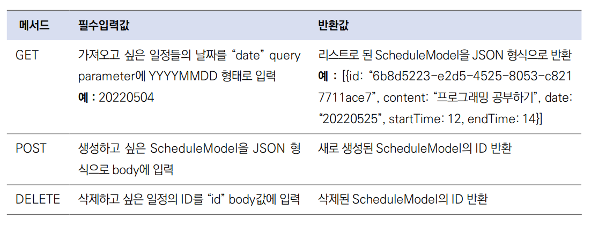

# **서버와 연동하기(상태 관리, 캐시와 긍정적 응답)**  
# **프로젝트 구상하기**  
현재는 데이터가 모두 드리프트와 연동되어 있다. 앱의 데이터 흐름과 UI는 모두 작성되어 있으니 18장에서 구현한 앱에서 드리프트 
관련 코드를 하나씩 서버와 연동하는 코드로 변경해나가는 방식으로 앱 기능을 그대로 유지하면서 REST API와 연동한다.  
  
서비스에서 유저의 이탈을 막으려면 앱의 작동이 빨라야 한다. 상태 관리와 캐싱을 사용해서 네트워크 요청이 빠르게 이루어진 
것처럼 보이게 한다.  
  
# **사전 지식**  
# **상태 관리**  
상태 관리를 영어로 State Management라고 부른다. 거창하게 들릴 수 있지만 지금까지 여러 프로젝트를 진행하면서 무의식적으로
StatefulWidget의 setState() 함수를 호출할 떄마다 상태 관리를 사용해왔다. 상태 관리에서의 상태는 데이터를 의미하니 
상태 관리는 결국 데이터 관리이다. 지금까지는 State 클래스 내부에서 데이터를 변경하고 setState() 함수를 실행했다. 
이 방식은 작은 프로젝트에서는 아주 효율적이다. 하지만 프로젝트가 커지면 커질수록 같은 변수를 반복적으로 서브 위젯으로 
넘겨줘야 하니 데이터 관리가 어렵다.  
  
  
  
위의 그림에서 최상위 부모 Container에서 최하단에 있는 Text 위젯까지 Colors.blue라는 값을 넘겨주려면 모든 중간 위젯이 
Colors.blue 값을 들고 있어야 한다. 이는 프로젝트가 커지고 협업할 엔지니어가 많아질수록 문제가 된다. 혹여나 매개변수가 
변경이라도 된다면 작은 수정이 대형 공사로 이어질 수도 있다. 그래서 대부분의 프론트엔드 프로젝트에서는 글로벌 상태 관리 
툴이라는 걸 사용한다. 초보에서 중수로 넘어가는 과정에서 가장 어렵고 이해하기 어려운 지식이다. 하지만 한 번 이해하고 나면 
데이터를 최상위 위젯에서 목표 위젯까지의 모든 위젯들에 전달할 필요 없이 목표 위젯에서 직접적으로 데이터를 가져올 수 있는 
이점을 누릴 수 있다.  
  
다음 그림에서는 최상위 부모 Container에서 최하단 Text 위젯까지 Colors.blue라는 값을 넘겨줄 때 더는 중간 위젯들에 
변수를 지속적으로 넘겨주지 않는다. 글로벌로 상태를 관리해 가능한 일이다.  
  
  
  
플러터에는 BloC, GetX, 리버팟(Riverpod), 프로바이더(Provider) 같은 상태 관리 플러그인이 있다. 이중 가장 사용하기 쉬운 
프로바이더를 사용한다.  
  
# **캐시와 긍정적 응답**  
실제 서버를 운영하는 상황에는 서버를 구매하거나 클라우드에서 운영하게 되는데 그러면 자연적으로 지연(latency)이 생기게 
된다. 하지만 현재는 서버와 앱을 같은 컴퓨터에서 실행하고 있기 떄문에 네트워크 요청에 대한 지연이 존재하지 않는다. 이는 
비현실적이기 떄문에 현재 서버에는 의도적으로 500ms의 지연이 적용되어 있다. 그래서 일정을 생성하고 삭제할 때 UI 반영이 
약간 지연된다. 이 지연되는 시간 동안 사용자는 앱이 느리다 라는 느낌을 받을 수 있다. 이런 문제를 해결하기 위해 개발자들은 
캐싱이라는 기법을 사용한다.  
  
캐싱은 데이터를 기억한다는 뜻이다. 예를 들어 현재 구현한 ScheduleProvider에는 cache라는 변수가 존재하며 이 변수에는 
GET 메서드로 불러온 모든 일정 정보가 전부 담겨있다. 그렇기 때문에 특정 날짜를 처음 선택했을 때는 데이터를 불러오는 시간이 
걸리지만 같은 날짜를 다시 요청할 떄는 기존 요청에서 기억하는 데이터를 지연 없이 불러올 수 있다.  
  
  
  
1. 사용자가 달력에서 날짜를 선택한다.  
2. 날짜가 선택되면 ScheduleProvider의 changeSelectedDate() 함수가 실행된다. changeSelectedDate()의 로직이 모두 
실행되면 UI를 다시 build() 하기 위해   
3. notifyListeners() 함수가 실행된다. notifyListeners()가 실행되면 HomeScreen 위젯의 
build()가 재실행되며 변경된 selectedDate 변수에 따른  
4. UI 업데이트가 진행된다. 이때 해당되는 날짜에 한 번도 GET 메서드로 일정을 가져온 적이 없다면 UI 업데이트까지 수행해 
빈 리스트가 화면에 보여진다. 하지만 기존에 GET 메서드를 사용해 가져온 데이터가 저장되어 있다면 API 요청을 기다리지 않고 
즉시 화면에 현재 cache값을 반영할 수 있다. changeSelectedDate() 함수의 실행이 끝나면 이어서  
5. getSchedules() 함수가 실행된다. getSchedules() 함수 내부에는 ScheduleRepository를 통해서  
6. getSchedules() 함수를 추가로 실행한다. 이 함수로 선택한 날짜에 해당되는 데이터를 서버에서 가져온다. ScheduleRepository의 
getSchedules() 함수를 실행해서 가져온 값으로  
7. cache를 업데이트한다. GET 메서드로 일정을 가져오는 데 성공하면  
8. notifyListeners() 함수가 실행된다. notifyListeners() 함수가 실행되면 HomeScreen 위젯의 build() 함수가 재실행된다. 
만약 ScheduleRepository의 getSchedules() 함수에서 가져온 값들이 이미 cache 변수에 존재하면 일정 리스트 UI는 변화가 
없다. 하지만 다른 값이 들어온다면 변경된 값을 화면에 다시 반영해주게 된다. cache 변수에 있는 값을 미리 보여주었기 떄문에 
사용자는 로딩이 전혀 없었던것 같은 착시효과를 누릴 수 있다.  
  
지금까지 적용한 캐싱 기법은 GET 메서드에만 적용되었다. 하지만 POST 메서드나 DELETE 메서드를 포함한 다른 요청에도 캐싱 
기법을 적용할 수 있다. GET 메서드의 캐싱 기법이 기존에 기억하던 데이터를 보여주는 방식이라면 POST 메서드는 응답이 오기 전에 
응답을 미리 예측하고 미리 캐시에 값을 넣어주는 방식이다.  
  
예를 들어 지금 보내고 있는 POST 메서드는 결국 두 가지의 응답을 할 수 있다. 요청에 성공해서 새로운 일정이 생성되거나 
요청에 실패해서 새로운 일정을 생성하지 못하는 경우이다.  
  
요청이 성공할 경우 현재 캐시에 하나의 일정이 추가될 거라는 걸 이미 알고 있다. 그리고 성공 시 추가될 일정은 사용자의 입력을 
받아서 생성한 일정이기 떄문에 어떤 값이 추가될지도 알고 있다. 그래서 API 요청을 보내기 전에 사용자가 입력한 값으로 미리 
캐시를 업데이트해서 응답을 예측할 수 있다. 추후 만약에 에러가 발생한다면 임의로 넣어둔 값을 삭제하면 된다. 응답이 성공적일 
거라는 예측을 하고 UI를 업데이트하는 방식이라서 이런 기법을 긍정적 응답(optimistic response)이라고 부른다. 요청 검증이 
잘된 상태로 보내졌다면 서버에 문제가 있지 않는 이상 에러가 생길 확률이 희박하니 근거있는 예측이라고 할 수 있다.  
  
  
  
1. Dismissible 위젯을 밀어서 선택한 일정을 UI에서 삭제한다. onDismissed 매개변수에 입력된 함수가 실행되고 ScheduleProvider의
2. deleteSchedule() 함수가 실행된다. 삭제 요청이 잘 반영될 거라는 가정하에 캐시에서 선택된 일정을 먼저 삭제한다.  
3. 캐시가 업데이트됐으니  
4. notifyListeners() 함수를 실행해서 관련 위젯들의 build() 함수를 실행해준다. notifyListeners() 함수가 실행됐으니  
5. UI가 업데이트된다.  
6. SchedulesRepository의 getSchedule() 함수가 실행된다. 만약에 요청이 성공적이었다면 로직 실행은 여기서 끝난다. 
에러가 있을 경우  
7. 캐시 업데이트를 한 번 더 해줘야 한다. 미리 일정을 삭제했기 떄문에 삭제한 일정을 다시 원상복귀시킨다.  
8. notifyListeners() 함수를 실행해서 관련 위젯들의 build() 함수를 실행한다.  
9. 삭제했던 일정을 UI에 복구한다.  
  
# **사전 준비**  
이번 프로젝트는 REST API를 이용해서 직접 서버와 연동하기 때문에 서버 설정을 진행해야 한다. 서버는 이 책의 범위에서 
벗어난다. 따라서 최소한의 지식만을 다룬다. 해당 예제는 Node.js의 NestJS 프레임워크를 기반으로 제작해놓은 REST API 
서버를 사용하면 된다. Node.js는 자바스크립트 기반 서버 엔진이고 NestJS는 Node.js 기반의 서버 프레임워크이다.  
  
이번에 사용할 서버는 일정 불러오기, 일정 생성하기, 일정 삭제하기 기능을 제공한다. REST API는 일관된 인터페이스를 갖고 
있어야 하고 접근한 리소스를 포함해야 하기 때문에 /schedules API에 GET, POST, DELETE 메서드(데이터 조회, 생성, 삭제) 
기능을 제작해두었다.  
  
  
  
# **Node.js 설치 및 실행하기**  
이번 프로젝트를 진행하려면 NestJS라는 서버를 실행해야 한다. 코드는 깃허브에 업로드돼 있는 상태지만 해당 코드를 실행하려면 
Node.js 라는 서버 엔진을 설치해줘야 한다.  
  
1. 웹 브라우저를 이용해서 https://www.nodejs.org로 이동한다. Download NodeJS(LTS) 버튼을 클릭해서 Node.js를 
다운받는다. 업데이트된 다른 버전을 사용해도 크게 상관없다.  
2. 내려받은 Node.js 파일을 설치한다.  
3. 깃허브에서 내려받은 예제 코드에서 서버 프로젝트를 안드로이드 스튜디오로 열어준다.  
4. 안드로이드 스튜디오 맨 아래에 Terminal 탭을 눌러서 터미널을 활성화시킨다. 현재 위치가 package.json 파일이 들어 있는 
calendar_scheduler_server이어야 한다. 아니라면 cd 명령으로 해당 폴더로 이동하자. 그리고 node --vsersion을 실행했을 때 
버전 정보가 잘 나오면 Node.js 설치가 완료된 거다.  
5. Node.js가 잘 설치된 걸 확인했다면 Terminal 탭에서 npm install을 실행해서 디펜던시를 다운로드한다.  
6. npm run start:dev를 실행한다. 그러면 package.json 파일에 있는 정보대로 디펜던시가 다운로드된다. 정상적으로 실행되면 
많은 로그가 출력된다.  
7. 인터넷 브라우저에서 http://localhost:3000/api로 이동했을 때 API 문서화가 되어 있는 Swagger 페이지가 보이면 서버 
설정이 성공적으로 수행된 것이다. 환경 설정의 편의를 위해 데이터베이스를 따로 설계하지 않았다. 모든 데이터는 메모리에 저장되므로 
서버를 종료하면 데이터가 삭제된다.  
  
# **구현하기**  
프로젝트 구조에 유의해가면서 API 요청을 할 리포지토리, 데이터를 담을 모델, 데이터를 관리할 프로바이더를 완전 분리해서 
작업한다. 더 나아가 단순한 API 연동을 마친 후 캐시를 사용한 긍정적 응답을 적용해서 사용자의 레이턴시 체감을 최소화할 수 
있는 방법을 알아본다.  
  
# **REST API용으로 모델 구현하기**  
model/schedule.dart 파일에 있는 Schedule은 드리프트 전용으로 구현된 모델이다. REST API를 연동할 떄 사용하기에 
적합한 모델을 따로 구현한다.  
  
1. model/schedule_model.dart 파일을 생성한 후 Schedule에 해당되는 모델을 구현한다. 모델의 속성들은 Schedules 클래스와 
똑같이 구현한다.  
  
lib -> model -> schedule_model.dart  
  
REST API 요청 응답을 받으면 JSON 형식으로 데이터를 받게 된다. JSON 형식 그대로 fromJson 생성자에 넣어주면 자동으로 
ScheduleModel에 매핑되도록 코드를 작성했다.  
  
fromJson이 JSON으로부터 ScheduleModel을 만들어내는 기능이라면 toJson()은 ScheduleModel을 JSON 형식으로 변환하는 
함수이다. 플러터에서 데이터를 관리할 때는 클래스 형태롤 관리하면 편하지만 서버로 네트워크 요청을 보낼 떄는 다시 JSON 
형식으로 데이터를 변환해야 한다. 이 과정에서 toJson() 함수가 사용된다.  
  
copyWith() 함수는 플러터에서 굉장히 흔히 사용되는 함수다. 현대에는 불변 즉, 한 번 선언한 인스턴스를 다시 변경하지 않는 
기법을 사용한다. 하지만 이미 존재하는 인스턴스에서 몇 개의 값만 변경하고 싶은 경우가 꼭 있다. 그럴 때 copyWith() 같은 
함수를 생성해서 입력하지 않은 값들을 그대로 보존하고 입력해준 값들을 새로 저장할 수 있다.  
  
# **API 요청 기능 구현하기**  
ScheduleRepository는 프로젝트에서 사용하게 될 모든 API 요청 관련 작업을 진행한다. 제공되는 서버에는 3개의 엔드포인트가 
존재하며 정보는 다음과 같다.  
  
- URL: http://localhost:3000/schedule  
  
  
  
1. 일정을 가져올 수 있는 GET 메서드부터 구현한다. ScheduleRepository 클래스를 생성하고 getSchedules() 함수에 
로직을 구현한다. dio 객체와 요청 URL은 반복적으로 사용할 계획이니 클래스 변수로 선언한다.  
  
lib -> repository -> schedule_repository.dart  
  
GET 메서드는 일정을 필터링할 날짜를 "date" query parameter에 입력해줘야 한다. 날짜의 형태는 "YYYYMMDD"로 20220504와 
같은 형태로 입력해야 하니 DateTime 타입인 date 변수를 변환해준다. DateTime의 month와 day 게터는 반드시 두 자릿수를 
반환해야 하니 padLeft() 함수를 사용해서 한 자리수 숫자일 때 왼쪽에 '0'을 추가해준다.  
  
결괏값을 반환받으면 ScheduleModel의 JSON 형식을 리스트로 받을 수 있으니 각각 값들을 모두 ScheduleModel로 다시 매핑한 
다음 반환해준다. fromJson 생성자를 미리 작성해 뒀으니 따로 json을 매핑하는 로직을 작성할 필요 없다는 점이 큰 장점이다.  
  
2. 두 번째로 일정을 생성하는 함수를 작성한다. 일정 생성은 POST 메서드를 사용하면 되고 생성하고 싶은 일정에 해당되는 
ScheduleModel을 JSON 형식으로 Body에 제공하면 된다. ScheduleModel 타입을 매개변수로 입력받는다는 가정하에 createSchedule() 
함수를 작성한다.  
  
lib -> repository -> schedule_repository.dart  
  
매개변수로부터 입력받은 ScheduleModel을 JSON 형식으로 변환한다. HTTP 요청의 Body는 꼭 JSON으로 변환되는 Map 형태로 
입력해줘야 한다.  
  
3. 마지막으로 일정을 삭제하는 API를 작업한다. 일정 삭제 API는 body에 삭제할 일정의 id값을 입력해주면 된다.  
  
lib -> repository -> schedule_repository.dart  
  
# **글로벌 상태 관리 구현하기: ScheduleProvider**  
프로바이더는 플러터 프레임워크 사용자들에게 인기 있는 글로벌 상태 관리 툴이다. 간단하고 빠르게 상태 관리 기능을 구현해서 
직관적으로 사용할 수 있다는 장점이 있다. ChangeNotifier 클래스를 상속하기만 하면 어떤 클래스든 프로바이더로 상태 
관리를 하도록 만들 수 있다.  
  
1. ScheduleProvider 클래스를 생성하고 material 패키지에서 제공하는 ChangeNotifier 클래스를 상속받는다. ScheduleProvider에는 
변수 3개가 필요하다. 첫 번째는 바로 앞에서 구현한 ScheduleRepository, 두 번째는 선택한 날짜를 저장하는 selectedDate, 
마지막으로 API 요청을 통해서 받아온 일정 정보를 저장할 cache 변수이다. provider/schedule_provider.dart 파일을 생성하고 
ScheduleProvider 클래스를 선언한 다음 변수 3개를 선언한다.  
  
lib -> provider -> schedule_provider.dart  
  
2. ChangeNotifier는 일반 클래스처럼 기능을 정의하고 해당 기능들을 위젯에서 실행해주면 된다. ScheduleRepository에서 
정의한 것처럼 일정을 불러오는 기능, 생성하는 기능, 삭제하는 기능을 구현해야 한다. 서버에서 받아온 값을 cache 변수에 집중하면서 
일단 날짜별 일저을 불러오는 기능부터 구현한다.  
  
lib -> provider -> schedule_provider.dart  
  
cache.update를 통해 매개변수에 입력한 날짜의 일정들을 GET 메서드에서 받은 응답값으로 대체한다. ifAbsent 매개변수는 date
에 해당되는 key 값이 존재하지 않을 때 실행되는 함수이니 똑같이 GET 메서드에서 받아온 응답값을 입력한다. notifyListeners()는 
ChangeNotifier 클래스를 상속하는 이유다. notifyListeners() 함수를 실행하면 현재 클래스를 watch() 하는 모든 위젯들의 build() 
함수를 다시 실행한다. 위젯들은 cache 변수를 바라보도록 할 계획이니 cache 변수가 업데이트될 때마다 notifyListeners() 함수를 
실행해서 위젯을 다시 빌드한다.  
  
3. 이번엔 일정을 생성하는 createSchedule() 함수를 작업한다. createSchedule() 함수는 POST 메서드로 일정을 생성한 다음 
cache 변수에 생성된 일정을 삽입해주면 된다.  
  
lib -> provider -> schedule_provider.dart  
  
새로운 일정을 생성하는 날짜에 해당되는 value에 새로운 일정을 추가한다. 그리고 모든 일정을 시작 시간 기준으로 오름차순 
정렬한다. 만약에 해당되는 날짜에 값이 없다면 새로 생성한 일정이 있는 리스트를 추가한다.  
  
4. 일정을 삭제하는 deleteSchedule() 함수를 작성한다.  
  
lib -> provider -> schedule_provider.dart  
  
deleteSchedule() 함수는 createSchedule() 함수와 마찬가지로 API 요청이 끝나면 cache 변수에서 삭제한 일정을 지워주는 
작업을 한다.  
  
5. 마지막으로 selectedDate를 변경하는 코드를 작성한다. changeSelectedDate() 라는 함수를 생성하고 단순히 매개변수로 
입력받은 날짜 변수로 selectedDate 변수를 대체하는 코드를 작성하면 된다.  
  
lib -> provider -> schedule_provider.dart  
  
# **프로바이더 초기화하기**  
프로바이더는 글로벌 상태 관리 툴이기 때문에 한 번 최상위에 선언을 해주면 최하단 위젯까지 모두 프로바이더의 속성들을 
사용할 수 있어야 한다. 이 작업이 가능하려면 프로젝트 최상위에 ScheduleProvider를 초기화하는 작업을 해야 한다.  
  
1. 우선 ScheduleRepository와 ScheduleProvider를 인스턴스화한다. 그리고 ChangeNotifierProvider 위젯으로 MaterialApp 
위젯을 감싼다. ChangeNotifierProvider 위젯은 프로바이더를 현재 위치에 주입시키고 주입한 위치의 서브에 있는 모든 
위젯에서 프로바이더를 사용하도록 해준다.  
  
lib -> main.dart  
  
ChangeNotifierProvider는 create와 child 매개변수를 제공해야 하며 child는 이미 알고 있는 것처럼 자식 위젯을 제공하면 
된다. create 매개변수는 서브 위젯들에 제공하고 싶은 프로바이더, 즉 ScheduleProvider를 반환하는 함수를 입력해주면 된다.  
  
# **드리프트를 프로바이더로 대체하기**  
드리프트를 사용할 때는 StreamBuilder를 사용해서 Stream값을 리스닝했지만 프로바이더를 사용하면 더는 StreamBuilder를 
사용할 필요가 없다. 프로바이더는 데이터를 불러올 수 있는 watch()와 read() 함수를 제공해주기 떄문이다. watch() 함수는 
StreamBuilder와 같이 지속적으로 값이 변경될 때마다 즉, notifyListeners() 함수가 실행될 떄마다 build() 함수를 
재실행해준다. read() 함수의 경우 FutureBuilder와 유사하며 단발성으로 값을 가져올 때 사용된다. 한 변수의 값에 따라 
UI를 다르게 보여줘야 하는 경우 watch() 함수를 많이 사용하며 버튼 탭 같은 특정 액션 후에 값을 가져올 떄는 read() 함수를 
많이 사용한다.  
  
1. 첫 번째로 HomeScreen 위젯을 StatefulWidget에서 StatelessWidget으로 변경하는 작업이 필요하다. 이제부터 StatefulWidget이 
아닌 프로바이더로 상태(데이터)를 관리할 계획이기 떄문에 더는 메모리를 많이 차지하는 StatefulWidget을 사용할 필요가 없다. 
StatelessWidget으로 변경하면 setState()를 더는 사용할 수 없으니 selectedDate 변수와 setState()와 관련된 코드를 
삭제한다. 추가적으로 _HomeScreenState에 있는 build() 함수를 HomeScreen StatelessWidget으로 옮겨서 전환을 마친다.  
  
lib -> screen -> home_screen.dart  
  
2. 현재 HomeScreen에는 일정 개수를 보여주는 위치와 일정 리스트를 렌더링하는 곳에서 StreamBuilder를 사용한다. 두 위치에서 
필요한 변숫값은 날짜에 해당되는 일정 리스트다. build() 함수의 맨 위에 SchduelProvider를 watch()하는 코드를 작성하고 현재 
선택한 날짜에 해당되는 일정들을 불러온다.  
  
lib -> screen -> home_screen.dart  
  
Provider 패키지를 꼭 불러와야지만 context.watch() 함수를 실행할 수 있다.  
Provider 패키지를 불러오면 BuildContext가 제공되는 어느 곳에서든 context.watch() 함수 및 context.read() 함수를 
실행할 수 있다. context.watch() 함수에는 불러오고 싶은 Provider 타입을 제네릭으로 제공해주면 된다. context.watch()가 
build() 함수 내에서 실행되는 순간 불러온 Provider에서 notifyListeners() 함수가 실행되면 build() 함수가 다시 실행된다. 
결과적으로 새로 갱신된 값에 의해서 위젯이 새로 렌더링된다. context.watch()는 미리 main.dart 파일에 선언해둔 같은 
인스턴스의 scheduleProvider 변수를 반환해준다.  
  
selectedDate 변수를 이제 더는 위젯에서 관리하지 않고 프로바이더에서 관리하기 때문에 provider로부터 selectedDate 값을 
불러와야 한다.  
  
ScheduleProvider에는 일정을 날짜별로 정리한 cache 값을 저장해두었다. 그러니 현재 선택한 날짜에 해당되는 일정들을 불러오려면 
cache 변수에서 selectedDate key에 해당되는 value를 불러오면 된다.  
  
3. 드리프트를 통해 StreamBuilder를 사용해야지만 불러올 수 있던 값들을 Provider를 통해서 모두 변수로 저장해두었으니 
StreamBuilder를 하나씩 제거하는 작업을 진행한다.  
  
lib -> screen -> home_screen.dart  
  
드리프트로 정의한 삭제 작업을 ScheduleProvider에 정의한 삭제 작업으로 대체한다.  
  
4. 일정을 생성하는 코드를 서버 연동 코드로 대체한다. 일정을 생성하는 코드는 ScheduleBottomSheet의 onSavePressed() 
함수에 정의돼 있다. 삭제하는 기능과 마찬가지로 드리프트로 연동되어 있는 코드를 삭제하고 ScheduleProvider의 deleteSchedule()로 
대체한다. 그리고 ScheduleBottomSheet에서도 Provider값을 불러와야 하기 떄문에 onSavedPressed() 함수의 첫 번째 매개변수에 
BuildContext를 입력받도록 한다.  
  
lib -> component -> schedule_bottom_sheet.dart  
  
일정 생성 요청을 보낼 때 ID는 어차피 사용되지 않으니 아무런 값이나 넣어줘도 괜찮다. 어떤 값을 넣어도 ID는 서버에서 
자동으로 생성된 값으로 대체된다.  
  
5. 마지막으로 날짜 선택 코드를 변경한다. 기존에는 StatefulWidget의 setState() 함수를 이용해서 날짜를 변경했지만 이제 
Provider로 날짜 변경을 실행해줘야 한다. HomeScreen의 onDaySelected() 함수에 BuildContext를 입력받고 ScheduleProvider의 
changeSelectedDate() 함수를 실행한다.  
  
lib -> screen -> home_screen.dart  
  
onDaySelected() 함수에 BuildContext를 포함해서 반환해준다.  
  
6. 드리프트로부터 프로바이더로 코드 전환이 잘되었는지 확인한다.  
- 서버를 구동한다.  
- 앱을 재실행하고 달력에서 원하는 날짜를 누르면 해당 날짜가 선택된다.  
- 해당 날짜에 일정을 생성하면 생성한 일정이 HomeScreen에 생성된다.  
- 생성된 일정을 왼쪽으로 밀어서 삭제하면 일정이 HomeScreen에서 제거된다.  
  
# **캐시 적용하기**  
현재 일정을 새로 추가하면 약 500밀리초 정도의 서버 레이턴시가 있는데 캐시아 긍정적 응답을 이용해서 레이턴시가 없는 
것처럼 보이게 코드를 변경한다.  
  
1. 일정을 생성하는 작업에 긍정적 응답을 적용한다. 방법은 간단한다. 현재 코드에서 cache 변수를 업데이트하는 구간을 하나 
더 추가해주면 된다.  
  
lib -> provider -> schedule_provider.dart  
  
API 요청이 성공하면 임시로 저장한 일정의 ID만 서버에서 생성된 값으로 변경한다. 에러가 난다면 일정 값이 제대로 저장되지 
않았다는 뜻이다. 그러니 캐시에서도 일정을 삭제해준다.  
  
2. 일정 삭제 긍정적 응답을 구현한다. 방식은 일정 생성과 비슷하다. 다만 캐시에 일정을 추가하는 게 아니라 삭제하는 작업을 
API 요청이 끝나기 전에 미리 적용한다.  
  
lib -> provider -> schedule_provider.dart  
  
일정을 삭제하는 API 요청을 보낸다. 이미 일정을 삭제했기 떄문에 만약에 요청이 성공하면 cache를 따로 수정할 필요는 없다. 
API 요청에서 에러가 난다면 기억해둔 일정을 다시 cache에 추가한다.  
  
3. 기존에는 약 500 밀리초 정도 딜레이가 있지만 이제는 화면에 일정 생성이 즉시 반영된다.  
  

  

  

  

