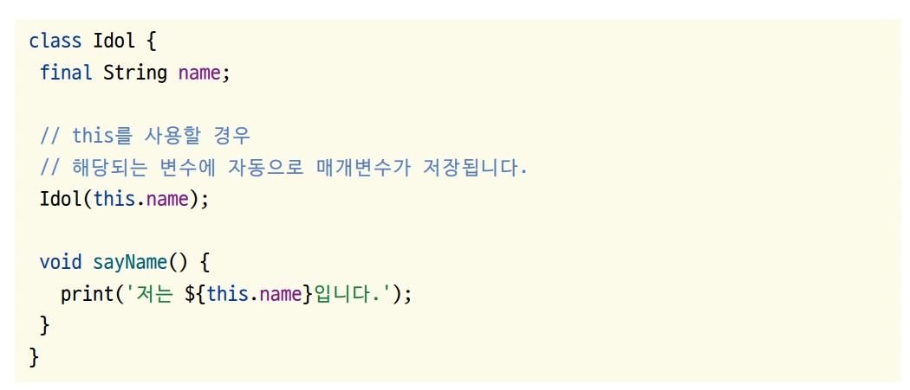

# **다트 객체지향 프로그래밍**  
# **객체지향 프로그래밍의 시작, 클래스**  
lib -> 2.2 -> class.dart 코드 참조  
  
# **생성자**  
lib -> 2.2 -> constructor.dart 코드 참조  
  
생성자에게 입력받을 변수를 일반적으로 final로 선언한다. 인스턴스화한 다음에 혹시라도 변수의 값을 변경하는 실수를 막기 
위함이다. 생성자 코드에는 네임드 파라미터 및 옵셔널 파라미터도 사용할 수 있다. : 기호 뒤에 입력받은 매개변수가 저장될 
클래스 변수를 지정해준다.  
  
생성자의 매개변수를 변수에 저장하는 과정을 생략하는 방법도 있다. 아래의 그림 참고  
  
  
  
