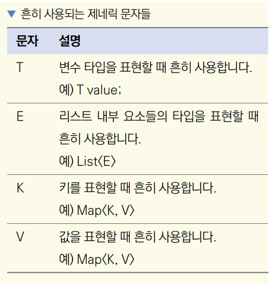

# **다트 객체지향 프로그래밍**  
# **객체지향 프로그래밍의 시작, 클래스**  
lib -> 2.2 -> class.dart 코드 참조  
  
# **생성자**  
lib -> 2.2 -> constructor.dart 코드 참조  
  
생성자에게 입력받을 변수를 일반적으로 final로 선언한다. 인스턴스화한 다음에 혹시라도 변수의 값을 변경하는 실수를 막기 
위함이다. 생성자 코드에는 네임드 파라미터 및 옵셔널 파라미터도 사용할 수 있다. : 기호 뒤에 입력받은 매개변수가 저장될 
클래스 변수를 지정해준다.  
  
생성자의 매개변수를 변수에 저장하는 과정을 생략하는 방법도 있다. 아래의 그림 참고  
  
  
  
# **네임드 생성자**  
네임드 생성자는 네임드 파라미터와 상당히 비슷한 개념이다. 일반적으로 클래스를 생성하는 여러 방법을 명시하고 싶을 때 사용한다. 
다트는 생성자 오버로딩이 안 되기 떄문에 네임드 생성자가 필요하다.  
   
lib -> 2.2 -> named_constructor.dart 코드 참조  
  
# **프라이빗 변수**  
다트에서 프라이빗 변수는 다른 언어와 정의가 약간 다르다. 일반적으로 프라이빗 변수는 클래스 내부에서만 사용하는 변수를 칭하지만 
다트 언어에서는 같은 파일에서만 접근 가능한 변수이다.  
  
lib -> 2.2 -> private_variable.dart 코드 참조  
  
# **게터/세터**  
게터는 말 그대로 값을 가져올 때 사용되고 세터는 값을 지정할 때 사용된다. 가변 변수를 선언해도 직접 값을 가져오거나 지정할 수 
있지만 게터와 세터를 사용하면 어떤 값이 노출되고 어떤 형태로 노출될지 그리고 어떤 변수를 변경 가능하게 할지 유연하게 정할 수 있다.  
  
최근에는 객체지향 프로그래밍을 할 때 변수의 값에 불변성을 특성으로 사용하기 때문에 세터는 거의 사용하지 않는다. 하지만 게터는 
종종 사용한다.  
  
lib -> 2.2 -> getter_and_setter.dart 코드 참조  
  
게터는 메서드를 선언하는 문법과 상당히 유사하지만 매개변수는 정의하지 않는다.  
  
# **상속**  
extends 키워드를 사용해 상속할 수 있다.  
  
lib -> 2.3 -> inheritance.dart 코드 참조  
  
# **오버라이드**  
다트에서는 override 키워드를 생략할 수 있기 때문에 사용하지 않고도 메서드를 재정의할 수 있다.  

lib -> 2.4 -> override.dart 코드 참조  
  
한 클래스에 이름이 같은 메서드가 존재할 수 없기 떄문에 부모 클래스나 인터페이스에 이미 존재하는 메서드명을 입력하면 override 키워드를 
생략해도 메서드가 덮어써진다. 하지만 직접 명시하는 게 협업 및 유지보수에 유리하다.  
  
# **인터페이스**  
인터페이스는 공통으로 필요한 기능을 정의만 해두는 역할을 한다. 다트에는 인터페이스를 지정하는 키워드가 따로 없다. 상속은 단 
하나의 클래스만 할 수 있지만 인터페이스는 적용 개수에 제한이 없다. 여러 인터페이스를 적용하고 싶으면 , 기호를 사용하여 
인터페이스를 나열해 입력하면 된다.  
  
lib -> 2.5 -> interface.dart 코드 참조  
  
GirlGroup 클래스는 Idol 클래스가 정의한 모든 기능을 다시 정의했다. 상속과 인터페이스는 비슷하지만 상속받을 때는 부모 클래스의 
모든 기능이 상속되므로 재정의할 필요가 없다. 반면 인터페이스는 반드시 모든 기능을 다시 정의해줘야 한다. 귀찮아 보이지만 애초에 
반드시 재정의할 필요가 있는 기능을 정의하는 용도가 인터페이스이기 때문이다. 그렇게 하면 실수로 빼먹는 일을 방지할 수 있다.  
  
# **믹스인**  
믹스인(mixin)은 특정 클래스에 원하는 기능들만 골라 넣을 수 있는 기능이다. 특정 클래스를 지정해서 속성들을 정의할 수 있으며 
지정한 클래스를 상속하는 클래스에서도 사용할 수 있다. 그리고 인터페이스처럼 한 개의 클래스에 여러 개의 믹스인을 적용할 수도 
있다. 인터페이스와 마찬가지로 여러 믹스인을 적용하고 싶으면 , 기호로 열거하면 된다.  
  
lib -> 2.6 -> mixin.dart 코드 참조  
  
# **추상**  
추상은 상속이나 인터페이스로 사용하는 데 필요한 속성만 정의하고 인스턴스화할 수 없도록 하는 기능이다. 인터페이스 예제와 같이 
Idol 클래스를 인터페이스로 사용하고 Idol 클래스를 따로 인스턴스화할 일이 없다면 Idol 클래스를 추상 클래스로 선언해서 Idol 
클래스의 인스턴스화를 방지하고 메서드 정의를 자식 클래스에 위임할 수 있다. 또한 추상 클래스는 추상 메서드를 선언할 수 있으며 
추상 메서드는 함수의 반환 타입, 이름, 매개변수만 정의하고 함수 바디의 선언을 자식 클래스에서 필수로 정의하도록 강제한다.  
  
lib -> 2.7 -> abstract_class.dart 코드 참조  
  
추상 클래스의 메서드를 하나라도 정의하지 않으면 에러가 난다.  
  
추상 메서드는 부모 클래스를 인스턴스화할 일이 없고 자식 클래스들에 필수적 또는 공통적으로 정의돼야 하는 메서드가 존재할 때 
사용된다.  
  
# **제네릭**  
제네릭은 클래스나 함수의 정의를 선언할 떄가 아니라 인스턴스화하거나 실행할 때로 미룬다. 특정 변수의 타입을 하나의 타입으로 
제한하고 싶지 않을 떄 자주 사용한다. 예를 들어 정수를 받는 함수, 문자열을 받는 함수를 각각 setInt(), setString()처럼 
따로 만들지 않아도 제네릭을 사용해 set() 함수 하나로 여러 자료형을 입력받게 처리할 수 있다.  
  
lib -> 2.8 -> generic.dart 코드 참조  
  
  
  
# **스태틱**  
지금까지 작성한 변수와 메서드 등 모든 속성은 각 클래스의 인스턴스에 귀속되었다. 하지만 static 키워드를 사용하면 클래스 
자체에 귀속된다.  
  
lib -> 2.9 -> static.dart 코드 참조  
  
변수 i를 스태틱으로 지정했다. Counter 클래스에 귀속되기 때문에 인스턴스를 호출할 때마다 1씩 증가한다. 생성자에 this.i가 아니고 
i로 명시했다. static 변수는 클래스에 직접 귀속되기 떄문에 생성자에서 static 값을 지정하지 못한다. 결과적으로 static 키워드는 
인스턴스끼리 공유해야 하는 정보에 지정하면 된다.  
  
# **캐스케이드 연산자**  
캐스케이드 연산자는 인스턴스에서 해당 인스턴스의 속성이나 멤버 함수를 연속해서 사용하는 기능이다. 캐스케이드 연산자는 
..기호를 사용한다.  
  
lib -> 2.10 -> cascade_operator.dart 코드 참조  
  