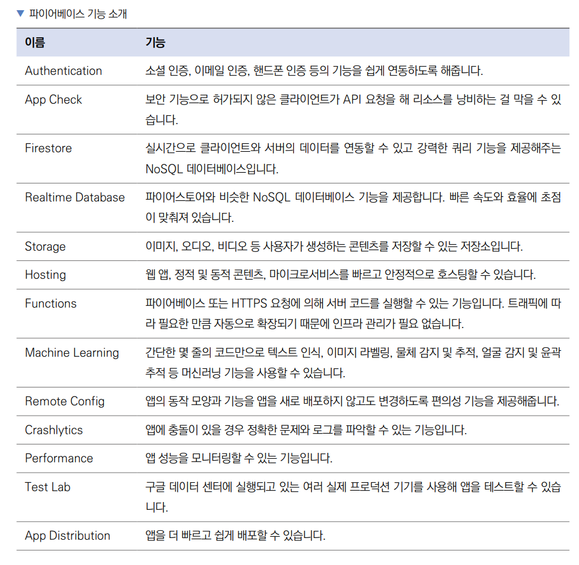
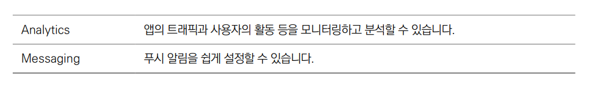
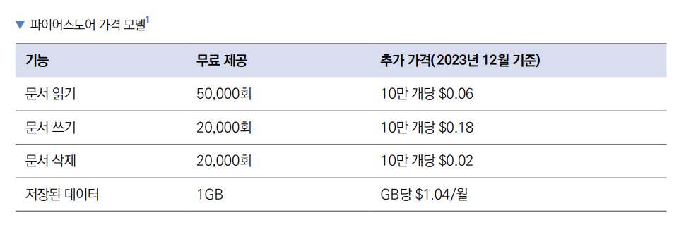
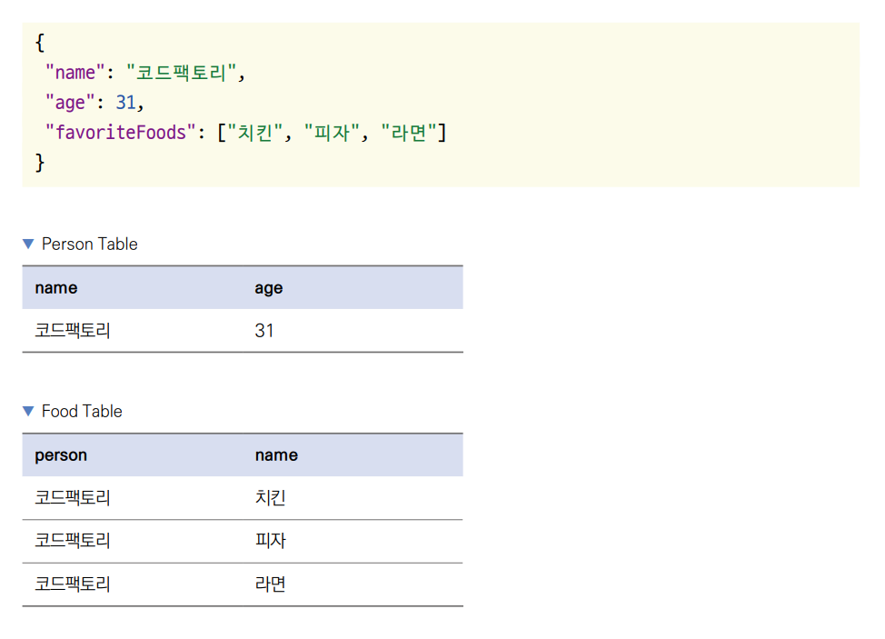
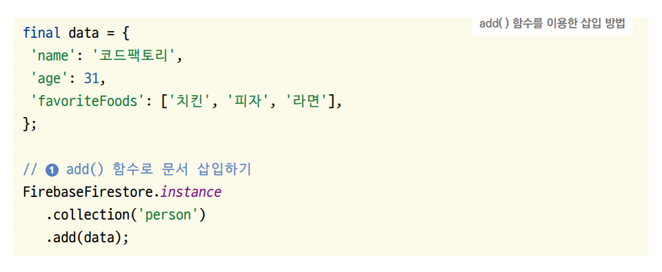
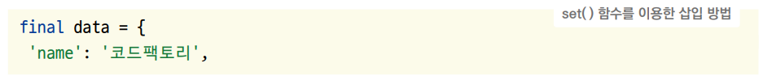
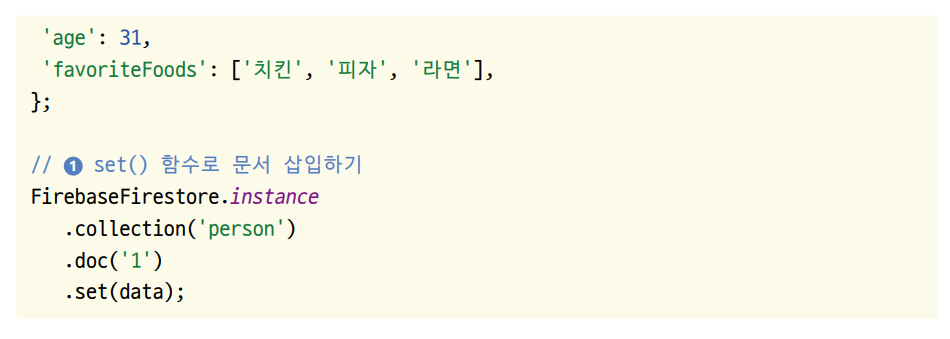
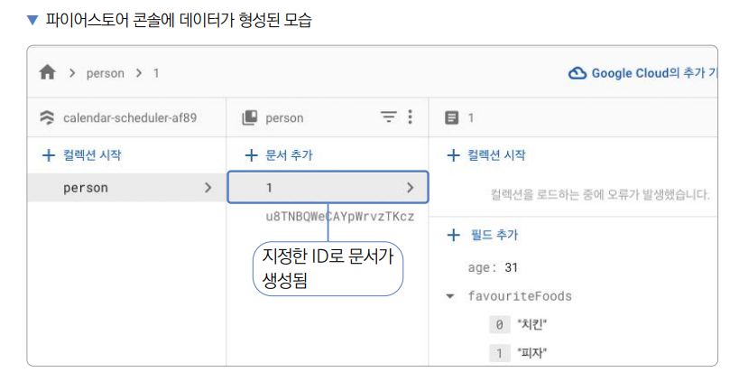
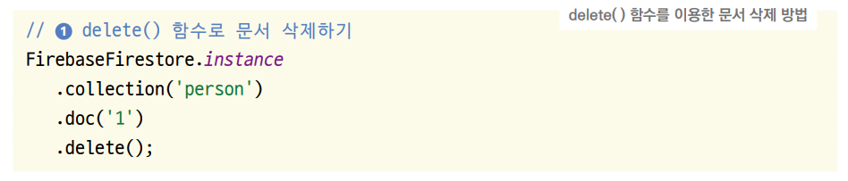

# **파이어베이스 연동하기 (파이어베이스, 파이어스토어)**  
# **프로젝트 구상하기**  
파이어베이스를 데이터베이스로 사용하도록 nestJS 서버 기반의 일정 관리 앱을 수정하며 프로젝트를 진행한다. Provider로 
API 연동한 기능을 제거하고 파이어베이스를 대신 연동한다.  
  
# **사전 지식**  
# **파이어베이스**  
파이어베이스(Firebase)는 구글이 인수한 모바일 앱 개발에 최적화된 기능을 제공하는 서비스다. 플러터뿐만 아니라 다른 앱 
개발 프레임워크 그리고 웹이나 서버에서도 이용할 수 있다. 이번 장에서는 파이어베이스의 데이터베이스 기능인 파이어스토어
(Firestore)만 사용하지만 파이어베이스에는 이외에도 수많은 기능이 있다.  
  
  
  
  
# **파이어스토어**  
이번 장에서 사용할 파이어베이스의 기능인 파이어스토어는 NoSQL 데이터베이스다. 필요한 서버와 인프라 관리를 구글에서 해주기 
때문에 백엔드 프로그래밍에 대해 크게 신경 쓸 필요 없이 서버를 구성할 수 있다. 클라이언트와 서버의 데이터를 실시간으로 연동하고 
오프라인 지원이 자동으로 되어서 네트워크 지연과 인터넷 연결과 관계없이 데이터를 저장할 수 있다. 또한 파이어베이스에서 제공하는 
파이어스토어 SDK를 사용하면 따로 HTTP 요청 코드를 작성할 필요 없이 제공되는 SDK로 직관적인 프로그래밍을 할 수 있다.  
  
파이어스토어는 유연한 가격 모델을 책정한다. 넓은 범위에서 무료 기능을 제공하고 사용량이 늘어나면 사용한 만큼 돈을 내는 
형태인 Pay As You Go 모델이다. 이번 프로젝트는 간단한 기능만 구현하기 떄문에 무료로 제공되는 범위에서 진행할 수 있다. 
프로덕션에서 파이어스토어를 사용한다면 다음 가격 모델을 참조하자.  
  
  
  
파이어스토어는 두 가지 데이터 개념이 있다. 컬렉션(collection)과 문서(document)이다. SQL 기반의 데이터베이스와 비교하면 
컬렉션은 테이블에 해당되고 문서는 열에 해당된다. NoSQL 문서는 SQL 데이터베이스와 비교해 더 유연한 데이터 구조를 사용할 수 있다. 
예를 들어서 SQL의 테이블에는 행과 열의 조합으로 하나의 행과 열 조합에는 하나의 값만 입력할 수 있다. 하지만 NoSQL의 
문서에서는 키와 값의 조합으로 하나의 값이 들어가는 위치에 리스트나 맵등 완전한 JSON 구조를 통쨰로 저장할 수 있다.  
  
예를 들어 아래의 데이터 구조를 테이블로 만들면 다음과 같은 테이블 2개가 필요하다.  
  
  
  
하지만 NoSQL에서는 JSON 형식을 있는 그대로 저장할 수 있다. 그러니 파이어스토어 또한 위 예제 데이터를 있는 그대로 문서에 
저장할 수 있다. 파이어스토어는 일반 데이터베이스와 마찬가지로 문서 삽입, 삭제, 조회, 업데이트 기능을 제공한다.  
  
# **파이어스토어 문서 삽입**  
파이어스토어에 문서를 삽입하는 방법은 대표적으로 두 가지가 있다. 첫 번째로 add() 함수를 이용한 삽입 방법이다. add() 
함수를 이용해서 문서를 삽입하면 파이어스토어에서 자동으로 문서의 ID 값을 생성해준다.  
  
  
  
FirebaseFirestore.instance를 실행하면 현재 플러터 프로젝트와 연동된 파이어스토어 기능을 불러올 수 있다. collection() 
함수는 문서를 저장할 컬렉션을 지정한다. 매개변수에 컬렉션 이름을 입력한다. add() 함수는 삽입할 문서를 입력할 수 있다. 
매개변수에 Map 형태의 데이터를 입력해주면 된다.  
  
  
  
add() 함수와 다르게 set() 함수를 이용하면 직접 문서의 ID 값을 지정할 수 있다.  
  
  
  
  
collection() 함수까지는 add() 함수를 실행할 떄와 같다. 하지만 다음으로 doc() 함수를 실행하면 문서의 ID 값을 매개변수에 
넣어줄 수 있다. 다음으로 set() 함수를 실행하고 첫 번째 매개변수에 저장하고 싶은 데이터를 입력해주면 ID 값에 해당되는 
데이터를 저장할 수 있다.  
  
  
  
# **파이어스토어 문서 삭제**  
파이어스토어에서 특정 문서를 삭제할 때는 delete() 함수를 사용하면 된다.  
  
  
  
doc() 함수를 실행할 때까지는 set() 함수로 문서를 삽입하는 과정과 같다. collection() 함수에 선택할 컬렉션 이름을 입력하고 
doc() 함수에 삭제할 문서의 ID를 입력해준다. 마지막으로 delete() 함수를 실행해주면 선택된 문서가 삭제된다.  
  
