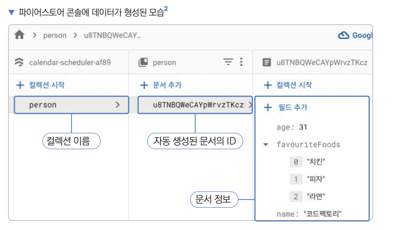
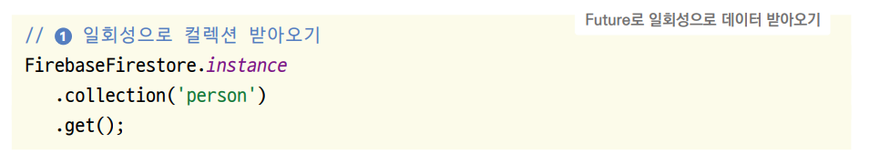
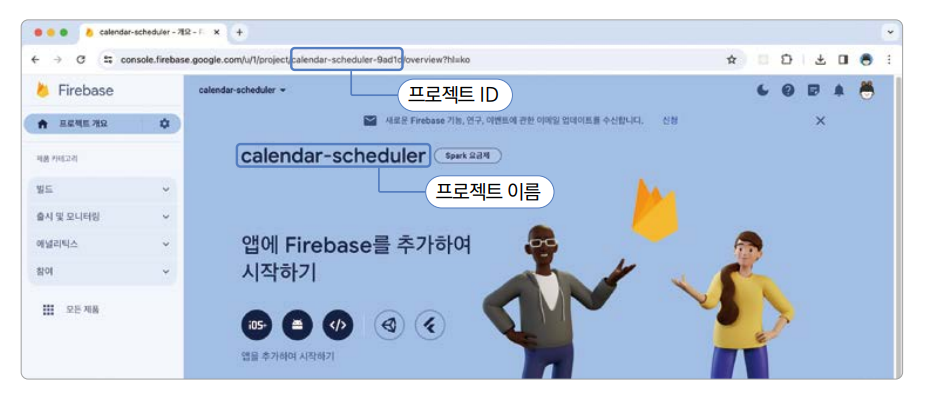

# **파이어베이스 연동하기 (파이어베이스, 파이어스토어)**  
# **프로젝트 구상하기**  
파이어베이스를 데이터베이스로 사용하도록 nestJS 서버 기반의 일정 관리 앱을 수정하며 프로젝트를 진행한다. Provider로 
API 연동한 기능을 제거하고 파이어베이스를 대신 연동한다.  
  
# **사전 지식**  
# **파이어베이스**  
파이어베이스(Firebase)는 구글이 인수한 모바일 앱 개발에 최적화된 기능을 제공하는 서비스다. 플러터뿐만 아니라 다른 앱 
개발 프레임워크 그리고 웹이나 서버에서도 이용할 수 있다. 이번 장에서는 파이어베이스의 데이터베이스 기능인 파이어스토어
(Firestore)만 사용하지만 파이어베이스에는 이외에도 수많은 기능이 있다.  
  
  
  
  
# **파이어스토어**  
이번 장에서 사용할 파이어베이스의 기능인 파이어스토어는 NoSQL 데이터베이스다. 필요한 서버와 인프라 관리를 구글에서 해주기 
때문에 백엔드 프로그래밍에 대해 크게 신경 쓸 필요 없이 서버를 구성할 수 있다. 클라이언트와 서버의 데이터를 실시간으로 연동하고 
오프라인 지원이 자동으로 되어서 네트워크 지연과 인터넷 연결과 관계없이 데이터를 저장할 수 있다. 또한 파이어베이스에서 제공하는 
파이어스토어 SDK를 사용하면 따로 HTTP 요청 코드를 작성할 필요 없이 제공되는 SDK로 직관적인 프로그래밍을 할 수 있다.  
  
파이어스토어는 유연한 가격 모델을 책정한다. 넓은 범위에서 무료 기능을 제공하고 사용량이 늘어나면 사용한 만큼 돈을 내는 
형태인 Pay As You Go 모델이다. 이번 프로젝트는 간단한 기능만 구현하기 떄문에 무료로 제공되는 범위에서 진행할 수 있다. 
프로덕션에서 파이어스토어를 사용한다면 다음 가격 모델을 참조하자.  
  
  
  
파이어스토어는 두 가지 데이터 개념이 있다. 컬렉션(collection)과 문서(document)이다. SQL 기반의 데이터베이스와 비교하면 
컬렉션은 테이블에 해당되고 문서는 열에 해당된다. NoSQL 문서는 SQL 데이터베이스와 비교해 더 유연한 데이터 구조를 사용할 수 있다. 
예를 들어서 SQL의 테이블에는 행과 열의 조합으로 하나의 행과 열 조합에는 하나의 값만 입력할 수 있다. 하지만 NoSQL의 
문서에서는 키와 값의 조합으로 하나의 값이 들어가는 위치에 리스트나 맵등 완전한 JSON 구조를 통쨰로 저장할 수 있다.  
  
예를 들어 아래의 데이터 구조를 테이블로 만들면 다음과 같은 테이블 2개가 필요하다.  
  
  
  
하지만 NoSQL에서는 JSON 형식을 있는 그대로 저장할 수 있다. 그러니 파이어스토어 또한 위 예제 데이터를 있는 그대로 문서에 
저장할 수 있다. 파이어스토어는 일반 데이터베이스와 마찬가지로 문서 삽입, 삭제, 조회, 업데이트 기능을 제공한다.  
  
# **파이어스토어 문서 삽입**  
파이어스토어에 문서를 삽입하는 방법은 대표적으로 두 가지가 있다. 첫 번째로 add() 함수를 이용한 삽입 방법이다. add() 
함수를 이용해서 문서를 삽입하면 파이어스토어에서 자동으로 문서의 ID 값을 생성해준다.  
  
  
  
FirebaseFirestore.instance를 실행하면 현재 플러터 프로젝트와 연동된 파이어스토어 기능을 불러올 수 있다. collection() 
함수는 문서를 저장할 컬렉션을 지정한다. 매개변수에 컬렉션 이름을 입력한다. add() 함수는 삽입할 문서를 입력할 수 있다. 
매개변수에 Map 형태의 데이터를 입력해주면 된다.  
  
  
  
add() 함수와 다르게 set() 함수를 이용하면 직접 문서의 ID 값을 지정할 수 있다.  
  
  
  
  
collection() 함수까지는 add() 함수를 실행할 떄와 같다. 하지만 다음으로 doc() 함수를 실행하면 문서의 ID 값을 매개변수에 
넣어줄 수 있다. 다음으로 set() 함수를 실행하고 첫 번째 매개변수에 저장하고 싶은 데이터를 입력해주면 ID 값에 해당되는 
데이터를 저장할 수 있다.  
  
  
  
# **파이어스토어 문서 삭제**  
파이어스토어에서 특정 문서를 삭제할 때는 delete() 함수를 사용하면 된다.  
  
  
  
doc() 함수를 실행할 때까지는 set() 함수로 문서를 삽입하는 과정과 같다. collection() 함수에 선택할 컬렉션 이름을 입력하고 
doc() 함수에 삭제할 문서의 ID를 입력해준다. 마지막으로 delete() 함수를 실행해주면 선택된 문서가 삭제된다.  
  
# **파이어스토어 문서 조회**  
파이어스토어는 아주 강력한 문서 조회 기능을 제공한다. 데이터가 변경될 때마다 실시간(Stream) 업데이트를 반영받을 수도 
있고 1회성으로 (Future) 데이터를 업데이트받을 수도 있다.  
  
  
  
collection() 함수에 snapshots() 함수를 실행하면 컬렉션의 모든 문서를 Stream<QuerySnapshot> 형태로 받아올 수 있다. 
Stream 형태로 받아오기 떄문에 컬렉션의 데이터가 업데이트되면 즉시 화면에 반영된다.  
  
Stream 형태로 문서를 받아오면 데이터 조회를 과도하게 많이 하게 될 수 있다. 그래서 파이어스토어는 Future 형태로 일회성으로 
데이터를 가져오는 기능도 제공한다.  
  
  
  
get() 함수를 실행하면 Future<QuerySnapshot>이 반환된다. 즉 실행하는 순간 한 번만 데이터를 받아오고 지속적으로 업데이트하지는 
않는다.  
  
특정 문서를 가져오고 싶으면 doc() 함수를 사용하면 된다. 가져오고 싶은 문서의 ID 값을 매개변수에 입력해주면 선택한 문서를 
불러올 수 있다. 이후 snapshots() 함수로 Stream을 받아오거나 get() 함수로 일회성으로 Future를 받아올 수 있다.  
  
  
  
# **파이어베이스 문서 업데이트**  
문서를 업데이트할 때는 update() 함수를 사용하면 된다.  
  
  
  
update() 함수를 실행하면 선택된 문서들을 update() 함수에 입력된 값들로 업데이트할 수 있다. 이 예제에서는 ID가 1인 
문서의 name값이 '골든래빗'으로 변경된다.  
  
# **사전 준비**  
# **pubspec.yaml 파일 설정하기**  
기존에 추가되어 있는 플러그인 아래에 이번 프로젝트에서 사용할 파이어베이스 플러그인들을 추가한다.  
  
pubspec.yaml 참고  
  
# **iOS 네이티브 설정하기**  
Firebase 플러그인들을 사용하려면 iOS 최소 버전(iOS Minimum Deployment Version)을 13 이상으로 설정해야 한다.  
  
1. iOS -> Runner -> Info.plist 파일을 열고 코드창의 맨 위에 Open iOS/macOS module in Xcode 버튼을 눌러서 XCode를 
실행한다.  
  
  
  
2. Runner -> Runner -> General을 클릭한 후 Minimum Deployments iOS 버전을 13으로 입력한다.  
  
  
  
# **파이어베이스 CLI 설치 및 로그인하기**  
파이어스토어는 파이어베이스에서 제공하는 기능이다. 파이어베이스 CLI를 설치하면 터미널이나 커맨드에서 쉽게 파이어베이스 
기능을 다룰 수 있다.  
  
# **macOS에서 설치 및 로그인**  
1. 터미널에서 다음 커맨드를 실행하면 파이어베이스 CLI를 내려받아 설치할 수 있다.  
  
  
  
2. 실행이 완료되면 다음 코드를 터미널에서 실행하여 버전 정보가 잘 나오는지 확인한다.  
  
  
  
3. 다음 코드를 실행해서 로그인 과정을 진행한다.  
  
  
  
# **윈도우에서 설치 및 로그인**  
1. 인터넷 브라우저를 이용해서 다음 링크로 접속한다  
- firebase.google.com/docs/cli#install-cli-windows  
  
2. 접속한 사이트의 Windows용 파이어베이스 CLI 바이너리를 눌러서 설치 파일을 내려받는다.  
  
  
  
3. 파이어베이스 CLI를 실행해서 로그인을 진행한다.  
  
  
  
# **프로젝트에 파이어베이스 설정하기**  
플러터 프로젝트에 파이어베이스 설정을 추가하려면 FlutterFire CLI를 설치하고 설정 기능을 실행해줘야 한다.  
  
1. 안드로이드 스튜디오의 Terminal 탭을 눌러서 터미널/커맨드를 열고 다음 명령을 실행해서 FlutterFire CLI를 설치한다.  
  
  
  
1과 같은 경고 문구가 보이면 윈도우 환경에서 환경 변수 Path에 C:\Users\{윈도우 사용자이름}\AppData\Local\Pub\Cache\bin 을 
추가하고 나서 안드로이드 스튜디오를 재실행 후 이후 과정을 진행하자. macOS 환경에서도 마찬가지로 콘솔에 제시된 경로를 
환경변수에 추가해주면 된다. 일반적으로 맥에서는 $HOME/.pub-cache/bin 경로를 추가하면 된다.  
  
2. 다음 링크에 접속해서 파이어베이스 Console로 이동한다. 파이어베이스 CLI에서 로그인했던 계정으로 콘솔을 접속한다.  
- console.firebase.google.com  
  
3. 프로젝트 추가 버튼을 누른다.  
  
4. 프로젝트 이름을 지정하고 라이선스에 동의한다. 프로젝트 이름을 입력하면 바로 아래에 프로젝트의 고유 식별자가 생성된다. 
입력을 완료하면 계속 버튼을 누른다.  
  
5. 애널리틱스 사용 설정을 한 후 계속 버튼을 누른다. 5번부터 8번까지는 계정의 상황에 따라 보일 수도 있고 보이지 않을 
수도 있다. 나타나면 진행하고 그렇지 않다면 9번 프로젝트 생성을 진행한다.  
  
  
  
6. 새 계정 만들기를 누른다.  
  
7. 새 애널리틱스 계정 이름을 지정하고 젖아 버튼을 누른다.  
  
8. 약관에 동의하고 프로젝트 만들기 버튼을 누른다.  
  
9. 프로젝트가 생성되면 계속 버튼을 누른다.  
  
10. 이동한 화면은 프로젝트 콘솔이다. 프로젝트 ID는 주소 표시줄 중간에 들어 있다. 이 값을 복사한다.  
  
  
  
11. 이제 생성한 파이어베이스 프로젝트를 플러터 프로젝트에 적용해야 한다. 안드로이드 스튜디오 터미널로 돌아가서 다음 세 명령어를 
차례대로 실행한다.  
  
  
  
12. 명령어를 실행하면 어떤 플랫폼을 사용할 건지 선택하는 창이 나온다. 기본으로 android와 iOS가 선택되어 있지만 선택이 
안 돼 있다면 화살표 키와 스페이스바를 이용해서 선택한다. 선택이 완료되면 Enter를 누른다.  
  
  
  
13. 다음과 같이 android/build.gradle과 android/app/build.gradle 파일을 변경해도 될지 질문이 실행되면 yes를 입력하고 
Enter를 누르면 된다.  
  
  
  
14. 실행이 완료되면 lib/firebase_options.dart 파일이 생성된다.  
  
# **파이어스토어 데이터베이스 생성하기**  
파이어베이스 프로젝트를 생성하려면 사용할 파이어스토어 데이터베이스를 생성해야 한다.  
  
1. 프로젝트 개요의 설정 버튼을 누르고 프로젝트 설정 버튼을 누른다.  
  
2. 기본 GCP 리소스 위치를 선택한다.  
  
3. 현재 거주하는 위치와 가장 가까운 지역을 선택한 후 완료 버튼을 선택한다. 보통은 자동으로 선택되어 있다. 그다음 완료 
버튼을 누른다.  
  
4. 파이어베이스 프로젝트 콘솔로 이동해서 빌드 탭의 Firestore Database 버튼을 누른다.  
이후로 진행할 5, 6, 7번은 파이어스토어 데이터베이스를 설정하는 과정이다(이미 과거에 파이어스토어를 설정한 적이 있다면 
진행할 필요 없다).  
  
5. 다음 화면에서 데이터베이스 만들기 버튼을 누른다.  
  
  
  
6. 이름 및 위치 설정에서 위치를 asia-northeast3(seoul)로 설정하고 보안 규칙에서 테스트 모드에서 시작을 체크한 다음 
사용 설정을 눌러 데이터베이스 만들기를 완료한다.  
  
데이터베이스 만들기를 하고 나서 오류가 발생하면 파이어스토어 데이터베이스 대시보드 홈에서 새로고침을 누르고 안내에 따라 
데이터베이스 설정을 Native 모드로 바꾼다.  
  
  
  
7. 다음과 같이 파이어스토어 콘솔이 실행되면 규칙 버튼을 누르고 규칙이 allow read, write: if false;로 작성돼 있다면 
allow read, write: if true;로 변경해서 데이터베이스를 접근하도록 한다. 이미 true로 설정돼 있다면 따로 변경할 필요가 
없다. 변경을 했다면 게시 버튼을 눌러서 저장한다.  
  
  
  
# **구현하기**  
서버 API와 연동된 로직을 파이어스토어와 연동하는 로직으로 변경하면 쉽게 파이어스토어와 연동을 완료할 수 있다.  
  
# **파이어베이스 설정 추가하기**  
파이어베이스는 파이어스토어뿐만 아니라 여러 기능을 지원한다. 하지만 파이어베이스에 포함되어 있는 기능이라면 한 번의 
설정만으로 모든 기능을 사용할 수 있다.  
  
1. firebase_core 플러그인에서 제공하는 Firebase.initializeApp() 함수를 사용하면 플러터 앱에 파이어베이스 설정을 
추가할 수 있다.  
  
lib -> main.dart  
  
Firebase.initializeApp() 함수를 실행하면 플러터 프로젝트에 Firebase 초기화를 할 수 있다. options 매개변수에 
DefaultFirebaseOptions.currentPlatform을 입력해주면 lib/firebase_options.dart 파일에 설정된 프로젝트 설정으로 
플러터 프로젝트에 파이어베이스 프로젝트를 설정할 수 있다.  
  
# **일정 데이터 삽입하기**  
1. 현재 component/schedule_bottom_sheet.dart 파일에 있는 ScheduleBottomSheet 위젯의 onSavePressed() 함수에서 
저장 기능을 실행한다. 이 함수의 로직을 변경해서 파이어스토어에 데이터를 저장하도록 한다.  
  
lib -> component -> schedule_bottom_sheet.dart  
  
ScheduleModel을 생성한다. ID 값은 UUID로 생성해서 입력해준다. FirebaseFirestore.instance.collection()을 실행하면 
특정 컬렉션을 가져올 수 있다. collection() 함수의 첫 번째 매개변수에는 가져오고 싶은 컬렉션 이름을 입력하면 된다. 
다음으로는 doc() 함수를 실행해서 저장하고 싶은 문서의 ID 값을 입력해주고 이어서 set() 함수를 실행한 후 저장하고 싶은 
데이터를 입력해준다.  
  
2. 앱을 실행한 후 FloatingActionButton을 누르고 ScheduleBottomSheet를 실행해서 일정을 생성한다.  
  
3. 파이어스토어 콘솔로 이동해서 데이터가 잘 생성되었는지 확인한다.  
  
# **일정 데이터 조회하기**  
schedule 컬렌션에 일정을 추가했으니 일정을 조회해서 달력의 특정 날짜가 선택될 때마다 해당 일정을 보여줘야 한다. 파이어스토어로부터 
Stream을 이용해서 데이터를 받아온 후 일정 정보를 화면에 보여주도록 수정한다.  
  
# **일정 데이터 받아오기**  
1. lib/screen/home_screen.dart 파일의 HomeScreen 위젯에서 더는 provider가 필요 없다. build() 함수의 최상단에 
선언해두었던 provider 관련 코드를 삭제한다.  
  
lib -> screen -> home_screen.dart  
  
2. Provider를 사용할 떄는 provider의 내부에서 선택된 날짜를 관리했다. 하지만 이제는 provider를 사용하지 않으니 
HomeScreen을 StatefulWidget으로 변경해서 선택된 날짜와 관련된 상태 관리를 진행한다.  
  
lib -> screen -> home_screen.dart  
  
3. 이제 날짜별 일정 값을 파이어스토어로부터 조회해야 한다. Stream으로 값을 받아서 화면에 보여주려면 StreamBuilder를 
사용해야 한다. 일정을 보여주고 있는 ListView 위젯을 StreamBuilder로 감싸서 일정들을 화면에 보여준다.  
  
lib -> screen -> home_screen.dart  
  
FirebaseFiresotre.collection('schedule').snapshots()를 실행하면 파이어스토어의 schedule 컬렉션에 있는 모든 
데이터를 스트림으로 받아올 수 있다. 하지만 우리가 받아오고 싶은 일정은 selectedDate 값과 date 속성이 같은 일정이기 
때문에 where() 함수를 실행해서 필터를 진행해준다. where() 함수의 첫 번째 매개변수에는 필터를 적용할 필드인 'date'
를 입력하고 isEqualTo 매개변수에 등가비교를 할 값인 selectedDate를 년, 월, 일 순으로 입력해주면 된다. 그러면 schedule 
컬렉션에 저장된 모든 일정 중에 현재 선택된 날짜인 selectedDate 값에 해당되는 date 속성을 갖고 있는 일정만 받아올 수 있다. 
  
QuerySnapshot의 data.docs값을 불러오면 쿼리에서 제공받은 모든 데이터를 리스트로 받아올 수 있다. 이 각 값은 QueryDocumentSnapshot 형태로 
제공된다. 미리 만들어둔 ScheduleModel.fromJson 생성자는 Map<String, dynamic> 형태를 입력받기 떄문에 QueryDocumentSnapshot에 
data() 함수를 실행해서 Map<String, dynamic> 형태로 데이터를 전환하면 ScheduleModel로 데이터를 매핑할 수 있다.  
  
4. 앱을 에뮬레이터 또는 시뮬레이터에서 실행한 후 일정을 생성한 날짜를 선택하면 삽입했던 일정이 조회되는 걸 확인할 수 있다.  
  
# **일정 개수 받아오기**  
1. TodayBanner 위젯의 조회 데이터 개수를 변경한다. TodayBanner를 StreamBuilder로 감싸주고 받아오는 데이터 개수를 
TodayBanner에 입력한다.  
  
lib -> screen -> home_screen.dart  
  
데이터가 없는 상태여서 null이 반환되면 0을 화면에 보여준다.  
  
# **일정 데이터 삭제하기**  
밀어서 삭제하기 제스처를 실행했을 때 schedule 컬렉션에서 해당되는 데이터를 삭제한다.  
  
1. 밀어서 삭제하기 기능은 Dismissible 위젯의 onDismissed 매개변수에 입력한 콜백 함수로 구현했다. 이 함수에 파이어스토어 
삭제 로직을 작성해서 삭제하기 기능을 구현한다.  
  
lib -> screen -> home_screen.dart  
  
컬렉션의 doc() 함수를 실행하면 컬렉션의 특정 문서를 가져올 수 있다. doc() 함수의 첫 번째 매개변수에는 가져올 문서의 
ID값을 입력해줘야 한다. 다음으로 delete() 함수를 이어서 실행하면 가져온 문서를 삭제할 수 있다.  
  
2. 생성해둔 일정을 우로 밀어서 삭제한다.  
  
# **main.dart 파일 정리하기**  
lib/main.dart 파일에는 아직 Drift 데이터베이스 및 provider 관련 코드가 남아 있다. 불필요한 코드를 삭제해서 필요 없는 
API가 실행되는걸 방지한다.  
  
1. Drift 데이터베이스 관련 코드와 provider 관련 코드를 모두 삭제한다.  
  
lib -> main.dart  
  
