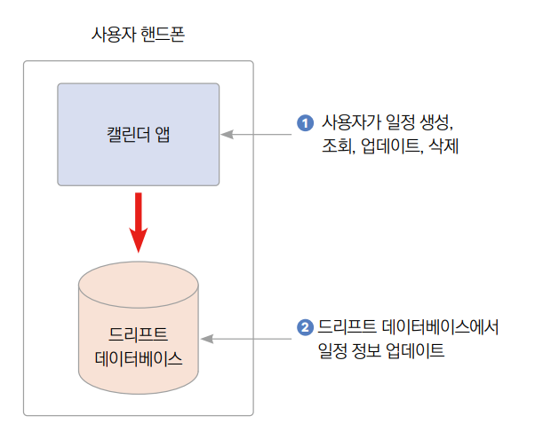
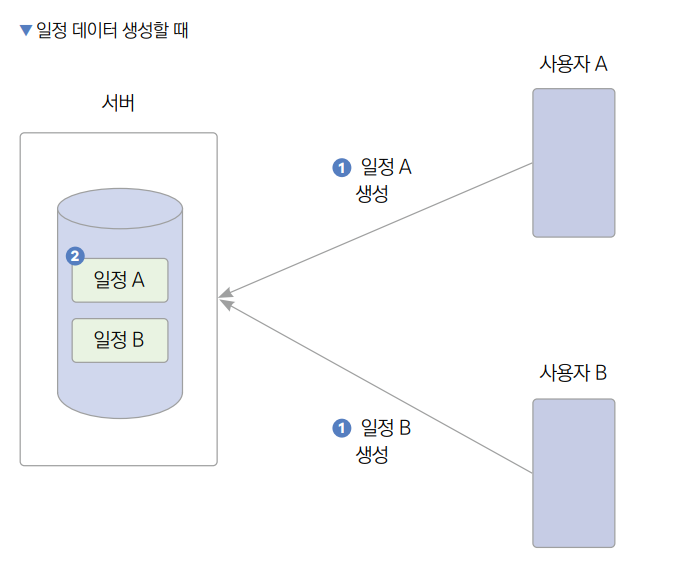
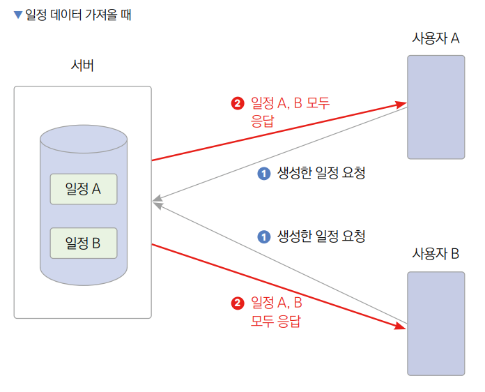
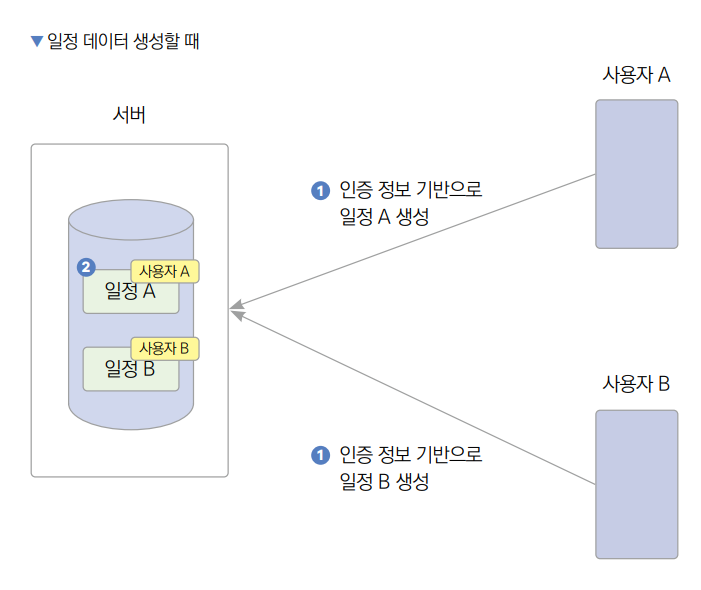
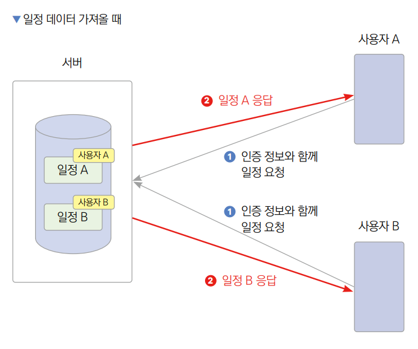
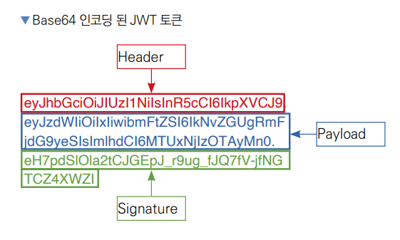
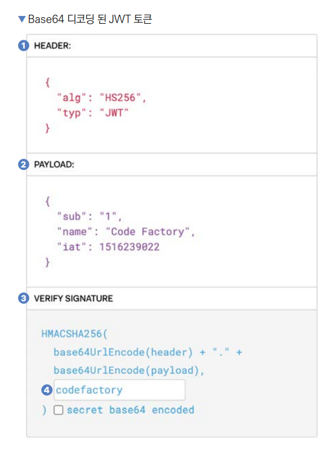

# **JWT를 이용한 인증하기 (JWT, 인증)**  
# **학습 목표**  
다양한 인증 방법이 있지만 그중에서 가장 많이 사용되는 방법은 JWT(json web token) 토큰을 사용한 인증이다.  
  
# **사전 지식**  
# **인증**  
인증(authentication)은 서버와 통신하는 사용자의 정보와 유효성을 검증하는 기능이다. 18장의 드리프트 플러그인을 사용하여 
데이터베이스를 이용하는 형태의 캘린더 앱은 프론트엔드에서 흔히 사용하는 로컬 데이터베이스를 사용하고 있다. 즉 사용자의 
핸드폰에서 데이터베이스를 직접 관리하기 떄문에 사용 중인 하나의 핸드폰에 저장한 정보는 한 명의 사용자가 저장한 정보라고 
가정해도 무방하다.  
  
  
  
사용자가 드리프트 API를 이용해 캘린더 앱에서 일정 관련 정보를 생성, 조회, 업데이트, 삭제한다. 드리프트 데이터베이스에서 새로 
입력받은 정보를 반영하거나 요청받은 정보를 반환한다. 이때 하나의 캘린더 앱당 드리프트 데이터베이스는 1:1로 매핑되어 있다. 
즉 하나의 앱당 데이터베이스는 하나다.  
  
하지만 앱에 서버를 연결하게 되면 상황은 매우 복잡하다. 19장에서 작업했던 캘린더 앱의 서버 연동 작업은 HTTP 프로토콜을 
통해 요청하는 법을 배우는 게 목표였기 때문에 사용자 정보 없이 직접 서버와 연동하는 작업을 했다. 다시 말해 단 하나의 기기만 
서버에 연동한다는 가정하에 작업하였다. 그렇기 떄문에 여러 기기에서 캘린더 앱을 실행하면 캘린더 앱을 실행한 모든 기기에서 
일정 데이터를 공유하게 된다. 개인 일정 관리를 목표로 기능을 만들었기 때문에 일정 데이터를 공유하는 것은 목적과 맞지 
않는다. 그러므로 A, B 사용자가 각각 생성한 개인 일정이 앱을 실행하면서 A, B 모두에게 공유된다면 개인 일정 앱이라고 볼 
수 없다.  
  
  
  
사용자 A와 사용자 B가 각각 다른 일정 A와 일정 B를 생성한다. 생성된 일정 A와 일정 B는 서버의 데이터베이스에 저장된다.  
  
  
  
사용자 A와 사용자 B가 각각 일정 정보를 서버에 요청한다. 요청을 받았지만 사용자를 식별할 수 있는 방법이 없어서 사용자 A와 
B는 일정 A와 일정 B 정보를 모두 응답받는다. 즉 본인이 생성한 일정뿐만 아니라 타인이 생성한 일정도 응답받게 된다.  
  
개인 일정 관리 앱의 일반적인 설계는 누가 생성한 일정인지 각 기기에 로그인한 사용자별로 구분하고 본인이 생성한 일정 정보만 
반환해주는 게 올바른 형태다. 이때 필요한 기능이 바로 인증이다. 특정 사용자로 로그인하고 로그인한 사용자의 정보를 기반으로 
일정을 생성하면 일정 정보를 요청할 때 요청하는 사용자가 생성한 일정만 구별해서 반환해준다.  
  
  
  
사용자 A와 사용자 B가 각각의 ID와 비밀번호를 입력해서 로그인한다. 로그인 정보를 기반으로 서버에서 사용자 인증을 진행하고 
인증 정보를 반환한다. 이 인증 과정에서 JWT를 사용한다.  
  
  
  
사용자 A와 사용자 B가 각각 다른 일정 A와 일정 B를 생성한다. 이때 사용자 A와 사용자 B는 인증 과정에서 발급받은 JWT를 
일정 데이터와 함께 전송한다. 일정 A와 일정 B를 저장할 때 각각의 일정 정보와 함께 전송된 JWT를 기반으로 어떤 사용자가 
생성한 일정인지에 대한 정보가 함께 데이터베이스에 저장된다.  
  
  
  
사용자 A와 사용자 B가 각각 일정 정보를 서버에 요청한다. 이때 인증 정보가 있는 JWT 토큰과 함게 요청을 보낸다. 서버에서는 
JWT를 분석하여 어떤 사용자가 요청을 보냈는지 알 수 있다. 서버에 생성된 일정은 어떤 사용자가 생성한 일정인지 이미 구분되어 
저장되어 있다. 일정 데이터 생성에서 JWT를 전송하여 인증 정보를 바탕으로 정보가 저장되었기 떄문이다. 따라서 각 사용자별로 
본인이 생성한 일정만 응답받을 수 있다.  
  
# **JWT란?**  
어떤 사용자가 요청을 하는지 알기 위해서 요청을 보낼 때마다 사용자에게 ID와 비밀번호를 입력하게 한다면 최악의 UX를 갖게 
하는 앱을 제작하게 될 것이다. 그렇기 때문에 사용자가 한 번 로그인을 하면 요청을 보낼 때마다 ID와 비밀번호를 매번 입력할 
필요 없이 기입력된 사용자 정보를 서버로 전달할 방법이 필요하다. 현대에는 이런 번거로움을 줄이기 위해 보편적으로 JWT를 
사용해서 사용자 정보를 서버와 공유한다.  
  
JWT는 헤더(header), 페이로드(payload), 시그니처(signature) 세 가지 요소로 이루어져 있다. 이 세 가지 요소를 이용해서 
토큰의 정보, 사용자 정보 그리고 토큰의 유효성에 대한 정보를 담게 된다. 이 세 요소는 각각 URL에 전송 가능한 형태인 
URL base64로 인코딩되어 있으며 '.'을 이용하여 하나의 String 값으로 묶어서 사용한다.  
  
  
  
  
헤더에는 토큰에 대한 정보가 담긴다. 예를 들면 토큰의 시그니처가 어떤 알고리즘으로 암호화됐는지, 토큰의 타입이 무엇인지 
저장한다.  
  
페이로드에는 데이터베이스상의 사용자 ID, 사용자 이름, 토큰의 만료 기간 등 사용자 정보가 담긴다.  
  
시그니처에는 JWT의 유효성을 검증할 수 있는 정보가 담겨 있다. 토큰을 생성할 당시 헤더를 base64로 인코딩한 값과 페이로드를 
base64로 인코딩한 값 그리고 사용자가 지정한 Secret값을 모두 합쳐서 헤더에서 정한 알고리즘으로 암호화한다. 만약 인증하는 
과정에서 해커가 JWT를 탈취한 후 페이로드나 헤더값을 한 글자라도 변경하면 똑같은 알고리즘으로 암호화한다 해도 다른 시그니처값이 
반환된다. 이 변경된 시그니처값과 기존의 시그니처값 대조를 통해 토큰의 변형 여부를 알 수 있다. 그렇기 때문에 Secret 값은 
탈취되지 않고 JWT가 탈취되어 토큰 내부 정보가 변경된다면 토큰의 변형 여부를 시그니처값 대조를 통해 알 수 있으므로 서버 
요청에 사용할 수 없다.  
  

