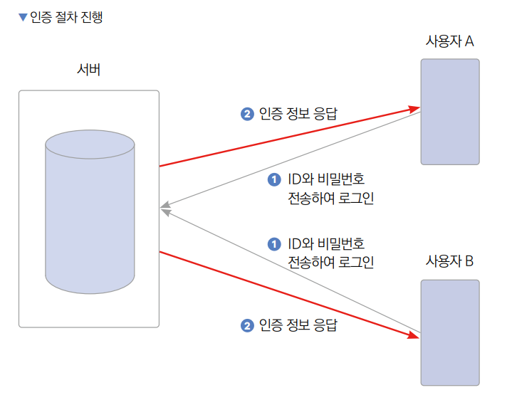

# **JWT를 이용한 인증하기 (JWT, 인증)**  
# **학습 목표**  
다양한 인증 방법이 있지만 그중에서 가장 많이 사용되는 방법은 JWT(json web token) 토큰을 사용한 인증이다.  
  
# **사전 지식**  
# **인증**  
인증(authentication)은 서버와 통신하는 사용자의 정보와 유효성을 검증하는 기능이다. 18장의 드리프트 플러그인을 사용하여 
데이터베이스를 이용하는 형태의 캘린더 앱은 프론트엔드에서 흔히 사용하는 로컬 데이터베이스를 사용하고 있다. 즉 사용자의 
핸드폰에서 데이터베이스를 직접 관리하기 떄문에 사용 중인 하나의 핸드폰에 저장한 정보는 한 명의 사용자가 저장한 정보라고 
가정해도 무방하다.  
  
  
  
사용자가 드리프트 API를 이용해 캘린더 앱에서 일정 관련 정보를 생성, 조회, 업데이트, 삭제한다. 드리프트 데이터베이스에서 새로 
입력받은 정보를 반영하거나 요청받은 정보를 반환한다. 이때 하나의 캘린더 앱당 드리프트 데이터베이스는 1:1로 매핑되어 있다. 
즉 하나의 앱당 데이터베이스는 하나다.  
  
하지만 앱에 서버를 연결하게 되면 상황은 매우 복잡하다. 19장에서 작업했던 캘린더 앱의 서버 연동 작업은 HTTP 프로토콜을 
통해 요청하는 법을 배우는 게 목표였기 때문에 사용자 정보 없이 직접 서버와 연동하는 작업을 했다. 다시 말해 단 하나의 기기만 
서버에 연동한다는 가정하에 작업하였다. 그렇기 떄문에 여러 기기에서 캘린더 앱을 실행하면 캘린더 앱을 실행한 모든 기기에서 
일정 데이터를 공유하게 된다. 개인 일정 관리를 목표로 기능을 만들었기 때문에 일정 데이터를 공유하는 것은 목적과 맞지 
않는다. 그러므로 A, B 사용자가 각각 생성한 개인 일정이 앱을 실행하면서 A, B 모두에게 공유된다면 개인 일정 앱이라고 볼 
수 없다.  
  
  
  
사용자 A와 사용자 B가 각각 다른 일정 A와 일정 B를 생성한다. 생성된 일정 A와 일정 B는 서버의 데이터베이스에 저장된다.  
  
  
  
사용자 A와 사용자 B가 각각 일정 정보를 서버에 요청한다. 요청을 받았지만 사용자를 식별할 수 있는 방법이 없어서 사용자 A와 
B는 일정 A와 일정 B 정보를 모두 응답받는다. 즉 본인이 생성한 일정뿐만 아니라 타인이 생성한 일정도 응답받게 된다.  
  
개인 일정 관리 앱의 일반적인 설계는 누가 생성한 일정인지 각 기기에 로그인한 사용자별로 구분하고 본인이 생성한 일정 정보만 
반환해주는 게 올바른 형태다. 이때 필요한 기능이 바로 인증이다. 특정 사용자로 로그인하고 로그인한 사용자의 정보를 기반으로 
일정을 생성하면 일정 정보를 요청할 때 요청하는 사용자가 생성한 일정만 구별해서 반환해준다.  
  
  
  
사용자 A와 사용자 B가 각각의 ID와 비밀번호를 입력해서 로그인한다. 로그인 정보를 기반으로 서버에서 사용자 인증을 진행하고 
인증 정보를 반환한다. 이 인증 과정에서 JWT를 사용한다.  
  
  
  
사용자 A와 사용자 B가 각각 다른 일정 A와 일정 B를 생성한다. 이때 사용자 A와 사용자 B는 인증 과정에서 발급받은 JWT를 
일정 데이터와 함께 전송한다. 일정 A와 일정 B를 저장할 때 각각의 일정 정보와 함께 전송된 JWT를 기반으로 어떤 사용자가 
생성한 일정인지에 대한 정보가 함께 데이터베이스에 저장된다.  
  
  
  
사용자 A와 사용자 B가 각각 일정 정보를 서버에 요청한다. 이때 인증 정보가 있는 JWT 토큰과 함게 요청을 보낸다. 서버에서는 
JWT를 분석하여 어떤 사용자가 요청을 보냈는지 알 수 있다. 서버에 생성된 일정은 어떤 사용자가 생성한 일정인지 이미 구분되어 
저장되어 있다. 일정 데이터 생성에서 JWT를 전송하여 인증 정보를 바탕으로 정보가 저장되었기 떄문이다. 따라서 각 사용자별로 
본인이 생성한 일정만 응답받을 수 있다.  
  
# **JWT란?**  
어떤 사용자가 요청을 하는지 알기 위해서 요청을 보낼 때마다 사용자에게 ID와 비밀번호를 입력하게 한다면 최악의 UX를 갖게 
하는 앱을 제작하게 될 것이다. 그렇기 때문에 사용자가 한 번 로그인을 하면 요청을 보낼 때마다 ID와 비밀번호를 매번 입력할 
필요 없이 기입력된 사용자 정보를 서버로 전달할 방법이 필요하다. 현대에는 이런 번거로움을 줄이기 위해 보편적으로 JWT를 
사용해서 사용자 정보를 서버와 공유한다.  
  
JWT는 헤더(header), 페이로드(payload), 시그니처(signature) 세 가지 요소로 이루어져 있다. 이 세 가지 요소를 이용해서 
토큰의 정보, 사용자 정보 그리고 토큰의 유효성에 대한 정보를 담게 된다. 이 세 요소는 각각 URL에 전송 가능한 형태인 
URL base64로 인코딩되어 있으며 '.'을 이용하여 하나의 String 값으로 묶어서 사용한다.  
  
  
  
  
헤더에는 토큰에 대한 정보가 담긴다. 예를 들면 토큰의 시그니처가 어떤 알고리즘으로 암호화됐는지, 토큰의 타입이 무엇인지 
저장한다.  
  
페이로드에는 데이터베이스상의 사용자 ID, 사용자 이름, 토큰의 만료 기간 등 사용자 정보가 담긴다.  
  
시그니처에는 JWT의 유효성을 검증할 수 있는 정보가 담겨 있다. 토큰을 생성할 당시 헤더를 base64로 인코딩한 값과 페이로드를 
base64로 인코딩한 값 그리고 사용자가 지정한 Secret값을 모두 합쳐서 헤더에서 정한 알고리즘으로 암호화한다. 만약 인증하는 
과정에서 해커가 JWT를 탈취한 후 페이로드나 헤더값을 한 글자라도 변경하면 똑같은 알고리즘으로 암호화한다 해도 다른 시그니처값이 
반환된다. 이 변경된 시그니처값과 기존의 시그니처값 대조를 통해 토큰의 변형 여부를 알 수 있다. 그렇기 때문에 Secret 값은 
탈취되지 않고 JWT가 탈취되어 토큰 내부 정보가 변경된다면 토큰의 변형 여부를 시그니처값 대조를 통해 알 수 있으므로 서버 
요청에 사용할 수 없다.  
  
# **액세스 토큰과 리프레시 토큰**  
JWT를 이용한 인증은 액세스 토큰과 리프레시 토큰 두 가지를 사용하는 방법이 일반적이다. 액세스 토큰은 보호된 정보에 접근할 
수 있는 권한 부여에 사용된다. 서버에 인증 정보를 보내서 리소스를 가져오거나 변경, 생성, 삭제하는데 이용할 수 있다. 
리프레시 토큰은 액세스 토큰의 유효기간이 만료됐을 때 재발급받을 수 있도록 사용하는 특수한 토큰이다.  
  
액세스 토큰은 사용 빈도가 높아 탈취당할 가능성이 매우 큰 토큰이다. 만약 해커가 액세스 토큰을 탈취하면 해당 액세스 토큰의 
사용자인 척하며 서버에 정보를 요청할 수 있다. 그래서 액세스 토큰은 탈취되어도 해커가 오래 사용하지 못하도록 액세스 토큰 
자체의 유요기간을 짧게 지정하여 문제를 해결한다.  
  
리프레시 토큰은 액세스 토큰을 폐기하고 새로운 액세스 토큰을 발급받을 때 사용한다. 물론 해커가 리프레시 토큰을 탈취하면 
액세스 토큰을 무한하게 발급받을 수 있다. 하지만 리프레시 토큰은 액세스 토큰과 비교했을 때 자주 사용하지 않아서 탈취당할 
가능성이 낮다.  
  
이렇게 탈취당할 확률이 높은 액세스 토큰은 유효기간을 짧게 지정하고 탈취당할 확률이 낮은 리프레시 토큰은 유효기간을 길게 
줘서 보안을 챙긴다.  
  
# **JWT를 이용한 인증 절차**  
JWT 인증 절차는 다음 세 가지 상황만 이해하면 된다. 첫 번쨰로 토큰을 발급받는 과정이다. 사용자가 ID와 비밀번호를 입력하고 
리프레시 토큰과 액세스 토큰을 발급받는다. 두 번째는 엑세스 토큰을 사용할 때이다. 액세스 토큰을 이용하여 사용자 정보와 
함께 서버에 요청을 보낸다. 마지막으로 유효기간이 만료된 액세스 토큰을 서버에 요청보낸 상황이다. 만료된 액세스 토큰을 
받은 서버는 요청을 받아들이지 않으며 401 에러가 발새한다. 이를 기반으로 사용자는 리프레시 토큰을 이용하여 액세스 토큰을 
재발급받고 새로운 토큰으로 기존 요청을 다시 보낸다.  
  
  
  
아이디와 비밀번호를 서버로 전송한다. 이때 아이디와 비밀번호는 ID:PASSWORD 형태로 base64로 인코딩한 다음 헤더에 authorization: 
'Basic {인코딩한 결과}' 형태로 전송한다. 헤더에 넣어준 정보를 서버에서 base64 인코딩한 후 아이디와 비밀번호를 검증한다. 
아이디와 비밀번호 검증에 성공하면 리프레시 토큰과 액세스 토큰을 응답으로 보내준다.  
  
  
  
헤더에 액세스 토큰을 authorization: 'Bearer {토큰}' 형태로 포함해서 API 요청을 한다. 그 후 액세스 토큰의 유효성을 검증하고 
액세스 토큰을 기반으로 데이터를 응답해준다.  
  
  
  
API 요청을 보낼 때 유효기간이 만료된 액세스 토큰을 함께 보낸다. 서버에서 액세스 토큰을 검증하지만 만료된 토큰이다. 서버는 
상태 코드 401 에러를 응답하며 만료된 토큰임을 알린다. 사용자는 리프레시 토큰을 포함하여 헤더에 authorization: 'Bearer {토큰}' 
을 입력해서 액세스 토큰 재발급을 URL에 요청보낸다. 서버에서 리프레시 토큰을 검증하고 새로운 액세스 토큰을 발급한다. 
신규 액세스 토큰을 응답으로 보내주고 새로운 액세스 토큰을 이용해서 이전에 실패한 요청을 다시 보낸다. 서버에서 액세스 토큰을 
검증하고 검증된 액세스 토큰을 기반으로 응답을 보내준다.  
  
# **사전 준비**  
# **서버 프로젝트 실행**  
1. Terminal 탭에서 npm run start:dev를 실행한다. 정상적으로 서버가 실행되면 서버 라우트 매핑과 관련된 로그가 출력된다.  
  
# **플러터 템플릿 프로젝트 설치**  
19장에서 서버와 연동하기에서 구현해놓은 프로젝트에 인증 기능을 추가하는 방식으로 진행한다.  
  
# **레이아웃 구상하기**  
이번 프로젝트에 추가할 UI는 로그인/회원가입 스크린이다. 실제 상업용 앱을 제작한다면 로그인과 회원가입 화면을 따로 만들고 
각종 검증 과정도 추가해야 한다.  
  
# **회원가입/로그인 페이지 구상하기**  
일정 생성 과정과 마찬가지로 텍스트 필드를사용하여 이메일과 비밀번호를 입력받는다. 회원가입 버튼을 누르면 입력된 이메일과 
비밀번호를 기반으로 회원가입을 진행한다. 로그인 버튼을 누르면 로그인을 진행한다.  
  
  
  
# **구현하기**  
# **로그인 UI 구현하기**  
1. 로그인/회원가입 UI를 제작할 때 사용할 로고를 pubspec.yaml 파일에 assets을 등록해준다. assets의 주석 처리를 해제하고 
그 아래에 원하는 폴더를 지정해준다. pubspec.yaml을 수정하고 pub get을 클릭해 실행해준다.  
  
pubspec.yaml 참고  
  
2. lib/screen/auth_screen.dart 파일을 생성한다. 이 파일에 로그인 관련 UI를 작성한다.  
  
3. 로그인 UI를 제작할 StatefulWidget을 생성한다. 로그인/회원가입과 관련된 모든 로직을 수행할 UI이기 때문에 AuthScreen이라고 
부르도록 한다.  
  
lib -> screen -> auth_screen.dart  
  
4. 로고와 텍스트 필드 그리고 회원가입 및 로그인 버튼은 모두 세로 방향으로 순서대로 배치한다. build() 함수를 모두 수정한다.  
  
lib -> screen -> auth_screen.dart  
  
5. 생성된 UI를 확인하기 위해서 lib/main.dart 파일에서 초기 실행 화면을 AuthScreen으로 변경해준다. 프로젝트를 실행하면 
간단한 로그인 기능이 렌더링된 화면을 볼 수 있다.  
  
lib -> main.dart  
  
# **UI 디자인 개선하기**  
현재 프로젝트 상태만으로 기능을 구현하는 데 문제는 없다. 다만 사용자가 호감을 느낄 디자인을 만드는 것도 앱 성공을 좌우하는 
중요한 요소 중 하나다. 지금 화면에서 약간의 색감과 디자인을 변경해 더욱 호감가는 UI로 변경한다.  
  
1. 우선 앞으로 사용할 색상들을 정리한다. lib/const/colors.dart 파일에 로고 색상과 같은 색상인 SECONDARY_COLOR 변수와 
텍스트 필드에 에러가 있을 때 메시지를 보여주는 용도로 사용할 색상인 ERROR_COLOR를 생성한다.  
  
lib -> const -> color.dart  
  
2. 현재 텍스트 필드의 디자인은 밑줄로만 되어 있다. 텍스트 필드의 디자인을 네모 형태로 일반화한다. lib/component/login_text_field.dart 
파일을 생성하고 기본 디자인을 추가한 텍스트 필드를 제작한다.  
  
lib -> component -> login_text_field.dart  
  
활성화 상태란 텍스트 필드에 값을 입력할 수 있는 상태를 의미한다. 비활성화 상태는 반대로 텍스트 필드는 존재하지만 탭해도 
문자를 입력하지 못하는 상태다. 텍스트 필드를 탭하면 보더가 포커스된 상태로 변하며 커서가 활성화되어 문자를 입력할 수 
있는 상태가 된다. errorBorder는 텍스트 필드에 에러가 존재하는 상태이다. validator 함수의 유효성 검사를 통과하지 
못하면 텍스트 필드는 에러 상태가 된다. focusedErrorBorder는 텍스트 필드를 탭해서 포커스가 되어 있는 상황에서 에러가 
난 상태이다.  
  
3. 새로 만든 텍스트 필드를 AuthScreen에 적용한다. 미리 제작해둔 LoginTextField는 TextFormField에 디자인을 입히고 
필요한 기능들을 매개변수로 노출한 컴포넌트이기 때문에 단순히 TextFormField들을 LoginTextField로 대체하면 된다.  
  
lib -> screen -> auth_screen.dart  
  
4. 이번에는 버튼의 색상을 로고의 색상과 동일하게 변경한다. 그러고 나서 프로젝트를 재실행하면 기존보다 간결하게 변경된 
디자인을 확인할 수 있다.  
  
lib -> screen -> auth_screen.dart  
  
# **인증 로직 구현하기**  
이 프로젝트에는 인증 요청 관련 로직을 담당하는 AuthRepository와 일정 관련 요청을 담당하는 ScheduleRepository 그리고 
상태 관리를 담당하는 ScheduleProvider가 있다. 이 세 가지를 사용해서 인증 로직을 구현한다. 사실 조금 더 확장성이 좋고 
정돈된 코드를 작성하려면 AuthProvider를 추가하여 인증 관련 상태를 따로 관리하는게 효율적이다. 그렇지만 21장 프로젝트는 
인증 과정을 보여주는 게 목적이며 AuthProvider를 추가하게 되면 목적과 관련 없는 코드를 너무 많이 추가하게 된다. 그렇기 
떄문에 AuthProvider에 포함됐을 로직은 모두 ScheduleProvider에 작업한다.  
  
1. 인증 요청과 관련된 로직을 작성하기 위해 lib/repository/auth_repository.dart 파일을 생성한 다음 회원가입 요청부터 
구현한다.  
  
lib -> repository -> auth_repository.dart  
  
2. 이번에는 로그인 로직을 작업한다. 회원가입은 바디의 텍스트 필드에 데이터를 입력해서 보내기 때문에 간단하다. 상대적으로 
로그인 요청은 JWT를 이용한 인증 절차에서 배웠던 것처럼 이메일과 비밀번호를 base64로 인코딩해서 헤더로 보내줘야 한다는 
차이가 있다.  
  
lib -> repository -> auth_repository.dart  
  
3. 다음으로 리프레시 토큰과 액세스 토큰을 재발급받는 요청을 작업한다. 사실상 토큰을 재발급받는 두 로직은 동일하며 요청을 
보내는 URL만 다르다. 같은 로직을 반복하고 싶지 않다면 하나의 함수에 리프레시 토큰과 액세스 토큰 중 어떤 토큰을 재발급받을 
것인지 명시하는 boolean으로 파라미터를 받고 URL만 변경해줘도 괜찮다. 이 프로젝트에서는 두 함수로 나눠서 작업한다.  
  
lib -> repository -> auth_repository.dart  
  
이제 서버와 통신하는 코드는 모두 준비했다. ScheduleProvider에 상태 관리 및 실제 UI에서 실행할 함수를 구현한다. ScheduleProvider 뿐만 
아니라 이 프로젝트에 미리 작성되어 있는 코드는 모두 19장 코드 기반으로 구현되어 있다.  
  
4. ScheduleProvider 클래스에서 필요한 변수들을 정리한다. 우선 ScheduleProvider 뿐만 아니라 AuthRepository의 인증 
관련 API 요청 로직 또한 사용해야 하기 때문에 매개변수로 입력받아야 한다. 추가로 리프레시 토큰과 액세스 토큰을 저장할 
refreshToken과 accessToken 프로퍼티도 생성한다.  
  
lib -> provider -> schedule_provider.dart  
  
5. 토큰을 새로 발급했을 떄 refreshToken 프로퍼티와 accessToken 프로퍼티를 업데이트 해줄 수 있는 updateTokens() 함수를 
구현한다. updateTokens() 함수의 로직은 리프레시 토큰과 액세스 토큰을 동시에 업데이트하거나 각자 하나씩만 업데이트할 수 있다.  
  
lib -> provider -> schedule_provider.dart  
  
6. 회원가입 로직을 구현한다. AuthRepository에서 통신 요청 로직을 모두 구현해놨기 떄문에 register() 함수에서는 AuthRepository에서 
구현한 회원가입 로직의 register() 함수만 실행해주고 위에서 구현한 새로 발급받은 토큰으로 업데이트해주는 updateTokens() 함수만 
실행해주면 된다.  
  
lib -> provider -> schedule_provider.dart  
  
7. 로그인과 로그아웃 기능을 추가한다. 로그인 기능은 회원가입 기능과 크게 다를 바가 없다. 텍스트 필드에 입력받은 이메일과 
비밀번호를 가져외 login() 함수를 실행하여 로그인한다. 로그아웃 기능은 단순히 refreshToken과 accessToken을 null로 
변환해주면 된다. 두 토큰이 모두 null인 상황이라면 로그인이 안 된 상황이다.  
  
lib -> provider -> schedule_provider.dart  
  
8. 이제 인증 관련 로직은 하나가 남았다. 리프레시 토큰과 액세스 토큰을 재발급받을 수 있는 rotateToken() 함수를 구현한다.  
  
lib -> provider -> schedule_provider.dart  
  
9. ScheduleProvider에 AuthRepository도 매개변수를 통해 입력받는 걸로 리팩토링했다. 다음으로 main.dart에서 ScheduleProvider를 
인스턴스화할 때 AuthRepository 또한 주입해주도록 한다.  
  
lib -> main.dart  
  
회원가입과 로그인 로직 모두 완성했다. 이제 이메일과 비밀번호를 입력하고 회원가입 버튼을 눌렀을 때 해당 로직들이 실행되기만 
하면 된다.  
  
10. AuthScreen의 Form에서 텍스트 필드의 유효성 검증을 할 때 실행할 함수를 구현한다. 이메일 텍스트 필드에서는 입력된 
값이 이메일 유형인지 확인하고 비밀번호는 4~8자 사이의 문자로 입력했는지 확인한다.  
  
lib -> screen -> auth_screen.dart  
  
추후 추가할 Form 위젯은 대표적으로 값을 검증하는 validate() 함수와 값을 저장하는 submit() 함수를 제공해준다. validate() 함수를 
실행하면 하위에 있는 모든 TextFormField의 validator() 함수가 실행되며 입력값을 확인한다. submit() 함수를 실행하면 
onSaved() 함수가 실행되며 값을 저장한다.  
  
11. TextFormField와 일반 TextField의 대표적인 차이점이 있다. TextFormField는 Form 위젯 하위에 입력됐을 때 Form의 
validate() 함수와 save() 함수를 실행해서 모든 TextFormField의 검증과 값 저장을 한 번에 관리할 수 있다는 점이다. 
TextFormField의 바로 상위 위젯인 Column을 Form으로 감싸고 Form을 제어할 수 있는 key를 입력한다. 추가로 Form의 save() 
함수를 실행했을 때 email 프로퍼티와 password 프로퍼티에 값을 저장하는 로직을 구현한다.  
  
lib -> screen -> auth_screen.dart  
  
12. 회원가입과 로그인 버튼을 눌렀을 때 Form 위젯 하위에 있는 모든 TextFormField를 검증해야 한다. 로그인 버튼과 
회원가입 버튼을 눌렀을 때 모두 공통으로 필요한 로직이니 함수를 생성해서 공통되는 부분을 정리한다. Form 위젯의 Key 매개변수에 
formKey 변수를 입력했으니 formKey의 validate() 함수를 실행하면 TextFormField들을 검증할 수 있고 save() 함수를 
실행하면 TextFormField에 입력한 값들을 저장할 수 있다.  
  
lib -> screen -> auth_screen.dart  
  
13. 이제 Form을 이용해서 회원가입 로직과 로그인 로직을 완성하면 된다. 우선 회원가입 로직부터 구현한다. onRegisterPress() 
함수를 생성하고 이 함수가 실행되면 Form 하위의 모든 TextFormField를 검증한다. 검증이 완료되면 텍스트 필드값을 저장한 
후 ScheduleProvider의 register() 함수를 실행한다.  
  
lib -> screen -> auth_screen.dart  
  
14. 로그인 로직은 ScheduleProvider의 register() 함수 대신에 login() 함수를 실행한다는 사실 외에는 onRegisterPress() 
함수와 큰 차이가 없다.  
  
lib -> screen -> auth_screen.dart  
  
15. 회원가입 버튼과 로그인 버튼이 클릭될 때마다 각각 기능에 적합한 함수를 실행하는 코드를 작성한다.  
  
lib -> screen -> auth_screen.dart  
  
16. 마지막으로 로그아웃 버튼을 생성한다. 회원가입이나 로그인이 성공적으로 진행되면 현재 메인 화면인 HomeScreen으로 이동하도록 
코드를 작성했다. 그래서 로그아웃 버튼은 HomeScreen에서 작업해야 한다. 현재 UI에서 로그아웃 버튼이 가장 어울릴만한 위치는 
TodayBanner이다. TodayBanner에 로그아웃 아이콘을 추가하고 아이콘을 눌렀을 때 ScheduleProvider의 logout() 함수 
실행 후 AuthScreen으로 되돌아가게 한다.  
  
lib -> component -> today_banner.dart  
  
17. 이제 작성한 코드를 테스트한다. 테스트할 때 calender_scheduler_server를 실행해야 한다.  
  
# **액세스 토큰을 이용한 요청 구현하기**  
인증 로직을 구현한 이유는 인증 확인 요청을 서버로 보냈을 떄 어떤 사용자가 요청을 보냈는지 서버가 식별할 수 있게 하기 
위함이다. 사용자 인증을 통해 액세스 토큰을 발급받았으니 모든 일정 정보 관련 요청에 액세스 토큰을 추가해서 요청을 보내는 
로직을 작업한다.  
  
1. 일정을 불러오는 GET 요청을 위한 getSchedules() 함수부터 작업한다. 모든 일정 관련 요청은 ScheduleRepository에서 구현하고 
있다. 따라서 각 함수에서 보내는 HTTP 요청의 헤더에 토큰을 포함하는 로직을 작업하면 된다.  
  
lib -> repository -> schedule_repository.dart  
  
2. 일정을 생성하는 코드 부분도 변경한다. getSchedules() 함수와 마찬가지로 createSchedule() 함수에 헤더의 액세스 토큰을 
포함해서 요청을 보내는 코드를 추가해준다.  
  
lib -> repository -> schedule_repository.dart  
  
3. 마지막으로 일정을 삭제하는 deleteSchedules() 함수에도 토큰을 함께 보내는 로직을 추가한다.  
  
lib -> repository -> schedule_repository.dart  
  
4. 일정 관련 함수들에 HTTP 헤더에 액세스 토큰을 포함하는 코드를 업데이트하고 나면 ScheduleProvider에 여러 에러가 생긴다. 
기존에 받지 않던 액세스 토큰을 인자로 넣어줘야 하기 떄문이다. 에러가 나는 위치에 모두 accessToken 프로퍼티를 주입한다.  
  
lib -> provider -> schedule_provider.dart  
  
