# **소셜 로그인과 파이어베이스 인증하기 (소셜 로그인, OAuth 2.0, 파이어베이스 인증, 구글 로그인 세팅)**
# **사전 지식**  
# **소셜 로그인과 OAuth 2.0**  
현대 앱 개발에서 소셜 로그인은 더 이상 빼놓을 수 없는 기능 중 하나다. 사용자에게 간단함과 편리함을 주기 떄문이다. 소셜 
로그인의 예로 앱에서 흔히 볼 수 있는 구글 로그인, 애플 로그인 등이 있다.  
  
# **소셜 로그인을 사용하면 얻을 수 있는 이점**  
소셜 로그인을 사용하면 다양한 이점이 있다. 첫 번째는 사용자가 서비스별로 다른 비밀번호를 기억해야 하는 번거로움을 줄일 
수 있고 복잡한 회원가입 절차를 간소화할 수 있다. 두 번째는 다른 서비스와 계정 정보를 연동하므로 악의적인 사용자의 가짜 
계정 생성을 어렵게 할 수 있다. 세 번째로 직접적인 인증을 진행하지 않으며 비밀번호 관리를 서비스 개발자가 직접하지 않으므로 
리소스를 절약할 수 있다. 마지막으로 간소한 사용자 인증 절차 덕분에 앱의 사용자 경험을 증진시킬 수 있다.  
  
소셜 로그인을 진행하려면 소셜 로그인 프로바이더에 앱을 등록해야 한다. 앱을 등록할 때 앱의 정보와 함께 리다리엑트 URL을 
등록한다. 리다이렉트 URL은 소셜 로그인 프로바이더에서 사용자 인증이 끝난 후 인증 코드를 반환할 URL이다. 앱의 경우 앱 스킴을 
사용하여 앱으로 다시 돌아오게 할 수 있다. URL 스킴을 사용하면 앱과 앱 사이의 이동이 쉬워진다. 앱을 등록하면 클라이언트 ID와 
클라이언트 Secret을 배정받는다. 이 값을 이용해서 소셜 로그인 프로바이더에 인증 요청을 할 수 있다.  
  
# **소셜 로그인 진행 방식 알아보기**  
다음 그림에서 소셜 로그인의 진행 방식을 알아본다. 구글 로그인을 진행한다는 가정하에 진행한다. 다른 소셜 로그인 프로바이더를 
사용해도 내부 구성은 OAuth 2.0이므로 로직은 같다.  
  
  
  
사용자가 구글로 로그인 버튼을 누르면 소셜 로그인이 시작된다. 구글 로그인 요청이 생기면 앱은 클라이언트 ID와 리다이렉트 URL, 
요청할 스코프를 구글 서버에 전송한다. 그러면 구글 서버는 구글 로그인 창을 실행한다. 만약에 이미 로그인이 되어 있다면 
로그인이 된 계정을 선택할 수 있는 창이 실행된다. 앱이 사용자의 정보에 접근하는 걸 사용자가 허가해주면 리다이렉트 URL 
또는 앱으로 인증 코드가 전송된다. 구글 서버의 토큰 발급 URL로 인증 코드, 클라이언트 ID, 클라이언트 Secret을 보내면 
액세스 토큰을 발급받을 수 있다. 액세스 토큰을 사용하면 구글 서버로부터 허가된 사용자 정보를 받아올 수 있다.  
  
요청할 스코프는 받고 싶은 사용자의 정보와 권한의 레벨을 정의하는 값이다.  
  
# **파이어베이스 인증**  
대표적인 소셜 로그인 프로바이더는 OAuth 2.0 스펙을 사용하므로 인증 로직은 대부분 비슷하다. 하지만 각 소셜 로그인별로 제공하는 
SDK의 사용법과 사용자 정보를 반환하는 값은 서로 다르며 요구하는 스펙 또한 다양하다. 그리고 보통은 최소 3개 이상의 소셜 
로그인 프로바이더로 앱을 개발하는 경우가 많다. 그래서 만약 서비스에서 제공할 모든 소셜 로그인 프로바이더의 연동을 직접 
구현한다면 각각 연동하는 과정은 매우 힘들 수 있다.  
  
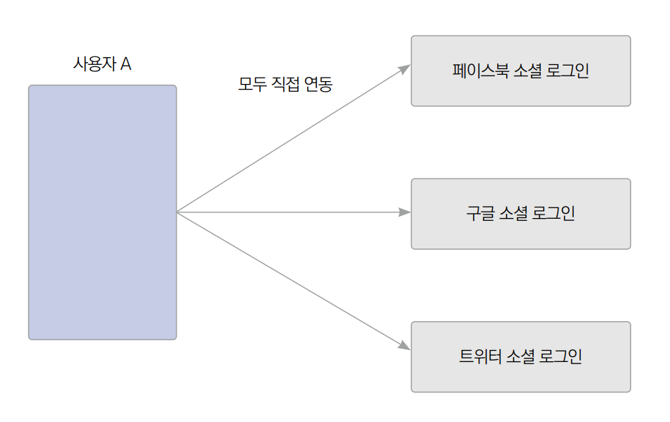  
  
그래서 Firebase, Auth0, Okta, Supabase 등은 소셜 로그인 기능을 자사 서비스 SDK 하나로 묶어 제공하여 소셜 로그인 
연동을 수월하게 해준다. 만약 제작 중인 서비스에 하나의 소셜 로그인 기능만 제공할 계획이라면 직접 소셜 로그인 프로바이더와 
연동해도 괜찮다. 다만 앱의 여러 소셜 로그인 프로바이더를 연동할 계획이라면 앞서 언급한 연동을 쉽게 해주는 서비스를 
사용하는 것도 좋은 방법이다.  
  
Auth0, Okta, Supabase는 이 기능을 유료로 제공하고 파이어베이스 인증은 이 서비스를 무료로 제공한다.  
  
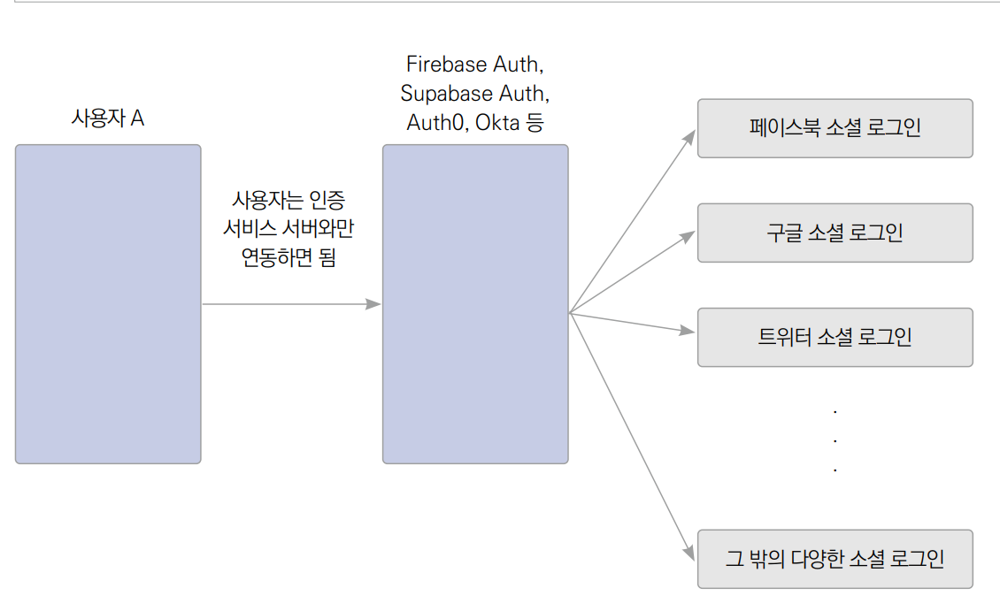  
  
# **구글 로그인 세팅**  
구글 로그인을 사용하려면 파이어베이스 연동 설정을 해야 한다. 구글 로그인뿐만 아니라 파이어스토어를 사용하기 위해서도 
파이어베이스 연동이 필요하다. 파이어베이스 설정은 20장에서 학습했으므로 22장에서 반복하지 않는다. 이번 프로젝트는 20장 
프로젝트를 기반으로 진행한다. 그러므로 파이어베이스 관련 사전 준비가 따로 필요 없다. 하지만 새로운 프로젝트에 구글 로그인을 
세팅한다면 파이어베이스 연동을 해야 한다.  
  
# **사전 준비**  
# **플러터 템플릿 다운로드**  
1. 깃허브의 ch22 프로젝트를 열고 실행하여 캘린더 프로젝트가 정상적으로 실행되면 프로젝트를 진행할 준비가 완료된 것이다.  
  
파이어베이스 추가 이후 실행했을 때 또는 macOS에서 안드로이드 시뮬레이터로 실행 시 multidex error가 발생하면 flutter run 
--debug를 실행하여 설정을 진행한다.  
  
# **Java 11 다운로드**  
이 책은 Java 11로 실습을 진행한다. gradlew를 실행해서 앱의 setting 정보를 가져오려면 JDK 11 버전이 필요하다. Signing 
Report 가져오기에서 에러가 날 경우 어떤 버전의 JDK가 필요한지 알려준다.  
  
# **Signing Report 가져오기**  
안드로이드 앱은 앱의 개발자를 인증하기 위해서 디지털 지문(digital signature)을 요구한다. 추가적으로 파이어베이스 플랫폼에서도 
특정 서비스를 사용할 때 디지털 지문 등록을 요구한다. 플러터 프로젝트도 처음 생성했을 때 기본 전자 서명이 생성되며 이 
전자 서명은 원한다면 추후 변경할 수 있다.  
  
1. 탐색기에서 android/gradlew 파일을 우클릭한 후 Open In -> Terminal을 선택한다. gradlew 파일은 안드로이드 환경에서 
프로젝트를 실행해야 생긴다. iOS 환경이라면 gradlew 파일이 보이지 않을 수도 있다. 그럴 경우 Android 환경에서 프로젝트를 
한 번 실행해서 gradlew 파일을 생성 후 이어서 실습을 진행한다.  
  
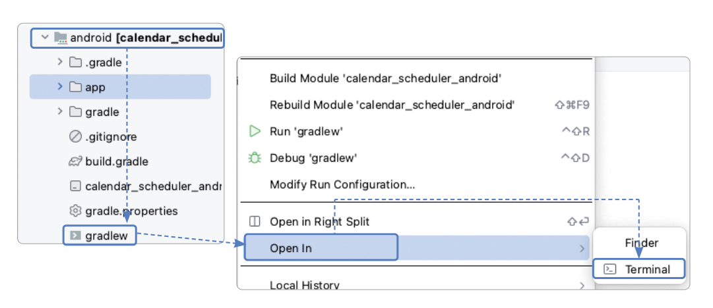  
  
2. 실행된 터미널에서 맥 사용자는 ./gradlew signingReport를 실행해주고 윈도우 사용자는 .\gradlew.bat signingReport를 
실행한다. 정상적으로 실행되면 상단으로 스크롤해서 "> Task :app:signingReport" 구문을 찾은 다음 Variant: debug를 확인하고 
그 아래에 있는 SHA-1 값을 복사한다. 추후 디지털 지문의 SHA-1키를 입력하라고 하면 이 값을 입력하면 된다.  
  
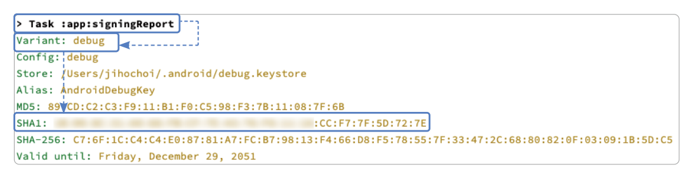  
  
# **pubspec.yaml 파일 설정하기**  
구글 로그인 플러그인을 pubspec.yaml에 추가하고 이미지 파일 설정도 등록한다. 플러그인을 등록한 다음에는 pub get을 눌러
플러그인 설정 업데이트를 완료한다.  
  
pubspec.yaml 참고  
  
# **OAuth 설정하기**  
1. 파이어베이스 콘솔로 이동하여 20장에서 파이어베이스 연동할 때 사용했던 프로젝트를 선택한다.  
  
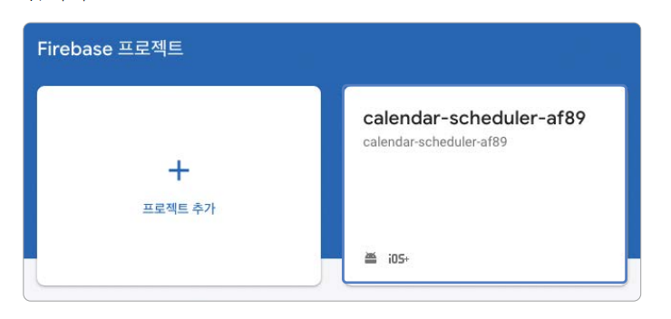  
  
2. 설정 -> 프로젝트 설정을 클릭한다.  
  
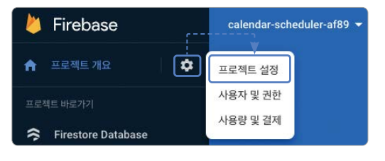  
  
3. 서비스 계정 -> 서비스 계정 권한 관리를 클릭한다.  
  
  
  
4. 파이어베이스 프로젝트와 연결된 GCP(Google Cloud Platform) 프로젝트로 연결되면 파이어베이스 프로젝트와 같은 이름의 
프로젝트가 실행 중인지 확인한다. 만약 아니라면 다른 구글 계정으로 콘솔레 진입됐을 수 있다. 그렇다면 계정 로그아웃을 한 
후 파이어베이스 프로젝트를 생성한 계정으로 다시 로그인한다. 동일한 이름의 GCP 프로젝트로 잘 이동이 됐다면 메뉴 -> API 및 
서비스 -> OAuth 동의 화면을 누른다.  
  
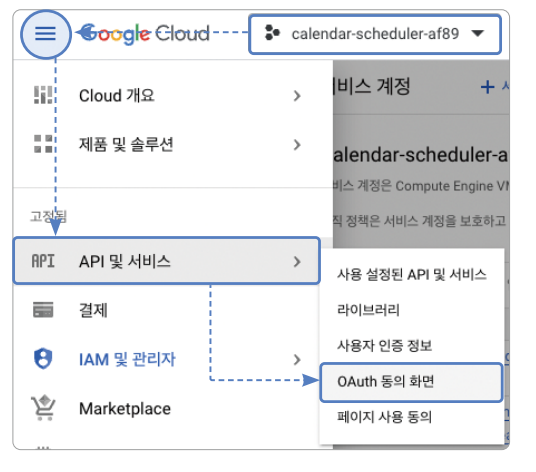  
  
5. 외부 옵션 버튼을 선택하고 만들기 버튼을 누른다.  
  
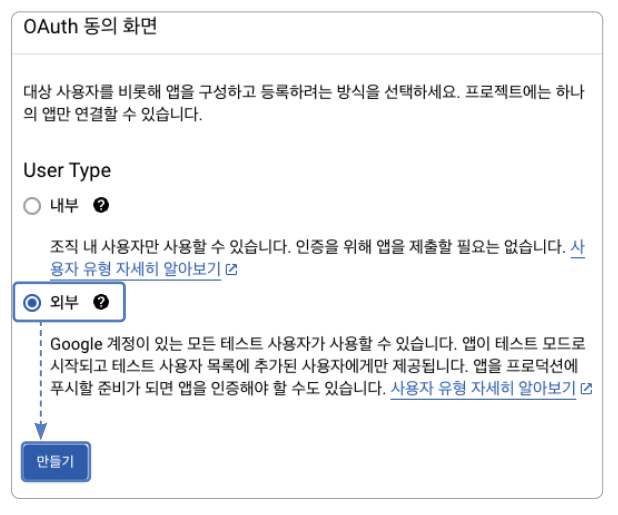  
  
6. 별 표시가 있는 필드는 모두 입력을 한 다음 저장 후 계속 버튼을 누른다.  
  
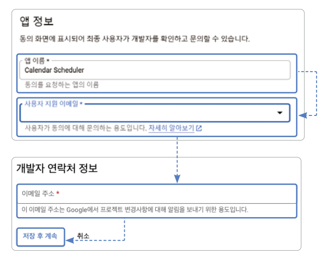  
  
7. 범위 추가 또는 삭제 버튼을 클릭한다.  
  
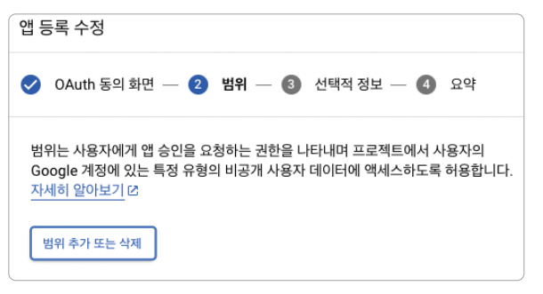  
  
8. 맨 위 세 개의 API는 구글 계정과 관련된 것으로 모두 선택해준다. 만약 로그인을 한 후 관련된 다른 정보도 받고 싶다면 
다른 API도 선태해 추가하면 된다. 다음으로 아래에 있는 업데이트 버튼을 눌러준다. 아래로 스크롤해서 저장 후 계속 버튼을 
눌러준다.  
  
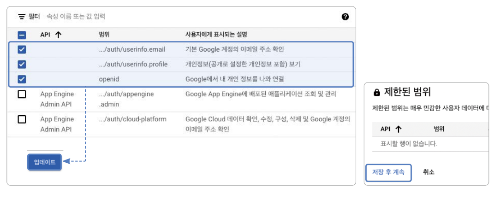  
  
9. 이어서 나온 화면에서도 저장 후 계속 버튼을 눌러 진행하고 모든 단계가 확인되면 설정 완료다. 모든 단계가 파란색으로 
채워지면 설정 완료다. 대시보드로 돌아가기를 눌러 마무리한다.  
  
# **파이어베이스 연동하기**  
안드로이드에서 구글 로그인을 진행하려면 플러터 프로젝트와 파이어베이스 프로젝트를 연동해야 한다. 20장 파이어베이스 CLI 설치 
및 연동하기에서 진행했던 것처럼 CLI 설치를 진행해야 한다. 그러고 나서 프로젝트에 파이어베이스 설정하기에서 진행했던 것처럼 
플러터 프로젝트를 파이어베이스 프로젝트와 연동해주면 된다. 만약에 20장 전체를 모두 잘 따라했다면 플러터 프로젝트 위치에서 
flutterfire configure를 터미널에서 실행한 후 플러터 프로젝트와 파이어베이스 프로젝트의 연동만 해주면 된다.  
  
# **파이어베이스 인증 설정하기**  
다수의 소셜 로그인을 연동하려면 소셜 로그인 프로바이더가 제공하는 인증 서비스를 따로 사용하는게 서비스 개발에 매우 유리하다. 
파이어베이스 인증 연동을 위해 파이어베이스 인증을 활성화한다.  
  
1. 파이어베이스 콘솔(https://console.firebase.google.com)로 접속해서 플러터 프로젝트와 연동되어 있는 프로젝트를 
선택한다.  
  
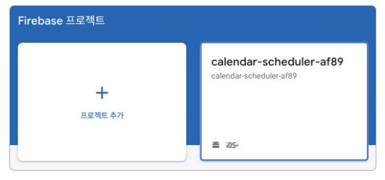  
  
2. 왼쪽 사이드바에 빌드 -> Authentication -> 시작하기를 눌러서 파이어베이스 인증 서비스를 활성화해준다. 만약 이전에 
파이어베이스 인증을 활성화한 이력이 있다면 이 화면이 나오지 않고 다음 화면이 나올 수 있다.  
  
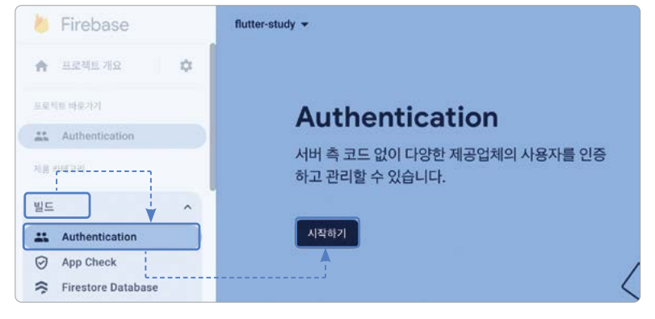  
  
3. Sign-in method -> Google을 눌러서 구글 로그인 설정을 진행한다.  
  
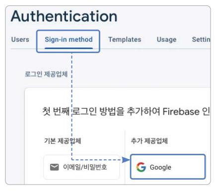  
  
4. 사용 설정 -> 저장 버튼을 누르면 설정이 완료된다. 앞으로 다른 소셜 로그인 기능이 필요할 경우 파이어베이스 인증에 소셜 
로그인 연동을 추가하고 파이어베이스 인증의 문서를 따라 설정하면 된다.  
  
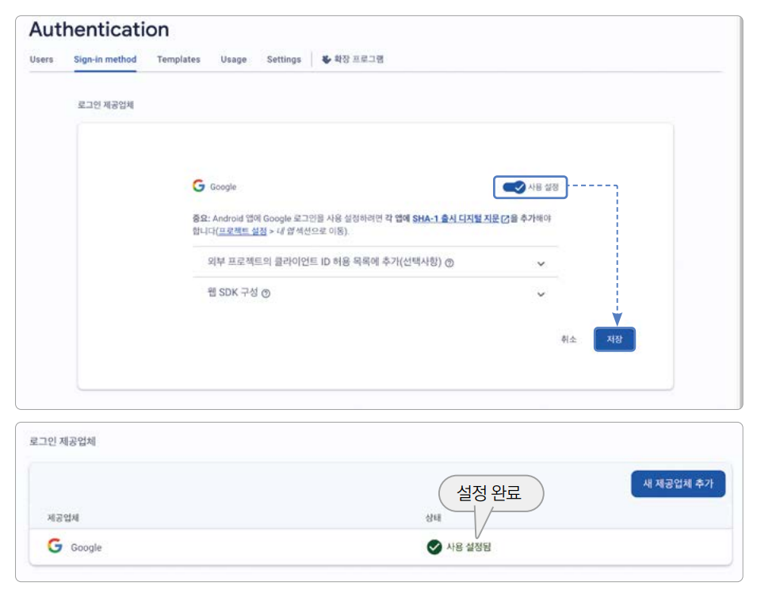  
  
5. 파이어베이스 인증은 디지털 지문 등록을 요구하는 서비스 중 하나이다. 파이어베이스 인증을 사용하기 위해 Debug SHA-1을 
등록한다. 실제 프로덕션 환경에서도 사용하고 싶다면 Release SHA-1도 등록해주면 된다. 파이어베이스 프로젝트 선택 후 세팅 
-> 프로젝트 설정 -> 내 안드로이드 앱 -> 디지털 지문 추가 버튼을 누른다.  
  
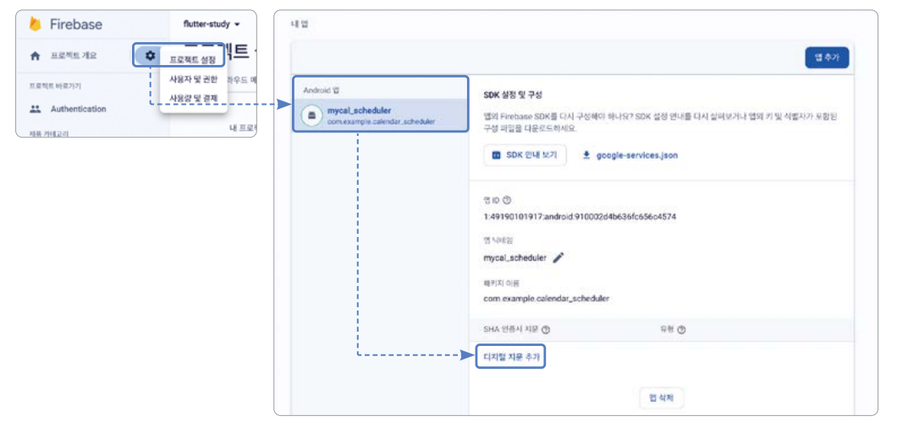  
  
6. 그다음 Singing Report 가져오기에서 저장해두었던 SHA-1 Debug 디지털 지문을 붙여넣는다. 마지막으로 저장 버튼을 누른다.  
  
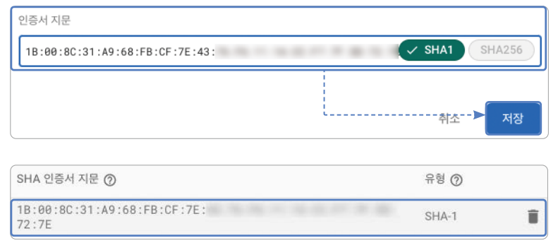  
  
# **iOS 네이티브 설정하기**  
안드로이드의 경우 20장 파이어베이스 연동하기의 사전 준비에서 진행했던 대로 파이어베이스 프로젝트와 플러터 프로젝트를 
연동하기만 하면 안드로이드 네이티브 설정은 추가적으로 해야할 게 없다. 하지만 iOS의 경우 Info.plist 파일을 수정해야 한다.  
  
1. ios/Runner/GoogleService-Info.plist 파일을 열고 REVERSED_CLIENT_ID 값을 찾는다. GoogleService-Info.plist 파일은 
파이어베이스 기능 설정을 했던 것처럼 파이어베이스 프로젝트와 플러터 프로젝트를 연동하면 자동으로 생성되는 파일이다. 
GoogleService-Info.plist 파일에서 RESERVED_CLIENT_ID 키에 해당되는 값을 복사한다. <string> 태그로 감싸진 값을 
복사하면 된다.  
  
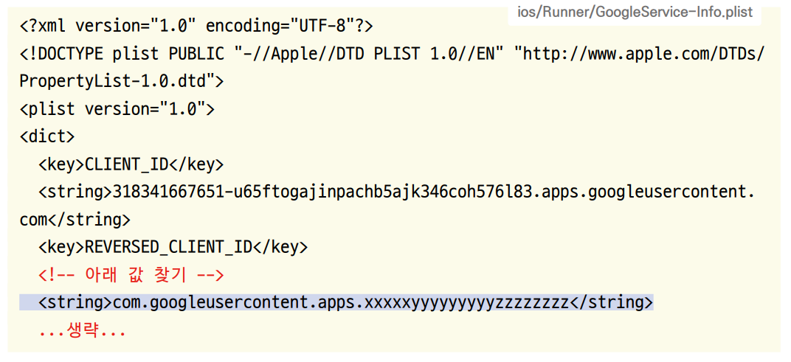  
  
2. 복사한 값을 ios/Runner/Info.plist 파일을 열어 맨 아래에 CFBundleURLTypes 값과 함께 추가해준다.  
  
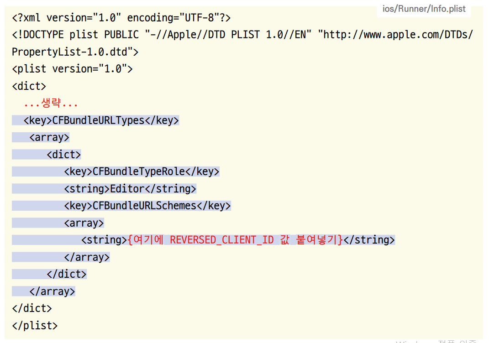  
  

