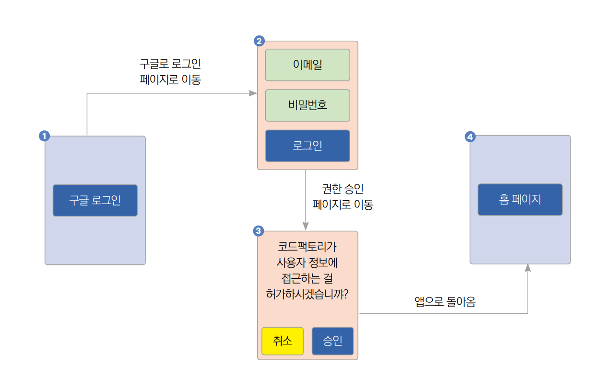

# **소셜 로그인과 파이어베이스 인증하기 (소셜 로그인, OAuth 2.0, 파이어베이스 인증, 구글 로그인 세팅)**
# **사전 지식**  
# **소셜 로그인과 OAuth 2.0**  
현대 앱 개발에서 소셜 로그인은 더 이상 빼놓을 수 없는 기능 중 하나다. 사용자에게 간단함과 편리함을 주기 떄문이다. 소셜 
로그인의 예로 앱에서 흔히 볼 수 있는 구글 로그인, 애플 로그인 등이 있다.  
  
# **소셜 로그인을 사용하면 얻을 수 있는 이점**  
소셜 로그인을 사용하면 다양한 이점이 있다. 첫 번째는 사용자가 서비스별로 다른 비밀번호를 기억해야 하는 번거로움을 줄일 
수 있고 복잡한 회원가입 절차를 간소화할 수 있다. 두 번째는 다른 서비스와 계정 정보를 연동하므로 악의적인 사용자의 가짜 
계정 생성을 어렵게 할 수 있다. 세 번째로 직접적인 인증을 진행하지 않으며 비밀번호 관리를 서비스 개발자가 직접하지 않으므로 
리소스를 절약할 수 있다. 마지막으로 간소한 사용자 인증 절차 덕분에 앱의 사용자 경험을 증진시킬 수 있다.  
  
소셜 로그인을 진행하려면 소셜 로그인 프로바이더에 앱을 등록해야 한다. 앱을 등록할 때 앱의 정보와 함께 리다리엑트 URL을 
등록한다. 리다이렉트 URL은 소셜 로그인 프로바이더에서 사용자 인증이 끝난 후 인증 코드를 반환할 URL이다. 앱의 경우 앱 스킴을 
사용하여 앱으로 다시 돌아오게 할 수 있다. URL 스킴을 사용하면 앱과 앱 사이의 이동이 쉬워진다. 앱을 등록하면 클라이언트 ID와 
클라이언트 Secret을 배정받는다. 이 값을 이용해서 소셜 로그인 프로바이더에 인증 요청을 할 수 있다.  
  
# **소셜 로그인 진행 방식 알아보기**  
다음 그림에서 소셜 로그인의 진행 방식을 알아본다. 구글 로그인을 진행한다는 가정하에 진행한다. 다른 소셜 로그인 프로바이더를 
사용해도 내부 구성은 OAuth 2.0이므로 로직은 같다.  
  
  
  
사용자가 구글로 로그인 버튼을 누르면 소셜 로그인이 시작된다. 구글 로그인 요청이 생기면 앱은 클라이언트 ID와 리다이렉트 URL, 
요청할 스코프를 구글 서버에 전송한다. 그러면 구글 서버는 구글 로그인 창을 실행한다. 만약에 이미 로그인이 되어 있다면 
로그인이 된 계정을 선택할 수 있는 창이 실행된다. 앱이 사용자의 정보에 접근하는 걸 사용자가 허가해주면 리다이렉트 URL 
또는 앱으로 인증 코드가 전송된다. 구글 서버의 토큰 발급 URL로 인증 코드, 클라이언트 ID, 클라이언트 Secret을 보내면 
액세스 토큰을 발급받을 수 있다. 액세스 토큰을 사용하면 구글 서버로부터 허가된 사용자 정보를 받아올 수 있다.  
  
요청할 스코프는 받고 싶은 사용자의 정보와 권한의 레벨을 정의하는 값이다.  
  

