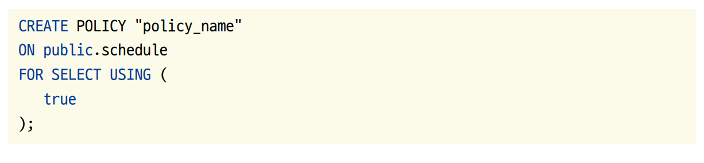
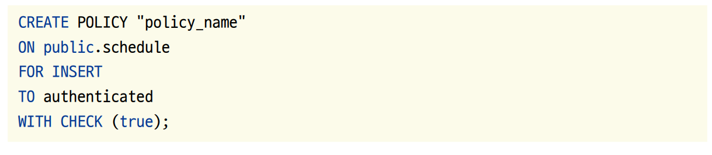
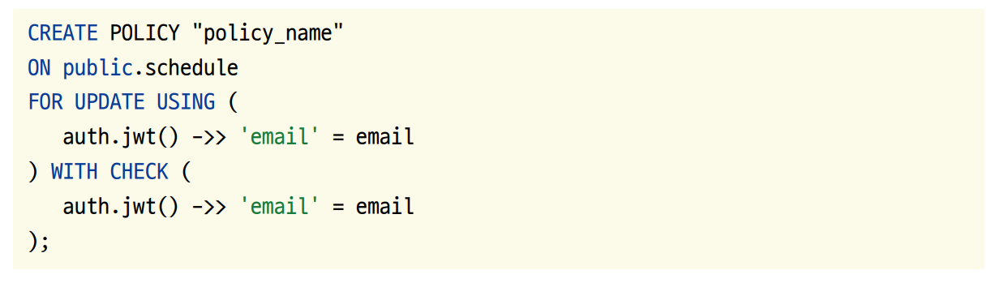
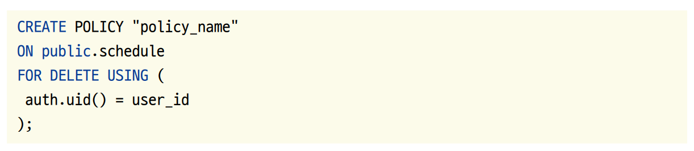
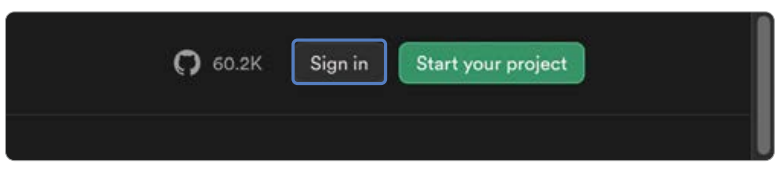
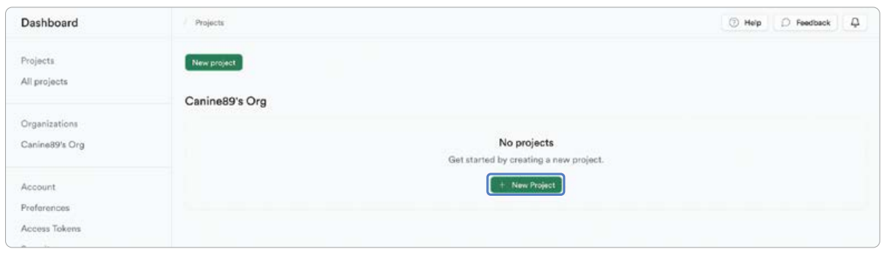
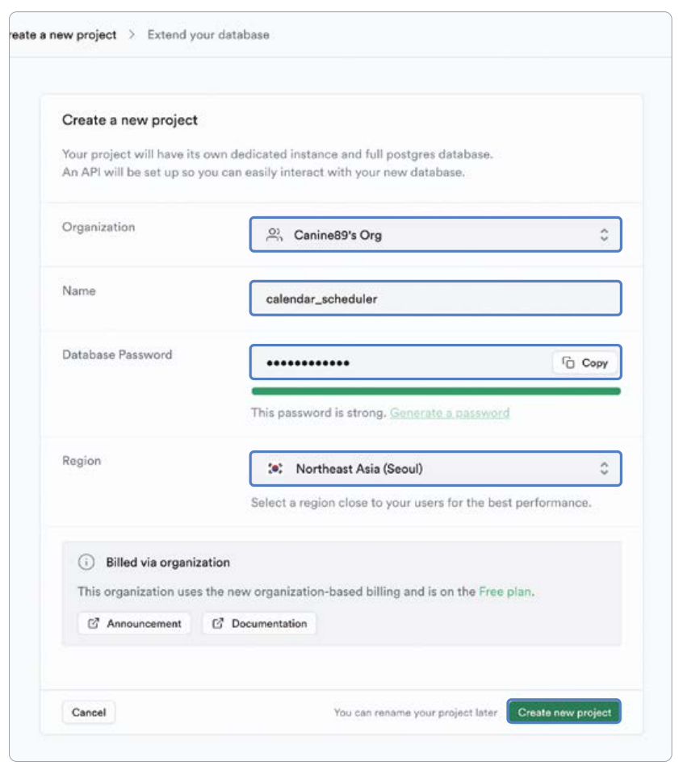
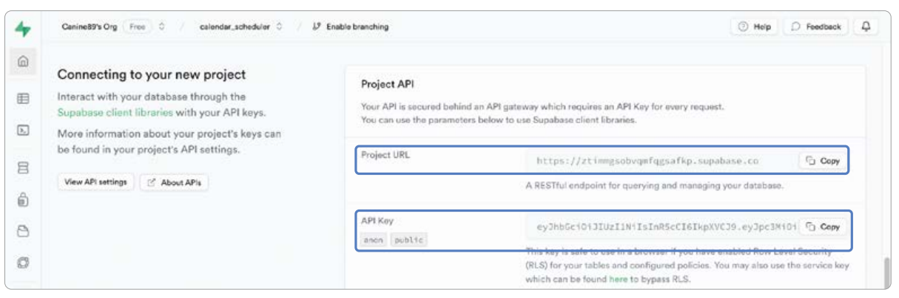
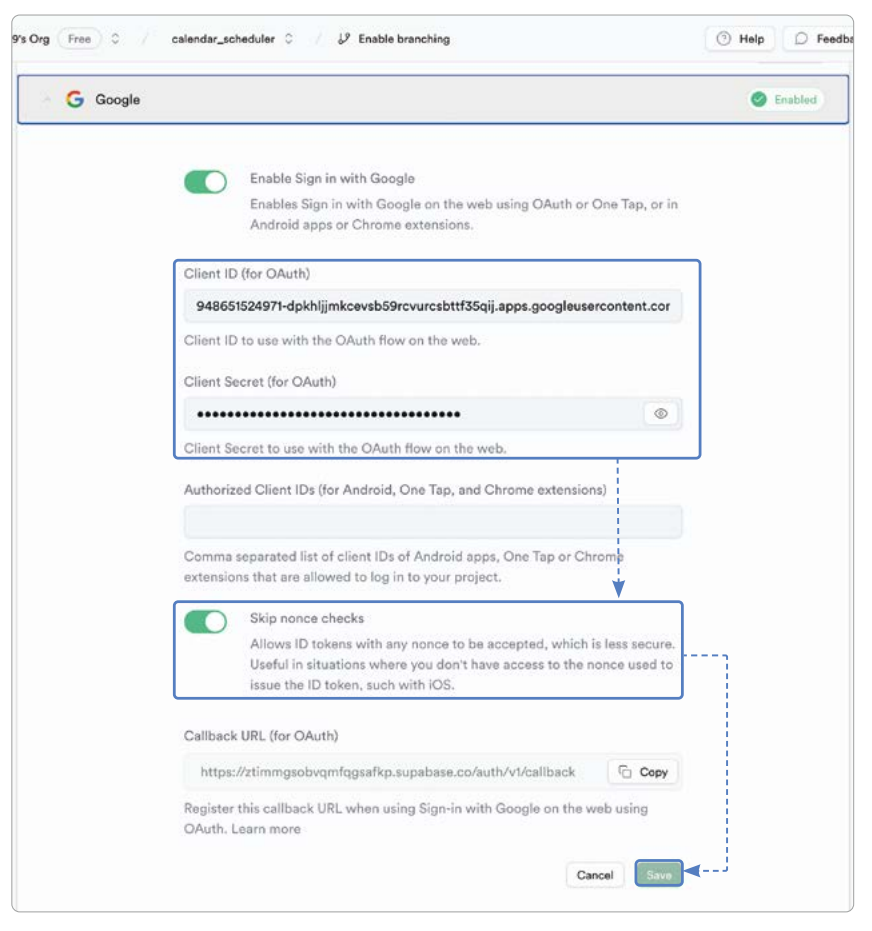
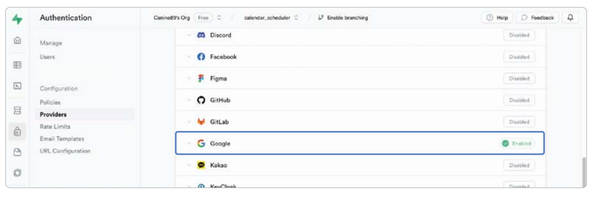

# **슈파베이스 연동하기 (행 수준 보안, 슈파베이스 인증, 연동)**  
슈파베이스(supabase)는 모바일 및 웹 애플리케이션 개발 플랫폼을 빠르게 개발할 수 있는 백엔드 서비스이다. 파이어베이스와 
마찬가지로 백엔드를 직접 설계하지 않고 슈파베이스 SDK로 다양한 백엔드 기능을 사용할 수 있다.  
  
# **사전 지식**  
# **슈파베이스란?**  
앱 개발의 오랜 역사 동안 올인원 백엔드 서비스라고 하면 파이어베이스가 가장 대표적인 서비스였다. 하지만 세계에서 가장 
유명한 스타트업 인큐베이터 중 하나인 와이 콤비네이터(Y combinator)에 2020년 슈파베이스 팀이 합류하면서 큰 변화를 
이끌고 있다. 슈파베이스는 인증, 데이터베이스, 실시간 구독 등 파이어베이스의 주요 기능을 대체할 수 있는 서비스를 출시하며 
그 사업성을 인정받았다.  
  
# **관계형 데이터베이스 기반인 슈파베이스**  
슈파베이스는 파이어베이스의 대안이라고 마케팅하고 있는 올인원 서버리스(all-in-one serverless) 백엔드 솔루션이다. 
NoSQL 기반인 파이어베이스의 파이어스토어와 다르게 슈파베이스는 프로그래밍 업계에서 가장 많이 사용하는 SQL 데이터베이스 
중 하나인 PostgreSQL을 사용한다. PostgreSQL은 관계형 데이터베이스로 데이터를 정규화해 관리하기 편하다. 슈파베이스를 
사용하다가 직접 SQL 데이터베이스를 운영하고 싶어하는 사용자도 많기 때문에 슈파베이스가 PostgreSQL 데이터베이스를 
사용한다는건 큰 인기의 비결 중 하나다.  
  
# **슈파베이스의 신념**  
슈파베이스는 파이어베이스의 주요 기능들을 대체할 수 있는 서비스를 제공하고 있으며 서비스의 종류는 다음 표에서 확인할 
수 있다.  
  
  
  
# **행 수준 보안**  
행 수준 보안(row level security, 이하 RLS)은 PostgreSQL의 강력한 보안 도구 중 하나이다. PostgreSQL을 사용하는 
슈파베이스에서도 RLS는 보안을 설정하는 가장 중요한 기술 중 하나이다. RLS를 사용하면 CRUD 작업을 진행할 떄 사용자별로 
실행할 수 있는 작업을 제한할 수 있다. 예를 들어 일정을 수정하거나 삭제하는 기능은 일정을 생성한 사용자만 할 수 있도록 
제한할 수 있다.  
  
# **PostgreSQL Policy 문법: 기본**  
  
  
RLS Policy를 생성할 때 필수 코드는 CREATE POLICY {name} on {table_name}이다. 나머지 조건은 필요에 따라 추가하면 된다. 
{name}에는 Policy의 이름을 입력하면 되고 {table_name}에는 Policy를 적용할 테이블의 이름을 입력하면 된다. 다음은 각 
Policy에 대한 설명이다.  
  
# **다수의 Policy 적용 시 권한 적용 설정**  
PERMISSIVE와 RESTRICTIVE는 다수의 Policy가 같이 적용되는 상황에 OR 조건을 사용할지 AND 조건을 사용할지 결정하는 
값이다. PREMISSIVE는 어느 쪽이든 하나의 Policy만 충족하면 되는 OR 조건을 사용하게 되고 RESTRICTIVE는 비교적 제한적으로 
모든 Policy가 충족되어야 하는 AND 조건을 사용하게 된다. 만약 PERMISSIVE와 RESTRICTIVE Policy가 모두 존재한다면 
각각 최소 하나의 Policy가 통과돼야만 쿠리 실행이 허가된다.  
  
# **적용할 CRUD 기능 설정**  
Policy를 적용할 CRUD 기능이다. SQL에서 실행 가능한 CRUD 기능인 SELECT, INSERT, UPDATE, DELETE 모두 입력 가능하며
ALL 입력 시 모든 기능에서 Policy가 적용된다.  
  
# **적용할 대상 설정**  
Policy를 적용할 대상을 정한다. PostgreSQL에서 제공되는 데이터베이스 관련 권한들을 특정 이름으로 모아 놓은 Role을 
입력하면 되며 기본값은 모두에게 적용되는 PUBLIC이다.  
  
# **쿼리를 실행할 떄 조회 가능 여부를 판단하는 설정**  
쿼리를 실행할 때 조회 가능한 Row를 판단하는 조건을 입력한다. 일반 SQL문을 입력할 수 있으며 Boolean인 참, 거짓 값을 
반환하는 조건을 입력해야 한다.  
  
# **INSERT나 DELETE문을 실행할 때 실행할 조건 확인**  
데이터를 새로 생성하거나 삭제할 때 허가할지 결정하는 조건문이다. 일반 SQL문을 입력할 수 있으며 Boolean을 반환하는 조건을 
입력해야 한다. Using문과 다르게 새로 생성 또는 변경될 예정인 데이터에 적용된다.  
  
# **PostgreSQL Policy 문법: 누구나 데이터를 읽을 수 있는 권한 예제**  
USING(true)를 입력하면 어떤 상황에서도 조회가 허가되는 조건을 구현할 수 있다.  
  
  
  
# **PostgreSQL Policy 문법: 인증된 사용자만 데이터를 생성할 수 있는 권한 예제**  
슈파베이스는 authenticated라는 인증된 사용자에게만 부여되는 Role이 있다. TOauthenticated를 입력하면 인증된 사용자에게만 
특정 Policy를 부여할 수 있다.  
  
  
  
# **PostgreSQL Policy 문법: 이메일에 따라 데이터를 업데이트할 수 있는 권한 예제**  
슈파베이스에서 auth.jwt() 함수를 실행하면 JWT 정보를 가져올 수 있다. auth.jwt() ->> 'email'을 실행하면 현재 로그인한 
사용자의 액세스 토큰에서 이메일 정보를 추출한다. 다음 예제는 테이블 email 컬럼에 데이터를 생성한 사용자의 이메일이 
입력되는 걸 가정한다.  
  
  
  
# **PostgreSQL Policy 문법: 생성자만 데이터를 삭제할 수 있는 권한 예제**  
다음 예제는 테이블 user_id 컬럼에 데이터를 생성한 사용자의 ID가 입력되는 걸 가정한다.  
  
  
  
# **슈파베이스 인증**  
슈파베이스 인증에서 구글 로그인을 사용하려면 22장 OAuth 설정하기와 파이어베이스 인증 설정하기에서 진행한 것과 같이 
파이어베이스 설정을 동일하게 해야 한다. 왜냐하면 구글 로그인은 기본적으로 파이어베이스 인증을 통해서 진행할 수 있도록 
제작되어 있기 때문이다.  
  
구글 로그인을 위해 파이어베이스 인증을 추가하지만 파이어베이스 인증이나 파이어스토어같은 파이어베이스 서비스는 이 
프로젝트에서 사용하지 않는다.  
  
# **사전 준비**
# **템플릿 프로젝트 다운로드**  
22장 소셜 로그인과 파이어베이스 인증하기에서 구현했던 로직을 그대로 슈파베이스로 변경해서 구현하는 방식으로 진행한다.  
  
# **슈파베이스 회원가입**  
슈파베이스를 프로젝트에 적용하기 위해 슈파베이스 사이트에서 회원가입을 진행하고 대시보드 페이지로 이동해야 한다.  
  
1. https://supabase.com에 접속해서 오른쪽 위의 Sign In 버튼을 누르고 Sign Up Now 버튼을 누르고 회원가입을 진행한다. 
깃허브 계정이 있으면 Continue with GitHub 버튼을 누르면 빠르게 회원가입을 할 수 있다.  
  
  
  
2. 회원가입을 하면 이동되는 화면이 대시보드이다. 앞으로 이 화면을 슈파베이스 대시보드라고 칭한다. 슈파베이스 대시보드에서 
중앙의 New project 버튼을 누른다.  
  
  
  
3. 프로젝트 이름을 calendar_scheduler로 설정하고 데이터베이스 비밀번호를 입력한다. Region은 Northeast Asia(Seoul)을 
선택한다. 마지막으로 Create new project 버튼을 누르면 프로젝트 생성이 진행된다.  
  
  
  
4. 프로젝트가 생성될 때까지 대기한 후 아래로 스크롤해서 Connecting to your new project 섹션을 찾는다. Project URL과 
API Key의 Copy 버튼을 누른 후 Project URL과 API Key를 안전한 곳에 저장해둔다.  
  
혹시 화면이 똑같이 보이지 않으면 새로고침을 누른다. Setting Up Your Project라는 알림과 함께 로딩이 진행된다면 프로젝트가 
생성될 때까지 대기해야 한다.  
  
  
  
# **슈파베이스 인증 설정하기**  
슈파베이스 인증(supabase auth) 또한 파이어베이스 인증과 같이 다양한 인증 방법을 제공한다. 이번 프로젝트도 파이어베이스를 
사용할 때 했던 방법처럼 구글 로그인을 사용할 계획이니 구글 로그인 설정을 진행한다. 이메일 회원가입/로그인은 기본으로 활성화되어 
있고 다른 소셜 로그인을 사용하고 싶다면 입력이 필요한 값은 다르지만 구글 로그인 설정과 같은 방식으로 슈파베이스에 활성화를 
해주면 된다.  
  
1. 슈파베이스 대시보드로 이동한 후 Authentication -> Providers를 클릭한다. 아래로 스크롤해서 구글 프로바이더를 찾은 
후 클릭해서 옵션을 펼친다. 그다음 Enable Sign in with Google 버튼을 눌러서 활성화한 후 맨 아래의 Callback URL을 복사한다.  
  
  
  
2. OAuth 설정하기에서 진행했던 것처럼 파이어베이스 프로젝트와 연결된 구글 클라우드 콘솔로 이동한 후 메뉴 -> API 및 서비스 
-> 사용자 인증 정보로 이동한다. 22장에서 OAuth 설정하기를 잘 진행했다면 OAuth 2.0 클라이언트 ID에 Android Client, 
iOS Client, Web Client 세 개의 클라이언트 ID를 찾을 수 있다. Web client의 Client ID만 복사한다.  
  
  
  
3. 다시 슈파베이스 Authentication -> Providers 창으로 돌아와서 복사해둔 Web 클라이언트 ID와 클라이언트 Secret을 
입력해준다. 클라이언트 Secret은 Web client를 누르면 상세 페이지에서 볼 수 있다. 그리고 Skip nonce checks 버튼을 클릭해서 
활성화해준다. Nonce Check는 보안을 강화하는 기능이지만 iOS의 경우 Nonce Check가 불가능하기 떄문에 활성화가 필요한다. 
모두 입력이 끝나면 Save 버튼을 눌러서 저장한다.  
  
iOS 클라이언트 ID는 나중에 플러터 코드를 작성할 때 사용한다. Setting Up Your Project라는 알림과 함께 로딩이 진행된다면 
프로젝트가 생성될 때까지 대기해야 한다.  
  
  
  
4. 구글 로그인이 Enabled 상태가 되면 활성화 완료다.  
  
  
  
# **pubspec.yaml 파일 설정하기**  
1. 슈파베이스 플러그인을 pubspec.yaml에 추가한다. 추가 후에는 반드시 pub get을 눌러 업데이트 한다.  
  
pubspec.yaml 참고  
  
# **파이어베이스 연동하기**  
안드로이드에서 구글 로그인을 진행하려면 플러터 프로젝트와 파이어베이스 프로젝트를 연동해야 한다. 20장 파이어베이스 CLI 설치 
및 연동하기에서 진행했던 것처럼 CLI 설치를 진행한다. 그리고 나서 20장 프로젝트에 파이어베이스 설정하기에서 진행했던 것처럼 
플러터 프로젝트를 파이어베이스 프로젝트와 연동해주면 된다. 20장 전체를 모두 잘 따라했다면 플러터 프로젝트 위치에서 
flutterfire configure를 터미널에서 실행한 후 플러터 프로젝트와 파이어베이스 프로젝트를 연동한 다음 22장 iOS 네이티브 
설정하기 진행을 완료한다.  
  
# **레이아웃 구상하기**  
모든 UI는 22장 소셜 로그인과 파이어베이스 인증하기와 동일하게 진행하도록 한다.  
  
