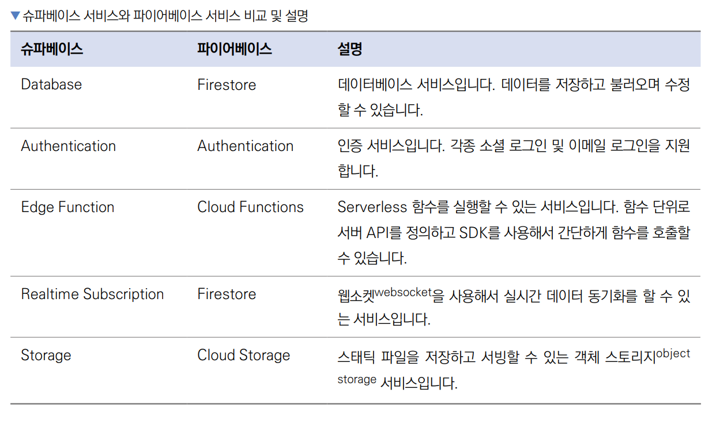
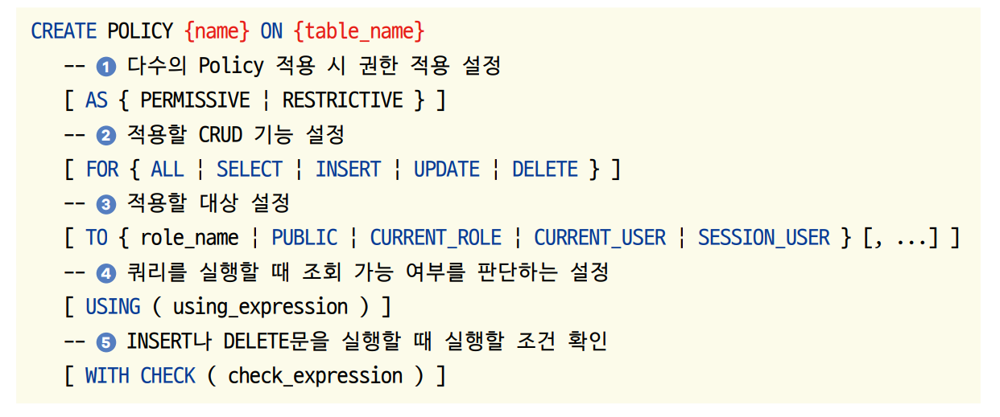

# **슈파베이스 연동하기 (행 수준 보안, 슈파베이스 인증, 연동)**  
슈파베이스(supabase)는 모바일 및 웹 애플리케이션 개발 플랫폼을 빠르게 개발할 수 있는 백엔드 서비스이다. 파이어베이스와 
마찬가지로 백엔드를 직접 설계하지 않고 슈파베이스 SDK로 다양한 백엔드 기능을 사용할 수 있다.  
  
# **사전 지식**  
# **슈파베이스란?**  
앱 개발의 오랜 역사 동안 올인원 백엔드 서비스라고 하면 파이어베이스가 가장 대표적인 서비스였다. 하지만 세계에서 가장 
유명한 스타트업 인큐베이터 중 하나인 와이 콤비네이터(Y combinator)에 2020년 슈파베이스 팀이 합류하면서 큰 변화를 
이끌고 있다. 슈파베이스는 인증, 데이터베이스, 실시간 구독 등 파이어베이스의 주요 기능을 대체할 수 있는 서비스를 출시하며 
그 사업성을 인정받았다.  
  
# **관계형 데이터베이스 기반인 슈파베이스**  
슈파베이스는 파이어베이스의 대안이라고 마케팅하고 있는 올인원 서버리스(all-in-one serverless) 백엔드 솔루션이다. 
NoSQL 기반인 파이어베이스의 파이어스토어와 다르게 슈파베이스는 프로그래밍 업계에서 가장 많이 사용하는 SQL 데이터베이스 
중 하나인 PostgreSQL을 사용한다. PostgreSQL은 관계형 데이터베이스로 데이터를 정규화해 관리하기 편하다. 슈파베이스를 
사용하다가 직접 SQL 데이터베이스를 운영하고 싶어하는 사용자도 많기 때문에 슈파베이스가 PostgreSQL 데이터베이스를 
사용한다는건 큰 인기의 비결 중 하나다.  
  
# **슈파베이스의 신념**  
슈파베이스는 파이어베이스의 주요 기능들을 대체할 수 있는 서비스를 제공하고 있으며 서비스의 종류는 다음 표에서 확인할 
수 있다.  
  
  
  
# **행 수준 보안**  
행 수준 보안(row level security, 이하 RLS)은 PostgreSQL의 강력한 보안 도구 중 하나이다. PostgreSQL을 사용하는 
슈파베이스에서도 RLS는 보안을 설정하는 가장 중요한 기술 중 하나이다. RLS를 사용하면 CRUD 작업을 진행할 떄 사용자별로 
실행할 수 있는 작업을 제한할 수 있다. 예를 들어 일정을 수정하거나 삭제하는 기능은 일정을 생성한 사용자만 할 수 있도록 
제한할 수 있다.  
  
# **PostgreSQL Policy 문법: 기본**  
  
  
RLS Policy를 생성할 때 필수 코드는 CREATE POLICY {name} on {table_name}이다. 나머지 조건은 필요에 따라 추가하면 된다. 
{name}에는 Policy의 이름을 입력하면 되고 {table_name}에는 Policy를 적용할 테이블의 이름을 입력하면 된다. 다음은 각 
Policy에 대한 설명이다.  
  
# **다수의 Policy 적용 시 권한 적용 설정**  
PERMISSIVE와 RESTRICTIVE는 다수의 Policy가 같이 적용되는 상황에 OR 조건을 사용할지 AND 조건을 사용할지 결정하는 
값이다. PREMISSIVE는 어느 쪽이든 하나의 Policy만 충족하면 되는 OR 조건을 사용하게 되고 RESTRICTIVE는 비교적 제한적으로 
모든 Policy가 충족되어야 하는 AND 조건을 사용하게 된다. 만약 PERMISSIVE와 RESTRICTIVE Policy가 모두 존재한다면 
각각 최소 하나의 Policy가 통과돼야만 쿠리 실행이 허가된다.  
  
