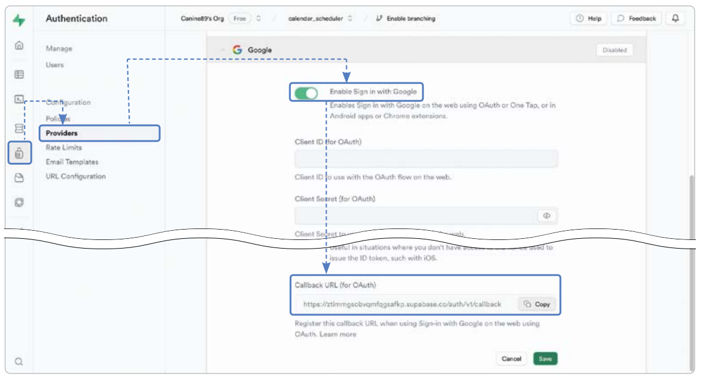
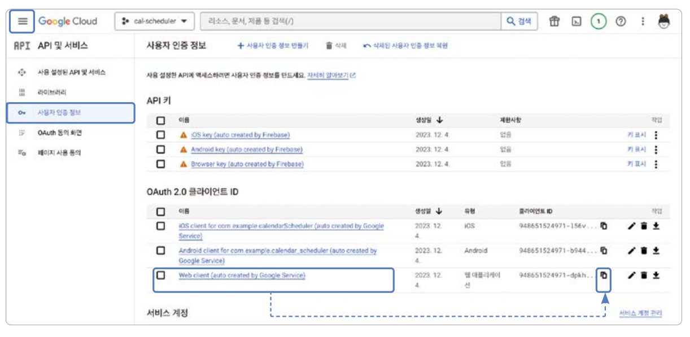

# **슈파베이스 연동하기 (행 수준 보안, 슈파베이스 인증, 연동)**  
슈파베이스(supabase)는 모바일 및 웹 애플리케이션 개발 플랫폼을 빠르게 개발할 수 있는 백엔드 서비스이다. 파이어베이스와 
마찬가지로 백엔드를 직접 설계하지 않고 슈파베이스 SDK로 다양한 백엔드 기능을 사용할 수 있다.  
  
# **사전 지식**  
# **슈파베이스란?**  
앱 개발의 오랜 역사 동안 올인원 백엔드 서비스라고 하면 파이어베이스가 가장 대표적인 서비스였다. 하지만 세계에서 가장 
유명한 스타트업 인큐베이터 중 하나인 와이 콤비네이터(Y combinator)에 2020년 슈파베이스 팀이 합류하면서 큰 변화를 
이끌고 있다. 슈파베이스는 인증, 데이터베이스, 실시간 구독 등 파이어베이스의 주요 기능을 대체할 수 있는 서비스를 출시하며 
그 사업성을 인정받았다.  
  
# **관계형 데이터베이스 기반인 슈파베이스**  
슈파베이스는 파이어베이스의 대안이라고 마케팅하고 있는 올인원 서버리스(all-in-one serverless) 백엔드 솔루션이다. 
NoSQL 기반인 파이어베이스의 파이어스토어와 다르게 슈파베이스는 프로그래밍 업계에서 가장 많이 사용하는 SQL 데이터베이스 
중 하나인 PostgreSQL을 사용한다. PostgreSQL은 관계형 데이터베이스로 데이터를 정규화해 관리하기 편하다. 슈파베이스를 
사용하다가 직접 SQL 데이터베이스를 운영하고 싶어하는 사용자도 많기 때문에 슈파베이스가 PostgreSQL 데이터베이스를 
사용한다는건 큰 인기의 비결 중 하나다.  
  
# **슈파베이스의 신념**  
슈파베이스는 파이어베이스의 주요 기능들을 대체할 수 있는 서비스를 제공하고 있으며 서비스의 종류는 다음 표에서 확인할 
수 있다.  
  
  
  
# **행 수준 보안**  
행 수준 보안(row level security, 이하 RLS)은 PostgreSQL의 강력한 보안 도구 중 하나이다. PostgreSQL을 사용하는 
슈파베이스에서도 RLS는 보안을 설정하는 가장 중요한 기술 중 하나이다. RLS를 사용하면 CRUD 작업을 진행할 떄 사용자별로 
실행할 수 있는 작업을 제한할 수 있다. 예를 들어 일정을 수정하거나 삭제하는 기능은 일정을 생성한 사용자만 할 수 있도록 
제한할 수 있다.  
  
# **PostgreSQL Policy 문법: 기본**  
  
  
RLS Policy를 생성할 때 필수 코드는 CREATE POLICY {name} on {table_name}이다. 나머지 조건은 필요에 따라 추가하면 된다. 
{name}에는 Policy의 이름을 입력하면 되고 {table_name}에는 Policy를 적용할 테이블의 이름을 입력하면 된다. 다음은 각 
Policy에 대한 설명이다.  
  
# **다수의 Policy 적용 시 권한 적용 설정**  
PERMISSIVE와 RESTRICTIVE는 다수의 Policy가 같이 적용되는 상황에 OR 조건을 사용할지 AND 조건을 사용할지 결정하는 
값이다. PREMISSIVE는 어느 쪽이든 하나의 Policy만 충족하면 되는 OR 조건을 사용하게 되고 RESTRICTIVE는 비교적 제한적으로 
모든 Policy가 충족되어야 하는 AND 조건을 사용하게 된다. 만약 PERMISSIVE와 RESTRICTIVE Policy가 모두 존재한다면 
각각 최소 하나의 Policy가 통과돼야만 쿠리 실행이 허가된다.  
  
# **적용할 CRUD 기능 설정**  
Policy를 적용할 CRUD 기능이다. SQL에서 실행 가능한 CRUD 기능인 SELECT, INSERT, UPDATE, DELETE 모두 입력 가능하며
ALL 입력 시 모든 기능에서 Policy가 적용된다.  
  
# **적용할 대상 설정**  
Policy를 적용할 대상을 정한다. PostgreSQL에서 제공되는 데이터베이스 관련 권한들을 특정 이름으로 모아 놓은 Role을 
입력하면 되며 기본값은 모두에게 적용되는 PUBLIC이다.  
  
# **쿼리를 실행할 떄 조회 가능 여부를 판단하는 설정**  
쿼리를 실행할 때 조회 가능한 Row를 판단하는 조건을 입력한다. 일반 SQL문을 입력할 수 있으며 Boolean인 참, 거짓 값을 
반환하는 조건을 입력해야 한다.  
  
# **INSERT나 DELETE문을 실행할 때 실행할 조건 확인**  
데이터를 새로 생성하거나 삭제할 때 허가할지 결정하는 조건문이다. 일반 SQL문을 입력할 수 있으며 Boolean을 반환하는 조건을 
입력해야 한다. Using문과 다르게 새로 생성 또는 변경될 예정인 데이터에 적용된다.  
  
# **PostgreSQL Policy 문법: 누구나 데이터를 읽을 수 있는 권한 예제**  
USING(true)를 입력하면 어떤 상황에서도 조회가 허가되는 조건을 구현할 수 있다.  
  
  
  
# **PostgreSQL Policy 문법: 인증된 사용자만 데이터를 생성할 수 있는 권한 예제**  
슈파베이스는 authenticated라는 인증된 사용자에게만 부여되는 Role이 있다. TOauthenticated를 입력하면 인증된 사용자에게만 
특정 Policy를 부여할 수 있다.  
  
  
  
# **PostgreSQL Policy 문법: 이메일에 따라 데이터를 업데이트할 수 있는 권한 예제**  
슈파베이스에서 auth.jwt() 함수를 실행하면 JWT 정보를 가져올 수 있다. auth.jwt() ->> 'email'을 실행하면 현재 로그인한 
사용자의 액세스 토큰에서 이메일 정보를 추출한다. 다음 예제는 테이블 email 컬럼에 데이터를 생성한 사용자의 이메일이 
입력되는 걸 가정한다.  
  
  
  
# **PostgreSQL Policy 문법: 생성자만 데이터를 삭제할 수 있는 권한 예제**  
다음 예제는 테이블 user_id 컬럼에 데이터를 생성한 사용자의 ID가 입력되는 걸 가정한다.  
  
  
  
# **슈파베이스 인증**  
슈파베이스 인증에서 구글 로그인을 사용하려면 22장 OAuth 설정하기와 파이어베이스 인증 설정하기에서 진행한 것과 같이 
파이어베이스 설정을 동일하게 해야 한다. 왜냐하면 구글 로그인은 기본적으로 파이어베이스 인증을 통해서 진행할 수 있도록 
제작되어 있기 때문이다.  
  
구글 로그인을 위해 파이어베이스 인증을 추가하지만 파이어베이스 인증이나 파이어스토어같은 파이어베이스 서비스는 이 
프로젝트에서 사용하지 않는다.  
  
# **사전 준비**
# **템플릿 프로젝트 다운로드**  
22장 소셜 로그인과 파이어베이스 인증하기에서 구현했던 로직을 그대로 슈파베이스로 변경해서 구현하는 방식으로 진행한다.  
  
# **슈파베이스 회원가입**  
슈파베이스를 프로젝트에 적용하기 위해 슈파베이스 사이트에서 회원가입을 진행하고 대시보드 페이지로 이동해야 한다.  
  
1. https://supabase.com에 접속해서 오른쪽 위의 Sign In 버튼을 누르고 Sign Up Now 버튼을 누르고 회원가입을 진행한다. 
깃허브 계정이 있으면 Continue with GitHub 버튼을 누르면 빠르게 회원가입을 할 수 있다.  
  
  
  
2. 회원가입을 하면 이동되는 화면이 대시보드이다. 앞으로 이 화면을 슈파베이스 대시보드라고 칭한다. 슈파베이스 대시보드에서 
중앙의 New project 버튼을 누른다.  
  
  
  
3. 프로젝트 이름을 calendar_scheduler로 설정하고 데이터베이스 비밀번호를 입력한다. Region은 Northeast Asia(Seoul)을 
선택한다. 마지막으로 Create new project 버튼을 누르면 프로젝트 생성이 진행된다.  
  
  
  
4. 프로젝트가 생성될 때까지 대기한 후 아래로 스크롤해서 Connecting to your new project 섹션을 찾는다. Project URL과 
API Key의 Copy 버튼을 누른 후 Project URL과 API Key를 안전한 곳에 저장해둔다.  
  
혹시 화면이 똑같이 보이지 않으면 새로고침을 누른다. Setting Up Your Project라는 알림과 함께 로딩이 진행된다면 프로젝트가 
생성될 때까지 대기해야 한다.  
  
  
  
# **슈파베이스 인증 설정하기**  
슈파베이스 인증(supabase auth) 또한 파이어베이스 인증과 같이 다양한 인증 방법을 제공한다. 이번 프로젝트도 파이어베이스를 
사용할 때 했던 방법처럼 구글 로그인을 사용할 계획이니 구글 로그인 설정을 진행한다. 이메일 회원가입/로그인은 기본으로 활성화되어 
있고 다른 소셜 로그인을 사용하고 싶다면 입력이 필요한 값은 다르지만 구글 로그인 설정과 같은 방식으로 슈파베이스에 활성화를 
해주면 된다.  
  
1. 슈파베이스 대시보드로 이동한 후 Authentication -> Providers를 클릭한다. 아래로 스크롤해서 구글 프로바이더를 찾은 
후 클릭해서 옵션을 펼친다. 그다음 Enable Sign in with Google 버튼을 눌러서 활성화한 후 맨 아래의 Callback URL을 복사한다.  
  
  
  
2. OAuth 설정하기에서 진행했던 것처럼 파이어베이스 프로젝트와 연결된 구글 클라우드 콘솔로 이동한 후 메뉴 -> API 및 서비스 
-> 사용자 인증 정보로 이동한다. 22장에서 OAuth 설정하기를 잘 진행했다면 OAuth 2.0 클라이언트 ID에 Android Client, 
iOS Client, Web Client 세 개의 클라이언트 ID를 찾을 수 있다. Web client의 Client ID만 복사한다.  
  
  
  
3. 다시 슈파베이스 Authentication -> Providers 창으로 돌아와서 복사해둔 Web 클라이언트 ID와 클라이언트 Secret을 
입력해준다. 클라이언트 Secret은 Web client를 누르면 상세 페이지에서 볼 수 있다. 그리고 Skip nonce checks 버튼을 클릭해서 
활성화해준다. Nonce Check는 보안을 강화하는 기능이지만 iOS의 경우 Nonce Check가 불가능하기 떄문에 활성화가 필요한다. 
모두 입력이 끝나면 Save 버튼을 눌러서 저장한다.  
  
iOS 클라이언트 ID는 나중에 플러터 코드를 작성할 때 사용한다. Setting Up Your Project라는 알림과 함께 로딩이 진행된다면 
프로젝트가 생성될 때까지 대기해야 한다.  
  
  
  
4. 구글 로그인이 Enabled 상태가 되면 활성화 완료다.  
  
  
  
# **pubspec.yaml 파일 설정하기**  
1. 슈파베이스 플러그인을 pubspec.yaml에 추가한다. 추가 후에는 반드시 pub get을 눌러 업데이트 한다.  
  
pubspec.yaml 참고  
  
# **파이어베이스 연동하기**  
안드로이드에서 구글 로그인을 진행하려면 플러터 프로젝트와 파이어베이스 프로젝트를 연동해야 한다. 20장 파이어베이스 CLI 설치 
및 연동하기에서 진행했던 것처럼 CLI 설치를 진행한다. 그리고 나서 20장 프로젝트에 파이어베이스 설정하기에서 진행했던 것처럼 
플러터 프로젝트를 파이어베이스 프로젝트와 연동해주면 된다. 20장 전체를 모두 잘 따라했다면 플러터 프로젝트 위치에서 
flutterfire configure를 터미널에서 실행한 후 플러터 프로젝트와 파이어베이스 프로젝트를 연동한 다음 22장 iOS 네이티브 
설정하기 진행을 완료한다.  
  
# **레이아웃 구상하기**  
모든 UI는 22장 소셜 로그인과 파이어베이스 인증하기와 동일하게 진행하도록 한다.  
  
# **구현하기**  
# **슈파베이스 세팅하기**  
슈파베이스를 프로젝트에서 사용하려면 프로젝트에 Project URL과 API Key를 등록해줘야 한다.  
  
1. lib/main.dart 파일에 슈파베이스를 초기화해준다. url 파라미터에 슈파베이스 회원가입에서 복사해두었던 Project URL 
값을 입력해주고 anonKey 파라미터에는 API Key 값을 입력해준다.  
  
대시보드에서 Project URL과 anonKey가 보이지 않으면 Settings -> API 화면을 참고한다.  
  
lib -> main.dart  
  
# **슈파베이스 인증 세팅하기**  
파이어베이스에서도 그러하듯 슈파베이스에서도 인증은 매우 중요한 기능 중 하나이다. 슈파베이스에서 구글 로그인을 진행한다.  
  
1. lib/auth_screen.dart 파일에는 이미 구글로 로그인 버튼이 구현되어 있고 버튼을 누르면 실행되는 onGoogleLoginPress() 
함수가 정의돼 있다. 현재 이 함수는 파이어베이스를 사용하여 구글 로그인을 진행하는 방식으로 정의되어 있다. 그러므로 슈파베이스로 
로그인하는 방식으로 함수를 변경해줘야 한다. 파이어베이스의 signInWithCredential() 함수 대신 슈파베이스의 signInWithIdToken() 
함수를 실행해서 로그인한다.  
  
lib -> screen -> auth_screen.dart  
  
provider 파라미터에 소셜 로그인 프로바이더를 입력해주고 idToken과 accessToken 파라미터에 각각 아이이 토큰과 액세스 
토큰을 입력한다.  
  
2. 프로젝트를 실행하고 구글로 로그인 버튼을 눌러서 로그인을 실행해본다. 로그인이 성공적으로 진행되며 다음 화면으로 
넘어가는 것을 확인할 수 있다. 이때 iOS로 구글 로그인을 사용하려면 22장의 ios/GoogleService-Info.plist에서 REVERSED_CLIENT_ID 
아래에 있는 <string>...</string>을 복사해서 23장 프로젝트의 ios/GoogleService-Info.plist와 ios/info.plist에 붙여 
넣는다.  
  
실행이 되지 않으면 android 폴더 삭제 후 flutter create .를 실행한다.  
  
iOS 시뮬레이터에서 Unable to boot simulator 오류가 발생하면 시스템 설정 -> 저장 공간에 있는 개발자 항목의 xcode 
프로젝트 빌드 파일 -> xcode 캐시를 삭제하고 실행한다.  
  
3. 로그인이 성공적으로 진행되면서 사용자 생성이 잘 되었음을 슈파베이스 대시보드에서 확인한다. 슈파베이스 대시보드로 
이동한 후 Table -> auth -> users를 클릭한 후 로그인한 이메일로 사용자가 하나 생성된 걸 확인한다.  
  
  
  
# **일정 테이블 생성하기**  
파이어스토어와 다르게 슈파베이스는 SQL 데이터베이스를 사용하기 떄문에 테이블 구조를 생성한 다음 데이터를 생성할 수 있다.  
  
1. 슈파베이스 대시보드로 이동한 다음 public 스키마를 선택한다. 그리고 중앙의 Create a new table 버튼을 눌러서 테이블 
생성 창을 실행한다. public 스키마는 외부에 공개되는 기본 스키마로 슈파베이스 SDK를 이용해서 접근 가능한 테이블을 생성하는 
위치다.  
  
  
  
2. Name 필드에는 테이블 이름을 지정하고 Description 필드는 테이블에 대한 설명을 입력하는 필드이다. Name은 schedule을 
넣어주고 Description은 일정을 저장하는 테이블로 입력한다. 추가로 Enable Row Level Security (RLS) 체크 버튼을 눌러서 
RLS를 활성화한다. 행 수준 보안에서 설명했든 RLS는 postgresql에서 테이블과 Row의 접근을 엄격히 제어할 수 있는 강력한 
보안 기능이다.  
  
  
  
3. 다음은 테이블의 컬럼을 생성해야 한다. 기본으로 각 행의 특수값인 id 컬럼과 행이 생성된 시간을 저장하는 created_at 컬럼이 있다. 
여기에 일정의 날짜인 date를 글자 타입인 text 타입으로, 일정 내용인 content를 text 타입으로, 시작 시간인 start_time을 2바이트 
크기의 정수인 int2 타입으로, 종료 시간인 end_time을 int2 타입으로 추가한다. 각 컬럼의 이름 아래쪽의 Add column 버튼을 
누르면 컬럼 추가가 가능하다.  
  
  
  
4. 다음은 컬럼의 제한 사항을 변경한다. 각 컬럼 오른쪽의 톱니바퀴 세팅 버튼을 누르면 제한 사항을 변경할 수 있다. content, 
start_time, end_time 컬럼의 Is Nulable 제한 사항을 모두 비활성화한다. Nullable은 Null값을 허용하는 조건으로 Is 
Nullable을 비활성화하면 값이 null이 될 수 없으며 꼭 값이 입력돼야 한다.  
  
  
  
5. 마지막으로 어떤 사용자가 생성한 일정인지 알 수 있는 author 컬럼을 추가한다. Add column 버튼을 누른 후 컬럼 이름을 
author로 설정한다. 그리고 타입을 UUID로 선택한 다음 is Nullable 체크를 해제한다.  
  
UUID는 다섯 개의 값이 -로 이어져 있는 형태를 띄고 있는 특수 문자열값으로 언제 생성해도 절대로 겹치지 않는 특성을 가진다.  
  
  
  
6. 생성된 일정을 실제 사용자와 연동하기 위해 쇠고리 모양의 버튼을 눌러서 연동을 진행한다.  
  
  
  
7. Foreign Key Relation 창이 실행되면 auth 스키마를 선택하고 users 테이블을 선택한다. 그리고 users 테이블의 id 
컬럼을 선택해서 schedule 테이블의 author 컬럼과 연동한다. 나머지 옵션은 그대로 두고 Save 버튼을 눌러서 저장한다.  
  
  
  
8. 쇠고리 버튼의 색이 변경되면 연동 성공이다. 앞으로 schedule 테이블에 데이터를 생성할 떄는 author 컬럼을 필수로 
입력해줘야 한다. author 컬럼값은 users 테이블의 id 컬럼값과 연동되었으므로 꼭 users 테이블의 id 컬럼에 있는 값이어야 한다.  
  
  
  
9. 이어서 id 컬럼의 타입을 int8에서 UUID로 변경한다. int8로 설정할 경우 1부터 오름차순으로 숫자가 하나씩 배정된다. 
UUID를 선택할 경우 파이어스토어에서 사용했던 것과 같이 임의의 문자열값이 ID값으로 배정된다. 22장에서 파이어베이스 인증 
기반으로 일정 CRUD 기능 변경하기에서 파이어스토어로 구현한 프로젝트의 ID에 UUID 타입을 사용했기 때문에 슈파베이스에서도 
똑같이 UUID 타입을 사용한다.  
  
  
  
10. 끝으로 author의 기본값을 지정하는 Defulat Value 필드에 auth.uid()를 입력해준다. auth.uid()는 슈파베이스에서 사용 
가능한 특수한 값으로 사용자 고유의 id값을 의미한다. 다시 말해 auth.uid()는 현재 로그인되어 있는 사용자의 ID를 가져온다. 
데이터를 입력하는 insert 요청이 실행될 때마다 현재 로그인되어 있는 사용자 ID를 자동으로 author 컬럼에 입력한다.  
  
  
  
11. 최종적으로 Save 버튼을 눌러서 테이블 생성을 완료한다.  
  
  
  
# **일정 테이블 RLS 설정하기**  
테이블에 RLS 기능을 활성화시키면 RLS Policy로 권한을 허가해주기 전까지 어떤 데이터도 접근할 수 없는 것이 기본 설정이다. 
RLS Policy를 추가해서 일정 생성자만 일정 데이터에 접근할 수 있도록 권한 설정을 진행한다.  
  
1. 슈파베이스 대시보드에서 Authentication 버튼을 누른 다음 Policies 버튼을 누른다. 오른쪽에 보이는 schedule 테이블의 
New Policy 버튼을 눌러서 schedule 테이블과 관련된 RLS Policy를 생성하는 창을 실행한다.  
  
  
  
2. 기본 템플릿을 제공해주는 Get started quickly 버튼과 전체 맞춤 설정이 가능한 For full customization 버튼이 있다. 
우리는 직접 전체 맞춤 설정하는 방법을 학습해보기 위해 For full customization 버튼을 누른다.  
  
  
  
3. 가장 먼저 Policy name에 이름을 정해 입력하고 Allowed operation에서 All을 선택하여 모든 CRUD 기능에 Policy를 
적용한다. Target roles은 아무것도 선택하지 않고 기본값인 Defaults(public)가 지정되도록 한다.  
  
  
  
4. 이제 조건문을 작성한다. Allowed Operation에서 All을 선택했기 때문에 USING 조건과 WITH CHECK 조건을 모두 작성할 
수 있다. 두 조건 모두 코드 auth.uid() = author를 입력해서 모든 CRUD 작업에서 현재 로그인한 사용자가 생성한 일정만 조회 
및 업데이트가 가능하도록 한다. 코드 입력을 완료했으면 Review 버튼을 누른다.  
  
  
  
5. 입력한 값들을 기반으로 생성된 쿼리문을 확인한 후 Save policy 버튼을 클릭한다.  
  
  
  
6. schedule 테이블에 Enable all for schedule creator Policy가 생성된 걸 확인한다.  
  
  
  
# **일정 CRUD 로직 작성하기**  
슈파베이스로 구현한 인증 기능을 기반으로 일정 관리 로직을 변경한다.  
  
1. 먼저 일정을 생성하는 플러터 코드를 작성한다. 일정 생성 로직은 lib/component/schedule_bottom_sheet.dart 파일의 
onSavePressed() 함수에 정의되어 있다. 파이어스토어에 일정을 추가하는 로직이 작성되어 있던 이 부분을 삭제하고 슈파베이스 
데이터베이스에 일정을 삽입하는 코드를 추가한다.  
  
lib -> component -> schedule_bottom_sheet.dart  
  
슈파베이스에 INSERT문을 실행하기 위해서는 먼저 from() 함수에 대상 테이블 이름을 입력해준다. 다음으로 insert() 함수에 
생성한 데이터 정보를 Map 형태로 입력한다. 만약 insert() 함수에 select() 함수를 이어서 실행하면 저장된 값을 반환받을 
수도 있다.  
  
2. 다트 언어에서는 키값을 작성할 때 첫 글자를 제외한 나머지 단어의 첫 번째 알파벳을 대문자로 작성하는 카멜 표기법을 
사용한다. 그러나 PostgreSQL 컬럼은 단어 사이를 _로 구분하는게 일반적이다. 그래서 ScheduleModel의 toJson() 함수를 
변형해서 startTime과 endTime으로 변환되던 키값들을 start_time과 end_time으로 변경한다.  
  
lib -> model -> schedule_model.dart  
  
3. 일정 정보를 불러오는 작업을 진행한다. 파이어스토어는 자동으로 데이터를 실시간으로 저장 및 동기화하는 Real Time 쿼리가 
활성화되기 때문에 수시로 변하는 데이터에 적합한 StreamBuilder 위젯을 사용한다. 슈파베이스 프로젝트는 리얼 타입을 활성화하지 
않았기 떄문에 일회성 응답에 적합한 FutureBuilder 위젯을 사용해서 일정 정보를 가져온다. 만약 슈파베이스에서 리얼 타임을 
활성화했다면 마찬가지로 StreamBuilder를 이용해서 지속적으로 일정 정보 업데이트를 받아올 수 있다.  
  
lib -> model -> home_screen.dart  
  
4. 일정 조회와 생성 기능을 구현했으니 이번에는 삭제인 DELETE 기능을 구현한다. Dismissible 위젯의 onDismissed() 함수에는 
파이어베이스 파이어스토어의 delete() 함수를 이용한 삭제 기능이 구현되어 있다. 이 부분을 슈파베이스의 delete() 함수로 
수정해서 일정을 삭제할 수 있도록 바꾼다.  
  
lib -> screen -> home_screen.dart  
  
# **로그아웃 기능 구현하기**  
로그아웃 기능은 22장에서 진행했던 형태와 동일하다. 다만 로그아웃 버튼을 눌렀을 때 실행할 기능만 슈파베이스 기반의 기능으로 
변경한다.  
  
1. TodayBanner의 오른쪽 끝에 로그아웃 아이콘을 생성하고 슈파베이스 로그아웃 기능을 구현한다.  
  
lib -> component -> today_banner.dart  
  
# **핵심 요약**  
1. 슈파베이스는 파이어베이스와 비슷한 올인원 벡엔드 솔루션이다.  
2. NoSQL 데이터베이스를 사용하는 파이어스토어와 다르게 슈파베이스는 SQL 데이터베이스인 PostgreSQL을 사용한다.  
3. 슈파베이스 인증 또한 파이어베이스 인증처럼 다양한 소셜 로그인을 지원한다.  
4. 슈파베이스는 SQL 데이터베이스를 사용하기 때문에 테이블을 생성하는 과정이 필수다.  
5. RLS 설정을 통해 슈파베이스 데이터베이스에 접근할 수 있는 권한을 손쉽게 제어할 수 있다.  
6. 이메일 로그인은 기본으로 활성화되어 있으며 다음 함수를 이용해서 회원가입 및 로그인을 진행할 수 있다.  
- 회원가입: Supabase.instance.client.auth.signUp()  
- 로그인: Supabase.instance.client.auth.signInWithPassword()  
7. 슈파베이스의 Real Time 기능을 사용하면 파이어스토어처럼 실시간으로 데이터를 받아올 수 있다.