# **광고 및 배포하기(구글 애드몹)**  
# **사전 지식**  
# **구글 애드몹**  
애드몹(Admob)은 구글에서 제공하는 광고 서비스이다. 간단한 가입만으로 누구든 광고를 게시하고 수익화를 할 수 있다. 플러터뿐만 
아니라 웹 및 다른 앱 개발 프레임워크에서도 자유롭게 사용할 수 있다. 플러터에서 사용할 수 있는 애드몹 광고 형태는 4가지다.  
  
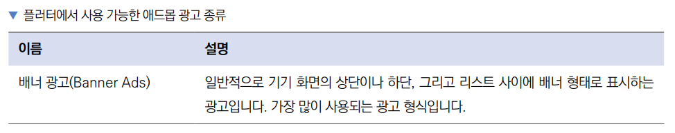  
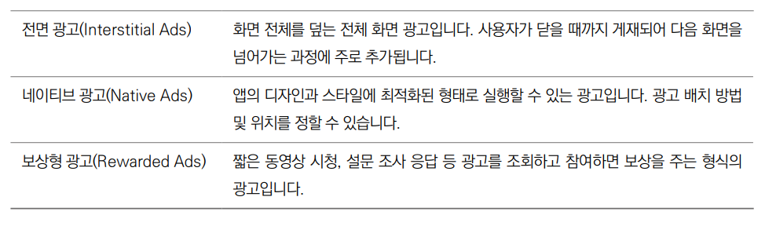  
  
# **사전 준비**  
# **pubspec.yaml 파일 설정하기**  
1. 프로젝트에 광고를 추가하려면 google_mobile_ads 플러그인을 사용해야 하니 pubspec.yaml 파일에 추가한다.  
  
pubspec.yaml 참고  
  
# **애드몹 가입 및 앱 생성하기**  
애드몹을 사용하려면 서비스 회원가입을 진행해야 한다. 그 후 앱을 추가하면 된다.  
  
# **애드몹 계정 생성**  
1. 다음 링크를 접속한 후 아직 애드몹 가입을 한 적이 없는 구글 계정으로 로그인한다.  
- https://apps.admob.com  
  
2. 대한민국을 국가로 선택하고 시간대를 서울로 선택한 다음 약관에 동의한 후 AbMob 계정 만들기 버튼을 누른다.  
  
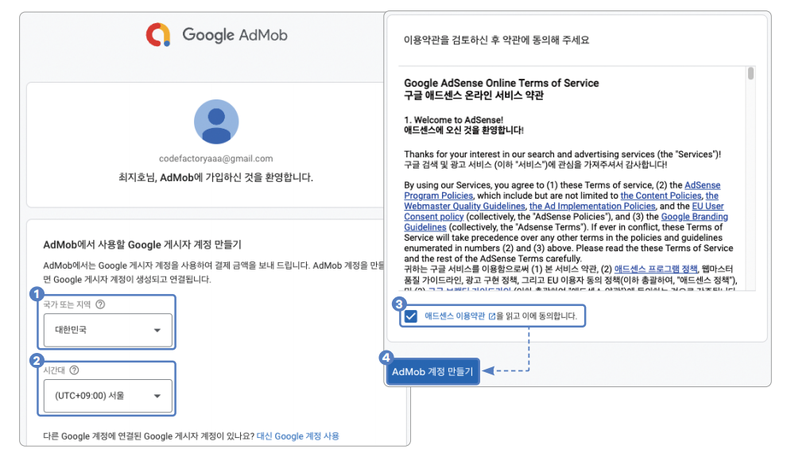  
  
3. 다음 설문에서 팁을 받고 싶은 부분은 예를 누르고 받고 싶지 않은 부분은 아니오를 누른 다음 다음: 계정 확인 버튼을 누른다.  
  
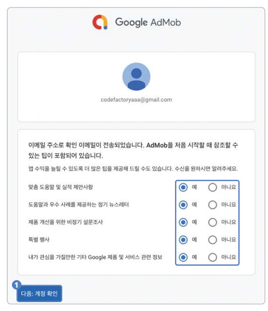  
  
4. 전화번호를 입력한 후 문자 메시지 또는 음성 호출 중 PIN을 입력받고 싶은 방법을 선택한다. 그다음 계속 버튼을 누른다.  
  
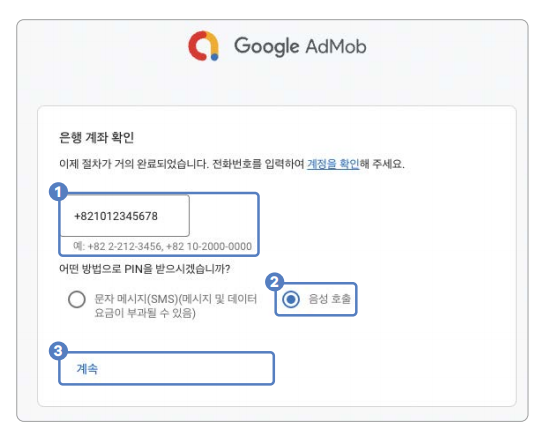  
  
5. PIN을 입력한 후 확인 버튼을 누른다.  
  
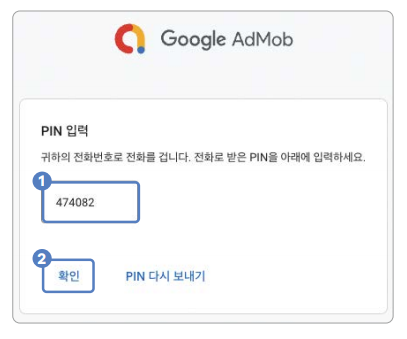  
  
6. 계속해서 AdMob 사용 버튼을 눌러서 가입을 마무리한다.  
  
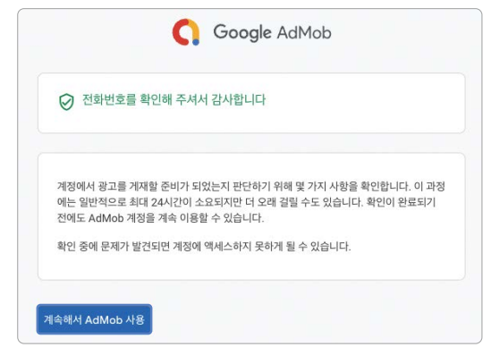  
  
# **앱 추가하기**  
1. 가입이 완료되면 왼쪽의 앱 탭을 누르고 첫 번째 앱 추가 버튼을 누른다.  
  
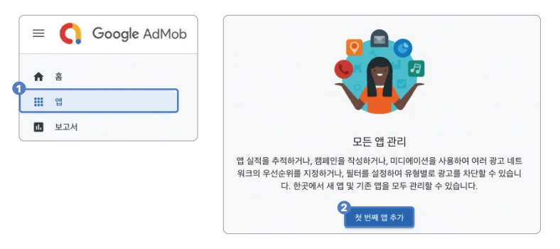  
  
2. 안드로이드와 iOS 앱을 따로 생성해줘야 한다. 먼저 Android 옵션을 누르고 지원되는 앱 스토어에 앱이 등록되어 있나요? 
질문에 아니오를 누른 후 계속 버튼을 누른다.  
  
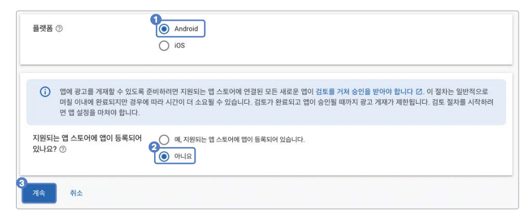  
  
3. 앱 이름을 입력한 다음 앱 추가 버튼을 누른다.  
  
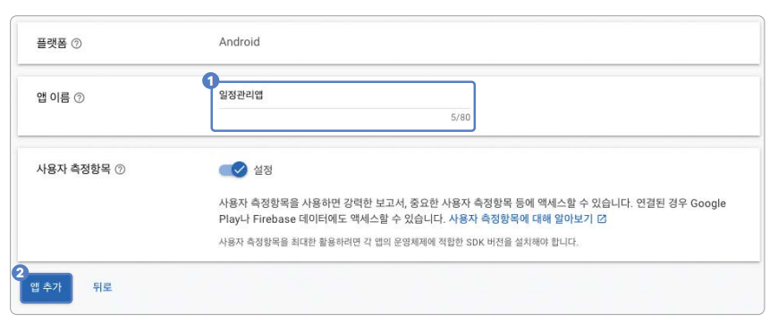  
  
4. 완료 버튼을 누르고 앱 생성을 완료한다.  
  
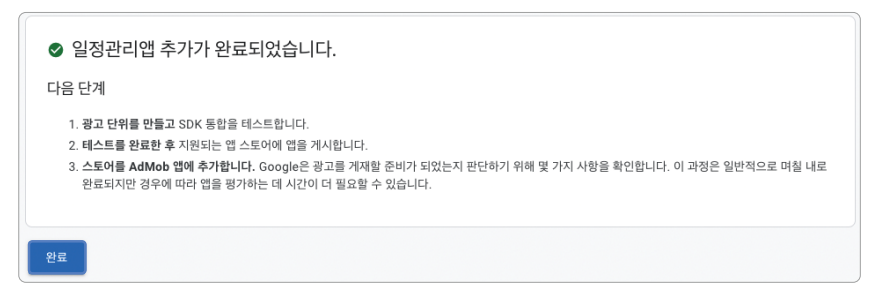  
  
5. 그러면 앱 개요가 보인다. 보이지 않는다면 생성한 앱의 앱 개요 탭을 누른 후 광고 단위 추가 버튼을 누른다.  
  
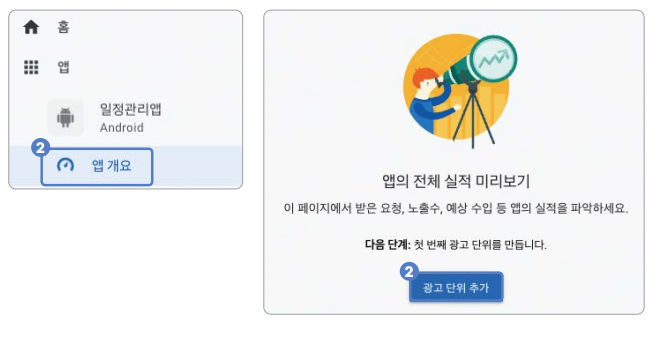  
  
6. 광고 단위는 앱에서 게재할 광고의 종류를 의미한다. 우리 프로젝트에서는 배너 광고를 사용한다. 배너 광고의 선택 버튼을 
눌러서 광고 단위를 생성한다.  
  
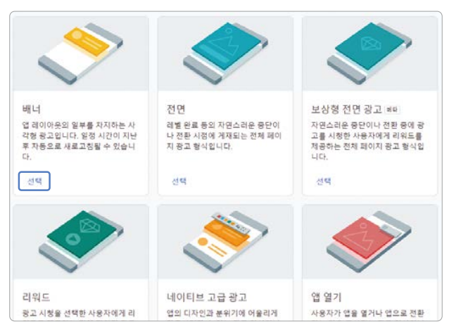  
  
7. 광고 단위 이름을 입력한 후 광고 단위 만들기 버튼을 눌러서 광고 단위를 생성한다.  
  
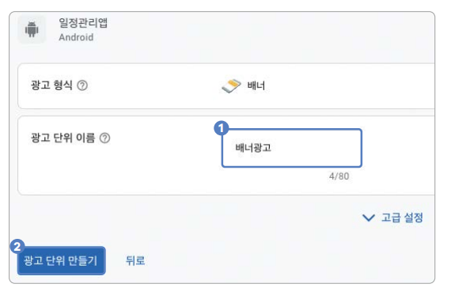  
  
8. 앱 ID와 광고 단위 ID를 기억해둔다. 프로젝트 설정할 때 필요하다. 앱 ID와 광고 단위 ID를 따로 적어둔 다음 완료 버튼을 
누른다.  
  
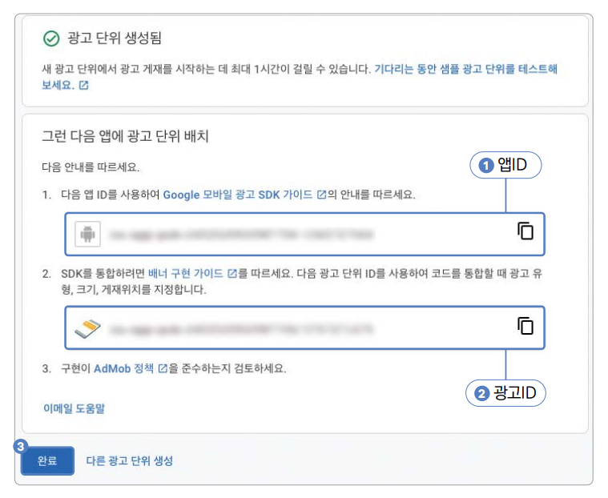  
  
9. iOS 광고를 만들 차례다. 앱 버튼을 누른 후 앱 추가 버튼을 누른다. 이후 과정은 2번부터 8번까지 반복한다.  
  
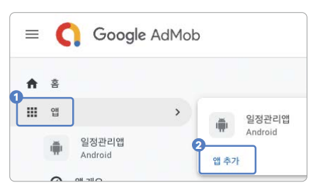  
  
# **구현하기**  
광고 기능을 추가하고 동작 테스트를 진행한다.  
  
# **배너 광고 기능 추가하기**  
애드몹에서 생성한 배너 광고 단위를 사용하여 달력 앱에 광고 기능을 추가한다.  
  
1. 애드몹 가입 및 앱 생성하기에서 진행하면서 발급받은 앱 ID를 프로젝트에 등록한다. android/app/src/main/AndroidManifest.xml 
파일을 다음과 같이 수정한다.  
  
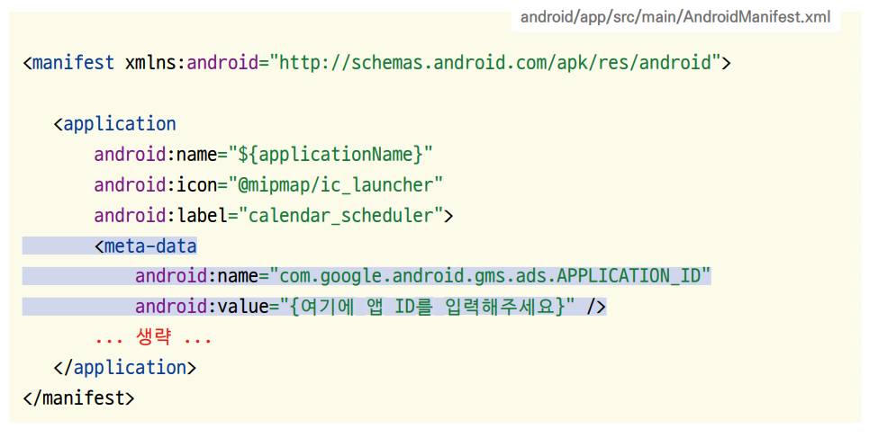  
  
2. 다음으로 iOS 설정을 진행한다. iOS는 ios/Runner/Info.plist 파일을 수정하면 된다. 마지막에 GADApplicationIdentifier 
키로 앱 ID 값을 추가한다.  
  
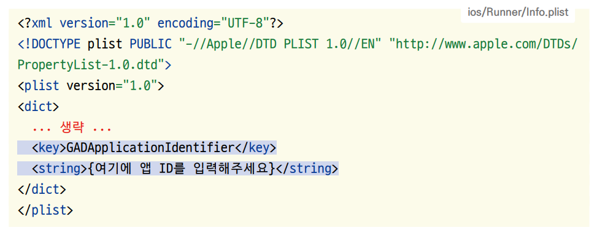  
  
3. 앱이 초기화될 때 google_mobile_ads 플러그인을 같이 초기화해야 한다. main() 함수에 초기화를 진행한다.  
  
lib -> main.dart  
  
4. 일정 두 개마다 하나의 배너 광고를 삽입하는 코드를 작성한다. 배너 광고는 애드몹 가입 및 앱 생성하기에서 저장해둔 광고 
ID를 사용하면 즉시 앱 수익화를 시작할 수 있다. 하지만 구글은 개발 환경에서 실제 광고 ID를 사용하는 걸 엄격히 금지한다. 
그러니 개발할 때는 구글에서 제공하는 테스트 광고 ID를 사용해야 한다. lib/component/banner_ad_widget.dart 파일을 
생성해서 배너 광고를 보여줄 위젯을 만든다.  
  
lib -> component -> banner_ad_widget.dart  
  
Platform.isIOS는 iOS일 때 true를 반환하고 아닐 때 false를 반환한다. 우리 앱은 모바일이니 true가 반환될 때 iOS용 
테스트 광고 ID를 반환하고 false일 때 안드로이드용 테스트 광고 ID를 반환한다. 나중에 앱을 출시하면 이 광고 ID를 실제 
발급받은 광고 ID로 대체해야 한다. 하지만 개발 도중에 실제 광고 ID를 사용하는 건 규정 위반이기 떄문에 꼭 테스트 광고 ID를 
사용하자.  
  
BannerAd 클래스를 사용하면 광고를 생성할 수 있다. size에는 광고 크기를 입력할 수 있다. adUnitId는 광고 ID를 입력하는 
매개변수이다.  
  
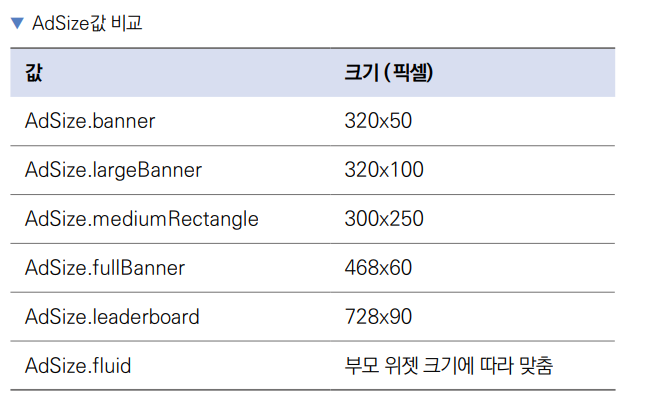  
  
광고의 생명주기 동안 이벤트를 받아볼 수 있다. onAdFailedToLoad 매개변수는 광고 로딩에 실패했을 때 실행된다. 로딩에 
실패하면 ad.dispose()를 실행해서 광고를 삭제한다.  
  
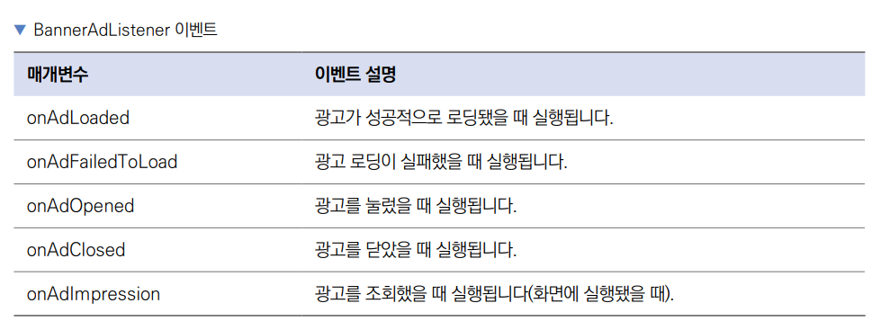  
  
5. 생성한 BannerAdWidget을 HomeScreen의 ListView에 적용해서 한 개의 일정마다 한 개의 배너 광고가 실행되도록 한다.  
  
lib -> screen -> home_screen.dart  
  
ListView.itemBuilder 대신에 ListView.separated를 사용하면 separatorBuilder 매개변수가 추가된다. 리스트 내부의 
위젯 사이사이에 또 다른 위젯을 입력하고 싶을 때 사용한다.  
  
separatorBuilder는 itemBuilder가 반환한 위젯 사이사이에 보여줄 위젯을 렌더링할 때 사용된다. BannerAdWidget을 
반환해서 일정의 사이사이에 광고를 그린다.  
  
# **배포하기: 구글 스토어 & 애플 앱스토어**  
안드로이드와 iOS 앱을 각 스토어에 배포한다. 먼저 배포에 필요한 준비인 앱 번들 ID 설정, 앱 버전 및 빌드 넘버 설정을 
진행한다.  
  
# **앱 Bundle ID 설정하기**  
Bundle ID는 앱을 식별하는 유일한 값이다. 세 개의 단어를 마침표로 구분해서 입력하며 같은 플랫폼(안드로이드, iOS 등)
내에서 다른 앱과 절대로 겹칠 수 없다. 일반적으로 도메인을 거꾸로 입력한 형태를 띈다. 예를 들어 google.com이라는 도메인을 
사용하고 있다면 com.google.{앱 이름} 형태가 된다. 앱에서 기본으로 설정된 Bundle ID를 직접 지정한 값으로 변경한다.  
  
1. 직접 모든 파일에 적혀 있는 Bundle ID를 변경해줄 수도 있지만 그러면 실수가 생길 수도 있고 시간이 오래 걸리기 떄문에 
플러그인의 도움을 받는다. pubspec.yaml 파일에 change_app_package_name: 1.1.0을 dev_dependencies로 추가한다.  
  
pubspec.yaml  
  
2. pub get을 실행해준 다음 터미널에서 명령어를 실행해서 Bundle ID를 변경한다.(ex -> ai.codefactory.calendarscheduler)  
  
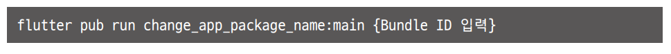  
  
3. 다음과 같이 출력되면 성공이다.  
  
  
  
4. 변경된 Bundle ID를 파이어베이스에 등록해주기 위해 다음 설정 명령어를 실행하고 안내에 따라 진행한다.  
  
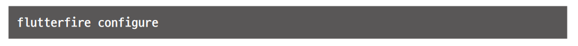  
  

