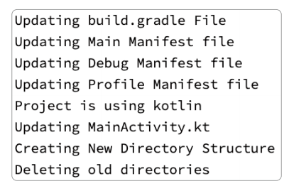
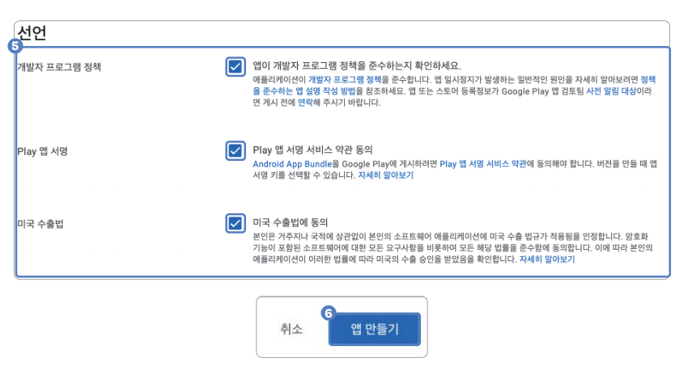
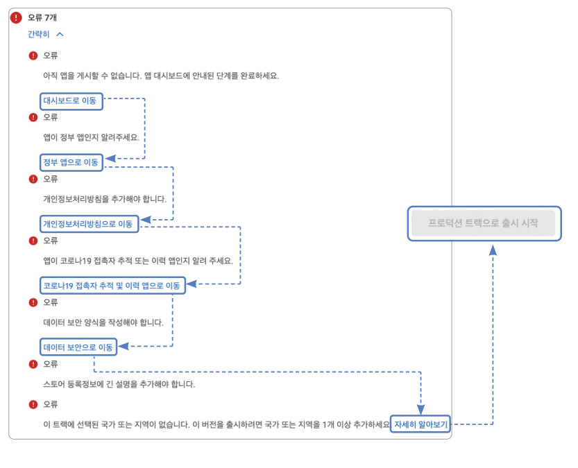

# **광고 및 배포하기(구글 애드몹)**  
# **사전 지식**  
# **구글 애드몹**  
애드몹(Admob)은 구글에서 제공하는 광고 서비스이다. 간단한 가입만으로 누구든 광고를 게시하고 수익화를 할 수 있다. 플러터뿐만 
아니라 웹 및 다른 앱 개발 프레임워크에서도 자유롭게 사용할 수 있다. 플러터에서 사용할 수 있는 애드몹 광고 형태는 4가지다.  
  
  
  
  
# **사전 준비**  
# **pubspec.yaml 파일 설정하기**  
1. 프로젝트에 광고를 추가하려면 google_mobile_ads 플러그인을 사용해야 하니 pubspec.yaml 파일에 추가한다.  
  
pubspec.yaml 참고  
  
# **애드몹 가입 및 앱 생성하기**  
애드몹을 사용하려면 서비스 회원가입을 진행해야 한다. 그 후 앱을 추가하면 된다.  
  
# **애드몹 계정 생성**  
1. 다음 링크를 접속한 후 아직 애드몹 가입을 한 적이 없는 구글 계정으로 로그인한다.  
- https://apps.admob.com  
  
2. 대한민국을 국가로 선택하고 시간대를 서울로 선택한 다음 약관에 동의한 후 AbMob 계정 만들기 버튼을 누른다.  
  
  
  
3. 다음 설문에서 팁을 받고 싶은 부분은 예를 누르고 받고 싶지 않은 부분은 아니오를 누른 다음 다음: 계정 확인 버튼을 누른다.  
  
  
  
4. 전화번호를 입력한 후 문자 메시지 또는 음성 호출 중 PIN을 입력받고 싶은 방법을 선택한다. 그다음 계속 버튼을 누른다.  
  
  
  
5. PIN을 입력한 후 확인 버튼을 누른다.  
  
  
  
6. 계속해서 AdMob 사용 버튼을 눌러서 가입을 마무리한다.  
  
  
  
# **앱 추가하기**  
1. 가입이 완료되면 왼쪽의 앱 탭을 누르고 첫 번째 앱 추가 버튼을 누른다.  
  
  
  
2. 안드로이드와 iOS 앱을 따로 생성해줘야 한다. 먼저 Android 옵션을 누르고 지원되는 앱 스토어에 앱이 등록되어 있나요? 
질문에 아니오를 누른 후 계속 버튼을 누른다.  
  
  
  
3. 앱 이름을 입력한 다음 앱 추가 버튼을 누른다.  
  
  
  
4. 완료 버튼을 누르고 앱 생성을 완료한다.  
  
  
  
5. 그러면 앱 개요가 보인다. 보이지 않는다면 생성한 앱의 앱 개요 탭을 누른 후 광고 단위 추가 버튼을 누른다.  
  
  
  
6. 광고 단위는 앱에서 게재할 광고의 종류를 의미한다. 우리 프로젝트에서는 배너 광고를 사용한다. 배너 광고의 선택 버튼을 
눌러서 광고 단위를 생성한다.  
  
  
  
7. 광고 단위 이름을 입력한 후 광고 단위 만들기 버튼을 눌러서 광고 단위를 생성한다.  
  
  
  
8. 앱 ID와 광고 단위 ID를 기억해둔다. 프로젝트 설정할 때 필요하다. 앱 ID와 광고 단위 ID를 따로 적어둔 다음 완료 버튼을 
누른다.  
  
  
  
9. iOS 광고를 만들 차례다. 앱 버튼을 누른 후 앱 추가 버튼을 누른다. 이후 과정은 2번부터 8번까지 반복한다.  
  
  
  
# **구현하기**  
광고 기능을 추가하고 동작 테스트를 진행한다.  
  
# **배너 광고 기능 추가하기**  
애드몹에서 생성한 배너 광고 단위를 사용하여 달력 앱에 광고 기능을 추가한다.  
  
1. 애드몹 가입 및 앱 생성하기에서 진행하면서 발급받은 앱 ID를 프로젝트에 등록한다. android/app/src/main/AndroidManifest.xml 
파일을 다음과 같이 수정한다.  
  
  
  
2. 다음으로 iOS 설정을 진행한다. iOS는 ios/Runner/Info.plist 파일을 수정하면 된다. 마지막에 GADApplicationIdentifier 
키로 앱 ID 값을 추가한다.  
  
  
  
3. 앱이 초기화될 때 google_mobile_ads 플러그인을 같이 초기화해야 한다. main() 함수에 초기화를 진행한다.  
  
lib -> main.dart  
  
4. 일정 두 개마다 하나의 배너 광고를 삽입하는 코드를 작성한다. 배너 광고는 애드몹 가입 및 앱 생성하기에서 저장해둔 광고 
ID를 사용하면 즉시 앱 수익화를 시작할 수 있다. 하지만 구글은 개발 환경에서 실제 광고 ID를 사용하는 걸 엄격히 금지한다. 
그러니 개발할 때는 구글에서 제공하는 테스트 광고 ID를 사용해야 한다. lib/component/banner_ad_widget.dart 파일을 
생성해서 배너 광고를 보여줄 위젯을 만든다.  
  
lib -> component -> banner_ad_widget.dart  
  
Platform.isIOS는 iOS일 때 true를 반환하고 아닐 때 false를 반환한다. 우리 앱은 모바일이니 true가 반환될 때 iOS용 
테스트 광고 ID를 반환하고 false일 때 안드로이드용 테스트 광고 ID를 반환한다. 나중에 앱을 출시하면 이 광고 ID를 실제 
발급받은 광고 ID로 대체해야 한다. 하지만 개발 도중에 실제 광고 ID를 사용하는 건 규정 위반이기 떄문에 꼭 테스트 광고 ID를 
사용하자.  
  
BannerAd 클래스를 사용하면 광고를 생성할 수 있다. size에는 광고 크기를 입력할 수 있다. adUnitId는 광고 ID를 입력하는 
매개변수이다.  
  
  
  
광고의 생명주기 동안 이벤트를 받아볼 수 있다. onAdFailedToLoad 매개변수는 광고 로딩에 실패했을 때 실행된다. 로딩에 
실패하면 ad.dispose()를 실행해서 광고를 삭제한다.  
  
  
  
5. 생성한 BannerAdWidget을 HomeScreen의 ListView에 적용해서 한 개의 일정마다 한 개의 배너 광고가 실행되도록 한다.  
  
lib -> screen -> home_screen.dart  
  
ListView.itemBuilder 대신에 ListView.separated를 사용하면 separatorBuilder 매개변수가 추가된다. 리스트 내부의 
위젯 사이사이에 또 다른 위젯을 입력하고 싶을 때 사용한다.  
  
separatorBuilder는 itemBuilder가 반환한 위젯 사이사이에 보여줄 위젯을 렌더링할 때 사용된다. BannerAdWidget을 
반환해서 일정의 사이사이에 광고를 그린다.  
  
# **배포하기: 구글 스토어 & 애플 앱스토어**  
안드로이드와 iOS 앱을 각 스토어에 배포한다. 먼저 배포에 필요한 준비인 앱 번들 ID 설정, 앱 버전 및 빌드 넘버 설정을 
진행한다.  
  
# **앱 Bundle ID 설정하기**  
Bundle ID는 앱을 식별하는 유일한 값이다. 세 개의 단어를 마침표로 구분해서 입력하며 같은 플랫폼(안드로이드, iOS 등)
내에서 다른 앱과 절대로 겹칠 수 없다. 일반적으로 도메인을 거꾸로 입력한 형태를 띈다. 예를 들어 google.com이라는 도메인을 
사용하고 있다면 com.google.{앱 이름} 형태가 된다. 앱에서 기본으로 설정된 Bundle ID를 직접 지정한 값으로 변경한다.  
  
1. 직접 모든 파일에 적혀 있는 Bundle ID를 변경해줄 수도 있지만 그러면 실수가 생길 수도 있고 시간이 오래 걸리기 떄문에 
플러그인의 도움을 받는다. pubspec.yaml 파일에 change_app_package_name: 1.1.0을 dev_dependencies로 추가한다.  
  
pubspec.yaml  
  
2. pub get을 실행해준 다음 터미널에서 명령어를 실행해서 Bundle ID를 변경한다.(ex -> ai.codefactory.calendarscheduler)  
  
  
  
3. 다음과 같이 출력되면 성공이다.  
  
  
  
4. 변경된 Bundle ID를 파이어베이스에 등록해주기 위해 다음 설정 명령어를 실행하고 안내에 따라 진행한다.  
  
  
  
# **앱 버전 및 빌드 넘버 설정하기**  
앱 버전과 빌드 넘버(build number)는 앱이 얼마나, 몇 번 업데이트되었는지 쉽게 알 수 있는 수단이다. 맨 처음 출시를 하면 
기본 설정에서 변경할 요소는 없으나 추후 업데이트 시에는 꼭 값들을 변경해줘야 한다.  
  
1. pubspec.yaml 파일을 실행하고 version이라고 적혀 있는 키값을 찾는다.  
  
pubspec.yaml 참고  
  
  
  
2. 업데이트할 때마다 version 키의 값을 변경해줘야 한다. +를 기준으로 왼쪽은 시맨틱 버전을 따른 앱 버전을 의미한다. 
시맨틱 버전은 major,minor.patch 형식을 가지며 각 특성은 아래 표에 있다.  
  
  
  
+를 기준으로 오른쪽은 빌드 넘버에 해당한다. 사용자에겐 보이지 않는 숫자로 말 그대로 몇 번째 빌드인지를 의미하며 앱스토어나 
플레이스토어에 똑같은 빌드 넘버를 갖고 있는 버전은 절대로 중복으로 업로드될 수 없다. 단순히 빌드할 때마다 숫자를 하나씩 
올려줘야 한다고 생각하면 된다. 우리는 기본으로 설정된 값인 1.0.0+1을 그대로 사용한다.  
  
# **안드로이드 앱 배포하기**  
안드로이드 앱을 배포하려면 키를 생성하고 안드로이드 프로젝트에 등록해줘야 한다. 그다음 앱번들(Appbundle)을 빌드한 후 
구글 플레이에 업로드해야 한다.  
  
1. 업로드 키를 생성하려면 자바 런타임이 필요하다. https://www.java.com/ko/download에 접속한 후 Java 내려받기 버튼을 
누른다.  
  
  
  
2. 내려받기가 완료되면 설치 파일을 실행해서 설치를 진행한다. 설치가 완료되면 윈도우 운영체제는 재부팅한다.  
  
3. 구글 플레이에 앱을 업로드하려면 업로드 키를 생성해야 한다. 이 업로드 키가 있어야 추후 업데이트가 가능하다. 다음 명령어를 
실행하면 홈 디렉토리에 upload-keystore.jks라는 키 파일을 생성할 수 있다. 만약에 다른 위치에 생성하고 싶다면 -keystore 
플래그 다음에 해당되는 경로로 입력한다.  
  
  
  
4. 명령어를 실행하면 비밀번호와 배포자의 정보 등 여러 질문에 대답해야 한다. 아래 정리된 표를 보고 적절한 답변을 작성한다.  
  
  
  
5. 생성한 키를 프로젝트에 등록해줘야 한다. android 폴더에 오른쪽 클릭을 한 후 New -> File을 눌러서 key.properties라는 
파일을 생성한 후 다음 코드를 입력한다.  
  
  
  
6. 생성한 key.properties 파일을 android/app/build.gradle 파일에 설정해줘야 한다. 다음처럼 코드를 변경해서 생성된 
key.properties 파일을 등록한다. android로 시작되는 블록을 찾아서 윗부분에 코드를 추가한다.  
  
  
  
7. key.properties로 불러온 정보를 하나씩 등록한다. buildTypes로 시작되는 블록을 찾아서 다음과 같이 변경한다.  
  
  
  
  
8. 다음으로 앱의 이름을 설정해야 한다. 앱 이름은 android/app/arc/main/AndroidManifest.xml 파일에서 설정할 수 
있다. android:label 값을 원하는 앱 이름으로 변경해주면 된다. 그럼 앱을 설치했을 때 앱의 이름을 변경할 수 있다.  
  
  
  
9. 다음 명령어를 실행해서 앱번들을 생성한다. 앱번들은 앱을 플레이스토어에 업로드할 수 있는 형태로 하나의 파일로 플러터 
앱이 포장된다.  
  
  
  
10. 다음과 같은 출력을 확인하면 빌드가 잘 완료된 것이다. 빌드가 된 파일은 [build/app/outputs/bundle/release/] 
에 있다.  
  
  
  
11. https://play.google.com/console에 접속해서 구글 계정으로 로그인한다. 개발자 계정을 등록하려면 25달러를 지불해야 
한다.  
  
12. 좌측 탭의 모든 맵 버튼을 누른 후 앱 만들기 버튼을 눌러서 새로운 앱을 생성한다.  
  
  
  
13. 다음 페이지에 실행되는 필드들을 모두 입력한다. 앱 이름에는 앱의 이름을 입력하고 기본 언어로 한국어를 선택한다. 
앱 또는 게임은 앱을 선택한다. 유료 또는 무료는 무료를 선택한다. 다른 옵션들을 선택하거나 입력하고 싶다면 변경해도 무관하다. 
다음으로 선언 섹션의 모든 정책에 동의한 후 앱 만들기 버튼을 누른다.  
  
  
  
  
14. 다음 실행되는 앱의 상세페이지에서 프로덕션 -> 새 버전 만들기를 누른다.  
  
  
  
15. App Bundle 탭의 업로드 버튼을 눌러서 미리 생성해둔 app-release.aab 파일을 업로드한다. 경로는 [프로젝트 위치]
/build/app/outputs/bundle/release/app-release.aab이다.  
  
  
  
16. 업로드가 완료되면 출시명이 자동으로 입력된다. 출시 노트는 어떤 기능이 업데이트 됐는지 알려주는 위치다. <ko-KR> 태그 
사이에 업데이트된 사항을 입력한다. 완료되면 버전 검토 버튼을 누른다.  
  
  
  
17. 첫 업로드라면 여러 추가 정보를 제공해줘야 한다. 오류 탭을 누른 후 각 오류의 링크를 타고 이동해서 오류를 하나씩 
수정한다. 모두 완료되면 우측 아래의 프로덕션 트랙으로 출시 버튼이 활성화된다. 이 버튼을 누르면 안드로이드 앱 출시가 완료된다. 
첫 버전 출시는 검토에 며칠이 걸릴 수 있다.  
  
  
  
# **iOS 앱 배포하기**  
iOS 앱을 배포하려면 애플 개발자 계정을 구매하고 iOS 배포 절차에 맞게 앱을 빌드해야 한다. iOS 빌드는 맥에서만 가능하기 떄문에 
꼭 맥 컴퓨터를 사용해야 한다.  
  
1. https://developer.apple.com/programs/enroll/에 접속한 후 개인 계정 또는 기업 계정으로 개발자 등록을 진행한다. 애플 
개발자 계정 등록은 매년 99달러를 지불해야 한다.  
  
  
  
2. https://developer.apple.com/account/ios/identifier/bundle로 접속해서 등록한 애플 개발자 계정으로 로그인한다.  
  
3. 실행된 화면에서 Identifiers 탭을 클릭한 후 + 버튼을 눌러서 앱 ID를 생성하는 창을 실행한다.  
  
  
  
4. App Ids를 선택한 후 Continue 버튼을 누른다.  
  
  
  
5. App을 선택한 후 Continue를 누른다.  
  
  
  
6. Description에 앱 이름을 입력해주고 Bundle ID는 Explicit 버튼을 선택한다. Bundle ID 텍스트 필드에 미리 정해둔 앱의 
Bundle ID를 입력한다. 마지막으로 Continue를 누르고 다음 화면에서 Register를 누른다.  
  
  
  
7. https://appstoreconnect.apple.com/에 접속해서 App Store Connect를 실행한다. 그리고 나의 앱 버튼을 누른다.  
  
  
  
8. 앱이라고 써져있는 글자 옆에 + 버튼을 누른 다음 신규 앱 버튼을 누른다.  
  
  
  
9. 플랫폼에 iOS를 선택하고 앱의 이름을 입력한다. 기본 언어를 한국어로 선택하고 번들 ID를 눌러서 6번에서 미리 생성해둔 
번들 ID를 누른다. SKU는 계정 내의 앱별 고유 식별 코드인데 번들 ID를 그대로 입력하면 된다. 마지막으로 전체 액세스 버튼을 
누른 후 생성을 누른다.  
  
  
  
10. Xcode를 실행한 후 [프로젝트 경로]/ios/Runner/Runner.xcworkspace 파일을 실행한다. 그리고 Runner 탭의 General 탭을 
누른 후 Display Name을 앱 이름으로 변경하고 Bundle Identifier를 Bundle ID로 변경한다.  
  
  
  
11. Product -> Destination -> Any iOS Device를 선택한다.  
  
  
  
12. 빌드 파일을 업로드하려면 구매한 개발자 계정으로 로그인을 해야 한다. Runner -> Signing & Capabilities에서 Team을 
선택한다. 로그인한 적이 없다면 Add an Account를 선택한 후 개발자 계정을 구매한 계정으로 로그인한다.  
  
  
  
13. Product -> Archive를 눌러서 안드로이드의 앱번들과 유사한 형태인 ipa 파일을 생성한다.  
  
  
  
14. 아카이브가 완료되면 아카이브가 된 파일 목록이 보인다. 최근 아카이브한 파일을 선택한 후 Distribute App 버튼을 누른다.  
  
  
  
15. 배포할 타깃으로 App Store Connect를 선택한 다음 Next를 누른다.  
  
  
  
16. Upload -> Next를 누른다.  
  
  
  
17. 체크돼 있는 기본값들을 그대로 유지한 채로 Next를 누른다.  
  
  
  
18. Automatically manage signing 버튼을 누른 후 Next 버튼을 누른다.  
  
  
  
19. 새로운 창이 실행되면 Upload 버튼을 누른다.  
  
  
  
20. 업로드가 완료되면 Done 버튼을 누른다.  
  
  
  
21. App Store Connect로 돌아가서 생성했던 앱을 선택한다. 이어서 TestFlight 탭으로 이동한다. 앱을 업로드하면 TestFlight에서 
빌드를 처리하는 데 어느 정도 시간이 걸린다. 수십 분이 될 수도 있고 몇 시간이 될 수 도 있다.  
  
  
  
22. 빌드 처리가 완료되면 관리 버튼을 눌러서 문서를 추가해준다.  
  
  
  
23. 적합한 암호화 알고리즘을 선택해서 다음 버튼을 누른다.  
  
  
  
24. 수출 규정 준수 정보에 적합한 값을 선택한 후 저장 버튼을 누른다.  
  
  
  
25. 제출 준비 완료로 상태가 변경되면 App Store 버튼을 눌러서 탭을 이동한다.  
  
  
  
26. 중간으로 스크롤 한 후 빌드 섹션을 찾아서 빌드 추가 버튼을 누른다.  
  
  
  
27. 추가한 빌드를 누른 후 완료 버튼을 누른다.  
  
  
  
28. 현재 페이지의 나머지 정보를 전부 입력하고 나면 심사에 추가 버튼이 활성화된다. 활성화되면 심사에 추가를 눌러서 앱을 
출시한다.  
  
  
  
# **핵심 요약**  
1. 애드몹을 이용하면 앱에 광고를 게재할 수 있다.  
2. 광고 관련 개발을 할 때는 꼭 테스트 광고 ID를 사용해야 한다. 실제 광고 ID를 사용하면 규정 위반으로 추후 수익화가 
불가능해질 수 있다.  
3. 애드몹 광고 종류로 배너 광고, 전면 광고, 네이티브 광고, 보상형 광고가 있다.  
- 배너 광고는 배너를 게재할 수 있는 광고다.  
- 전면 광고는 화면 전체를 덮는 광고다.  
- 네이티브 광고는 현재 앱의 최적화된 디자인을 활용할 수 있는 광고다.  
- 보상형 광고는 광고를 보고난 후 앱에서 보상을 제공할 수 있는 형태의 광고다.  
4. 안드로이드 앱은 플레이스토어를 통해 배포할 수 있다. 안드로이드 앱을 배포하려면 앱 번들을 빌드해야 한다.  
5. iOS 앱은 앱스토어를 통해 배포할 수 있다. iOS 앱을 배포하려면 ipa를 아카이브해야 한다.  
  

