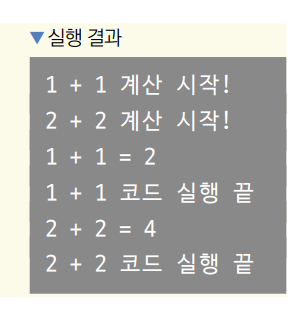
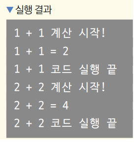

# **다트 비동기 프로그래밍**  
# **Future**  
Future 클래스는 미래라는 단어의 의미대로 미래에 받아올 값을 뜻한다. List나 Set처럼 제네릭으로 어떤 미래의 값을 받아올지를 
정할 수 있다.  
  
lib -> 3.2 -> future.dart 참조  
  
비동기 프로그래밍은 서버 요청과 같이 오래 걸리는 작업을 기다린 후 값을 받아와야 하기 때문에 미래값을 표현하는 Future 클래스가 
필요하다. 특정 기간 동안 아무것도 하지 않고 기다리는 Future.delayed()를 사용해서 실습한다.  
  
lib -> 3.2 -> future2.dart 참조  
  
첫 번째 매개변수에 대기할 기간을 입력하고 두 번째 매개변수에 대기 후 실행할 콜백 함수를 입력하면 된다. 코드를 보면 
Future.delayed()를 통해 3초간 대기한다. 그다음 마지막에 print() 함수를 실행하고 함수를 마친다.  
  
# **async와 await**  
코드가 작성된 순서대로 실행되지 않는다면 개발자 입자에서 헷갈릴 수 있다. 이때 async와 await 키워드를 사용하면 비동기 
프로그래밍을 유지하면서도 코드 가독성을 유지할 수 있다.  

lib -> 3.3 -> async_and_await.dart 참조  
  
예제와 같이 함수를 async로 지정해주고 나서 대기하고 싶은 비동기 함수를 실행할 때 await 키워드를 사용하면 코드는 작성한 
순서대로 실행된다. 이렇게 되면 비동기 프로그래밍이 아니라 동기 프로그래밍이 아니냐고 생각할 수 있다. 합리적인 의심이지만 
async와 await 키워드를 사용하면 비동기 프로그래밍 특징을 그대로 유지하며 코드가 작성된 순서대로 프로그램을 실행한다. 
addNumbers() 함수를 두 번 실행하는 다음 예제를 보면 쉽게 이해할 수 있다.  
  
lib -> 3.3 -> async_and_await2.dart 참조  
  
  
  
addNumbers() 함수는 두 번 실행되었다. 그러니 출력 결과를 함수별로 나눠서 보면 각 addNumbers() 함수의 실행 결과가 예상한 
코드 순서대로 시작되었다. 그런데 addNumbers(1, 1)가 끝나기 전에 addNumbers(2, 2)가 실행되었다. 그 이유는 addNumbers() 함수가 
비동기 프로그래밍으로 실행되었기 때문이다. addNumbers(1, 1)의 Future.delayed()가 실행되며 3초를 기다려야 할 때 CPU의 리소스가 
낭비되지 않고 바로 다음 실행할 코드인 addNumbers(2, 2)를 실행한다.  
  
만약 addNumbers(1, 1)과 addNumbers(2, 2)가 순차적으로 실행되길 원한다면 다음과 같이 async와 await 키워드를 추가해주면 된다.  
  
lib -> 3.3 -> async_and_await3.dart 참조  
  
  
  
main() 함수에 async 키워드를 적용하고 addNumbers(1, 1)과 addNumbers(2, 2)에 await 키워드를 적용했기 때문에 코드는 
작성한 순서대로 실행되었다.  
  
# **결괏값 반환받기**  
async와 await 키워드를 사용한 함수에서도 결괏값을 받아낼 수 있다. 이때 앞서 배운 Future 클래스를 사용한다. 입력된 
두 숫자를 더한 결괏값을 반환하는 addNumbers() 함수의 코드를 수정해 자세히 알아보자.  
  
lib -> 3.3 -> returning_value.dart 참조  
  
