# **플러터 입문하기**  
# **플러터 소개**  
플러터는 구글이 구현한 크로스 플랫폼 프에임워크이다. 초기에 안드로이드와 iOS 앱만 지원헀지만 현재는 웹사이트, macOS, 윈도우, 
리눅스 데스크톱 앱까지 지원한다. 플러터로 개발하면 한 소스 코드로 수많은 플랫폼에 대응할 수 있어서 개발 비용을 아끼고 관리 
부담을 줄일 수 있다. 기존 리액트 네이티브가 장악하던 크로스 플랫폼 앱 개발 프레임워크 시장을 플러터가 상당 부분 장악했다. 
상대적으로 다루기 쉽다는 점과 크로스 플랫폼 호환성이 상당히 자연스럽다는 점, 구글에서 강력하게 밀고 있는 프로젝트라는 점을 
종합했을 때 플러터는 앞으로 더욱 기대되는 프레임워크다.  
  
플러터는 플랫폼 간의 이질감이 적은 크로스 플랫폼 프레임워크다. 기존 크로스 플랫폼 프레임워크들은 코드를 네이티브 프레임워크 코드로 
전환하는 데 중점을 두었다. 하지만 플러터는 스키아 엔진이라는 2D 렌더링 엔진과 직접 통신하기 때문에 스키아 엔진이 실행되는 
플랫폼에서는 똑같은 API를 사용해서 프로그래밍할 수 있다. 이런 장점 덕분에 플러터 프레임워크는 어떤 플랫폼이든 일관된 UI를 
제공할 수 있다. 그래서 타 크로스 플랫폼 프레임워크보다 플랫폼별 UI 디버깅 부담이 현저히 적다.  
  
# **플러터 구조 살펴보기**  
플러터 프레임워크는 세 계층으로 나눠져 있다. 하드웨어와 가장 가까운 로우 레벨에는 임베더(embedder) 계층이 있다. 임베더는 플러터가 
현재 지원하는 6개 플랫폼의 네이티브 플랫폼과 직접 통신을 하고 운영체제의 자체적 기능을 모듈화해둔 계층이다. 이 모듈들은 각 
플랫폼의 네이티브 언어로 작성되어 있다. 중간에는 엔진 계층이 있다. 이 계층은 대부분 C++로 작성되어 있으며 플러터 코어 API와 
스키아 그래픽 엔진, 파일시스템 그리고 네트워크 기능 등이 정의돼 있다. 마지막 계층은 플러터 개발자들이 대부분의 시간을 보내는 
프레임워크 계층이다.  
  
  
  
프레임워크 계층에는 플러터 프레임워크를 사용하는 데 필수적인 위젯, 애니메이션, 머티리얼 패키지, 쿠퍼티노 패키지 등이 있다. 
이렇게 세 계층으로 나뉘고 잘 모듈화된 아키텍처 덕분에 플러터는 쉽게 여러 플랫폼을 지원하고 일관된 API 및 개발 경험을 제공해 준다.  
  
플러터가 스키아 엔진과 직접 통신한다는 건 다시 말해 어떤 플랫폼이든 스키아 엔진을 지원한다면 플러터가 컴파일되고 실행되도록 
구현할 수 있다는 의미이다. 그래서 플러터팀은 플러터로 단순히 iOS와 안드로이드 앱을 개발하는 데 만족하지 않고 윈도우, 리눅스, 
macOS 애플리케이션 그리고 심지어 웹사이트까지 같은 플러터 코드로 배포하도록 구현했다. 다시 말해 플러터 프로그래밍을 할 줄 
알면 한번에 6가지 플랫폼을 대상으로 배포할 수 있다.  
  
  
  
플러터가 스키아 엔진을 사용했을 떄 어떤 장점이 있을까? 대부분의 크로스 플랫폼 앱 개발 프레임워크들은 웹뷰를 사용하거나 각 플랫폼의 
UI 라이브러리들을 사용한다. 플러터는 웹뷰를 사용하지 않고 직접 스키아 엔진을 사용해 화면에 UI를 그려낸다. 이때 새로 렌더링이 
필요한 위젯들만 렌더링하기 때문에 다른 크로스 플랫폼 앱 개발 프레임워크보다 상당히 높은 퍼포먼스를 선보인다.  
  
예를 들어 플러터의 대표적인 경쟁 프레임워크인 리택트 네이티브는 자바스크립트 브릿지를 통해서 플랫폼과 통신한다. 또한 플랫폼의 
UI(OEM 위젯)를 그대로 사용한다. 그래서 플랫폼과 리액트 네이티브 간 통신을 할 때 필요한 리소스 비용이 상당히 높다. 하지만 
플러터는 위젯을 스키아 엔진에 직접 그려내고 필요한 제스처 및 이벤트를 브릿지를 통하지 않고 실행하기 때문에 리액트 네이티브에 
비해 상당히 빠른 퍼포먼스를 자랑한다.
  
# **Hello Flutter 앱 만들기**  
# **안드로이드 스튜디오에서 프로젝트 생성하기**  
안드로이드 스튜디오에서 프로젝트를 생성하는 방법은 2가지다. GUI와 CLI에서 각각 생성할 수 있다.  
  
# **GUI 환경에서 생성하기**  
1. 안드로이드 스튜디오 전용 플러터 플러그인 덕분에 플러터 프로젝트 생성은 상당히 쉽다. 처음 안드로이드 스튜디오를 실행하면 
다음과 같은 화면을 볼 수 있다. [New Flutter Project] 버튼을 클릭한다.  
  
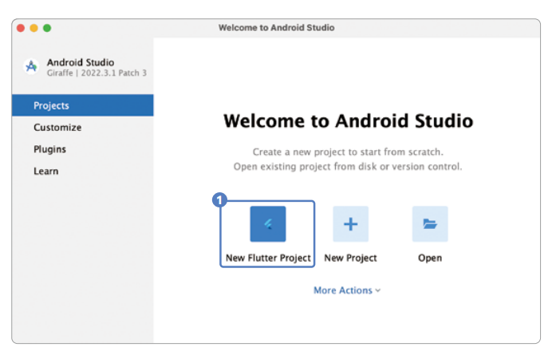  
  
기존에 안드로이드 스튜디오를 사용해서 프로젝트를 생성한 적이 있다면 'Welcome to Android Studio' 화면 대신 프로젝트 화면이 
실행된다. [New Flutter Project] 버튼이나 [File] -> [New] -> [New Flutter Project] 메뉴를 찾아 실행한다.  
  
2. [Flutter] 탭을 선택하고 [Flutter SDK Path]에 플러터를 다운받은 폴더 위치를 찾는다. 일반적으로 자동으로 인식된다. 완료 후 
[Next]를 클릭한다.  
  
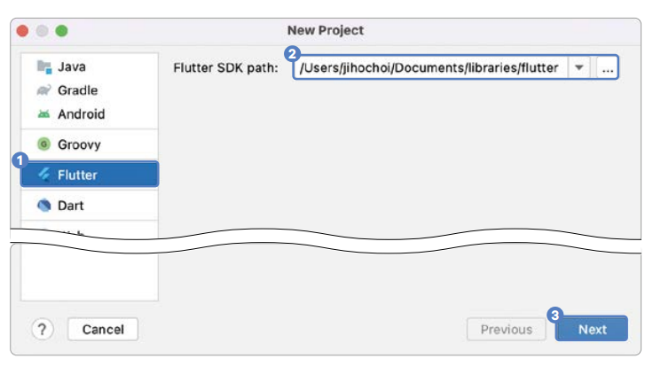  
  
3. 프로젝트 이름으로 hello_world를 입력하고 안드로이드는 Kotlin을 선택한다. 각자의 환경에 맞게 Android 또는 iOS를 선택한다. 
그 후 [Finish] 버튼을 눌러 진행한다. 원한다면 프로젝트 위치를 바꿔도 된다.  
  
참고로 3번은 프로젝트 설명, 4번은 프로젝트 종류(Application이 일반 플러터 프로젝트고 이 책에서는 매번 Application만 선택한다). 
5는 프로젝트의 번들 아이디이다. 앱을 마켓에 출시할 때 식별하는 값이다(일반적으로 도메인을 거꾸로 작성한다. 예: codefactory.ai -> 
ai.codefactory.[앱 이름])  
  
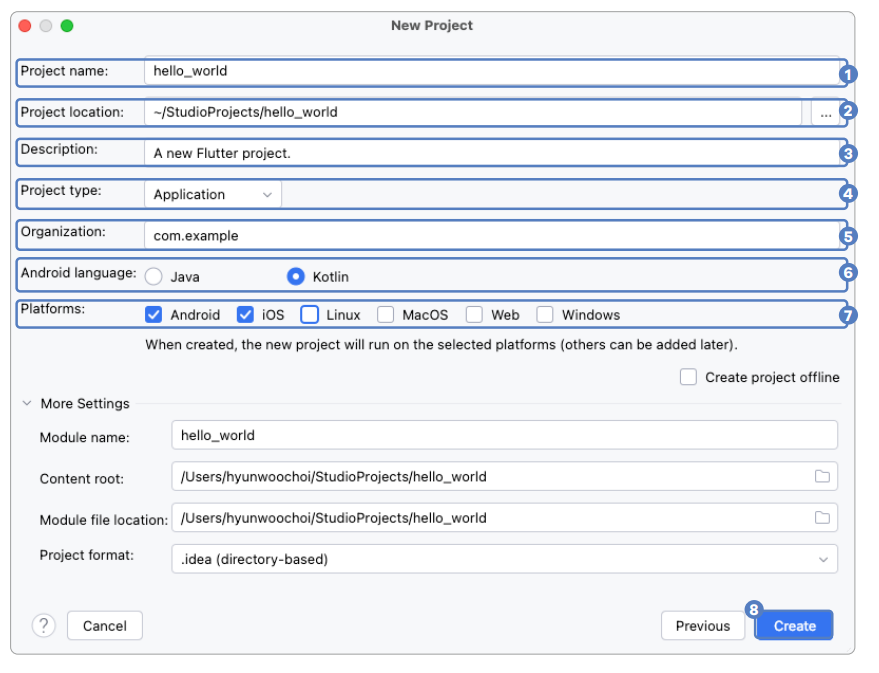  
  
4. 생성이 마무리되면 다음과 같이 프로젝트가 생성된다. 만약 왼쪽에 폴더 구조가 보이지 않는다면 [Project] 탭을 누른다.  
5. 프로젝트를 생성하고 탭이 [Project]로 설정돼 있지 않으면 1번을 누르고 [Project]를 누른다(안드로이드 스튜디오는 일반적으로 
안드로이드 개발을 할 때 사용하기 때문에 [Android]가 선택되어 있을 수 있다).  
  
# **CLI 환경에서 프로젝트 생성하기**  
사실 안드로이드 스튜디오는 플러터 프로젝트 생성을 위한 UI만 제공해줄 뿐이다. CLI로도 플러터 프로젝트를 생성할 수 있다.  
  
1. 윈도우나 macOS 터미널을 하나 열어서 원하는 폴더로 이동한 후 'flutter create <DIRECTORY>' 명령으로 프로젝트를 생성한다. 
<DIRECTORY>에 프로젝트 이름을 넣으면 된다. 플러터 프로젝트 이름은 소문자나 언더스코어로 시작해야 한다.  
  
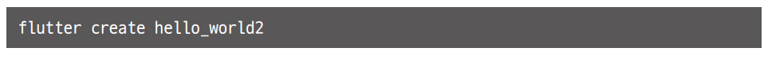  
  
위와 같은 명령어를 실행하면 프로젝트가 생성된다. 생성된 프로젝트를 안드로이드 스튜디오로 실행하면 된다.  
  
# **가상 머신 테스트 환경 안내**  
# **안드로이드 에뮬레이터 생성하기**  
프로젝트를 생성했으니 프로젝트를 실행할 수 있는 안드로이드 에뮬레이터를 생성해야 한다. 안드로이드 에뮬레이터는 실제 안드로이드 
기기가 없어도 컴퓨터에서 안드로이드 기기를 테스트해볼 수 있는 프로그램이다.  
  
1. 안드로이드 스튜디오 오른쪽 끝의 Device Manager 아이콘을 클릭한다.  
  
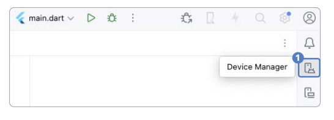  
  
2. [Create Virtual Device] 버튼을 눌러서 에뮬레이터 생성 화면을 실행한다.  
  
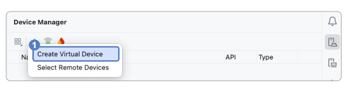  
  
3. [Phone] 탭에서 [Pixel 2]를 선택한 후 [Next] 버튼을 누른다.  
  
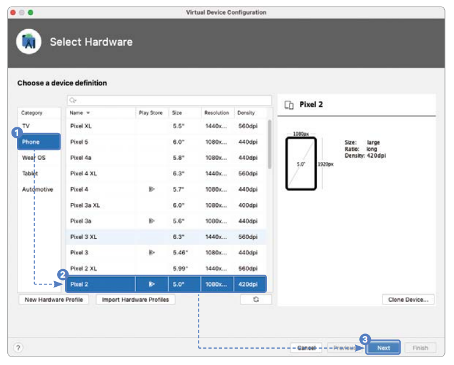  
  
4. OS를 선택할 차례이다. 여기에서는 API 35를 사용한다. 안드로이드 운영체제는 버전을 숫자로 표현한다. 높을수록 최신 버전이니 
선택 후 [Next] 버튼을 누른다. 35 버전을 선택해서 에뮬레이터를 생성한다. 최신 버전을 사용해도 큰 문제가 되진 않지만 버전 
호환으로 인한 에러가 발생할 가능성이 있다. 상황에 따라 선택한 버전의 운영체제를 다운받아야 할 수 있다.  
  
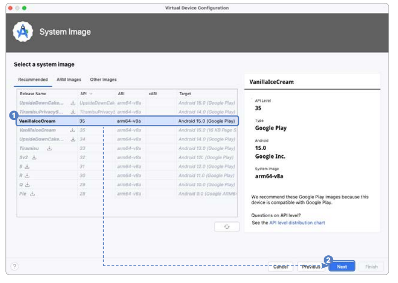  
  
5. 원하는 에뮬레이터 이름을 설정한다. [show Advanced Settings]를 누른다.  
  
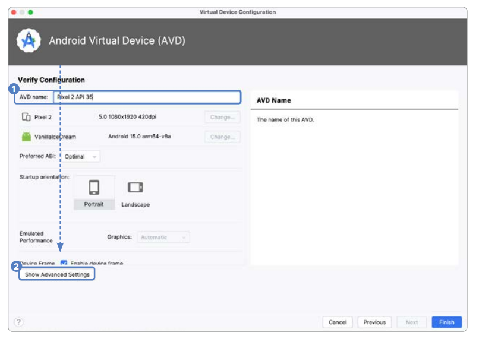  
  
6. 화면을 아래로 스크롤해서 Internal Storage를 8GB로 설정한다. 앱을 설치할 충분한 용량을 추가해줘야 한다. [Finish] 버튼을 
눌러서 에뮬레이터를 생성한다.  
  
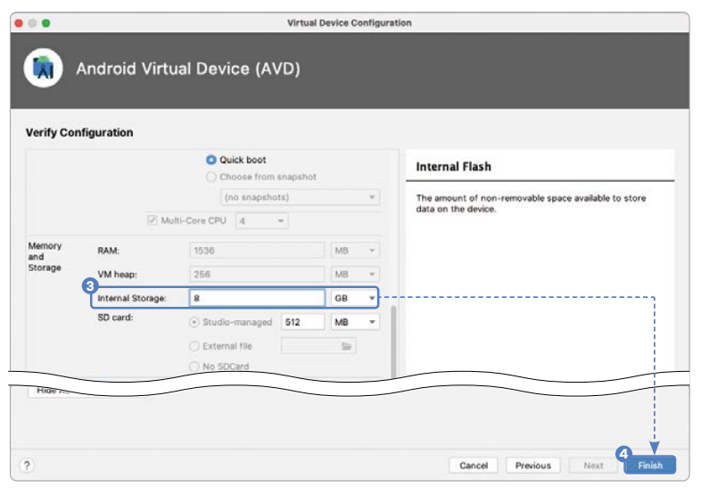  
  
7. 다시 Device Manager로 돌아오면 안드로이드 에뮬레이터가 새로 생성되어 있다. 재생 버튼을 누르면 생성한 안드로이드 에뮬레이터를 
실행할 수 있다.  
  
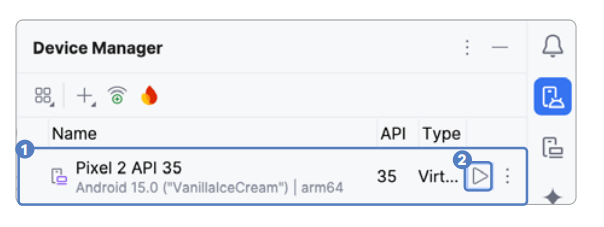
  
# **iOS 시뮬레이터 실행하기**  
iOS 시뮬레이터는 MacOS 환경에서만 실행할 수 있다. Xcode 설치하기에서 진행한 대로 환경 설정이 됐다면 iOS 시뮬레이터는 자동으로 
설치된다. iOS 시뮬레이터는 다음과 같은 방법으로 실행할 수 있다.  
  
1. [Open iOS Simulator]를 누르면 시뮬레이터가 실행된다. 이미 시뮬레이터가 추가되어 있을 때는 원하는 iOS 시뮬레이터를 
선택하면 iOS 시뮬레이터 앱이 실행된다.  
  
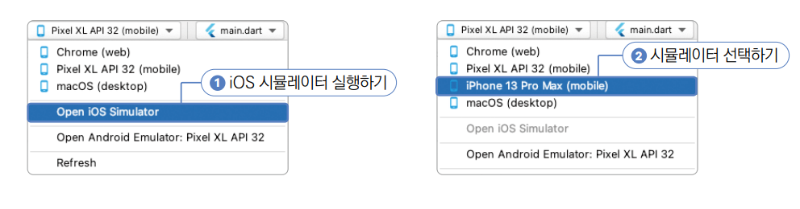  
  
# **'Hello Code Factory' 출력하기**  
1. 플러터 프로젝트를 생성하면 항상 같은 샘플 프로젝트가 <프로젝트 폴더>/lib 폴더 아래 main.dart 파일에 생성된다. 자동으로 
생성된 코드를 모두 삭제하고 다음과 같이 main() 함수만 남긴다.  
  
lib -> main.dart 참조  
  
main() 함수는 플러터 프로젝트가 실행되는 도입부이다. 플러터 프로젝트를 실행하면 가장 먼저 main() 함수가 실행되며 main() 함수 
안에 runApp() 함수를 실행시켜서 플러터 프로젝트를 실행한다.  
  
2. 'Hello Code Factory'라는 글자를 출력하는 코드를 작성한다.  

lib -> main.dart 참조  
  
runApp() 함수에 MaterialApp이라는 위젯을 추가하고 그 안에 Scaffold라는 위젯을 추가했다. MaterialApp은 머티리얼 디자인 
기반의 위젯들을 사용하게 해주는 위젯이다. Scaffold는 MaterialApp 위젯 다음으로 위치하는 위젯으로 화면 전체를 차지하며 
레이아웃을 도와주고 UI 관련 특수 기능을 제공해준다. 예를 들어 화면에 알림과 같은 스낵바를 실행한다든지 화면의 위에 앱바를 추가하거나 
아래에 탭바를 추가하는 기능을 제공해준다. 플러터에서 main() 함수 안에 runApp을 실행하고 그 안에 MaterialApp과 Scaffold 위젯을 
추가하는 것이 기본 설정이라고 생각하면 된다. 이 설정을 하고 나면 비로소 원하는 요소를 화면에 추가할 수 있다. 플러터에서는 마지막 
매개변수의 끝에 ,기호를 추가하는 코딩 표준이 있다. ,기호가 없어도 에러가 나지는 않지만 코드 자동 정리를 실행했을 때 , 기호를 
기준으로 줄 나눔이 된다. 그러니 다음 매개변수가 없더라도 마지막 매개변수의 끝에는 ,기호를 항상 추가하자. 
  
  
  
글자를 화면에 출력하고 싶기 때문에 Text 위젯을 Scaffold에 추가해서 'Hello Code Factory'라는 글자를 입력했다.  
  
3. 이제 안드로이드 에뮬레이터를 실행하고 실행한 에뮬레이터를 선택한 다음 [실행 버튼]을 누르면 화면에 'Hello Code Factory'가 
보인다.  
  
# **Center 위젯으로 중앙 정렬**  
1. 'Hello Code Factory'라는 글자를 화면에 보이게 하는 데 성공했지만 맨 위에 있는 상태바에 가렸다. 글자가 잘 보이게 화면의 
가운데로 옮기기 위해 Center 위젯을 사용한다.  

lib -> main.dart 참조  
  
2. 실행하면 'Hello Code Factory'가 가운데에 위치한다.  
  
# **실제 단말 테스트 환경 구축**  
지금까지는 컴퓨터에서 핸드폰을 가상화해서 플러터 앱을 실행했다. 실제 안드로이드나 아이폰 기기에서도 앱을 테스트할 수 있다. 
  
# **안드로이드 실제 기기 사용하기**  
안드로이드 실제 기기 연동하는 데 USB와 와이파이 무선 방식을 사용할 수 있다. 먼저 실제 기기에서 개발자 옵션을 활성화한다.  
  
# **안드로이드 옵션 활성화하기: USB와 무선 연결 공통 작업**  
먼저 안드로이드 실제 기기에서 개발자 옵션을 활성화해야 한다. USB 연결과 무선 연결을 이용할 때 공통으로 필요한 과정이다.  
  
1. 개발자 옵션 및 USB 디버깅 사용 설정을 한다. 안드로이드 버전별로 아래 절차를 따라한다(버전에 따라 탭 횟수는 상이할 수 있다).  
- Android 9 / API 28 이상: [설정] -> [휴대전화 번호] -> [빌드 번호] 7번 탭하기  
- Android 8 / API 26 ~ 27 이상: [설정] -> [시스템] -> [휴대전화 번호] -> [빌드 번호] 7번 탭하기  
- Android 7.1 / API 25 이하: [설정] -> [휴대전화 정보] -> [빌드 번호] 7번 탭하기  
  
2. USB 디버깅이 활성화돼 있는지 확인한다. 만약에 활성화돼 있지 않다면 활성화한다(버전에 따라 위치가 상이하거나 'USB 디버깅' 메뉴는 
버전에 상관없이 제공된다).  
- Android 9 / API 28 이상: [설정] -> [시스템] -> [고급] -> [개발자 옵션] -> [USB 디버깅]  
- Android 8 / API 26 ~ 27: [설정] -> [시스템] -> [개발자 옵션] -> [USB 디버깅]  
- Android 7.1 / API 25 이하: [설정] -> [개발자 옵션] -> [USB 디버깅]  
  
# **USB로 연결하기**  
안드로이드 실제 기기로 USB 디버깅을 하려면 Android 4.1 (API 16) 이상의 안드로이드 버전을 사용해야 한다.  
  
1. 안드로이드 스튜디오에서 Google USB Driver를 설치해야 한다. 먼저 메인 메뉴에서 [Tools] -> [SDK Manager]를 클릭한다. 
그 후 [Languages & Frameworks] -> [Android SDK]를 선택한다. [Google USB Driver]를 선택한다. [OK]를 클릭한다.  
  
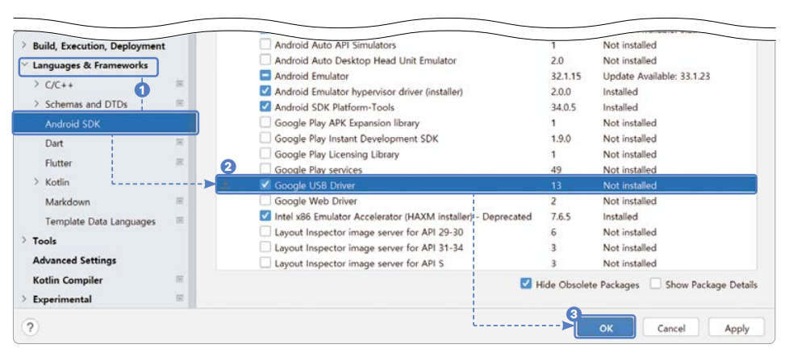  
  
2. USB로 안드로이드 핸드폰과 컴퓨터를 연결한다. 만약에 권한 요청이 뜨면 권한을 허가한다.  
3. 안드로이드 스튜디오 실행 기기 선택 탭에서 연결된 핸드폰을 선택한 후 실행 버튼을 누른다.  
  
안드로이드 실제 기기 사용법은 공식 사이트에서 더욱 자세히 알아볼 수 있다. 추가로 최신 안드로이드 기기를 사용할 경우 와이파이를 
이용한 무선 디버깅도 가능하다. 무선 디버깅을 진행해보고 싶다면 다음 링크를 참고하자.  
  
- 안드로이드 USB 연결 공식 문서  
https://docs.flutter.dev/get-started/install/windows#android-setup  
- 안드로이드 와이파이 연결 공식 문서  
https://developer.android.com/studio/command-line/adb  
  
# **아이폰 실제 기기 사용하기**  
안드로이드 실제 기기와 마찬가지로 아이폰도 실제 기기를 이용해서 플러터 앱을 실행할 수 있다. macOS 환경이 필요하다.  
  
1. 아이폰을 개발 컴퓨터에 연결한다. 만약에 권한 요청이 뜨면 [신뢰하기]를 누른다. iOS 16 이상을 사용한다면 [Settings (설정) ->
Privacy & Security(개인정보 보호)] 에서 [Developer (개발자 모드)]를 활성화한다.  
2. 터미널을 실행해서 다음 두 코드 중 하나를 실행한다. 인텔 기반 맥북인지 애플 실리콘 기반(M1 등)의 맥북인지에 따라 명령이 다르다. 
Brew 및 CocoaPods 설치하기에서 CocoaPods를 설치했다면 CocoaPods 설치 과정은 건너뛰어도 된다.  
  
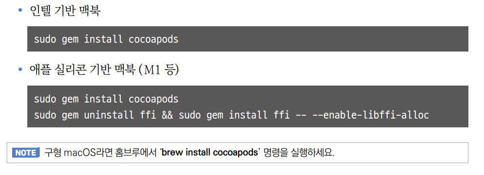  
  
3. Xcode를 실행하고 생성한 프로젝트의 ios/Runner.xcworkspace를 연다.  
4. 좌측의 [Runner]를 선택한다. TARGETS의 [Runner]를 선택한다. [Signing & Capabilities] 탭을 선택한다. Bundle Identifier를 
유니크한 값으로 변경한다. 나중에 앱을 출시할 때 앱을 구분하는 데 사용되니 출시 중이거나 개발 중으로 등록된 그 어떤 앱과도 겹치면 안 된다. 
연습용 프로젝트이니 com.[본인 영어 이름].[복잡한 영어 단어]로 구성해서 겹치지 않는 값을 지정한다. [Automatically manage Signing]이 
체크되지 않았다면 체크한다. 버튼을 눌러서 로그인된 계정을 선택하거나 새로운 애플 계정으로 로그인한다.  
  
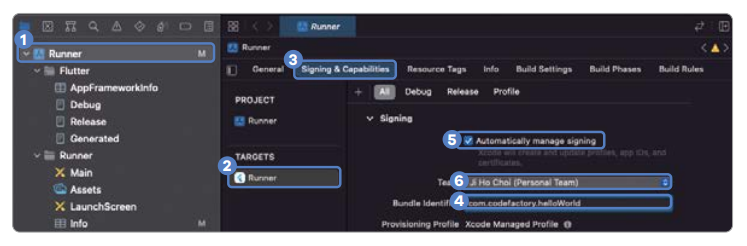  
  
5. 안드로이드 스튜디오 실행 기기 선택 탭에서 연결된 핸드폰을 선택한 후 실행 버튼을 누른다.  
아이폰 실제 기기 사용법은 공식 사이트에서 더욱 자세히 알아볼 수 있다.  
- 아이폰 USB 연결 공식 문서  
https://docs.flutter.dev/get-started/install/macos#deploy-to-ios-devices  
  
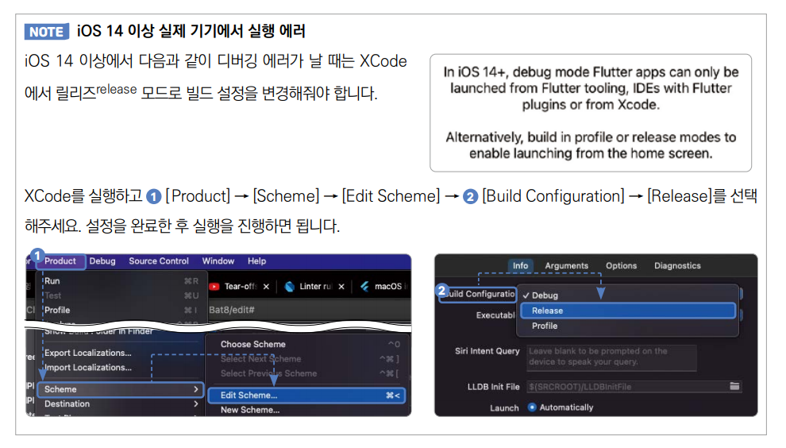  
  
