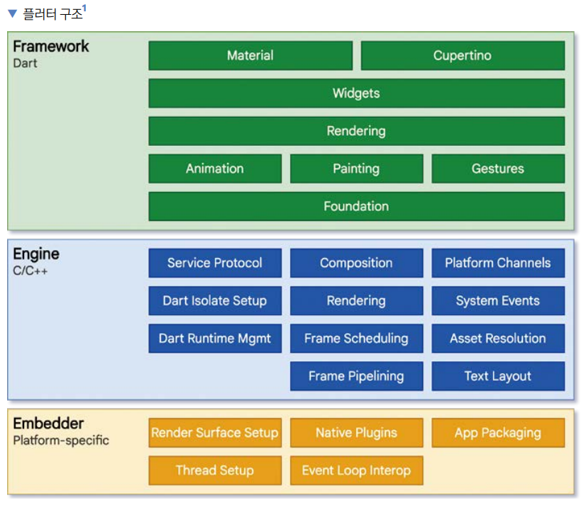
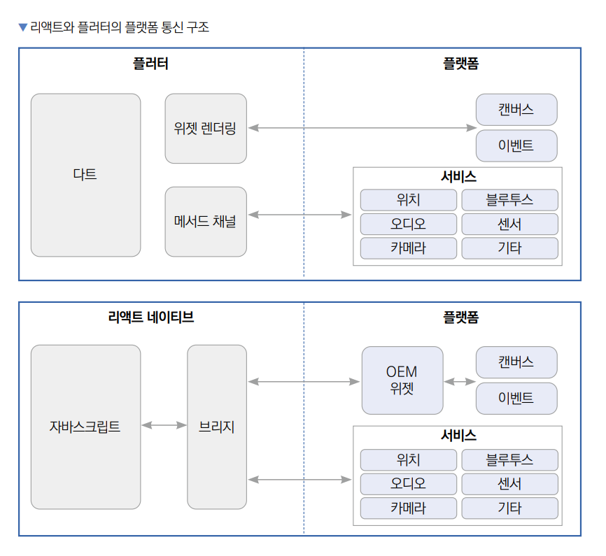

# **플러터 입문하기**  
# **플러터 소개**  
플러터는 구글이 구현한 크로스 플랫폼 프에임워크이다. 초기에 안드로이드와 iOS 앱만 지원헀지만 현재는 웹사이트, macOS, 윈도우, 
리눅스 데스크톱 앱까지 지원한다. 플러터로 개발하면 한 소스 코드로 수많은 플랫폼에 대응할 수 있어서 개발 비용을 아끼고 관리 
부담을 줄일 수 있다. 기존 리액트 네이티브가 장악하던 크로스 플랫폼 앱 개발 프레임워크 시장을 플러터가 상당 부분 장악했다. 
상대적으로 다루기 쉽다는 점과 크로스 플랫폼 호환성이 상당히 자연스럽다는 점, 구글에서 강력하게 밀고 있는 프로젝트라는 점을 
종합했을 때 플러터는 앞으로 더욱 기대되는 프레임워크다.  
  
플러터는 플랫폼 간의 이질감이 적은 크로스 플랫폼 프레임워크다. 기존 크로스 플랫폼 프레임워크들은 코드를 네이티브 프레임워크 코드로 
전환하는 데 중점을 두었다. 하지만 플러터는 스키아 엔진이라는 2D 렌더링 엔진과 직접 통신하기 때문에 스키아 엔진이 실행되는 
플랫폼에서는 똑같은 API를 사용해서 프로그래밍할 수 있다. 이런 장점 덕분에 플러터 프레임워크는 어떤 플랫폼이든 일관된 UI를 
제공할 수 있다. 그래서 타 크로스 플랫폼 프레임워크보다 플랫폼별 UI 디버깅 부담이 현저히 적다.  
  
# **플러터 구조 살펴보기**  
플러터 프레임워크는 세 계층으로 나눠져 있다. 하드웨어와 가장 가까운 로우 레벨에는 임베더(embedder) 계층이 있다. 임베더는 플러터가 
현재 지원하는 6개 플랫폼의 네이티브 플랫폼과 직접 통신을 하고 운영체제의 자체적 기능을 모듈화해둔 계층이다. 이 모듈들은 각 
플랫폼의 네이티브 언어로 작성되어 있다. 중간에는 엔진 계층이 있다. 이 계층은 대부분 C++로 작성되어 있으며 플러터 코어 API와 
스키아 그래픽 엔진, 파일시스템 그리고 네트워크 기능 등이 정의돼 있다. 마지막 계층은 플러터 개발자들이 대부분의 시간을 보내는 
프레임워크 계층이다.  
  
  
  
프레임워크 계층에는 플러터 프레임워크를 사용하는 데 필수적인 위젯, 애니메이션, 머티리얼 패키지, 쿠퍼티노 패키지 등이 있다. 
이렇게 세 계층으로 나뉘고 잘 모듈화된 아키텍처 덕분에 플러터는 쉽게 여러 플랫폼을 지원하고 일관된 API 및 개발 경험을 제공해 준다.  
  
플러터가 스키아 엔진과 직접 통신한다는 건 다시 말해 어떤 플랫폼이든 스키아 엔진을 지원한다면 플러터가 컴파일되고 실행되도록 
구현할 수 있다는 의미이다. 그래서 플러터팀은 플러터로 단순히 iOS와 안드로이드 앱을 개발하는 데 만족하지 않고 윈도우, 리눅스, 
macOS 애플리케이션 그리고 심지어 웹사이트까지 같은 플러터 코드로 배포하도록 구현했다. 다시 말해 플러터 프로그래밍을 할 줄 
알면 한번에 6가지 플랫폼을 대상으로 배포할 수 있다.  
  
  
  
플러터가 스키아 엔진을 사용했을 떄 어떤 장점이 있을까? 대부분의 크로스 플랫폼 앱 개발 프레임워크들은 웹뷰를 사용하거나 각 플랫폼의 
UI 라이브러리들을 사용한다. 플러터는 웹뷰를 사용하지 않고 직접 스키아 엔진을 사용해 화면에 UI를 그려낸다. 이때 새로 렌더링이 
필요한 위젯들만 렌더링하기 때문에 다른 크로스 플랫폼 앱 개발 프레임워크보다 상당히 높은 퍼포먼스를 선보인다.  
  
예를 들어 플러터의 대표적인 경쟁 프레임워크인 리택트 네이티브는 자바스크립트 브릿지를 통해서 플랫폼과 통신한다. 또한 플랫폼의 
UI(OEM 위젯)를 그대로 사용한다. 그래서 플랫폼과 리액트 네이티브 간 통신을 할 때 필요한 리소스 비용이 상당히 높다. 하지만 
플러터는 위젯을 스키아 엔진에 직접 그려내고 필요한 제스처 및 이벤트를 브릿지를 통하지 않고 실행하기 때문에 리액트 네이티브에 
비해 상당히 빠른 퍼포먼스를 자랑한다.
  
# **Hello Flutter 앱 만들기**  
# **안드로이드 스튜디오에서 프로젝트 생성하기**  
안드로이드 스튜디오에서 프로젝트를 생성하는 방법은 2가지다. GUI와 CLI에서 각각 생성할 수 있다.  
  
