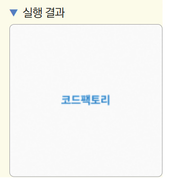
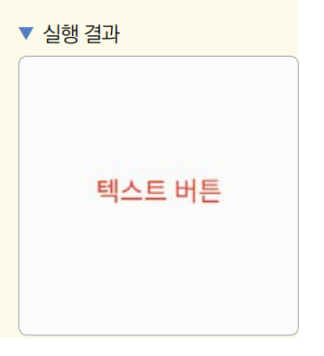
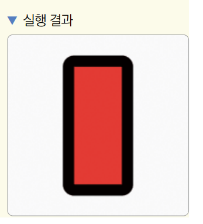
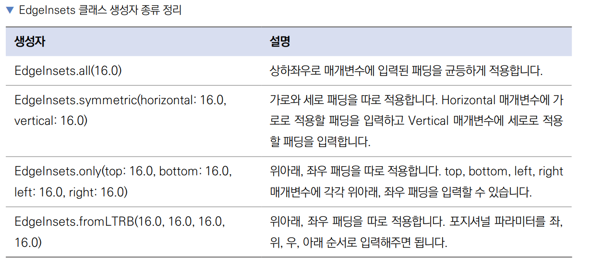

# **기본 위젯 알아보기**  
# **위젯 소개**  
'Everything is a Widget'은 구글에서 플러터를 소개하는 문구이다. 한국어로 직역하면 '모든 것은 위젯이다'이다. 플러터에서 
화면에 보여지는 UI와 관련된 모든 요소는 위젯으로 구성되어 있다. 위젯은 현재 주어진 상태(데이터)를 기반으로 어떤 UI를 구현할지를 
정의한다. 위젯의 상태가 변경되면 변경 사항에 알맞게 변경된 UI를 화면에 다시 그린다. 이때 플러터 프레임워크는 기존 상태의 
위젯과 새로운 사앷의 위젯을 비교해서 UI 변화를 반영할 때 필요한 최소한의 변경 사항을 산출해서 화면에 그려낸다. 결과적으로 
플러터는 최소한의 리소스를 이용해서 UI 변경을 이끌어낼 수 있으며 쉽게 최대 120FPS까지 높은 퍼포먼스를 발휘할 수 있다.  
  
위젯은 자식을 하나만 갖는 위젯과 자식을 여럿 갖는 위젯으로 나눈다. 자식을 하나만 갖는 대표적인 위젯들은 다음과 같으며 대체로 
child 매개변수를 입력받는다.  
  
- Container 위젯: 자식을 담는 컨테이너 역할을 한다. 다만 단순하게 자식을 담는 역할을 하는 게 아니라 배경색, 너비와 높이, 
테두리 등의 디자인을 지정할 수 있다.  
- GestureDetector 위젯: 플러터에서 제공하는 제스처 기능을 자식 위젯에서 인식하는 위젯이다. 탭이나 드래그 그리고 더블 클릭 
같은 제스처 기능이 자식 위젯에 인식됐을 때 함수를 실행할 수 있다.  
- SizeBox 위젯: 높이와 너비를 지정하는 위젯이다. Container 위젯과 다르게 디자인적 요소는 적용할 수 없고 const 생성자로 
선언할 수 있어서 퍼포먼스 측면에서 더 효율적이다.  
  
다수의 자식을 입력할 수 있는 위젯은 children 매개변수를 입력받으며 리스트로 여러 위젯을 입력할 수 있다. 대표적인 다수의 자식을 
입력할 수 있는 위젯은 아래와 같다.  
  
- Column 위젯: children 매개변수에 입력된 모든 위젯들을 세로로 배치한다.  
- Row 위젯: children 매개변수에 입력된 모든 위젯들을 가로로 배치한다.  
- ListView 위젯: 리스트를 구현할 때 사용한다. 마찬가지로 children 매개변수에 다수의 위젯을 입력할 수 있으며 입력된 위젯이 
화면을 벗어나게 되면 스크롤이 가능해진다.  
  
child와 children 매개변수에 지속적으로 하위 위젯을 입력하면 크리스마스 트리처럼 위젯 계층이 정리된다. 예를 들어 다음과 
같은 UI를 구현한다고 가정한다.  
  
  
  
위 UI의 위젯 트리는 다음과 같다. 이렇게 UI를 위젯 트리로 그릴 수 있어야 플러터 앱 프로그래밍을 할 수 있으니 두 그림 간의 
관계를 이해하자.  
  
  
  
이외에도 플러터에서 기본으로 제공하는 위젯들은 플러터 공식 웹사이트에서 API를 확인할 수 있다.  
- https://flutter.dev/docs/development/ui/widgets  
  
# **Children와 Child의 차이점**  
플러터는 위젯 아래에 계속 위젯이 입력되는 형태로 위젯 트리를 구성하여 UI를 제작한다. child 매개변수와 children 매개변수는 
위젯에 하위 위젯을 추가할 때 사용한다. 명칭에서도 알 수 있듯이 child는 위젯을 하나만 추가할 수 있고 children은 여럿을 추가할 
수 있다. 대부분 위젯은 child 또는 children 매개변수를 하나만 제공한다. child와 children 매개변수를 동시에 입력받는 
위젯은 존재하지 않는다. 다음 예제에서 child와 children 매개변수의 차이점을 알아보자.  
  
lib -> main.dart 참고  
  
1. child 매개변수에는 단 하나의 위젯만 입력할 수 있다. Center 위젯은 child 매개변수에 입력된 위젯을 가운데 정렬해주는 기능을 
갖고 있기 때문에 Text 위젯을 가운데 정렬해준다.  
  
반면 children 매개변수는 여러 위젯을 리스트에 입력할 수 있다. 리스트에 입력된 순서대로 화면에 그려진다. 위젯을 세로로 배치할 
수 있는 위젯인 Column 위젯을 사용해서 children 매개변수를 알아보자.  
  
lib -> main.dart 참고  
  
children 매개변수는 리스트를 입력받고 리스트 안에는 원하는 만큼 위젯을 입력할 수 있다. 'Code'라는 글자를 입력한 Text 위젯이 
먼저 입력됐고 이어서 'Factory'라는 글자가 입력된 Text 위젯이 입력됐으니 2행에 걸쳐 'Code Factory'라는 글자가 화면에 
그려진다.  
  
# **위젯 실습용 템플릿 작성**  
1. 프로젝트를 새로 생성한다.  
2. 앞으포 배울 위젯들을 화면에 구현하려면 배우려는 위젯 코드 외에 기본 코드가 약간 필요하다. 다음 템플릿을 참고해서 기본 
코드를 구현한 후 child 매개변수에 실습 예제들을 작성한다.  
  
lib -> main.dart 참고  
  
# **텍스트 관련 위젯**  
화면에 글자를 보여주려면 글자를 렌더링할 수 있는 위젯을 사용해야 한다. 가장 대표적인 텍스트 관련 위젯인 Text 위젯만 다룬다.  
  
- 플러터는 RichText 위젯과 Paragraph 같은 클래스도 제공한다.  
https://docs.flutter.dev/development/ui/widgets/text  
  
Text 위젯은 글자를 적고 스타일링하는 위젯이다. 첫 번재 포지셔널 파라미터에 원하는 문자열을 작성하고 style이라는 네임드 파라미터를 
사용해 스타일을 지정한다.  
  
lib -> widgets -> text_widget.dart 참고  
  
  
  
# **제스처 관련 위젯**  
사용자가 키보드로 글자를 입력하는 행위 외의 모든 입력을 플러터에서는 제스처라고 부른다. 예를 들어 화면을 한 번 탭한다거나 
두 번 탭한다거나 길게 누르는 행동 모두가 제스처이다. GestureDetector 위젯은 모든 제스터를 매개변수로 제공해준다. 제스처 
관련 위젯은 하위 위젯에 탭이나 드래그처럼 특정 제스처가 입력됐을 때 인지하고 콜백 함수를 실행한다. Button, IconButton, 
GestureDetector, FloatingActionButton 위젯을 알아보자.  
  
# **Button 위젯**  
플러터 머티리얼 패키지에서 기본 제공하는 버튼으로 TextButton, OutlinedButton, ElecatedButton이 있다. TextButton, 
OutlinedButton, ElevatedButton 모두 버튼을 누르면 색이 변경되는 리플 효과를 지원한다.  
  
  
  
lib -> widgets -> text_button_widget.dart 참고  
  
  
  
lib -> widgets -> outlined_button_widget.dart 참고  
  
  

lib -> widgets -> elevated_button_widget.dart 참고  
  
  
  
# **IconButton 위젯**  
IconButton은 아이콘을 버튼으로 생성하는 위젯이다. icon 매개변수에 보여주고 싶은 아이콘을 넣을 수 있다. onPressed 매개변수에 
IconButton을 누리면 실행할 콜백 함수를 제공할 수 있다. 아이콘은 글리프(glyph) 기반의 아이콘을 사용할 수 있으며 Icons 클래스를 
통해 플러터에서 제공하는 기본 아이콘들을 사용할 수 있다.  
  
lib -> widgets -> icon_button_widget.dart 참고  
  
# **GestureDetector 위젯**  
앱은 모든 입력을 손가락으로 한다. 그래서 손가락으로 하는 여러 가지 입력을 인지하는 위젯이 필요한데 GestureDetector가 바로 
그 역할을 한다.  
  
lib -> widgets -> gesture_detector_widget.dart 참고  
  
  
  
GestureDetector는 이뿐만 아니라 웹에서의 오른쪽 클릭, 위젯 드래그 등의 입력도 받을 수 있다.  
  
다음 표는 GestureDetector가 제공하는 중요한 제스처를 정리한 표이다.  
  
  
  
  
# **FloatingActionButton 위젯**  
FloatingActionButton은 Material Design에서 추구하는 버튼 형태이다. 안드로이드 앱들을 사용하다 보면 화면의 오른쪽 아래에 
동그란 플로팅 작업 버튼을 쉽게 볼 수 있다. FloatingActionButton과 Scaffold를 같이 사용하면 특별한 어려움 없이 해당 형태의 
디자인을 구현할 수 있다.  
  
lib -> widgets -> floating_action_button_widget.dart 참고  
  
  
  
# **디자인 관련 위젯**  
디자인 관련 위젯은 배경을 추가하거나 간격을 추가하거나 패딩을 추가하는 등 디자인적 요소를 적용할 때 사용한다.  
  
# **Container 위젯**  
Container 위젯은 말 그대로 다른 위젯을 담는 데 사용된다. 위젯의 너비와 높이를 지정하거나 배경이나 테두리를 추가할 때 많이 
사용된다.  
  
lib -> widgets -> container_widget.dart 참고  
  
  
  
Container 위젯은 다른 위젯처럼 child 매개변수를 사용할 수 있다.  
  
# **SizedBox 위젯**  
SizedBox 위젯은 일반적으로 일정 크기의 공간을 공백으로 두고 싶을 때 사용된다. Container 위젯을 사용해도 공백을 만들 
수 있지만 SizedBox는 const 생성자를 사용했을 때 퍼포먼스에서 이점을 얻을 수 있다.  
  
lib -> widgets -> sized_box_widget.dart 참고  
  
  
  
# **Padding 위젯**  
Padding 위젯은 child 위젯에 여백을 제공할 때 사용한다. Padding 위젯을 사용하면 Padding 위젯의 상위 위젯과 하위 위젯 
사이의 여백을 둘 수 있다. Padding 위젯의 padding 매개변수는 EdgeInsets라는 값을 입력해야 한다. 또한 child 매개변수에 
Padding을 적용하고 싶은 위젯을 입력할 수 있다.  
  
lib -> widgets -> padding_widget.dart 참고  
  
  
  
패딩은 적용된 위젯이 차지하는 크기 내부에서 간격이 추가된다. 플러터에서 자주 사용하지는 않지만 위젯의 바깥에 간격을 추가해주는 마진이라는 
기능도 있다. 다만 마진은 따로 위젯이 존재하지 않고 Container 위젯에 추가할 수 있다.  

lib -> widgets -> padding_widget.dart 참고  
  
  
  
EdgeInsets 클래스는 다양한 생성자를 제공한다. 자세한 사항은 다음 표를 참고하자.  
  
  
  
# **SafeArea**  
현대 핸드폰은 크기와 디자인 모두 여러 가지이다. 특히 애플 아이폰의 노치 디자인은 정말 특이한 디자인이다. 플러터는 가용되는 
화면을 모두 사용하기 때문에 노치가 있는 핸드폰에서 노치에 위젯들이 가릴 수 있다. SafeArea 위젯을 사용하면 따로 기기별로 예외 
처리를 하지 않고도 안전한(Safe) 화면에서만 위젯을 그릴 수 있다.  

lib -> widgets -> safe_area_widget.dart 참고  
  
  
  

