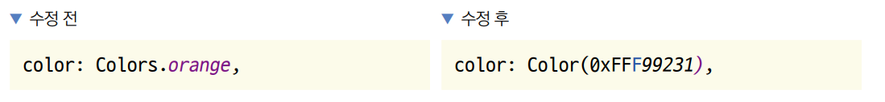

# **앱을 만들려면 알아야 하는 그 밖의 지식**  
# **앱 만들기 프로세스**  
현업에서는 기획 -> UI 구상하기 -> 구현하기 -> 테스트 순서로 만든다. 앱을 개발하는 흐름은 협업의 순서와 비슷한 순서로 
진행한다.  
  
  
  
현업에서 UI로 레이아웃을 구성할 때는 프로토타입을 만들어볼 수 있는 피그마, 어도비 XD, 플러터 플로우 프로그램을 주로 
사용한다.  
  
  
  
구현할 때는 폴더 구조를 잘 잡아야 협업이 편하고 유지보수가 용이하다. 이 책은 다음과 같은 폴더 구조를 잡는다. 구조에 정답은 
없다.  
  
  
  
# **플러그인 추가 방법**  
오픈 소스 프로젝트들은 불러와서 원하는 프로젝트에 추가하면 개발 속도를 비약적으로 높일 수 있다. 예를 들어 웹 브라우저 기능을 
추가하려면 WebView가 필요한데 직접 구현하려면 몇 달이 넘게 걸린다. 다행이 webview_flutter 플러그인이 플러터 오픈 소스 저장소인 
pub.dev에 공개돼 있어서 직접 구현하지 않고 가져다 쓰면 그만이다. 그 외 카메라, 블루투스, GPS 등 다양한 플러그인이 제공된다.  
  
플러터 프로젝트를 생성하면 자동으로 생성되는 pubspec.yaml 파일에 원하는 플러그인을 추가하고 [pub get] 버튼을 눌러주면 
등록한 플러그인을 바로 프로젝트에서 사용할 수 있다.  
  
  
  
dependencies에 사용할 플러그인을 등혹하면 된다. 하단에 웹뷰 플러그인을 적었다. 콜론: 오른쪽에 해당 플러그인 버전을 
작성하면 플러그인을 프로젝트에 추가할 수 있다.  
  
플러그인을 pubspec.yaml에 추가하고 나면 플러그인들을 내려받고 프로젝트에 적용시켜야 한다. 안드로이드 스튜디오에서 pubspec.yaml 
파일을 열면 파일 화면의 오른쪽 위에 [pub get] 버튼이 생긴다. 이 버튼을 눌러주면 플러그인뿐만 아니라 pubspec.yaml에서 
설정한 모든 요소를 현재 프로젝트에 적용시킬 수 있다.  
  
  
  
# **주변 장치 종류**  
플러터 프레임워크는 다양한 하드웨어 기능을 제공한다. 그래서 스마트폰에서 장치를 손쉽게 사용할 수 있다. 대표적으로 움직임을 
측정하는 센서 및 GPS 기능, 카메라 그리고 블루투스나 와이파이 같은 네트워크 기능이 있다. 이 책에서는 센서, GPS, 카메라 기능을 
활용해 앱을 만든다. 그 외 기능에 대해서도 아래 표를 참고하자.  
  
  
  
# **연습용 앱 만들기: 스플래시 스크린 앱**  
앱이 로딩되는 동안 보이는 스플래시 스크린을 간단하게 구현하면서 위젯을 화면에 배치하는 Row 위젯과 Column 위젯을 사용한다.  
  
  
  
# **사용자 정의 위젯 만들기: 스테이트리스 위젯**  
1. 실습에 사용할 프로젝트를 생성한다.  
- 프로젝트 이름: splash_screen
- 네이티브 언어: 코틀린  
  
2. 위젯의 형태는 2가지로 나뉜다. 위젯의 내부에서 값이 변경되었을 때 위젯 자체에서 다시 렌더링을 실행시킬 수 있는 
스테이트풀(stateful) 위젯과 위젯 내부에서 값이 변경되어도 위젯 자체적으로는 다시 렌더링 할 수 없는 스테이트리스(stateless) 
위젯이다. 여기서는 플러터의 가장 기본이 되는 스테이트리스 위젯을 직접 구현한다. SplashScreen라는 이름의 스테이트리스 위젯 
클래스를 main.dart 파일에 추가한다.  
  
lib -> main.dart  
  
플러터에서 기본으로 제공하는 StatelessWidget이라는 클래스를 사용자 정의 위젯(SplashScreen 클래스)이 상속받으면 된다. 
그러면 build() 함수를 필수적으로 오버라이드하게 되는데 화면에 그려주고 싶은 위젯을 입력하면 된다. 사용자 정의해서 만든 
SplashScreen 위젯을 앱 전체 화면으로 사용한다. 그러므로 runApp() 함수의 매개변수로 제공한다.  
  
3. 아직 SplashScreen의 build() 함수에서 아무것도 반환을 해주지 않는다. MaterialApp 위젯과 Scaffold 위젯을 기본 제공한 
뒤 화면 중앙에 Splash Screen이라는 글자를 넣는다. 지금은 MaterialApp이 항상 최상단에 입력되고 그다음으로 Scaffold 앱이 
입력된다는 정도로만 알고 있으면 된다.  

lib -> main.dart  
  
4. 코드를 실행하면 화면 중앙에서 Splash Screen 이라는 글자를 확인할 수 있다. runApp()에 SplashScreen 위젯을 매개변수로 
제공해주었더니 앱 화면에서 SplashScreen의 build() 함수에 있는 코드의 실행 결과가 보인다. 이로써 사용자 정의 위젯을 
정의해 사용했다. 아울러 build() 함수가 위젯의 UI를 결정한다는 걸 알 수 있다.  
  
# **배경색 바꾸기: Container와 BoxDecoration 위젯**  
이번에는 배경색을 바꾼다. 배경 관련 UI를 변경할 떄 Container 위젯을 가장 많이 사용한다.  
  
1. 배경색을 화면 전체에 적용할 계획이니 Scaffold 위젯 바로 아래에 Container 위젯을 적용해 배경화면을 오랜지색으로 
변경한다.  
   
lib -> main.dart  
  
Container는 decoration이라는 네임드 파라미터를 제공한다. decoration이라는 매개변수에는 BoxDecoration 클래스를 사용하게 
되는데 BoxDecoration의 매개변수를 통해서 배경색, 테두리 색상, 테두리 두께 등 컨테이너의 여러 가지 UI 요소를 지정할 수 있다. 
BoxDecoration의 color 매개변수에 Colors.orange값을 적용했다. 일반적으로 프로그래밍할 때 색상은 헥스 코드(예: #FEFEFE)를 
사용해서 지정한다. 플러터에서도 헥스 코드를 사용해서 정확한 색상을 지정하는 방법도 있지만 Colors 클래스를 이용하면 헥스 
코드 없이 쉽게 기본 색상 중에 원하는 색상을 골라낼 수 있다.  
  
2. 코드를 작성하고 나면 파일을 저장한다. 저장을 하고 나면 따로 실행 버튼을 누리지 않았는데 앱의 화면이 변경한 코드대로 반영된다. 
핫 리로드(hot reload)라는 편리한 기능 덕분이다.  
  
# **이미지 출력하기: Image 위젯**  
'Splash Screen'이라는 글자 대신 코드팩토리 로고를 출력한다. Text 위젯 대신에 이미지를 보여줄 Image 위젯을 사용하면 된다. 
Image 위젯은 다음과 같이 다섯 가지 생성자가 있다.  
  
1. 기본 Image 생성자는 ImageProvider라는 또 다른 위젯에서 이미지를 그린다.  
2. Image.asset 생성자는 앱에 저장된 asset 파일로 이미지를 그린다.  
3. Image.network 생성자는 URL을 통해서 이미지를 그린다.  
4. Image.file 생성자는 파일을 통해서 이미지를 그린다.  
5. Image.memory 생성자는 메모리에서 직접 이미지를 그린다.  
  
우선 앱에 저장해둔 asset 파일로 이미지를 그려낼 수 있는 Image.asset 생성자를 사용한다.  
  
1. 깃허브에서 예제 프로젝트의 코드팩토리 로고를 다운로드 한다. 프로젝트 폴더에 assets 폴더를 생성한다. 그리고 assets 
폴더에 내려받은 코드팩토리 이미지를 logo.png 라는 이름으로 저장한다.  
  
2. assets 폴더에 로고 파일을 추가했지만 아직은 화면에 불러올 수 없다. 프로젝트 구조를 보면 맨 아랫부분에 pubspec.yaml 파일이 있다. 
플러터 프로젝트가 처음 생성되면서 자동으로 생성되는 파일인데 프로젝트에서 사용할 폰트, 이미지, 외부 플러그인 등을 지정하는데 
사용한다. 따라서 이미지를 담을 asset 폴더를 pubspec.yaml 파일에 지정해야 한다.  
  
3. flutter.assets라는 키에 assets 폴더를 지정한다.  
  
pubspec.yaml 참조  
  
YAML에서 - 기호는 리스트값을 의미하기 떄문에 원하는 만큼 -로 시작하는 값들을 계속 추가할 수 있다.  
  
4. pubspec.yaml은 플러터 프로젝트의 모든 설정이 담긴 파일이다. 설정을 변경했으므로 asset 파일을 프로젝트에 추가하고 
새로운 플러그인을 내려받는 등 추가 작업이 필요하다. 플러터에서는 pub get 기능을 제공해 이 작업을 자동으로 처리해준다. 
파일이 수정되었을 때 에디터 위에 자동으로 나타나는 pub get 기능을 클릭해 실행한다.  
  
5. pub get 기능을 실행하고 나면 앱을 다시 실행을 해야 새로 바뀐 설정이 적용된다. 앱을 종료한 후 다시 실행 버튼을 눌러서 
새로운 설정을 적용한 채로 앱을 실행한다.  
  
6. 코드를 변경한 게 없기 때문에 앱을 재실행해도 화면은 바뀌지 않는다. 하지만 이제 assets/logo.png 파일을 플러터 코드에서 
불러올 수 있게 되었다. 글자를 보여주는 Text 위젯을 그림을 보여주는 Image.asset 위젯으로 대체한다.  
   
lib -> main.dart  
  
Image.asset은 매개변수 하나를 받게 된다. 파일의 위치(여기서는 assets/logo.png)를 적어주면 된다.  
  
7. 이미지를 화면에 보여주는 건 성공했지만 로고 이미지의 배경 색상이 앱 전체의 배경 색상과 맞지 않는다. Colors.orange 대신에 
배경색의 정확한 헥스 코드를 사용해서 이미지 배경색과 앱의 배경색을 똑같이 맞춘다. 코드팩토리 로고의 정확한 헥스 코드는 
#F99231이다.  
  
헥스 코드를 색상으로 사용하려면 Colors 대신 Color라는 클래스를 사용해야 한다. 다음과 같이 해당 코드를 수정한다.  
  
  
  
Colors 클래스를 단순히 Color로 변경하고 첫 번째 위치 매개변수에 헥스 코드를 제공해 색상을 표현했다. 6자리 헥스 코드의 
앞에 16진수를 의미하는 0x와 불투명도 100%를 의미하는 'FF'를 추가한 다음에 헥스 코드를 # 없이 입력하면 된다. 결과적으로 
F99231이라는 색상은 0xFFF00231로 입력하면 된다.  
  
