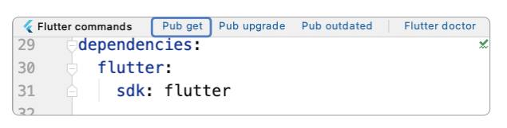

# **앱을 만들려면 알아야 하는 그 밖의 지식**  
# **앱 만들기 프로세스**  
현업에서는 기획 -> UI 구상하기 -> 구현하기 -> 테스트 순서로 만든다. 앱을 개발하는 흐름은 협업의 순서와 비슷한 순서로 
진행한다.  
  
  
  
현업에서 UI로 레이아웃을 구성할 때는 프로토타입을 만들어볼 수 있는 피그마, 어도비 XD, 플러터 플로우 프로그램을 주로 
사용한다.  
  
  
  
구현할 때는 폴더 구조를 잘 잡아야 협업이 편하고 유지보수가 용이하다. 이 책은 다음과 같은 폴더 구조를 잡는다. 구조에 정답은 
없다.  
  
  
  
# **플러그인 추가 방법**  
오픈 소스 프로젝트들은 불러와서 원하는 프로젝트에 추가하면 개발 속도를 비약적으로 높일 수 있다. 예를 들어 웹 브라우저 기능을 
추가하려면 WebView가 필요한데 직접 구현하려면 몇 달이 넘게 걸린다. 다행이 webview_flutter 플러그인이 플러터 오픈 소스 저장소인 
pub.dev에 공개돼 있어서 직접 구현하지 않고 가져다 쓰면 그만이다. 그 외 카메라, 블루투스, GPS 등 다양한 플러그인이 제공된다.  
  
플러터 프로젝트를 생성하면 자동으로 생성되는 pubspec.yaml 파일에 원하는 플러그인을 추가하고 [pub get] 버튼을 눌러주면 
등록한 플러그인을 바로 프로젝트에서 사용할 수 있다.  
  
  
  
dependencies에 사용할 플러그인을 등혹하면 된다. 하단에 웹뷰 플러그인을 적었다. 콜론: 오른쪽에 해당 플러그인 버전을 
작성하면 플러그인을 프로젝트에 추가할 수 있다.  
  
플러그인을 pubspec.yaml에 추가하고 나면 플러그인들을 내려받고 프로젝트에 적용시켜야 한다. 안드로이드 스튜디오에서 pubspec.yaml 
파일을 열면 파일 화면의 오른쪽 위에 [pub get] 버튼이 생긴다. 이 버튼을 눌러주면 플러그인뿐만 아니라 pubspec.yaml에서 
설정한 모든 요소를 현재 프로젝트에 적용시킬 수 있다.  
  
  
  
