# **블로그 웹 앱 (콜백 함수, 웹뷰, 네이티브 설정)**  
# **프로젝트 구상하기**  
이번 앱을 구현하려면 두 가지 개념을 배워야 한다. 첫 번째로는 이 프로젝트에서 가장 중요한 웹뷰이다. 웹뷰는 웹사이트의 
URL을 입력하면 해당 웹사이트를 화면에 보여주는 역할을 한다. 네이티브 UI가 아니기 때문에 약간의 이질감은 있지만 웹사이트를 
쉽게 앱으로 구현할 수 있다. 두 번째는 머티리얼 디자인 요소인 앱바(AppBar)이다. 앱 맨 위에 페이지 이름이나 앱 이름이 
적혀 있는 이런 형태의 UI를 그려주는 위젯이 바로 앱바이다.  
  
# **사전지식**  
# **콜백 함수**  
콜백 함수는 일정 작업이 완됴되면 실행되는 함수이다. 함수를 정의해두면 바로 실행되지 않고 특정 조건이 성립될 때 실행되기 
때문에 이름이 콜백이다. 예를 들어 유저가 화면을 터치했을 때 실행할 함수나 웹뷰의 로딩이 완료되면 실행할 콜백 함수를 
다음과 같이 정의할 수 있다.  
  
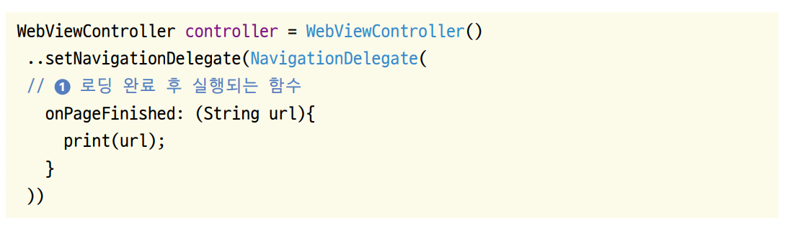  
  
onPageFinished()는 웹뷰에서 페이지 로딩이 완료된 뒤에 실행되는 콜백 함수이다. 이 함수는 첫 번째 매개변수로 로딩된 
페이지의 URL을 반환해준다. 페이지 로딩 후 실행하고 싶은 작업이 있다면 함수 내부에 코드를 정의하면 된다. 웹뷰 위젯
(WebviewWidget) 위젯의 콜백 함수는 onPageFinished() 함수에서만 지정할 수 있는 게 아니다. onWebViewCreated(), 
onPageStarted(), onProgress() 등 측정 조건이 성립됐을 때 실행되는 콜백 함수도 있다.  
  
# **웹뷰 위젯**  
웹뷰는 프레임워크에 내장된 브라우저를 앱의 네이티브 컴포넌트에 임베딩하는 기능이다. 다시 말해 앱에서 웹 브라우저 기능을 
구현해주는 기술이다. 웹뷰는 네이티브 컴포넌트에 비해 속도가 느리고 애니메이션이 부자연스럽다는 단점이 있다. 그럼에도 많은 
앱에서 웹뷰를 사용하는 이유는 기존에 만든 웹사이트를 손쉽게 활용할 수 있기 때문이다. 예를 들어 이미 만들어져 있는 웹사이트가 
존재한다고 하자. 웹뷰를 사용하면 코드 몇 줄로 해당 사이트를 앱에 웹뷰로 탑재해서 앱을 출시할 수 있다. 또한 결제 모듈을 
PG사에서 웹으로 이미 기능을 구현해두었기 때문에 웹뷰를 사용하면 굳이 시간을 추가로 들여 결제 기능을 개발할 필요가 없어진다. 
플러터에서도 웹뷰 위젯을 제공해주며 이 위젯을 사용하면 플러터 앱에서 브라우저를 실행할 수 있다.  
  
웹뷰를 구현할 때 사용할 웹뷰 위젯은 controller 파라미터에 WebViewController 객체를 입력해줘야 한다. 웹뷰 컨트롤러는 웹뷰 
위젯을 제어하는데 필요한 기능들을 제공해준다. 웹뷰 컨트롤러에서 흔히 사용하는 함수는 아래와 같다.  
  
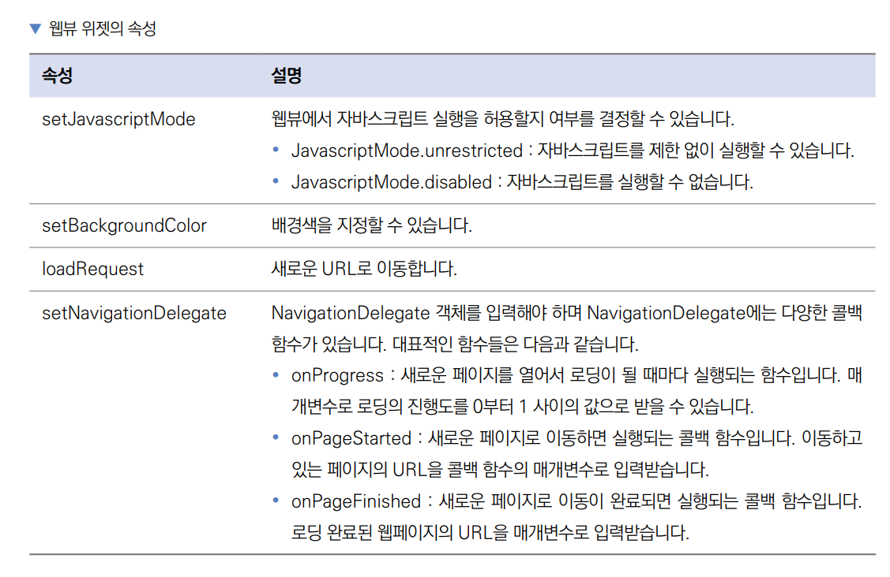  
  
# **안드로이드와 iOS 네이티브 설정**  
다트 언어만 사용해서 모든 작업을 할 수 있다면 매우 편하겠지만 플러터 또한 결국 각 네이티브 플랫폼으로 코드가 컴파일되므로 
최소한의 네이티브 설정은 필요하다. 예를 들어 이번 프로젝트에는 인터넷 권한과 https 프로토콜에 관한 권한 설정이 필요하다. 
카메라, 사진첩, 푸시 권한 등 보안에 민감한 사항이나 하드웨어에 접근할 떄도 네이티브 설정을 해야 한다.  
  
네이티브 설정을 하는데 안드로이드와 iOS 네이티브 프로그래밍을 할 줄 몰라도 크게 문제가 없다. 네이티브 설정이 필요한 
플러그인은 보통 플러그인 홈페이지에 설정법이 상세히 기재되어 있다. 네이티브 설정이 필요한 경우는 일반적으로 해당 플러그인의 
pub.dev 소개 페이지에서 확인할 수 있다.  
  
# **사전 준비**  
프로젝트 초기화 방법과 권한 및 네이티브 설정 방법은 모든 프로젝트에서 공통된 사항이므로 확실히 익혀두어야 한다.  
  
1. 실습에 사용할 프로젝트를 생성한다.  
- 프로젝트 이름: blog_web_app
- 네이티브 언어: 코틀린  
  
# **pubspec.yaml 설정하기**  
pubspec.yaml 파일은 플러터 프로젝트와 관련된 설정을 하는 파일이다. 프로젝트에서 사용할 이미지 및 폰트를 지정하거나 
사용할 오픈 소스 프로젝트들을 명시할 때 사용된다.  
  
1. webview_flutter 플러그인을 pubspec.yaml 파일에 추가하고 pub get을 실행한다.  
  
pubspec.yaml 참고  
  
다음 표는 주요 pub 명령어를 정리한 것이다.  
  
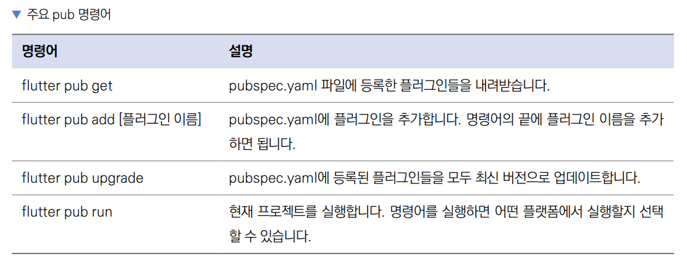  
  
# **권한 및 네이티브 설정하기**  
웹뷰를 사용하려면 몇 가지 네이티브 설정이 필요하다. 인터넷 사용 권한을 추가하고 https 프로토콜뿐만 아니라 http 프로토콜도 
이용할 수 있게 수정한다.  
  
# **안드로이드 설정**  
1. 안드로이드 설정 파일은 android/app/src/main/AndroidManifest.xml이다. 안드로이드 앱에 필요한 각종 권한을 여기서 설정할 
수 있다. AndroidManifest.xml 파일을 연다.  
  
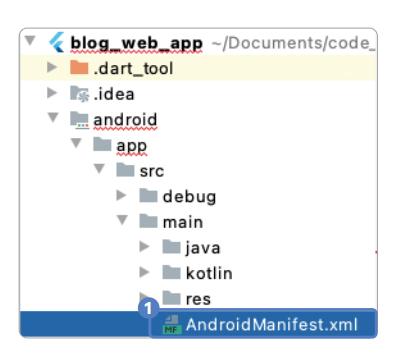  
  
2. 웹뷰를 실행할 때 인터넷을 사용해야 하니 인터넷 권한을 추가한다.  
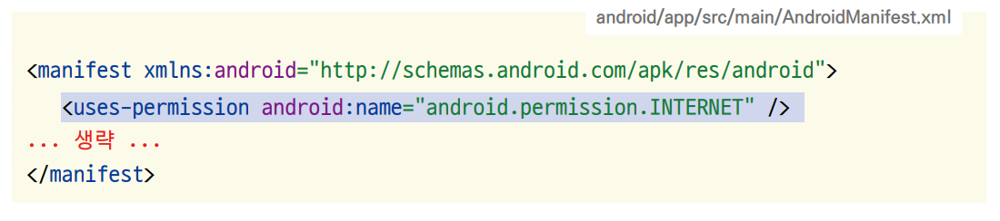  
  
자주 사용하는 안드로이드 권한은 아래 표를 참고하자.  
  
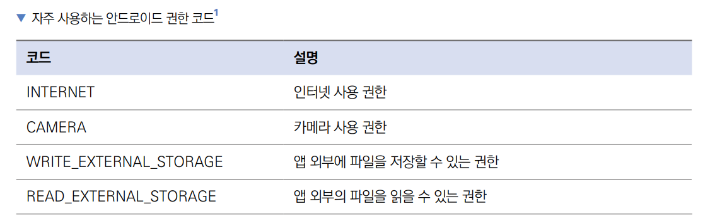  
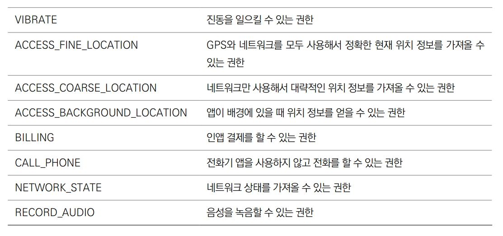  
  
3. 현대 웹사이트는 대부분 https 프로토콜을 사용하지만 아직도 http 프로토콜을 사용하는 웹사이트도 있다. 안드로이드와 iOS에서는 
모두 기본적으로 http 웹사이트를 사용할 수 없도록 설정되어 있다. 이 설정을 해제하려면 다음 코드를 추가한다. 만약에 http 프로토콜을 
허용할 필요가 없다면 이번 코드는 추가할 필요가 없다.  
  
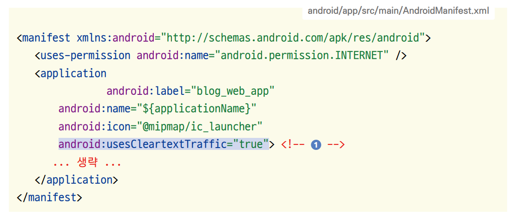  
  
# **iOS 설정**  
1. ios/Runner/Info.plist 파일을 연다.  
  
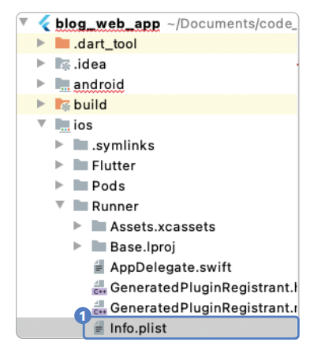  
  
Info.plist에서도 http 프로토콜을 사용하는 설정을 추가한다.  
  
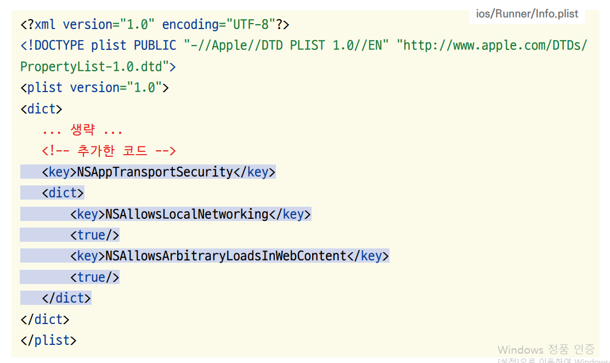  
  
Info.plist 파일은 iOS 앱의 런타임을 설정하는 파일이다. 플러터 프로젝트를 생성하면 자동으로 필수 키가 생성된다. NSAppTransportSecurity는 
http 프로토콜을 허용하는 키값이지만 앞으로 Info.plist에 우리가 입력할 값들은 대부분 앱에서 이미지, 카메라 등 권한 요청을 
할 때 보여줄 메시지를 정의한다.  
  
권한 메시지 사용 예제는 다음과 같다.  
  
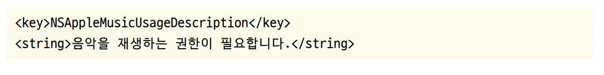  
  
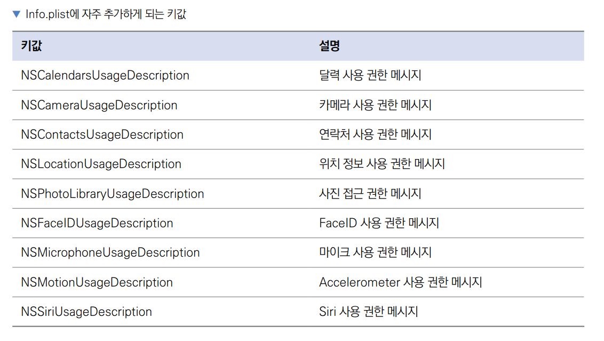  
  
나머지 키에 관련된 정보는 애플 공식 사이트에서 찾아볼 수 있다.  
  
# **프로젝트 초기화하기**  
프로그래밍을 하다 보면 폴더와 파일의 정리가 매우 중요하다. 프로젝트가 작을 때는 원하는 코드나 특정 파일을 찾는 게 어렵지 
않지만 프로젝트가 커질수록 복잡해진다. 이번 프로젝트를 포함해 앞으로 진행할 모든 프로젝트에서 화면과 관련된 모든 위젯을 
[screen] 폴더에 모아둔다.  
  
1. lib 폴더 안에 screen 폴더를 생성한다. 그 다음 screen 폴더 안에 앱의 기본 홈 화면으로 사용할(사용자 지정 위젯인) 
홈 스크린 위젯을 생성할 home_screen.dart 파일을 생성한다.  
  
2. home_screen.dart 파일에 HomeScreen이라는 StatelessWidget을 생성한다. 이 위젯은 블로그 웹 앱을 실행했을 때 가장 
먼저 실행되는 홈 화면이 된다.  
  
lib -> screen -> home_screen.dart  
  
생성자 앞에 const 키워드를 추가하면 const 인스턴스를 생성할 수 있다. 한 번 생성된 const 인스턴스 위젯은 재활용되어서 
하드웨어 리소스를 적게 사용할 수 있다.  
  
3. main.dart 파일에 자동 생성된 기존 코드를 지우고 HomeScreen()을 불러오는 코드를 작성한다. MaterialApp 위젯은 
플러터 앱의 최상위 위젯이며 앱이 처음 실행됐을 때 보여줄 화면을 home 매개변수에 입력할 수 있다. HomeScreen()을 불러와서 
앱의 첫 화면으로 설정한다.  
  
lib -> main.dart  
  