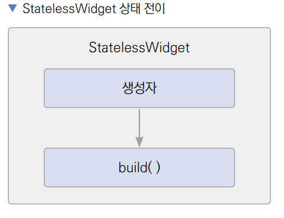
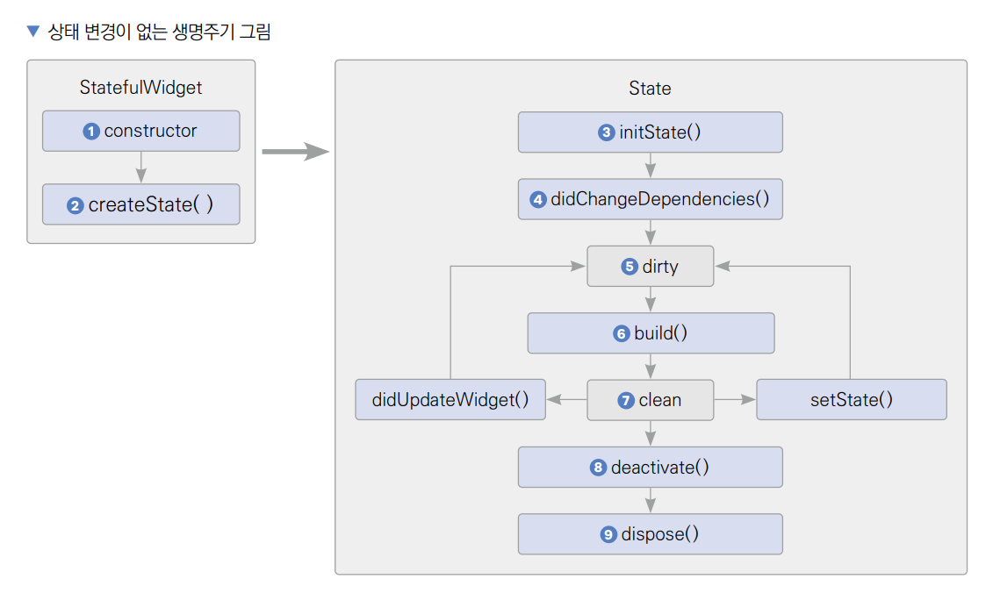

# **전자액자 (위젯 생명주기, PageView, Timer, SystemChrome, StatefulWidget)**  
# **프로젝트 구상하기**  
이번 프로젝트에서는 세 가지 요소에 집중한다. 첫 번째로 PageView 위젯이다. PageView 위젯은 가로 또는 세로로 스와이프해 
화면에 보이는 위젯을 변경하도록 해준다. 두 번째는 Timer다. Timer는 일정 기간을 기다리거나 주기적으로 반복 작업을 
실행하는 데 사용된다. 마지막으로는 StatefulWidget이다. 지금까지 StatelessWidget만 사용해왔는데 Timer를 효율적으로 
사용하려면 StatefulWidget과 StatefulWidget의 생명주기에 대해 알아야 한다.  
  
# **사전 지식**  
# **위젯 생명주기**  
위젯 생명주기는 위젯이 화면에 그려지는 순간부터 삭제되는 순간까지의 주기를 의미한다.  
  
# **StatelessWidget**  
지금까지 작성한 위젯은 모두 StatelessWidget이었다. 직역하면 상태가 없는 위젯이라는 뜻인데 이 위젯의 생명주기는 굉장히 
간단하다. 먼저 StatelessWidget이 빌드되면 생성자가 실행된다. 이어서 필수로 오버라이드해야 하는 build() 함수가 실행된다. 
마지막으로 build() 함수에 반환한 위젯이 화면에 렌더링된다.  
  
  
  
플러터에서 모든 위젯은 Widget 클래스를 상속하고 Widget 클래스는 불변 특성을 갖고 있다. 불변이란 클래스를 한 번 생성하고 나면 
속성을 변경할 수 없다는 뜻이다.  
  
하지만 분명히 위젯의 속성을 변경해야 할 때가 있다. 예를 들어 생성자에 새로운 매개변수가 입력되는 경우이다. build() 함수에서 
매개변수 값을 사용하고 있다면 변경된 매개변수를 기반으로 build() 함수를 재실행해줘야 한다. 하지만 스테이트리스 위젯은 
불변이기 떄문에 한 번 생성된 인스턴스의 build() 함수는 재샐행되지 않는다. 대신 인스턴스를 아예 새로 생성한 후 기존 인스턴스를 
대체해서 변경 사항을 화면에 반영한다.  
  
# **StatefulWidget**  
스테이트풀위젯은 스테이트리스위젯과 다른 목적으로 탄생했다. 외부에서 위젯 생성자의 매개변수를 변경해주면 위젯이 새롭게 
생성되고 build()가 실행되기까지 과정은 StatelessWidget과 같다. 하지만 위젯 내부에서 자체적으로 build() 함수를 재실행해야 
하는 상황이 있다. 이때 StatefulWidget을 사용하면 된다.  
  
StatelessWidget과 다르게 StatefulWidget은 위젯 클래스와 스테이트 클래스 2개로 구성되어 있고 생명주기가 훨씬 복잡하다.  
  
# **상태 변경이 없는 생명주기**  
상태 변경이 없는 생명주기는 위젯이 화면에 나타나며 생성되고 화면에서 사라지며 삭제되는 과정을 의미한다. 중간에 위젯의 
상태가 변경되지 않는다.  
  
  
  
1. StatefulWidget 생성자가 실행된다.  
2. createState() 함수가 실행된다. createState() 함수는 필수로 오버라이드해야 하는 함수로 StatefulWidget과 연동되는 
State를 생성한다.  
3. State가 생성되면 initState()가 실행된다. initState()는 State가 생성되는 순간에만 단 한 번 실행되고 절대로 다시 
실행되지 않는다.  
4. didChangeDependencies()가 실행된다. initState()와 다르게 BuildContext가 제공되고 State가 의존하는 값이 변경되면 
재실행된다.  
5. State의 상태가 dirty로 설정된다. dirty 상태는 build()가 재실행돼야 하는 상태이다.  
6. 따라서 build() 함수가 실행되고 UI가 반영된다.  
7. build() 실행이 완료되면 상태가 clean 상태로 변경된다. 화면에 변화가 없으면 이 상태를 유지한다.  
8. 위젯이 위젯 트리에서 사라지면 deactivate()가 실행된다. deactivate()는 State가 일시적 또는 영구적으로 삭제될 때 실행된다.  
9. dispose()가 실행된다. 위젯이 영구적으로 삭제될 때 실행된다.  
  
# **StatefulWidget 생성자의 매개변수가 변경됐을 때 생명주기**  
StatefulWidget도 StatelessWidget처럼 하나의 클래스이다. 그렇기 때문에 매개변수를 입력받을 수 있다. 위젯이 생성된 
후 삭제가 되기 전 매개변수가 변경되면 다음 생명주기가 실행된다.  
  
  
  
1. StatefulWidget 생성자가 실행된다.  
2. State의 didUpdateWidget() 함수가 실행된다.  
3. State가 dirty 상태로 변경된다.  
4. build()가 실행된다.  
5. State의 상태가 clean으로 변경된다.  
  
# **State 자체적으로 build()를 재실행할 때 생명주기**  
StatelessWidget은 생성될 때 build() 함수가 한 번 실행되고 절대로 다시 실행되지 않는다. 반면 StatefulWidget은 
StatefulWidget 클래스와 State 클래스로 구성돼 있는데 State 클래스는 setState() 함수를 실행해서 build() 함수를 자체적으로 
재실행할 수 있다.  
  
  
  
1. setState()를 실행한다.  
2. State가 dirty 상태로 변경된다.  
3. build()가 실행된다.  
4. State의 상태가 clean으로 변경된다.  
  
# **Timer**  
Timer는 특정 시간이 지난 후에 일회성 또는 지속적으로 함수를 실행한다. 이번 프로젝트에서는 Timer.periodic()을 사용해서 
주기적으로 콜백 함수를 실행한다. Timer.periodic()은 매개변수 2개를 입력받는다.  
  
  
  
1. 콜백 함수를 실행할 주기를 지정한다. Duration에 days, hours, minutes, seconds, milliseconds, microseconds 매개변수를 
이용해서 주기를 정할 수 있다.  
2. 주기가 지날 떄마다 실행할 콜백 함수다. 매개변수에 현재 실행 중인 Timer 객체가 제공된다.  
  
Timer의 생성자는 Timer(), Timer.periodic() 두 가지다. 각각에 대해서는 다음 표를 참고하자.  
  
  
  
# **사전 준비**  
실습에 사용할 프로젝트를 생성한다.  
- 프로젝트 이름: image_carousel
- 네이티브 언어: 코틀린  
  
# **이미지 추가하기**  
에셋은 프로젝트에서 사용되는 파일들을 의미한다. 동영상, 이미지, 음악 파일 등이 예제이다. 앱에서 슬라이딩할 이미지들을 
내려받고 프로젝트에 등록한다.  
  
1. Project에서 최상의 폴더에 asset 폴더를 생성하고 그 아래 img 폴더도 생성한다.  
2. 깃허브 예제에서 이미지를 다운로드 받하 img 폴더에 넣는다.  
  
# **pubspec.yaml 설정하기**  
추가된 에셋을 pubspec.yaml에 등록한다. pubspec.yaml 파일은 프로젝트의 의존성과 에셋을 등록하는 파일이다. 프로젝트에서 
사용할 에셋 파일을 등록해줄 때는 pubspec.yaml 파일의 중간쯤에 있는 flutter 키에 assets 키를 작성하고 사용할 에셋이 있는 
위치(asset/img/)를 다음과 같이 적어준다. 마지막으로 pub get을 실행해주면 등록한 에셋을 프로젝트에서 사용할 수 있다.  
  
pubspec.yaml 참고  
  
# **프로젝트 초기화하기**  
1. lib 폴더에 screen 폴더를 생성하고 앱의 기본 홈 화면으로 사용할 HomeScreen 위젯을 생성할 home_screen.dart를 생성한다. 
  
lib -> screen -> home_screen.dart  
  
2. lib/main.dart 파일에서도 마찬가지로 HomeScreen을 홈 위젯으로 등록한다.  
  
lib -> main.dart  
  
