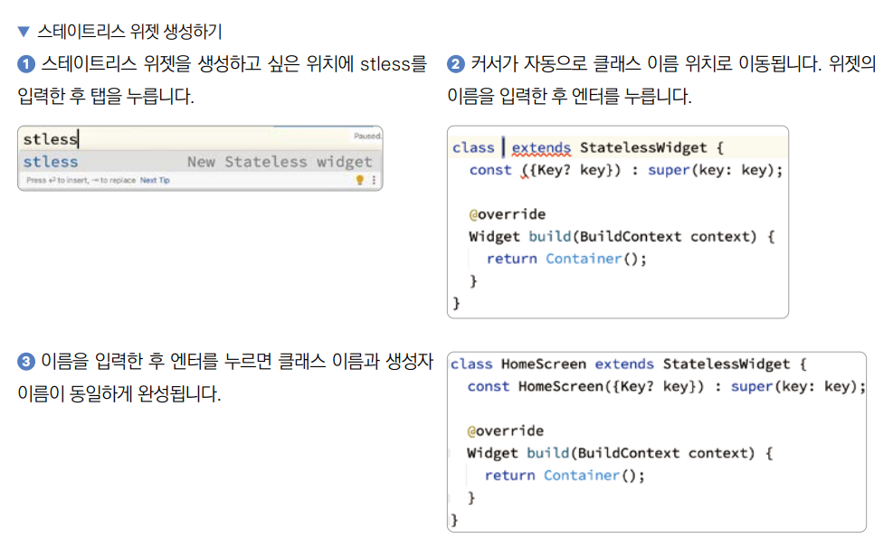

# **부록**  
# **데이터베이스 종류와 하이브**  
모바일에서는 SQLite와 하이브(Hive)를 클라이언트 사이드 데이터베이스로 주로 사용한다. 추가로 파이어스토어를 사용해서 
간단한 서버 사이드 NoSQL 데이터베이스 및 API를 구현하기도 한다. 18장에서는 SQLite를 드리프트 플러그인을 사용해서 다룬다. 
20장에서는 파이어베이스의 공식 플러그인을 사용해서 파이어스토어를 다룬다. SQLite와 하이브 중에는 SQLite가 사용법이 
조금 더 복잡하다. 하지만 플러터 생태계에서는 SQLite만큼 하이브 또한 큰 점유율을 유지하고 있다.  
  
# **하이브**  
하이브는 NoSQL 데이터베이스이면서 동시에 인메모리 데이터베이스다. 데이터를 파일에 저장하기 떄문에 앱의 생명주기와 
관계없이 데이터가 유지되지만 앱이 실행되는 순간 파일에 저장돼 있던 모든 데이터가 메모리에 올라오기 떄문에 빠른 속도를 
자랑한다. 하이브는 사용법이 크게 어려운 편이 아니다.  
  
1. 프로젝트를 생성한다.  
- 프로젝트 이름: hive_db_practice  
- 네이티브 언어: 코틀린  
  
2. pubspec.yaml에 하이브 관련 패키지들을 추가한다. 하이브는 코드 생성 기능을 지원하기 때문에 build_runner와 hive_generator 등 
코드 생성을 제공하는 플러그인도 추가해줘야 한다.  
  
pubspec.yaml 참고  
  
3. 하이브를 초기화한다. main() 함수에 하이브를 꼭 초기화해줘야지만 프로젝트에서 하이브를 사용할 수 있다.  
  
lib -> main.dart  
  
4. 하이브에는 박스라는 개념이 있다. SQL에서의 테이블처럼 똑같은 타입의 데이터를 모아두는 공간이다. 특정 데이터를 저장하고 
다루기 위해서는 박스를 열어야 한다. 박스를 열 때는 어떤 타입의 데이터를 저장할지 박스의 이름을 지정해주면 된다.  
   
lib -> main.dart  
  
String 타입을 저장할 student_name이라는 명칭을 갖는 박스를 연다. 이 박스에 접근할 때는 student_name이라는 명칭을 
사용하면 되고 String 타입만 저장할 수 있다.  
  
5. student_name 박스에 학생 이름을 입력한다. openBox() 함수를 실행해서 반환받는 박스에 add() 함수를 실행해서 값을 
추가할 수 있다.  
  
lib -> main.dart  
  
add() 함수를 이용해서 박스에 값을 추가하면 자동으로 키값이 배정된다. 박스의 toMap() 함수를 실행하면 박스의 키와 값을 
Map 형태로 반환받을 수 있다. 플러터 앱은 꼭 runApp() 함수가 있어야지만 작동하므로 runApp() 함수를 추가한다.  
  
6. 단순한 프리미티브(primitive) 타입이 아닌 클래스 형태의 데이터도 박스에 저장할 수 있다. Student라는 클래스를 생성해서 
박스에 저장할 형태를 만든다.  
  
lib -> model -> student.dart  
  
하이브에 저장될 모든 클래스는 HiveType 어노테이션을 사용해서 프로젝트에서 유일한 typeId를 지정해줘야 한다. 추후 클래스 
구조가 변경됐을 때 하이브는 typeId를 기반으로 변경된 클래스를 인식한다. 한 프로젝트 내에서 겹치지 않는 숫자이기만 하면 
된다. 하이브에 저장할 클래스의 모든 속성들은 클래스 내부에서 유일한 HiveField ID 값을 입력해줘야 한다. HiveType의 
typeId처럼 추후 필드가 변경됐을 때 Hive에서는 HiveField ID값을 기반으로 변경된 필드를 인식한다. 클래스 내부에서 
유일한 값을 지정만 해주면 된다.  
  
7. 터미널 또는 커맨드에서 flutter pub run build_runner build를 실행해서 코드 생성을 진행한다.  
  
8. 클래스 타입의 데이터도 사실상 프리미티브 타입의 데이터를 저장하는 것과 방법이 같다. 약간의 다른 점이 있다면 어댑터를 
등록해줘야 한다. 하이브에서 제공하는 registerAdapter() 함수로 쉽게 어댑터를 등록할 수 있다.  
  
lib -> main.dart  
  
프리미티브 타입을 저장할 때와 유일하게 다른 점이다. flutter pub run build_runner build를 실행해서 생성된 StudenAdapter
를 하이브에 등록한다.  
  
하이브의 box 객체에는 add() 함수 외에도 여러 가지 기능을 함수로 제공해준다.  
  
  
  
  
# **앱 이름과 아이콘 설정 방법**  
앱을 출시하기 전에 앱의 서비스 내용과 어울리는 이름과 아이콘을 설정하는 건 매우 중요한 일이다. 플러터에서도 물론 앱 이름과 
아이콘을 완전히 커스터마이즈할 수 있다.  
  
  
  
  
아이콘 파일 위치를 지정한 다음 flutter pub run flutter_launcher_icons:main을 실핸한다. iOS와 안드로이드에 모두 
자동으로 아이콘이 등록된다.  
  
# **코딩이 편해지는 안드로이드 스튜디오 편의 기능**  
# **코드 자동 정리**  
코드를 작성하다 보면 코드 간의 간격, 줄바꿈 등 포매팅이 정리가 잘 안될 때가 있다. 이때 코드 자동 정리 기능을 사용하면 
손쉽게 보기좋은 형태로 포매팅을 할 수 있다. 코드 자동 정리를 실행할 파일에 마우스 커서를 올려놓은 뒤 맥에서는 Command + 
Option + L을, 윈도우에서는 Control + Alt + L을 실행하면 된다.  
  
코드 자동 정리를 진행할 떄 주의할 부분은 콤마의 위치이다. 플러터는 줄바꿈을 할 때 콤마를 기반으로 줄바꿈을 진행하고 코드 
정리를 한다. 리스트의 끝과 마지막 매개변수를 입력 후에 , 기호를 끝에 추가해주면 해당 위치를 기반으로 줄바꿈된다.  
  
  
  
# **스테이트리스 위젯과 스테이트풀 위젯 자동 생성하기**  
플러터 개발을 하면 가장 많이 하는 작업이 스테이트리스 위젯과 스테이트풀 위젯을 생성하는 작업이다. 너무 반복적이고 템플릿 
코드가 많다. 안드로이드 스튜디오에서 플러터 플러그인을 설치하고 stless를 입력한 다음에 탭을 누르면 스테이트리스 위젯을 
생성할 수 있고 stful을 입력한 다음에 탭을 누르면 스테이트풀 위젯을 생성할 수 있다.  
  
  
  
  
# **Show Context Action**  
안드로이드 스튜디오에 플러터 플러그인을 설치하면 유용한 자동화 기능이 추가된다. 사용 방법은 Show Context Action을 
실행하고 싶은 코드 위에 커서를 올려놓은 뒤 맥에서는 Option + Enter를, 윈도우에서는 Alt + Enter를 실행하면 된다.  
  
Show Context Action으로 실행할 수 있는 기능은 다양하다. 자주 사용하는 위젯 감싸기, 위젯 삭제하기, 스테이트리스 위젯을 
스테이트풀 위젯으로 변경하기, 함수를 비동기로 변경하기 기능, import 추가하기가 있다.  
  
# **위젯 감싸기**  
플러터는 위젯들이 트리 구조를 띄고 있기 때문에 이미 작성된 위젯을 새로운 위젯으로 감싸야 하는 상황이 많이 생긴다. 이럴 
때 Show Context Action을 이용해서 원하는 위젯을 새로운 위젯으로 쉽게 감쌀 수 있다.  
  
  
  
  
# **위젯 삭제하기**  
새로운 위젯으로 감싸기의 반대 역할을 하는 기능이다. 선택한 위젯을 위젯 트리에서 삭제하고 싶을 때 목표 위젯에 마우스 커서를 
올려놓은 뒤 Show Context Action을 실행하고 Remove this widget 옵션을 선택하면 된다. 가장 하위에 있는 위젯에는 
사용하지 못하며 children 매개변수에 여러 개의 위젯이 입력될 때도 사용이 불가능하다.  
  
  
  
# **스테이트리스 위젯 스테이트풀 위젯으로 변경하기**  
스테이트리스 위젯을 사용하다가 setState() 함수와 상태 관리가 필요해서 스테이트풀 위젯으로 전환하는 일이 흔히 발생한다. 
전환하고 싶은 스테이트리스 위젯에 마우스 커서를 올려놓은 뒤 Show Context Action을 실행하면 Convert to StatefulWidget 옵션을 
볼 수 있다. 옵션을 선택하면 스테이트리스 위젯을 스테이트풀 위젯으로 변경할 수 있다.  
  
  
  
# **동기 함수 비동기 함수로 전환하기**  
동기 함수를 비동기 함수로 전환하는 일도 흔히 있다. 비동기 함수로 변경하고 싶은 동기 함수에 Show Context Action을 
실행하면 Convert to async function body 옵션을 볼 수 있다. 해당 옵션을 선택하면 반환 타입이 Future로 감싸지고 
함수에 async 키워드가 추가된다.  
  
  
  
import 추가하기